<div align="center">

# Prax

**Your personal AI assistant — on Discord, SMS, and voice.**

106+ tools. Self-modifying plugins. Git-backed memory. Runs on your own server.

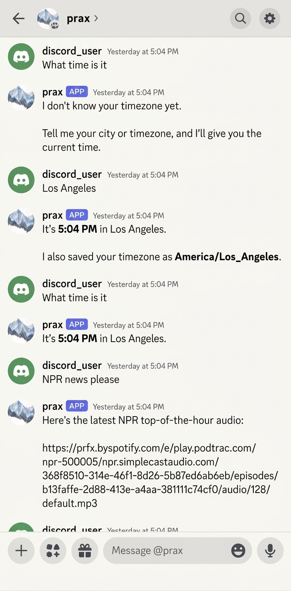

*Prax remembering your timezone, fetching NPR news, and managing your workspace — all from Discord.*

</div>

---

## Quick Start

### Docker Compose (recommended)

```bash
git clone <repo-url> prax && cd prax
cp .env-example .env                      # configure (at minimum: OPENAI_KEY)
docker compose up --build                 # builds app + sandbox, starts everything
```

This brings up Prax, the always-on sandbox (with LaTeX, ffmpeg, poppler, pandoc), and ngrok — all wired together. Prax can install packages in the sandbox on the fly.

For developer mode (bind-mounts source code, Werkzeug auto-reloads on file changes):

```bash
docker compose -f docker-compose.yml -f docker-compose.dev.yml up --build app
```

Or, if you don't need to rebuild:

```bash
docker compose -f docker-compose.yml -f docker-compose.dev.yml up
```

Most code changes are picked up automatically by Werkzeug's reloader. For changes to `app.py`, the entrypoint, watchdog, or dependencies, restart the container:

```bash
# Restart without rebuilding (entrypoint/watchdog changes, env var changes)
docker compose -f docker-compose.yml -f docker-compose.dev.yml restart app

# Rebuild and restart (new dependencies, Dockerfile changes)
docker compose -f docker-compose.yml -f docker-compose.dev.yml up --build app
```


### Local development

```bash
git clone <repo-url> prax && cd prax
uv sync --python 3.13                    # install deps (requires uv)
cp .env-example .env                      # configure (at minimum: OPENAI_KEY)
mkdir -p static/temp
docker build -t prax-sandbox:latest sandbox/   # optional: code execution
uv run python app.py                      # start Prax
```

Set up a channel in `.env`:
- **Discord (free):** `DISCORD_BOT_TOKEN` + `DISCORD_ALLOWED_USERS`
- **Twilio (paid):** `TWILIO_ACCOUNT_SID` + `TWILIO_AUTH_TOKEN` + `NGROK_URL`

---

## Table of Contents

- [Features](#features)
- [Architecture](#architecture)
- [Sandbox Code Execution](#sandbox-code-execution)
- [Self-Improving Fine-Tuning](#self-improving-fine-tuning)
- [Self-Modification via PRs](#self-modification-via-prs)
- [Agent Delegation](#agent-delegation)
- [Browser Automation](#browser-automation)
- [Agent Checkpointing](#agent-checkpointing)
- [Prerequisites](#prerequisites)
- [Security](#security)
- [Configuration](#configuration)
- [Channel Setup](#channel-setup)
- [Database](#database)
- [Running the App](#running-the-app)
- [Testing](#testing)
- [Docker](#docker)
- [Extending the Agent](#extending-the-agent)
- [Troubleshooting](#troubleshooting)
- [Roadmap](#roadmap)

---

## Features

Prax is a multi-channel AI assistant powered by a LangGraph ReAct agent. It connects to **Discord** and/or **Twilio** (voice + SMS), remembers everything in SQLite, and can modify its own tools at runtime.

| Category | Highlights |
|----------|-----------|
| **Channels** | Discord bot (free, WebSocket), Twilio voice + SMS (webhooks), configurable agent name |
| **Agent** | LangGraph ReAct loop, 106+ tools, dedicated sub-agents (self-improvement, plugin engineering, content authoring, research, coding), watchdog supervisor, automatic checkpoint & retry on failures |
| **Memory** | SQLite conversations with auto-summarization, git-backed per-user workspaces, dynamic user notes, link history, to-do lists, task plans |
| **Documents** | PDF extraction (arXiv, URLs, attachments), web page summaries, YouTube transcripts, LaTeX compilation |
| **Code** | Always-on Docker sandbox with [OpenCode](https://opencode.ai/), auto-installs packages, multi-model support, round-based budget control |
| **Scheduling** | Cron jobs (YAML), one-time reminders, timezone-aware delivery |
| **Browser** | Playwright automation, persistent login profiles, VNC for manual login, credential management |
| **Self-improvement** | Hot-swappable plugin system (sandbox + auto-rollback), self-modifying code via PRs, QLoRA fine-tuning on conversation history |
| **Models** | OpenAI, Anthropic, Google Vertex, Ollama, local vLLM — per-component routing |
| **Plugins** | Folder-per-plugin, git submodule imports from public repos, security scanning, workspace push to private remote, auto-generated catalog |
| **File sharing** | Opt-in file publishing via ngrok (shareable links for videos, PDFs), Twilio media serving |

## Architecture

### High-Level System Overview

```mermaid
graph TB
    User["User (Phone / Discord)"]

    subgraph Twilio["Twilio Cloud (optional)"]
        Voice["Voice Webhook"]
        SMS["SMS Webhook"]
    end

    subgraph Discord["Discord (optional)"]
        DiscordBot["Discord Bot\n(WebSocket)"]
    end

    subgraph Flask["Flask App"]
        MainRoutes["/transcribe, /respond"]
        SmsRoute["/sms"]
        VoiceSvc["VoiceService"]
        SmsSvc["SmsService"]
        DiscordSvc["DiscordService"]
        ConvoSvc["ConversationService"]
    end

    subgraph Agent["LangGraph ReAct Agent (Prax)"]
        Orchestrator["ConversationAgent"]
        LLMFactory["LLM Factory"]
        SubAgent["Sub-Agents\n(delegate_task)"]

        subgraph Tools["Agent Tools (97+)"]
            BuiltIn["Built-In (7)"]
            WS["Workspace Tools (19)"]
            SB["Sandbox Tools (7)"]
            Sched["Scheduler Tools (9)"]
            FT["Fine-Tune Tools (8)"]
            CG["Self-Improve Tools (10)"]
            BW["Browser Tools (14)"]
            PL["Plugin Tools (14)"]
            SA["Sub-Agent (1)"]
        end
    end

    subgraph PluginSys["Plugin System (Hot-Swappable)"]
        PluginLoader["Plugin Loader\n(folder-per-plugin discovery)"]
        PluginSandbox["Subprocess Sandbox"]
        PluginRegistry["Version Registry\n(registry.json)"]
        PluginCatalog["CATALOG.md\n(auto-generated)"]
        PromptMgr["Prompt Manager"]
        LLMConfig["LLM Routing\n(llm_routing.yaml)"]
        BuiltInPlugins["Built-In Plugins\n(NPR, PDF, YouTube, arXiv, ...)"]
        CustomPlugins["Custom Plugins\n(plugins/tools/custom/)"]
        SysPrompt["System Prompt\n(plugins/prompts/)"]
    end

    subgraph PluginRepo["Plugin Repository (optional)"]
        RemoteRepo["Private Git Repo\n(SSH deploy key)"]
        RepoBranch["Branch: plugins"]
        RemoteCatalog["CATALOG.md"]
    end

    subgraph Storage["Persistence"]
        SQLite["SQLite\n(conversation memory)"]
        Workspace["Git-Backed Workspace\n(per-user files)"]
        ScheduleYAML["schedules.yaml\n(cron definitions)"]
        AdapterReg["adapter_registry.json\n(LoRA adapters)"]
        Todos["todos.json\n(user to-do list)"]
        Links["links.md\n(link history)"]
        Instructions["instructions.md\n(prompt reference)"]
        AgentPlan["agent_plan.json\n(task decomposition)"]
    end

    subgraph Sandbox["Docker Sandbox"]
        Container["Docker Container"]
        OpenCode["OpenCode\n(headless HTTP API)"]
    end

    subgraph LocalML["Local ML Stack (optional)"]
        vLLM["vLLM Server\n(OpenAI-compat API)"]
        LoRA["LoRA Adapters\n(hot-swappable)"]
        Unsloth["Unsloth QLoRA\n(training subprocess)"]
    end

    subgraph Browser["Browser (Playwright)"]
        Chromium["Headless Chromium"]
        SiteCreds["sites.yaml\n(credentials)"]
        Profiles["Persistent Profiles\n(cookies/sessions)"]
        VNCServer["Xvfb + x11vnc\n(manual login)"]
    end

    Worktree["Git Worktree\n(self-modification)"]

    Scheduler["APScheduler\n(background cron)"]

    User -->|Call| Voice
    User -->|Text| SMS
    User -->|Message| DiscordBot
    Voice --> MainRoutes --> VoiceSvc
    SMS --> SmsRoute --> SmsSvc
    DiscordBot --> DiscordSvc
    VoiceSvc --> ConvoSvc
    SmsSvc --> ConvoSvc
    DiscordSvc --> ConvoSvc
    ConvoSvc --> Orchestrator
    Orchestrator --> LLMFactory
    LLMFactory -->|cloud| BuiltIn
    LLMFactory -->|local| vLLM
    Orchestrator --> Tools
    WS --> Workspace
    SB --> Container
    Container --> OpenCode
    Sched --> ScheduleYAML
    FT --> Unsloth
    FT --> vLLM
    vLLM --> LoRA
    CG --> Worktree
    PL --> PluginLoader
    PluginLoader --> BuiltInPlugins
    PluginLoader --> CustomPlugins
    PluginLoader --> PluginSandbox
    PluginLoader --> PluginRegistry
    PluginLoader --> PluginCatalog
    CustomPlugins -.->|push| RemoteRepo
    RemoteRepo --> RepoBranch
    RepoBranch --> RemoteCatalog
    Orchestrator --> PromptMgr
    PromptMgr --> SysPrompt
    LLMFactory --> LLMConfig
    BW --> Chromium
    Chromium --> SiteCreds
    Chromium --> Profiles
    VNCServer --> Chromium
    ConvoSvc --> SQLite
    Scheduler -->|reads| ScheduleYAML
    Scheduler -->|fires| ConvoSvc
    ConvoSvc -->|SMS / Discord reply| User
    Worktree -->|PR| Workspace
```

### Request Flow — SMS Message

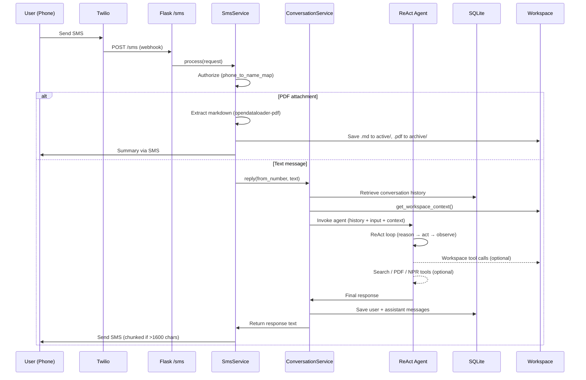

### Request Flow — Discord Message

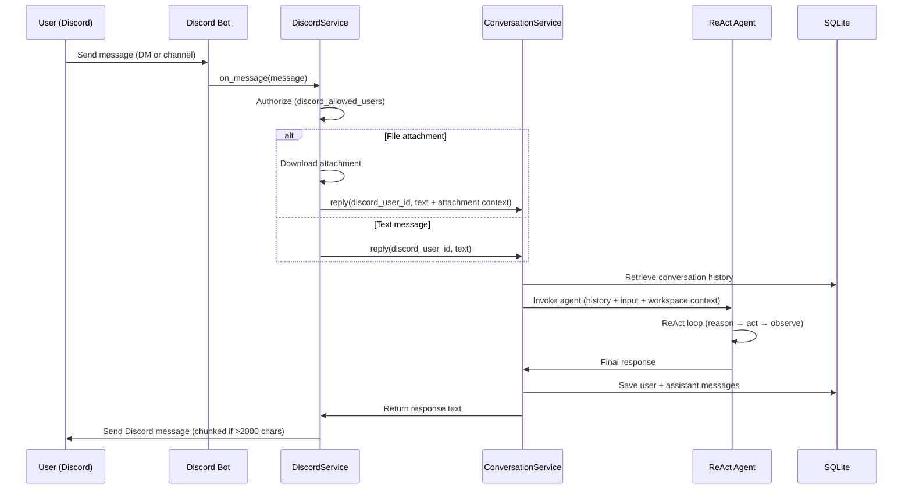

### Sandbox Code Execution Flow

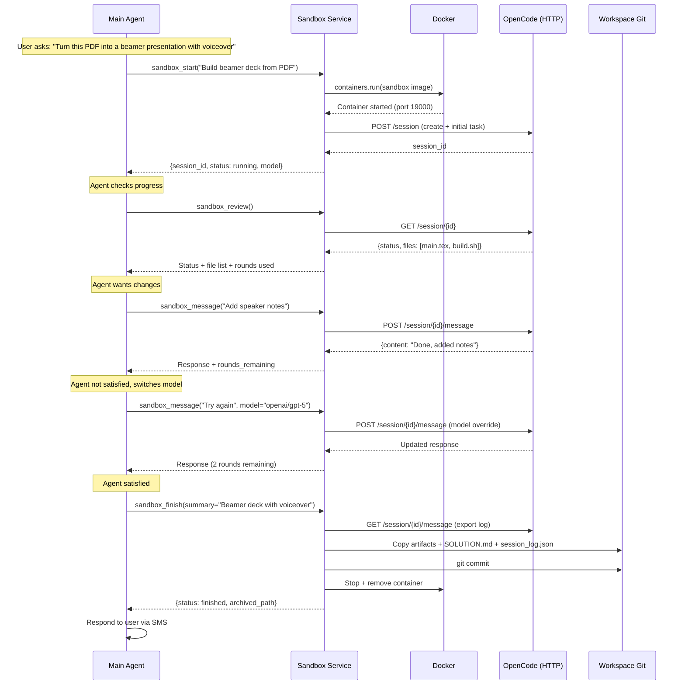

### Solution Reuse Flow

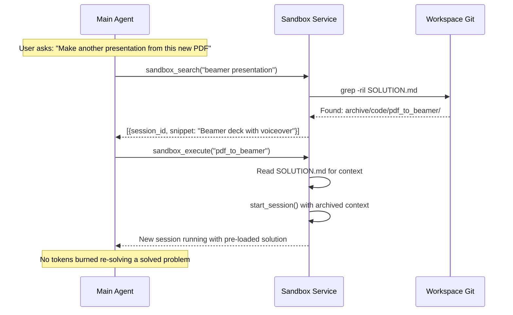

### Scheduled Messages Flow

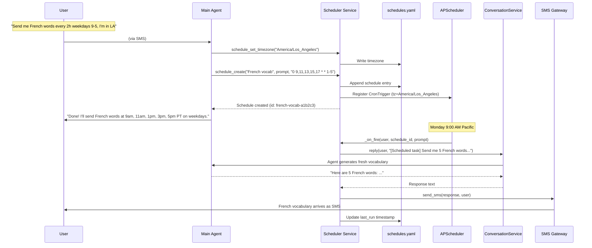

### schedules.yaml Format

Each user has a `schedules.yaml` in their git workspace that both the agent and the user can edit manually:

```yaml
timezone: America/Los_Angeles
schedules:
- id: french-vocab-a1b2c3
  description: French vocabulary practice
  prompt: >
    Send me 5 new French words with their English translations,
    pronunciation guides, and example sentences. Vary the difficulty
    and topic each time. Remember what you sent before.
  cron: '0 9,11,13,15,17 * * 1-5'
  timezone: America/Los_Angeles
  enabled: true
  created_at: '2026-03-20T09:00:00-07:00'
  last_run: '2026-03-20T15:00:00-07:00'

- id: daily-briefing-d4e5f6
  description: Morning news briefing
  prompt: >
    Give me a brief morning briefing: top 3 news headlines,
    weather summary, and one interesting fact.
  cron: '30 7 * * 1-5'
  timezone: America/Los_Angeles
  enabled: true
  created_at: '2026-03-20T09:05:00-07:00'
  last_run: null
```

Cron field reference (5 fields: `minute hour day month weekday`):

| Pattern | Meaning |
|---------|---------|
| `0 9,11,13,15,17 * * 1-5` | 9am, 11am, 1pm, 3pm, 5pm on weekdays |
| `30 7 * * *` | Daily at 7:30am |
| `0 */3 * * 1-5` | Every 3 hours on weekdays |
| `0 8 * * 1` | Every Monday at 8am |
| `0 20 1,15 * *` | 8pm on the 1st and 15th of each month |

**Manual editing:** Edit the YAML directly in the workspace, then tell the agent "I edited the schedules file" and it will call `schedule_reload` to pick up changes. All changes are git-committed automatically.

### Agent Tool Map

```mermaid
graph LR
    subgraph "Kernel Tools (3)"
        search["background_search"]
        datetime["get_current_datetime"]
        fetch_url["fetch_url_content"]
    end

    subgraph "Built-In Plugins (6)"
        npr["npr_podcast_tool"]
        web["web_summary_tool"]
        pdf["pdf_summary_tool"]
        yt["youtube_transcribe"]
        arxiv["arxiv_fetch_papers"]
        dlf["deutschlandfunk_tool"]
    end

    subgraph "Workspace Tools (19)"
        ws_save["workspace_save"]
        ws_read["workspace_read"]
        ws_list["workspace_list"]
        ws_archive["workspace_archive"]
        ws_search["workspace_search"]
        ws_restore["workspace_restore"]
        un_update["user_notes_update"]
        un_read["user_notes_read"]
        reread["reread_instructions"]
        log_link["log_link"]
        links_hist["links_history"]
        td_add["todo_add"]
        td_list["todo_list"]
        td_complete["todo_complete"]
        td_remove["todo_remove"]
        ap_plan["agent_plan"]
        ap_step["agent_step_done"]
        ap_status["agent_plan_status"]
        ap_clear["agent_plan_clear"]
    end

    subgraph "Sandbox Tools (7)"
        sb_start["sandbox_start"]
        sb_msg["sandbox_message"]
        sb_review["sandbox_review"]
        sb_finish["sandbox_finish"]
        sb_abort["sandbox_abort"]
        sb_search["sandbox_search"]
        sb_exec["sandbox_execute"]
    end

    subgraph "Scheduler Tools (9)"
        sc_create["schedule_create"]
        sc_list["schedule_list"]
        sc_update["schedule_update"]
        sc_delete["schedule_delete"]
        sc_tz["schedule_set_timezone"]
        sc_reload["schedule_reload"]
        rm_create["schedule_reminder"]
        rm_list["reminder_list"]
        rm_delete["reminder_delete"]
    end

    subgraph "Fine-Tune Tools (8)"
        ft_harvest["finetune_harvest"]
        ft_start["finetune_start"]
        ft_status["finetune_status"]
        ft_verify["finetune_verify"]
        ft_load["finetune_load"]
        ft_promote["finetune_promote"]
        ft_rollback["finetune_rollback"]
        ft_list["finetune_list_adapters"]
    end

    subgraph "Self-Improve Tools (10)"
        si_start["self_improve_start"]
        si_read["self_improve_read"]
        si_write["self_improve_write"]
        si_test["self_improve_test"]
        si_lint["self_improve_lint"]
        si_verify["self_improve_verify"]
        si_deploy["self_improve_deploy"]
        si_submit["self_improve_submit"]
        si_list["self_improve_list"]
        si_cleanup["self_improve_cleanup"]
    end

    subgraph "Browser Tools (14)"
        bw_open["browser_open"]
        bw_read["browser_read_page"]
        bw_shot["browser_screenshot"]
        bw_click["browser_click"]
        bw_fill["browser_fill"]
        bw_press["browser_press"]
        bw_find["browser_find"]
        bw_creds["browser_credentials"]
        bw_login["browser_login"]
        bw_close["browser_close"]
        bw_req["browser_request_login"]
        bw_fin["browser_finish_login"]
        bw_chk["browser_check_login"]
        bw_prof["browser_profiles"]
    end

    subgraph "Plugin Tools (17)"
        pl_list["plugin_list"]
        pl_read["plugin_read"]
        pl_write["plugin_write"]
        pl_test["plugin_test"]
        pl_activate["plugin_activate"]
        pl_rollback["plugin_rollback"]
        pl_status["plugin_status"]
        pl_remove["plugin_remove"]
        pl_catalog["plugin_catalog"]
        pr_read["prompt_read"]
        pr_write["prompt_write"]
        pr_rollback["prompt_rollback"]
        pr_list["prompt_list"]
        llm_read["llm_config_read"]
        llm_update["llm_config_update"]
        src_read["source_read"]
        src_list["source_list"]
    end

    subgraph "Sub-Agent Tools (4)"
        delegate["delegate_task"]
        delegate_si["delegate_self_improve"]
        delegate_pf["delegate_plugin_fix"]
        delegate_ca["delegate_course_author"]
    end

    Agent["ReAct Agent\n(Prax)"] --> delegate & delegate_si & delegate_pf & delegate_ca
    Agent --> search & datetime & fetch_url
    Agent --> npr & web & pdf & yt & arxiv & dlf
    Agent --> ws_save & ws_read & ws_list & ws_archive & ws_search & ws_restore & un_update & un_read & reread & log_link & links_hist & td_add & td_list & td_complete & td_remove & ap_plan & ap_step & ap_status & ap_clear
    Agent --> sb_start & sb_msg & sb_review & sb_finish & sb_abort & sb_search & sb_exec
    Agent --> sc_create & sc_list & sc_update & sc_delete & sc_tz & sc_reload & rm_create & rm_list & rm_delete
    Agent --> ft_harvest & ft_start & ft_status & ft_verify & ft_load & ft_promote & ft_rollback & ft_list
    Agent --> si_start & si_read & si_write & si_test & si_lint & si_verify & si_deploy & si_submit & si_list & si_cleanup
    Agent --> bw_open & bw_read & bw_shot & bw_click & bw_fill & bw_press & bw_find & bw_creds & bw_login & bw_close & bw_req & bw_fin & bw_chk & bw_prof
    Agent --> pl_list & pl_read & pl_write & pl_test & pl_activate & pl_rollback & pl_status & pl_remove & pl_catalog & pr_read & pr_write & pr_rollback & pr_list & llm_read & llm_update & src_read & src_list
```

### Key Modules

| Module | Purpose |
|--------|---------|
| `prax/agent/orchestrator.py` | LangGraph ReAct agent with hot-swappable system prompt, plugin-aware graph rebuild, and per-component LLM routing |
| `prax/agent/subagent.py` | General sub-agent delegation: spawns focused LangGraph sub-graphs with per-category LLM config |
| `prax/agent/self_improve_agent.py` | Self-improvement sub-agent: diagnose bugs, patch via sandbox, deploy via codegen |
| `prax/agent/plugin_fix_agent.py` | Plugin engineering sub-agent: create/fix/test/activate plugins autonomously |
| `prax/agent/course_author_agent.py` | Content author sub-agent: produces rich course materials (mermaid, code, LaTeX) via iterative sandbox drafting |
| `prax/agent/tools.py` | Kernel tool wrappers (search, datetime, fetch_url) — reader tools migrated to plugins |
| `prax/agent/plugin_tools.py` | 17 plugin management tools: plugin CRUD, catalog, prompt CRUD, LLM config, source_read/list |
| `prax/agent/workspace_tools.py` | 19 workspace tools: notes, files, links, todos, task planning, instructions |
| `prax/agent/sandbox_tools.py` | 7 sandbox tools for code execution sessions |
| `prax/agent/scheduler_tools.py` | 9 scheduler tools: recurring cron + one-time reminders |
| `prax/agent/finetune_tools.py` | 8 fine-tuning tools (harvest, train, verify, promote, rollback) |
| `prax/agent/codegen_tools.py` | 10 self-improvement tools (worktree, edit, test, lint, verify, deploy, PR) |
| `prax/agent/browser_tools.py` | 14 browser tools (navigate, click, fill, screenshot, login, VNC) |
| `prax/agent/tool_registry.py` | Tool aggregation: built-in + plugin-provided + manually registered |
| `prax/agent/llm_factory.py` | Multi-provider LLM factory (OpenAI, Anthropic, Google, Ollama, vLLM) |
| `prax/plugins/loader.py` | Recursive plugin discovery (folder-per-plugin + flat), hot-swap, version tracking, auto-rollback, catalog generation |
| `prax/plugins/sandbox.py` | Subprocess-isolated plugin validation before activation |
| `prax/plugins/registry.py` | JSON-based version registry with rollback and failure monitoring |
| `prax/plugins/repo.py` | Plugin repository service: SSH deploy key auth, clone, commit, push to private repo branch |
| `prax/plugins/catalog.py` | Auto-generated CATALOG.md listing all available plugins with metadata |
| `prax/plugins/prompt_manager.py` | Hot-swappable system prompt loading with variable expansion |
| `prax/plugins/llm_config.py` | Per-component LLM routing (YAML-based, hot-reloaded) |
| `prax/plugins/monitored_tool.py` | Runtime monitoring wrapper: failure counting + auto-rollback |
| `prax/plugins/tools/*/plugin.py` | Built-in reader plugins (NPR, web summary, PDF, YouTube, arXiv, Deutschlandfunk) |
| `prax/services/sms_service.py` | SMS workflow: media handling, PDF pipeline, agent routing |
| `prax/services/voice_service.py` | Voice workflow: speech processing, TTS buffer management |
| `prax/services/conversation_service.py` | Shared conversation layer with workspace context injection |
| `prax/services/sandbox_service.py` | Docker + OpenCode sandbox lifecycle, archiving, budget control |
| `prax/services/scheduler_service.py` | APScheduler-backed cron service reading YAML definitions |
| `prax/services/finetune_service.py` | LoRA fine-tuning pipeline: harvest → train → verify → hot-swap |
| `prax/services/codegen_service.py` | Self-modification via staging clone + verify + hot-swap / PR workflow |
| `prax/services/discord_service.py` | Discord bot: message handling, authorization, response delivery |
| `prax/services/browser_service.py` | Playwright browser automation with per-user sessions |
| `prax/services/pdf_service.py` | PDF download, extraction (opendataloader-pdf), arxiv detection |
| `prax/services/youtube_service.py` | YouTube audio download (yt-dlp) + Whisper transcription |
| `prax/services/workspace_service.py` | Git-backed per-user file operations with per-user locking |
| `scripts/watchdog.py` | Supervisor process: health checks Flask, auto-rollback on crash after self-improve deploy |
| `scripts/finetune_train.py` | Standalone Unsloth QLoRA training script (runs in GPU subprocess) |
| `prax/settings.py` | Pydantic BaseSettings — all config from `.env` |
| `prax/clients.py` | Shared lazy-initialized Twilio client |
| `prax/sms.py` | SMS chunking and sending utilities |
| `prax/call_state.py` | `CallStateManager` — typed call state with `ensure()` |
| `prax/conversation_memory.py` | SQLite storage with auto-summarization at 100k tokens |

### Workspace Layout

```
workspaces/{user_id}/          ← phone number or Discord user ID
├── .git/                  ← full version history
├── schedules.yaml         ← cron schedule definitions (YAML)
├── user_notes.md          ← dynamic notes about the user (timezone, preferences, personality)
├── links.md               ← running log of every URL the user has shared
├── todos.json             ← user's personal to-do list
├── instructions.md        ← system prompt reference (agent can re-read)
├── agent_plan.json        ← current task decomposition (transient)
├── active/                ← files the agent is currently aware of
│   ├── 2301.12345.md      ← extracted PDF with frontmatter
│   └── sessions/          ← live sandbox coding sessions
│       └── {session_id}/
└── archive/               ← agent moves files here when done
    ├── 2301.12345.pdf     ← original PDF preserved
    └── code/              ← completed coding solutions
        └── pdf_to_beamer/
            ├── SOLUTION.md
            ├── session_log.json
            ├── convert.py
            └── build.sh

adapters/                  ← LoRA adapter storage (FINETUNE_OUTPUT_DIR)
├── adapter_registry.json  ← active/previous adapter tracking
├── training_data/         ← JSONL training batches
│   └── batch_20260320_140000.jsonl
├── adapter_20260319_140000/  ← previous LoRA weights
│   ├── adapter_config.json
│   └── adapter_model.safetensors
└── adapter_20260320_140000/  ← active LoRA weights
    ├── adapter_config.json
    └── adapter_model.safetensors
```

### Dropbox Sync

To back up workspaces to Dropbox automatically, symlink the workspace directory into your Dropbox folder:

```bash
# From the project root:
ln -s "$PWD/workspaces" ~/Dropbox/prax-workspaces
```

If you move the project, remove the old symlink and re-link:

```bash
rm ~/Dropbox/prax-workspaces
ln -s "$PWD/workspaces" ~/Dropbox/prax-workspaces
```

The Dropbox desktop app will sync all workspace files (notes, todos, links, archives) in real time. No API keys or code changes needed.

## Sandbox Code Execution

### The Problem

Instead of adding infinite specialized tools (one for LaTeX, one for ffmpeg, one for data transforms...), give the agent a sandbox where it can write and execute its own code. The hardest or most common operations stay as dedicated tools; everything else the agent codes up itself.

### The Solution: Docker + OpenCode

[OpenCode](https://opencode.ai/) is an open-source coding agent (MIT, 126k+ stars) with a headless HTTP server mode (`opencode serve`). It has 15 built-in tools (bash, file edit, read, write, grep, glob, etc.), supports every major LLM provider, and has first-class session management (create, resume, fork, export).

**Always-on sandbox:** In Docker Compose deployment, the sandbox runs 24/7 alongside the app. Prax can install system packages on the fly with `sandbox_install("poppler-utils")` — no user intervention needed. For permanent additions, Prax can edit the sandbox Dockerfile and rebuild with `sandbox_rebuild()`. In local development, ephemeral containers are spun up per session instead.

**Interactive feedback loop:** The main agent and coding agent converse. If the result isn't satisfactory, the main agent can send follow-up instructions, switch models mid-session (e.g., from Claude to GPT-5), or abort and try a different approach.

**Solution reuse:** Every `sandbox_finish()` commits code to the workspace git with a `SOLUTION.md`. When a similar task comes up, the agent searches the archive and re-executes the existing solution — zero tokens burned re-solving a solved problem.

**Budget control:** Each session has a configurable round limit (`SANDBOX_MAX_ROUNDS`, default 10). The agent sees `rounds_remaining` in every response so it knows when to wrap up. After hitting the limit, only `sandbox_finish` or `sandbox_abort` are available.

**File sharing:** When the sandbox produces large files (videos, PDFs), Prax can publish them with `workspace_share_file()` to generate a public ngrok URL. Only explicitly published files are accessible — the rest of the workspace stays private. Links can be revoked with `workspace_unshare_file()`.

> **Security note:** Ngrok URLs are publicly reachable — anyone with the link can download the file. However, shared file URLs are protected by two layers of randomization: a 32-character hex token in the path and a UUID-randomized filename (only the file extension is preserved). This makes URLs unguessable and reveals nothing about the original file name or contents. Still, treat shared links as semi-public: share them only with intended recipients, and revoke them with `workspace_unshare_file()` when no longer needed.

### Sandbox Docker Image

Pre-built with common tools:

```dockerfile
FROM node:22-slim
RUN apt-get update && apt-get install -y \
    python3 python3-pip python3-venv \
    texlive-latex-base texlive-latex-extra texlive-fonts-recommended latexmk \
    ffmpeg poppler-utils pandoc \
    git curl wget jq \
    && npm install -g opencode
WORKDIR /workspace
EXPOSE 4096
CMD ["opencode", "serve", "--hostname", "0.0.0.0", "--port", "4096"]
```

### Alternatives Evaluated

| Option | Verdict |
|--------|---------|
| **NVIDIA OpenShell** | Wraps the agent (security sandbox), doesn't provide code execution as a tool. Wrong direction of control. |
| **E2B** | Cloud-only, pay-per-second, no self-hosting. Good API but sends user data to third party. |
| **Daytona** | Self-hostable, 90ms sandbox creation, built-in Git/LSP/MCP. Strong runner-up — upgrade path if Docker management gets unwieldy. |
| **Docker SDK + custom sub-agent** | Full control but requires building everything OpenCode already has. |
| **Docker SDK + OpenCode** | **Selected.** Best balance of capability, simplicity, and self-hosting. |

## Self-Improving Fine-Tuning

### The Problem

Cloud LLMs are expensive and generic. An 8B parameter model fine-tuned on *your* conversations — where the agent learns from every correction you make — can outperform a general-purpose model at a fraction of the cost.

### The Solution: vLLM + Unsloth + LoRA Hot-Swap

The agent runs on a local [Qwen3-8B](https://huggingface.co/Qwen/Qwen3-8B) model served by [vLLM](https://docs.vllm.ai/) with its OpenAI-compatible API. When the agent detects it's been making mistakes (user corrections like "no, that's wrong" or "try again"), it:

1. **Harvests** correction pairs from SQLite conversation history
2. **Trains** a QLoRA adapter using [Unsloth](https://github.com/unslothai/unsloth) (~6 GB VRAM, fits on RTX A2000 16GB)
3. **Verifies** the new adapter against test prompts
4. **Hot-swaps** the adapter into vLLM via its REST API — zero downtime, no restart
5. **Promotes** or **rolls back** based on verification results

The entire pipeline is gated behind `FINETUNE_ENABLED=true` so the app runs normally on machines without a GPU.

### Self-Improvement Cycle

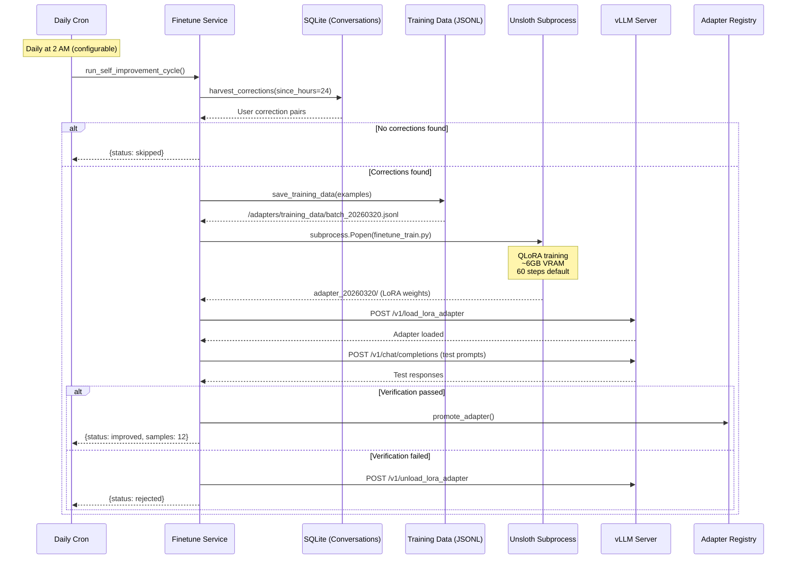

### Training Data Format

Corrections are extracted as ChatML training pairs:

```jsonl
{"messages": [
  {"role": "system", "content": "You are Prax, a warm, capable phone concierge."},
  {"role": "user", "content": "What's the capital of Australia?"},
  {"role": "assistant", "content": "The capital of Australia is Canberra."}
]}
```

The harvester looks for user messages containing correction signals ("no,", "that's wrong", "try again", etc.), then pairs the original question with the corrected response to create training examples.

### Hardware Requirements

| Component | Minimum | Recommended |
|-----------|---------|-------------|
| GPU | NVIDIA with 8GB VRAM | NVIDIA RTX A2000 16GB+ |
| VRAM Usage | ~6GB (4-bit QLoRA) | ~10GB (training + serving) |
| Disk | 20GB for model + adapters | 50GB+ |
| RAM | 16GB | 32GB+ |

### vLLM Setup

```bash
# Install vLLM (requires CUDA)
pip install vllm

# Start vLLM with LoRA support
vllm serve Qwen/Qwen3-8B \
  --enable-lora \
  --max-lora-rank 16 \
  --lora-modules '' \
  --port 8000

# Configure the app
echo 'FINETUNE_ENABLED=true' >> .env
echo 'VLLM_BASE_URL=http://localhost:8000/v1' >> .env
echo 'LLM_PROVIDER=vllm' >> .env
echo 'LOCAL_MODEL=Qwen/Qwen3-8B' >> .env
```

### Adapter Registry

Adapters are tracked in `{FINETUNE_OUTPUT_DIR}/adapter_registry.json`:

```json
{
  "active_adapter": "adapter_20260320_140000",
  "previous_adapter": "adapter_20260319_140000",
  "adapters": [
    {
      "name": "adapter_20260319_140000",
      "path": "./adapters/adapter_20260319_140000",
      "created_at": "2026-03-19T14:00:00+00:00",
      "verified": true
    },
    {
      "name": "adapter_20260320_140000",
      "path": "./adapters/adapter_20260320_140000",
      "created_at": "2026-03-20T14:00:00+00:00",
      "verified": true
    }
  ]
}
```

Rollback is one tool call: `finetune_rollback` unloads the current adapter and re-loads the previous one.

## Self-Modification via PRs

### The Problem

When the agent identifies a pattern it handles poorly, it should be able to fix its own code — but never without human review.

### The Solution: Staging Clone + Verify + Hot-Swap

The agent works in a **staging clone** — a separate `git clone` of the live repo at `/tmp/self-improve-staging`. It never touches the live directory during development. [Git worktrees](https://git-scm.com/docs/git-worktree) branch off the staging clone for each change.

Two deployment paths:

**Path A — Hot-swap (quick fixes):**
1. **Start branch** — creates a worktree off the staging clone
2. **Read/Write files** — operates entirely within the worktree
3. **Verify** — runs tests + lint + app startup check (all must pass)
4. **Deploy** — copies changed files to live repo + commits; Flask's Werkzeug reloader auto-restarts

**Path B — PR (complex changes):**
1. Same steps 1-2
2. **Submit PR** — pushes to GitHub and creates a PR for human review
3. The agent **cannot merge to main**

### Self-Modification Flow (Hot-Swap Deploy)

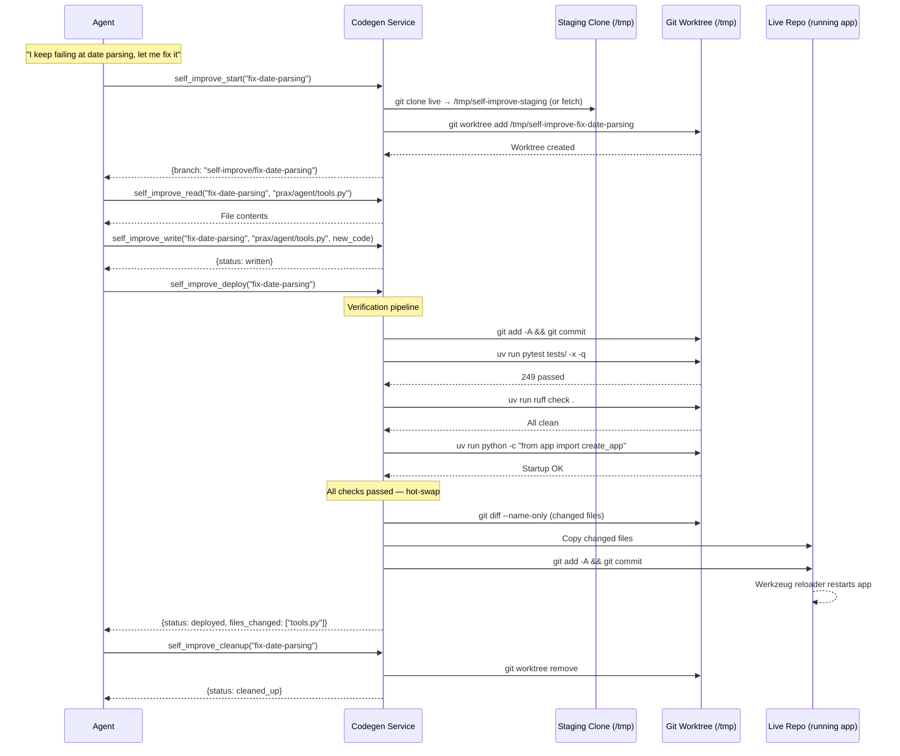

### Self-Modification Flow (PR Path)

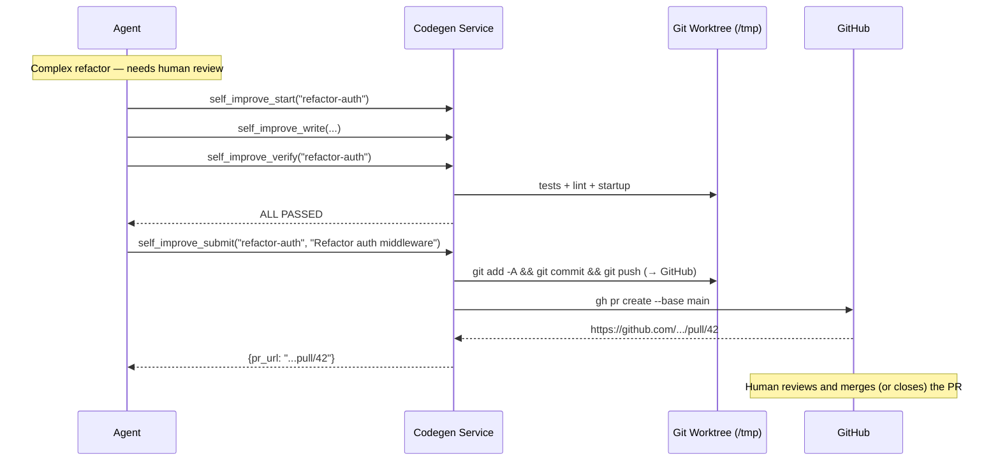

### Safety Guardrails

- **Staging isolation** — all development happens in a clone at `/tmp`, never the live repo
- **Verify-then-deploy** — tests, lint, AND startup check must all pass before any files are copied
- **Atomic hot-swap** — only changed files are copied; Flask's reloader handles the restart
- **Watchdog supervisor** — `scripts/watchdog.py` runs as the main process and monitors Flask via `/health`. If the app crashes (non-zero exit) after a self-improve deploy, the watchdog automatically `git revert`s the offending commit and restarts. Clean exits (code 0, e.g. Werkzeug reloader) are restarted immediately without counting against limits. Prax is informed on the next conversation turn via `self_improve_pending`
- **Max 3 attempts** — the deploy state file (`.self-improve-state.yaml`) tracks attempt counts per branch. After 3 failures, the agent is forced to stop and report to the user
- **Rollback** — `self_improve_rollback` reverts the last deploy commit. The watchdog also does this automatically on crash
- The `SELF_IMPROVE_ENABLED` flag must be `true` (default `false`)

## Agent Delegation

Prax keeps its main conversation loop lean by delegating coding-heavy work to focused sub-agents. Each sub-agent runs its own LangGraph ReAct loop with a specialized system prompt and a curated tool set.

### Delegation Architecture

| Task | Tool | Sub-Agent Gets | Notes |
|------|------|----------------|-------|
| Bug in Prax's own code | `delegate_self_improve` | source_read, sandbox, codegen, read_logs | Diagnoses via logs, patches via sandbox (OpenCode), deploys via codegen tools |
| Plugin create/fix/improve | `delegate_plugin_fix` | source_read, sandbox, plugin_write/test/activate/rollback | Full plugin lifecycle — write, sandbox-test, activate, rollback |
| Research (web, PDFs, etc.) | `delegate_task(category="research")` | web search, fetch_url, plugin tools (NPR, PDF, YouTube) | For multi-step research that would bloat the main context |
| Course content creation | `delegate_course_author` | sandbox, course_save_material, course_publish, course_status, course_tutor_notes | Produces rich markdown with mermaid diagrams, code blocks, LaTeX via iterative sandbox drafting |
| General coding | `delegate_task(category="sandbox")` | sandbox_start/message/review/finish | OpenCode writes and executes code in Docker |
| Browser automation | `delegate_task(category="browser")` | Playwright tools | Persistent profiles, VNC login |
| Scheduling tasks | `delegate_task(category="scheduler")` | Cron + reminder tools | Recurring messages, one-time reminders |

### What stays with Prax

- **Tutoring conversation** — interactive Q&A, pacing, assessment (but content *creation* is delegated to the course author agent)
- **Reminders/scheduling** — single tool calls, no coding needed
- **Todos, workspace files, user notes** — simple CRUD
- **URL handling** — fetch + summarize
- **Plugin imports** — tool calls only, no code to write

### How it works

1. Prax detects that work requires coding (bug report, plugin failure, user request)
2. Prax calls the appropriate delegation tool with a detailed task description
3. The sub-agent runs autonomously with its own tools and system prompt
4. The sub-agent returns a summary — Prax relays it to the user

### Source code in the sandbox

The app source is mounted in the sandbox container at `/source/` so OpenCode can read and modify Prax's own code:

| Mode | Mount | Access |
|------|-------|--------|
| Production | `./prax:/source/prax` | Read-only — OpenCode can inspect but not modify directly |
| Dev mode | `./prax:/source/prax` | Read-write — changes propagate via bind mount, Werkzeug auto-reloads |

In dev mode, the self-improvement agent can tell OpenCode to patch files at `/source/prax/...` and the live app picks up the changes immediately.

### Key files

| File | Purpose |
|------|---------|
| `prax/agent/self_improve_agent.py` | Self-improvement sub-agent — diagnose, sandbox-patch, deploy |
| `prax/agent/plugin_fix_agent.py` | Plugin engineering sub-agent — create, fix, test, activate |
| `prax/agent/course_author_agent.py` | Content author sub-agent — produces rich markdown (mermaid, code, LaTeX) via iterative sandbox drafting |
| `prax/agent/subagent.py` | General delegation (`delegate_task`) with category routing |
| `scripts/watchdog.py` | Supervisor process — health checks, crash rollback, restart |

## Browser Automation

### The Problem

Many websites (Twitter/X, SPAs, pages behind logins) don't work with simple HTTP scraping. The agent needs a real browser to navigate, log in, and read content.

### The Solution: Playwright + Credential Store + Persistent Profiles + VNC

The agent gets a full Playwright-backed Chromium browser with per-user sessions. Two login strategies:

1. **YAML credentials** (`sites.yaml`) — the agent fills login forms automatically
2. **VNC manual login** — the agent starts a visible browser on a VNC display; the user SSH-tunnels in, logs in manually (handling MFA, CAPTCHAs, etc.), and the login session is saved to a **persistent browser profile** that future headless sessions reuse

When a user texts a Twitter link, the agent opens it, detects the login wall, and either auto-fills credentials or prompts the user to connect via VNC.

### Browser Automation Flow

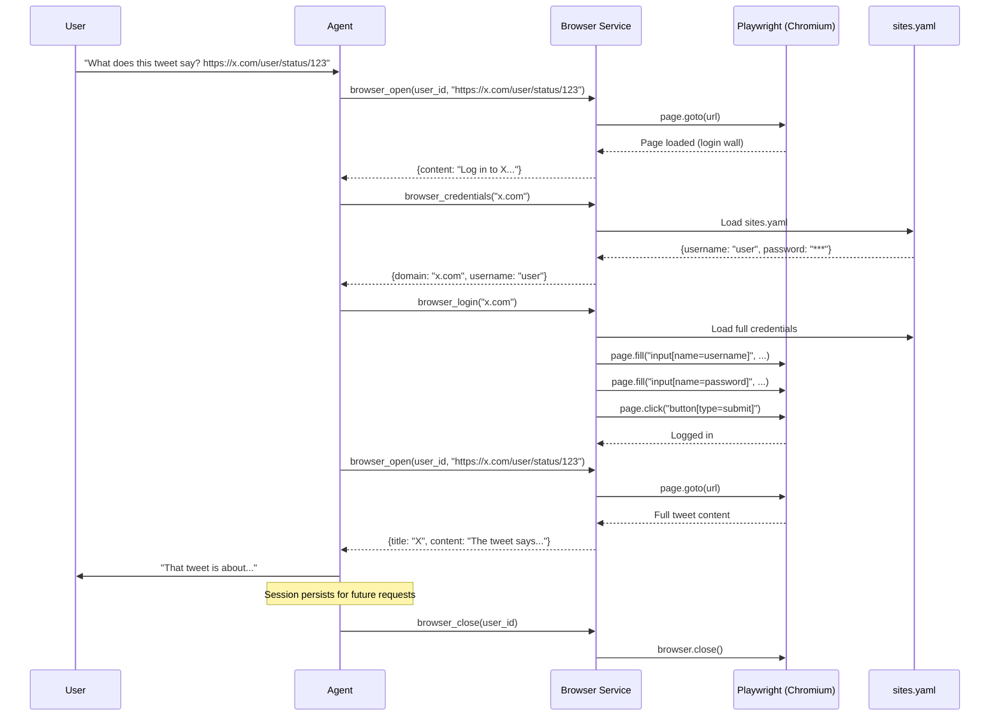

### VNC Manual Login Flow

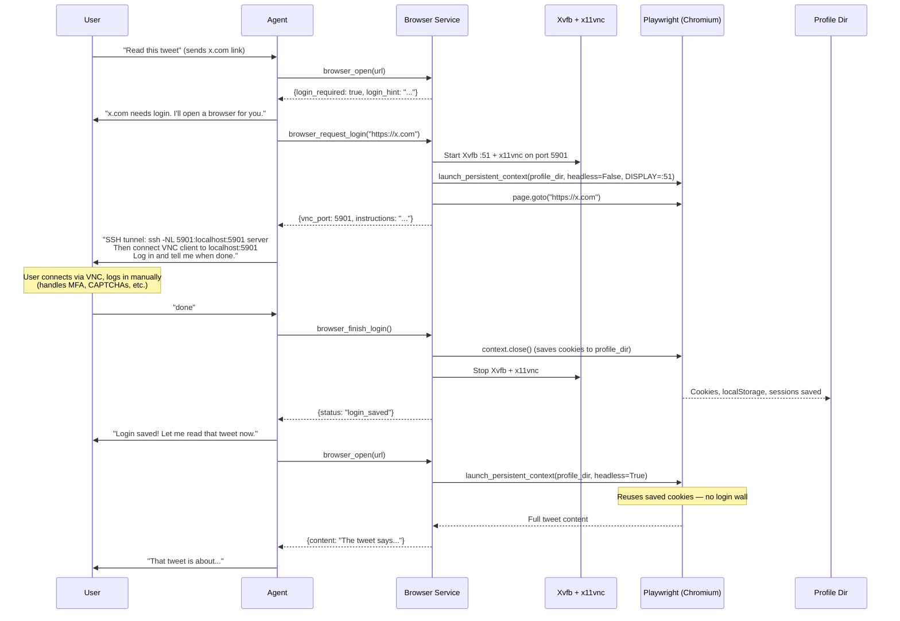

### Persistent Browser Profiles

When `BROWSER_PROFILE_DIR` is set, the browser uses Playwright's persistent context to save cookies, localStorage, and session data to disk. This means:

- Logins survive process restarts
- Each user gets an isolated profile at `{BROWSER_PROFILE_DIR}/{phone_number}/`
- VNC logins and YAML credential logins both persist to the same profile
- The agent can check login status before attempting access (`browser_check_login`)

```bash
# Enable persistent profiles
echo 'BROWSER_PROFILE_DIR=./browser_profiles' >> .env

# Enable VNC for manual login (requires Xvfb + x11vnc on the server)
echo 'BROWSER_VNC_ENABLED=true' >> .env
echo 'BROWSER_VNC_BASE_PORT=5900' >> .env

# Install VNC dependencies (Linux)
sudo apt-get install xvfb x11vnc
```

### sites.yaml Credentials Format

Store site credentials in a YAML file (set `SITES_CREDENTIALS_PATH` in `.env`):

```yaml
sites:
  x.com:
    username: your_twitter_handle
    password: your_password
    aliases:
      - twitter.com

  github.com:
    username: your_github_user
    password: your_github_pat

  reddit.com:
    username: your_reddit_user
    password: your_reddit_pass
```

The `aliases` field lets the agent match `twitter.com` URLs to `x.com` credentials. The `browser_credentials` tool returns the username but hides the password; `browser_login` exposes the password only to the Playwright fill action.

### Browser Capabilities

| Tool | What It Does |
|------|-------------|
| `browser_open` | Navigate to a URL, wait for JS to render, return page text (detects login walls) |
| `browser_read_page` | Get the current page's text content |
| `browser_screenshot` | Take a PNG screenshot of the current page |
| `browser_click` | Click an element by CSS selector |
| `browser_fill` | Fill a form field |
| `browser_press` | Press a keyboard key (Enter, Tab, Escape) |
| `browser_find` | Query all elements matching a selector |
| `browser_credentials` | Look up stored credentials (password hidden) |
| `browser_login` | Fill login form with stored credentials |
| `browser_close` | Close the browser session |
| `browser_request_login` | Start VNC session for manual login (MFA, CAPTCHAs) |
| `browser_finish_login` | End VNC session and save persistent profile |
| `browser_check_login` | Check if currently logged into a domain |
| `browser_profiles` | List all saved browser profiles |

## Agent Checkpointing

### The Problem

When the agent chains multiple tool calls to accomplish a task, a failure midway through (API timeout, bad tool output, wrong approach) can leave things in a half-finished state. Without checkpointing, the only option is to re-run the entire chain from scratch.

### The Solution: LangGraph Checkpoints with Automatic Retry

Every conversation turn is checkpointed using LangGraph's built-in `InMemorySaver`. After each tool call, the agent's full state (messages, tool results, pending decisions) is saved to an in-memory checkpoint. If a tool call fails:

1. **Automatic rollback** — the orchestrator rolls back to the last clean decision point (skipping the failed tool result and the tool call itself)
2. **Retry from checkpoint** — the agent resumes from the rolled-back state, choosing a different approach
3. **Budget limit** — after `DEFAULT_MAX_RETRIES` (default: 2) failed attempts, the error is raised to the user

Checkpoints are scoped per-user with unique thread IDs, so one user's state can never leak into another's. Memory is freed automatically when a turn completes.

### How It Works

```
User message
  → start_turn() — creates a fresh thread_id
  → graph.invoke(messages, config={thread_id})
      ├─ checkpoint saved after each step
      ├─ tool call succeeds → checkpoint saved → continue
      └─ tool call fails →
          ├─ can_retry? → rollback 2 checkpoints → retry from last good state
          └─ no retries left → raise error
  → end_turn() — purge checkpoints, free memory
```

### Key Design Decisions

- **In-memory only** — no database or filesystem needed. Fast, zero-config. Checkpoints are ephemeral and scoped to a single turn.
- **Per-turn isolation** — each message from a user gets a fresh thread. No cross-turn state leakage.
- **Rollback granularity** — rolls back 2 steps by default (the failed result + the tool call), landing on the last clean agent decision point.

## Prerequisites

- Python 3.13 (managed via [uv](https://github.com/astral-sh/uv)).
- **At least one messaging channel:**
  - **Twilio** (Voice + SMS) — requires a Twilio account, verified phone number, and ngrok for webhooks. Paid per message/minute.
  - **Discord** (text + attachments) — requires a Discord bot token (free). No ngrok needed — connects via WebSocket.
- OpenAI (or alternate LLM) credentials.
- Java 11+ (for `opendataloader-pdf` PDF extraction).
- Docker (for sandbox code execution).
- **Optional:** NVIDIA GPU with 8GB+ VRAM + vLLM + Unsloth (for self-improving fine-tuning).
- **Optional:** Playwright (`pip install playwright && playwright install chromium`) for browser automation.
- **Optional:** `gh` CLI (for self-modification PR creation).

## Installation Details

See [Quick Start](#quick-start) at the top of this README for the fast path.

**Sandbox code execution** requires both Docker Desktop running **and** the sandbox image built (`docker build -t prax-sandbox:latest sandbox/`). Without the image, sandbox tools will fail with a "pull access denied" error — it's a local image, not on Docker Hub. If Docker itself isn't running, the agent falls back to saving source files to the workspace.

**Browser automation** requires Playwright: `uv run playwright install chromium`

On startup you'll see:
```
Starting Prax — provider=openai model=gpt-4o temperature=0.7 encoding=o200k_base
```

## Security

- **Twilio webhook validation** — all webhook routes (`/transcribe`, `/respond`, `/sms`, `/reader`, `/read`, `/say`, `/play`, `/conference`) validate the `X-Twilio-Signature` header using your `TWILIO_AUTH_TOKEN`. If the token is not set (e.g. Discord-only or local dev), validation is skipped with a one-time warning.
- **Path traversal protection** — workspace file operations (`save_file`, `read_file`, `archive_file`, etc.) and self-improvement file operations validate that resolved paths stay within the expected root directory. Attempts to escape via `../` or absolute paths are blocked.
- **Sandbox auth** — each app process generates a random per-process auth key (`secrets.token_urlsafe(32)`) for sandbox container communication. Never committed to source.
- **Docker socket** — the app container needs `/var/run/docker.sock` mounted for sandbox management. This grants host Docker access; only run in trusted environments.
- **VNC** — when enabled, VNC servers bind to `127.0.0.1` only. Access requires an SSH tunnel.
- **Secret key validation** — the app warns on startup if `FLASK_SECRET_KEY` is set to a weak placeholder like `change-me`.

## Configuration

All runtime config is centralized in `.env` and validated via Pydantic (`prax/settings.py`). Copy `.env-example` and fill in your values:

```bash
cp .env-example .env
```

Key fields:

| Variable | Purpose | Default |
|----------|---------|---------|
| `TWILIO_ACCOUNT_SID`, `TWILIO_AUTH_TOKEN` | Twilio console credentials (not needed if Discord-only) | `None` |
| `OPENAI_KEY` | OpenAI API key | *(required unless using other provider)* |
| `ANTHROPIC_KEY` | Anthropic API key (for sandbox coding agent) | `None` |
| `LLM_PROVIDER` | LLM provider: `openai`, `anthropic`, `google_vertex`, `ollama`, `vllm` | `openai` |
| `BASE_MODEL` | Model name for the main agent | `gpt-4o` |
| `AGENT_NAME` | Display name for the agent across all channels, greetings, and prompts | `Prax` |
| `PHONE_TO_NAME_MAP` | JSON: `{"+15551234567": "Alice"}` — whitelists callers | `None` |
| `PHONE_TO_EMAIL_MAP` | JSON: `{"+15551234567": "alice@example.com"}` | `None` |
| `NGROK_URL` | HTTPS base URL from ngrok | `None` |
| `WORKSPACE_DIR` | Path to workspace root | `./workspaces` |
| **Sandbox** | | |
| `SANDBOX_IMAGE` | Docker image for sandbox | `prax-sandbox:latest` |
| `SANDBOX_TIMEOUT` | Max sandbox session duration (seconds) | `1800` |
| `SANDBOX_MAX_CONCURRENT` | Max simultaneous sandbox sessions | `5` |
| `SANDBOX_DEFAULT_MODEL` | Default model for sandbox coding | `anthropic/claude-sonnet-4-5` |
| `SANDBOX_MAX_ROUNDS` | Max message rounds per sandbox session | `10` |
| `SANDBOX_MEM_LIMIT` | Container memory limit | `1g` |
| `SANDBOX_CPU_LIMIT` | Container CPU limit (nanocpus) | `2000000000` |
| **Fine-Tuning (optional)** | | |
| `FINETUNE_ENABLED` | Enable self-improving fine-tuning | `false` |
| `VLLM_BASE_URL` | vLLM server URL | `http://localhost:8000/v1` |
| `LOCAL_MODEL` | Local model name for vLLM inference | `Qwen/Qwen3-8B` |
| `FINETUNE_BASE_MODEL` | Unsloth model for QLoRA training | `unsloth/Qwen3-8B-unsloth-bnb-4bit` |
| `FINETUNE_OUTPUT_DIR` | Directory for LoRA adapters | `./adapters` |
| `FINETUNE_MAX_STEPS` | Training steps per run | `60` |
| `FINETUNE_LEARNING_RATE` | QLoRA learning rate | `2e-4` |
| `FINETUNE_LORA_RANK` | LoRA rank (higher = more capacity) | `16` |
| **Browser (optional)** | | |
| `BROWSER_HEADLESS` | Run Chromium in headless mode | `true` |
| `BROWSER_TIMEOUT` | Default page timeout (ms) | `30000` |
| `SITES_CREDENTIALS_PATH` | Path to `sites.yaml` credentials file | `None` |
| `BROWSER_PROFILE_DIR` | Directory for persistent browser profiles (cookies/sessions); recommended for x.com/Twitter support | `None` |
| `BROWSER_VNC_ENABLED` | Enable VNC-based manual login sessions | `false` |
| `BROWSER_VNC_BASE_PORT` | Base port for VNC servers | `5900` |
| **Self-Improvement (optional)** | | |
| `SELF_IMPROVE_ENABLED` | Enable self-modification via staging clone + verify + deploy | `false` |
| `SELF_IMPROVE_REPO_PATH` | Path to the repo (default: cwd) | `None` |
| **Discord (optional)** | | |
| `DISCORD_BOT_TOKEN` | Discord bot token from Developer Portal | `None` |
| `DISCORD_ALLOWED_USERS` | JSON: `{"123456789": "Alice"}` — maps Discord user IDs to names | `None` |
| `DISCORD_ALLOWED_CHANNELS` | Comma-separated channel IDs the bot responds in (empty = DMs + all visible) | `None` |
| `DISCORD_TO_PHONE_MAP` | JSON: `{"discord_id": "+phone"}` — link Discord to Twilio identity | `None` |

## Channel Setup

You need at least one messaging channel. You can run both simultaneously.

### Option A: Discord (Free)

No ngrok, no per-message costs. The bot connects to Discord via WebSocket.

#### Step 1: Create a Discord Application

1. Go to the [Discord Developer Portal](https://discord.com/developers/applications).
2. Click **New Application** (top right).
3. When asked "What brings you to the Developer Portal?", select **Build a Bot**.
4. Give it a name (e.g., "Prax") and click **Create**.

#### Step 2: Configure the Bot

1. In your application, go to the **Bot** tab (left sidebar).
2. Click **Reset Token** and **copy** the token. You'll only see it once — save it now.
3. Scroll down to **Privileged Gateway Intents** and enable:
   - **Message Content Intent** (required — the bot needs to read message text)
4. Under **Authorization Flow**, keep **Public Bot** checked (it just means anyone with the invite link can add it — you control who can actually talk to it via `DISCORD_ALLOWED_USERS`).

#### Step 3: Create a Discord Server

If you don't already have a server to add the bot to:

1. Open Discord (desktop app or browser).
2. Click the **+** button at the bottom of the server list (left sidebar).
3. Select **Create My Own** → **For me and my friends** (or any option).
4. Name it (e.g., "Prax AI") and click **Create**.

#### Step 4: Invite the Bot to Your Server

1. Back in the [Developer Portal](https://discord.com/developers/applications), open your application.
2. Go to the **Installation** tab (left sidebar).
2. Under **Installation Contexts**, uncheck **User Install** and keep **Guild Install** checked.
3. Under **Guild Install → Default Install Settings**, click the **Scopes** dropdown and add `bot`.
4. A **Permissions** dropdown appears — add:
   - Send Messages
   - Read Message History
   - Attach Files
   - Add Reactions
   - Embed Links
   - View Channels
5. Click **Save Changes**.
6. Now go to the **OAuth2** tab (left sidebar). Copy the **Install Link** (or use the URL Generator with `bot` scope if you prefer).
7. Open the link in your browser, select your server, and click **Authorize**.

#### Step 5: Find Your Discord User ID

You need your Discord user ID (a long number) for the allow list:

1. Open Discord → **User Settings** (gear icon) → **Advanced** → enable **Developer Mode**.
2. Close settings, then **right-click your own name** in any chat → **Copy User ID**.
3. It'll be something like `123456789012345678`.

#### Step 6: Configure `.env`

```bash
# Paste the bot token from Step 2
DISCORD_BOT_TOKEN=MTIz...your_token_here

# Map Discord user IDs to display names (JSON)
DISCORD_ALLOWED_USERS={"123456789012345678": "Alice"}

# Optional: restrict to specific channels (comma-separated channel IDs)
# If empty, the bot responds to DMs and all channels it can see
DISCORD_ALLOWED_CHANNELS=
```

#### Step 7: Identity Linking (automatic for single users)

If you have **one Discord user** and **one phone user** in your config, they are **automatically linked** — Discord messages share the same conversation history and workspace as SMS. You'll see this in the logs:

```
Auto-linking Discord user 123... → +1555... (single user on both channels).
```

**Multiple users?** Set the mapping explicitly:

```bash
# Maps Discord user IDs to PERSONAL phone numbers (from PHONE_TO_NAME_MAP).
# This is YOUR number that you text/call FROM — NOT the Twilio ROOT_PHONE_NUMBER.
DISCORD_TO_PHONE_MAP={"123456789012345678": "+15551234567", "987654321098765432": "+15559876543"}
```

**Don't want linking?** Opt out explicitly:

```bash
DISCORD_TO_PHONE_MAP=false
```

Without linking, Discord gets its own separate conversation history and workspace.

#### Step 8: Start

```bash
uv run python app.py
```

The Discord bot starts automatically if `DISCORD_BOT_TOKEN` is set. You'll see `Discord bot connected as Prax#1234` in the logs. DM the bot or message in a channel to start chatting.

> **Discord-only setup:** If you don't want Twilio at all, you can skip `TWILIO_ACCOUNT_SID` and `TWILIO_AUTH_TOKEN` entirely. The app works with just Discord.

### Option B: Twilio (Voice + SMS)

Requires a Twilio account and ngrok for webhook forwarding.

1. Start the Flask server locally (see Running below).
2. In another terminal, run ngrok against the Flask port (default 5001):
   ```bash
   ngrok http 5001
   ```
3. Copy the HTTPS forwarding URL from ngrok output and set `NGROK_URL` in `.env`.
4. In the Twilio console open **Phone Numbers → Active Numbers → [your number] → Voice & Fax**:
   - Set **A Call Comes In** to `Webhook` with URL `https://<ngrok-domain>/transcribe` using POST.
5. Under **Messaging** set **A Message Comes In** to `Webhook` with URL `https://<ngrok-domain>/sms` using POST.

> **Note:** US phone numbers require A2P 10DLC registration for SMS. Consider a toll-free number or use Discord to avoid this entirely.

## Database

By default the SQLite database lives at `conversations.db`. To start fresh:
```bash
rm -f conversations.db
uv run python -c "from prax.conversation_memory import init_database; init_database('conversations.db')"
```

## Running the App

```bash
uv run python app.py
```
The server listens on `0.0.0.0:5001` (configurable via `.env`). The scheduler starts automatically and loads any existing `schedules.yaml` files from user workspaces.

### Production / Deployment

- **Gunicorn**: `uv run gunicorn 'app:app' --bind 0.0.0.0:5001 --workers 2 --threads 4`
- **Environment**: copy `.env` to the server, point `LOG_PATH`/`DATABASE_NAME` to persistent volumes.
- **Docker**: see `Dockerfile` and `docker-compose.yml` in the repo root. The app container needs `/var/run/docker.sock` mounted for sandbox functionality.
- **TLS / DNS**: terminate TLS via ngrok (dev) or a reverse proxy (Nginx/Cloudflare/etc.).

## Testing

```bash
# Run all tests
uv run pytest tests/ -q

# With coverage
uv run coverage run -m pytest
uv run coverage report
```

Coverage configuration (see `pyproject.toml`) focuses on business logic; Twilio blueprints and heavy IO helpers are excluded until integration tests are added.

## Docker

### Docker Compose (recommended)

```bash
cp .env-example .env    # configure API keys
docker compose up --build
```

**Day-to-day usage** — once images are built, skip the rebuild to start in seconds:

```bash
docker compose up                         # start with existing images (fast)
docker compose up --build                 # rebuild ALL images then start
docker compose up --build app             # rebuild only the app image, start everything
docker compose up --build sandbox         # rebuild only the sandbox image, start everything
docker compose build app && docker compose up   # same idea, explicit two-step
```

Use `--build` when you've changed a Dockerfile or its dependencies (e.g. added a package). For code-only changes in dev mode, plain `docker compose up` is enough.

**Dev mode** — mount local source code so changes auto-reload without rebuilding:

```bash
docker compose -f docker-compose.yml -f docker-compose.dev.yml up
```

This bind-mounts `prax/`, `app.py`, `config.py`, and `scripts/` into the container and sets `DEBUG=true`, which enables Flask's Werkzeug reloader. Edit code locally, save, and the app restarts automatically. You still need `--build` if you change the Dockerfile, `pyproject.toml`, or system-level dependencies.

This starts three services:

| Service | Description |
|---------|-------------|
| **app** | Flask app (port 5001), `.env` injected, Docker socket for sandbox management |
| **sandbox** | Always-on OpenCode sandbox with Python, LaTeX, ffmpeg, poppler, pandoc. Shares `./workspaces` volume. Restarts automatically. |
| **ngrok** | Tunnel to app:5001. Prax can serve files via public URLs. |

The app waits for the sandbox health check before starting. Environment detection is automatic — `RUNNING_IN_DOCKER=true` and `SANDBOX_HOST=sandbox` are set by compose.

**Runtime capabilities in Docker mode:**
- `sandbox_install("package")` — apt-get install inside the running sandbox
- `sandbox_rebuild()` — Prax edits the Dockerfile, rebuilds the image, and restarts the container
- `workspace_share_file("path/to/file.mp4")` — publish a file with a public ngrok URL

### Standalone (without compose)

```bash
docker build -t prax .
docker run -d -p 5001:5001 --restart always \
  -v "$HOME/workspaces:/app/workspaces" \
  -v "$HOME/conversations.db:/app/conversations.db" \
  -v /var/run/docker.sock:/var/run/docker.sock \
  prax
```

Build the sandbox image separately:
```bash
docker build -t prax-sandbox:latest sandbox/
```

## Extending the Agent

### Plugin System (recommended — hot-swappable at runtime)

The agent can create and manage its own tool plugins at runtime. Plugins use a **folder-per-plugin** layout and are validated in a subprocess sandbox before activation. No restart needed — the orchestrator rebuilds its tool graph automatically.

**Plugin layout:**

```
prax/plugins/tools/
  npr_podcast/          ← Built-in plugin (ships with repo)
    plugin.py
    README.md
  pdf_reader/
    plugin.py
    README.md
  custom/               ← Agent-created plugins
    weather/
      plugin.py
      README.md
  CATALOG.md            ← Auto-generated plugin listing
```

**Plugin format** — a Python module with a `register()` function:

```python
# prax/plugins/tools/custom/weather/plugin.py
from langchain_core.tools import tool

PLUGIN_VERSION = "1"
PLUGIN_DESCRIPTION = "Weather lookup for any city"

@tool
def weather_lookup(city: str) -> str:
    """Get the current weather for a city."""
    import requests
    resp = requests.get(f"https://wttr.in/{city}?format=3")
    return resp.text

def register():
    return [weather_lookup]
```

**Lifecycle:**

1. **Write** — `plugin_write("weather", code)` creates the folder, saves `plugin.py` + `README.md`, runs sandbox tests
2. **Activate** — `plugin_activate("weather")` hot-swaps it into the live agent
3. **Monitor** — runtime failures are counted; after 3 consecutive failures, the plugin auto-rolls back
4. **Rollback** — `plugin_rollback("weather")` reverts to the previous version instantly
5. **Catalog** — `plugin_catalog()` shows all available plugins with versions and tools

**Workspace sync (optional):** Prax stores custom plugins and user files in a git-backed workspace. You can push this workspace to a **private** remote for backup and review. Prax verifies the remote is private before pushing — public repos are refused.

**Setting up workspace sync (step by step):**

**Step 1 — Create a private GitHub repo for the workspace:**

Go to [github.com/new](https://github.com/new), create a repo (e.g. `prax-workspace`), and **make sure it is set to Private**. Do NOT initialize it with a README.

**Step 2 — Generate an SSH deploy key:**

```bash
ssh-keygen -t ed25519 -f ~/.ssh/prax_deploy_key -N "" -C "prax-workspace"
```

This creates two files:
- `~/.ssh/prax_deploy_key` — the **private** key (stays on your server, goes into `.env`)
- `~/.ssh/prax_deploy_key.pub` — the **public** key (goes onto GitHub)

**Step 3 — Add the public key to GitHub as a deploy key:**

1. Go to your repo → **Settings** → **Deploy keys** → **Add deploy key**
2. Title: `Prax workspace`
3. Key: paste the output of `cat ~/.ssh/prax_deploy_key.pub`
4. **Check "Allow write access"** — this is required for Prax to push
5. Click **Add key**

**Step 4 — Base64-encode the private key and add to `.env`:**

```bash
cat ~/.ssh/prax_deploy_key | base64 | tr -d '\n'
```

Copy the output (one long string) and add to your Prax `.env`:

```bash
PRAX_SSH_KEY_B64=<paste the base64 string here>
```

**Step 5 — Tell Prax the remote URL:**

In a conversation with Prax, say: *"Set my workspace remote to git@github.com:yourname/prax-workspace.git"*

Prax will verify the repo is private, then set it up. After that, say *"push my workspace"* any time to sync.

> **Security:** Prax checks the GitHub/GitLab API before every push to confirm the remote repo is private. If someone changes the repo to public, Prax will refuse to push.

**Importing shared plugins:** Users can share plugin repos publicly. Import them with `plugin_import("https://github.com/someone/cool-tools.git")` — they're added as git submodules in the workspace. `plugin_import_list` shows what's installed, `plugin_import_remove` uninstalls.

**Workspace .gitignore:** Every workspace automatically gets a `.gitignore` that blocks media files (mp3, mp4, wav, etc.), LaTeX build artifacts (aux, log, nav, etc.), and Python caches. PDFs, `.tex` files, and text are committed normally.

The agent also has tools for modifying its own system prompt (`prompt_write`, `prompt_rollback`) and LLM routing (`llm_config_update`) — all without restart.

| Tool | Purpose |
|------|---------|
| `plugin_list` | List all active plugins with versions |
| `plugin_read` / `plugin_write` | Read/write plugin source code |
| `plugin_test` / `plugin_activate` | Sandbox test / hot-swap activation |
| `plugin_rollback` / `plugin_remove` | Revert or remove a plugin |
| `plugin_status` | Health: version, failure count, auto-rollback threshold |
| `plugin_catalog` | Auto-generated listing of all available plugins |
| `plugin_import` / `plugin_import_activate` / `plugin_import_remove` / `plugin_import_list` | Import shared plugins from public repos (git submodules), security review |
| `workspace_set_remote` / `workspace_push` | Configure and push workspace to a private remote |
| `workspace_share_file` / `workspace_unshare_file` | Publish/unpublish workspace files via ngrok (opt-in, token-based) |
| `sandbox_install` | Install system packages in the persistent sandbox |
| `sandbox_rebuild` | Edit sandbox Dockerfile and rebuild the container image |
| `prompt_read` / `prompt_write` / `prompt_rollback` | System prompt management |
| `prompt_list` | List all prompt files with version info |
| `llm_config_read` / `llm_config_update` | Per-component LLM provider/model/temperature routing |
| `source_read` / `source_list` | Read any source file or list directories in the codebase |

**Plugin priority:** Workspace custom plugins override built-in ones when they define tools with the same name. Priority: workspace plugins > built-in. This lets Prax fix or improve any built-in tool by writing a better version.

**Example plugins — [prax-plugins](https://github.com/praxagent/prax-plugins):** A collection of open-source plugins. Install one by telling Prax: *"Import the pdf2presentation plugin from https://github.com/praxagent/prax-plugins"* — or install them all: *"Import all plugins from https://github.com/praxagent/prax-plugins"*. See its README for how to create your own plugins.

**Architecture:** See [SELF_MODIFY_PLAN.md](SELF_MODIFY_PLAN.md) for the full design rationale.

### Manual Tool Registration (for deployment-time extensions)

For tools that should be registered at startup (not runtime), use the tool registry before the Flask app is created:

```python
from langchain_core.tools import tool
from prax.agent.tool_registry import register_tool

@tool
def city_guide(city: str) -> str:
    """Return travel resources for a city."""
    return f"Here are resources for {city}"

register_tool(city_guide)
```

Registered tools automatically become available to both SMS and voice flows without editing the blueprints.

## Troubleshooting

- **Docker build "not enough free space":** Run `docker system prune -a` to remove unused images, containers, and build cache. Add `--volumes` if you also want to reclaim volume space (this deletes data in unnamed volumes). On macOS, Docker Desktop's disk image can also be resized in Settings → Resources.
- **403 from `/transcribe`:** Ensure the calling number exists in `PHONE_TO_NAME_MAP`.
- **ngrok 502 / Twilio timeout:** Confirm the Flask process is running and ngrok points to the correct port.
- **PDF extraction fails:** Ensure Java 11+ is installed (`java -version`).
- **LangChain provider errors:** `prax/agent/llm_factory.py` validates missing API keys; double-check `.env`.
- **Sandbox won't start:** In Docker Compose mode, check `docker compose logs sandbox` — the app waits for the sandbox health check. In local mode, verify Docker Desktop is running (`docker info`). Build the sandbox image: `docker build -t prax-sandbox:latest sandbox/`.
- **sandbox_install fails:** Only works in Docker Compose mode (`RUNNING_IN_DOCKER=true`). In local mode, install packages on your machine directly.
- **Shared file link returns 404:** The file may have been deleted or the share token revoked. Re-publish with `workspace_share_file`.
- **Schedule fires at wrong time:** Check the `timezone` field in `schedules.yaml`. Use IANA names like `America/Los_Angeles`, not abbreviations like `PST`.
- **vLLM connection refused:** Ensure vLLM is running with `--enable-lora` and `VLLM_BASE_URL` points to it.
- **Training OOM:** Reduce `FINETUNE_LORA_RANK` (8 instead of 16) or `FINETUNE_MAX_STEPS`. QLoRA should fit in 6GB VRAM.
- **Browser login fails:** Check `sites.yaml` credentials. For sites with CAPTCHAs or 2FA, use `browser_request_login` for VNC-based manual login instead.
- **VNC won't connect:** Ensure `Xvfb` and `x11vnc` are installed. Check the SSH tunnel: `ssh -NL 5901:localhost:5901 server`. Verify `BROWSER_VNC_ENABLED=true` and `BROWSER_PROFILE_DIR` is set.
- **Self-improve stuck in a loop:** Prax is limited to 3 deploy attempts per branch. If it keeps failing, it will stop automatically. To manually clear the state: delete `.self-improve-state.yaml` from the project root and restart the app. To rollback a broken deploy: tell Prax "rollback" or manually run `git revert HEAD` (if the last commit starts with `self-improve deploy:`).
- **Self-improve PR fails:** Ensure `gh` CLI is authenticated (`gh auth status`) and the repo has a remote origin.
- **Plugin sandbox fails:** The sandbox runs plugins in a subprocess of the same Python environment. If `langchain_core` or other dependencies aren't installed, plugin tests will fail. Run `uv sync` to ensure all dependencies are available.
- **Plugin auto-rollback triggers unexpectedly:** Check `plugin_status("name")` to see the failure count and threshold. Adjust `max_failures_before_rollback` in the registry if needed.
- **Workspace push fails:** Verify `PRAX_SSH_KEY_B64` in `.env` and that a remote is set via `workspace_set_remote`. The key must be base64-encoded: `cat ~/.ssh/prax_deploy_key | base64 | tr -d '\n'`. Check that the deploy key has write access to the repo. The repo must be **private** — Prax refuses to push to public repos.
- **CATALOG.md not updating:** The catalog regenerates on every `load_all()` call (startup and after any hot-swap). Check `prax/plugins/tools/CATALOG.md` or the plugin repo's `CATALOG.md`.
- **Discord bot not responding:** Verify `DISCORD_BOT_TOKEN` is set and valid. Check that **Message Content Intent** is enabled in the Developer Portal. Ensure the user's Discord ID is in `DISCORD_ALLOWED_USERS`.
- **Discord "Privileged intent" error:** Go to Developer Portal → Bot tab → enable **Message Content Intent** under Privileged Gateway Intents.

## Roadmap

- [x] LangGraph ReAct agent with tool calling
- [x] PDF extraction pipeline (opendataloader-pdf)
- [x] Git-backed per-user workspace with agent tools
- [x] Workspace context injection in system prompt
- [x] Structural refactor (shared Twilio client, Pydantic settings, modular services)
- [x] Sandbox code execution (Docker + OpenCode)
- [x] Solution archiving and reuse
- [x] Interactive sandbox sessions (main agent <-> coding agent feedback loop)
- [x] Multi-model support with mid-session switching
- [x] Round-based budget control for sandbox sessions
- [x] Scheduled recurring messages (APScheduler + YAML + timezone-aware cron)
- [x] Self-improving fine-tuning (vLLM + Unsloth QLoRA + hot-swap)
- [x] Self-modification via staging clone + verify-then-deploy + PR workflow
- [x] Browser automation (Playwright + credential store + persistent profiles + VNC login)
- [x] Discord bot (free alternative to Twilio for text messaging)
- [x] Local model support (vLLM with OpenAI-compatible API)
- [x] Configurable agent name (AGENT_NAME)
- [x] One-time reminders (APScheduler DateTrigger)
- [x] User to-do list (natural language task management)
- [x] Link history (URL logging to workspace)
- [x] Dynamic user notes (per-user preferences and personality)
- [x] Agent task planning (multi-step decomposition)
- [x] Lightweight URL fetching (fetch_url_content with oEmbed support)
- [x] Instruction persistence (reread_instructions tool)
- [x] Plugin system (hot-swappable tools, prompts, and LLM routing with subprocess sandbox + auto-rollback)
- [x] Folder-per-plugin layout with auto-generated CATALOG.md
- [x] Reader-to-plugin migration (NPR, web summary, PDF, YouTube, arXiv, Deutschlandfunk)
- [x] Plugin repository support (separate private git repo with SSH deploy key)
- [ ] Apple Silicon support (MLX backend as alternative to vLLM/CUDA)
- [ ] Sandbox Docker image build + integration test with live OpenCode
- [ ] Voice-triggered sandbox sessions
- [ ] Schedule firing with workspace file attachments (e.g., daily PDF digest)
- [ ] MCP server integration for sandbox tooling
- [ ] Discord voice channel support (join, listen, speak)
- [ ] Multi-step browser workflows (e.g., "check my Twitter DMs every morning")
- [ ] Adapter A/B testing (serve two adapters, compare quality metrics)

Contributions are welcome — please open issues or PRs with reproducible steps and include pytest/coverage output.
