<div align="center">

# Prax

**Your personal AI assistant — on the web, Discord, SMS, and voice.**

97+ built-in tools, extensible via self-modifying plugins. Git-backed memory. Runs on your own server.

Includes [**TeamWork**](https://github.com/praxagent/teamwork) — a Slack-like web UI with real-time chat, Kanban board, file browser, terminal, and browser screencast.


*Prax remembering your timezone, fetching NPR news, and managing your workspace — all from Discord.*

</div>

> **Warning — Active Development & API Cost Risk**
>
> This project is under heavy, rapid development. Interfaces, tool names, and
> behaviors may change without notice. **Use at your own risk.**
>
> Prax runs agentic workflows that can chain many LLM calls per user message
> (tool calls, sub-agent delegation, revision loops, sandbox sessions, etc.).
> If you are using a non-local LLM provider (OpenAI, Anthropic, Google, etc.),
> **you must set up spending limits and cost monitoring on your provider
> account.** A stuck or misconfigured workflow can burn through API credits
> quickly. Built-in guardrails (recursion limits, round budgets, auto-abort on
> consecutive failures) reduce this risk but cannot eliminate it entirely.
> The maintainers are not responsible for any API charges incurred.

---

## Quick Start

### Docker Compose (recommended)

```bash
git clone https://github.com/praxagent/prax.git && cd prax
git clone https://github.com/praxagent/teamwork.git ../teamwork  # web UI
cp .env-example .env                      # configure (at minimum: OPENAI_KEY)
docker compose up --build                 # builds app + sandbox + TeamWork, starts everything
```

This brings up Prax, the always-on sandbox (with LaTeX, ffmpeg, poppler, pandoc, headless Chrome), [TeamWork](https://github.com/praxagent/teamwork) web UI, and ngrok — all wired together. Open **http://localhost:3000** to access TeamWork.

For developer mode (bind-mounts source code, Werkzeug auto-reloads on file changes):

```bash
docker compose -f docker-compose.yml -f docker-compose.dev.yml up --build app
```

Or, if you don't need to rebuild:

```bash
docker compose -f docker-compose.yml -f docker-compose.dev.yml up
```

Most code changes are picked up automatically by Werkzeug's reloader. For changes to `app.py`, the entrypoint, watchdog, or dependencies, restart the container:

```bash
# Restart without rebuilding (entrypoint/watchdog changes, env var changes)
docker compose -f docker-compose.yml -f docker-compose.dev.yml restart app

# Rebuild and restart (new dependencies, Dockerfile changes)
docker compose -f docker-compose.yml -f docker-compose.dev.yml up --build app
```


### Local development

```bash
git clone https://github.com/praxagent/prax.git && cd prax
uv sync --python 3.13                    # install deps (requires uv)
cp .env-example .env                      # configure (at minimum: OPENAI_KEY)
mkdir -p static/temp
docker build -t prax-sandbox:latest sandbox/   # optional: code execution
uv run python app.py                      # start Prax
```

Set up a channel in `.env`:
- **TeamWork web UI (included):** runs automatically via Docker Compose — open http://localhost:3000
- **Discord (free):** `DISCORD_BOT_TOKEN` + `DISCORD_ALLOWED_USERS`
- **Twilio (paid):** `TWILIO_ACCOUNT_SID` + `TWILIO_AUTH_TOKEN` + `NGROK_URL`

---

## Table of Contents

- [Features](#features)
- [TeamWork Web UI](#teamwork-web-ui)
- [Architecture](#architecture)
- [Sandbox Code Execution](#sandbox-code-execution)
- [Self-Improving Fine-Tuning](#self-improving-fine-tuning)
- [Self-Modification via PRs](#self-modification-via-prs)
- [Agent Delegation](#agent-delegation)
- [Browser Automation](#browser-automation)
- [Agent Checkpointing](#agent-checkpointing)
- [Prerequisites](#prerequisites)
- [Security](#security)
- [Configuration](#configuration)
- [Channel Setup](#channel-setup)
- [Database](#database)
- [Running the App](#running-the-app)
- [Testing](#testing)
- [Docker](#docker)
- [Extending the Agent](#extending-the-agent)
- [Troubleshooting](#troubleshooting)
- [Research](#research--academic-foundations-for-agentic-workflow-design)
- [Roadmap](#roadmap)

---

## Features

Prax is a multi-channel AI assistant powered by a LangGraph ReAct agent. It connects to **Discord** and/or **Twilio** (voice + SMS), remembers everything in SQLite, and can modify its own tools at runtime.

| Category | Highlights |
|----------|-----------|
| **Channels** | [TeamWork](https://github.com/praxagent/teamwork) web UI (Slack-like chat, Kanban, terminal, browser, file browser), Discord bot (free, WebSocket), Twilio voice + SMS (webhooks) |
| **Agent** | LangGraph ReAct loop, 97+ built-in tools (extensible via plugins), dedicated sub-agents (self-improvement, plugin engineering, content authoring, research, coding), watchdog supervisor, automatic checkpoint & retry on failures |
| **Memory** | SQLite conversations with auto-summarization, git-backed per-user workspaces, dynamic user notes, link history, to-do lists, task plans |
| **Notes** | Conversation-to-note publishing (Hugo pages with KaTeX, mermaid, syntax highlighting), iterative updates, searchable index, shareable URLs, bidirectional knowledge graph links |
| **Documents** | PDF extraction (arXiv, URLs, attachments), web page summaries, YouTube transcripts, LaTeX compilation, URL-to-note / PDF-to-note / arXiv-to-note pipelines |
| **Research** | Research projects (group notes, links, sources), RSS/Atom feed subscriptions, conversation history search across sessions |
| **Code** | Always-on Docker sandbox with [OpenCode](https://opencode.ai/), auto-installs packages, multi-model support, round-based budget control |
| **Scheduling** | Cron jobs (YAML), one-time reminders, timezone-aware delivery |
| **Browser** | Playwright automation, persistent login profiles, VNC for manual login, credential management |
| **Self-improvement** | Hot-swappable plugin system (sandbox + auto-rollback), self-modifying code via PRs, QLoRA fine-tuning on conversation history |
| **Models** | OpenAI, Anthropic, Google Vertex, Ollama, local vLLM — per-component routing |
| **Plugins** | Folder-per-plugin, git submodule imports from public repos, security scanning, workspace push to private remote, auto-generated catalog |
| **File sharing** | Opt-in file publishing via ngrok (shareable links for videos, PDFs), Twilio media serving |

## TeamWork Web UI

[**TeamWork**](https://github.com/praxagent/teamwork) is an agent-agnostic collaboration shell — a Slack-like web interface that gives Prax a visual frontend. It runs as a separate container alongside Prax and connects via the External Agent API.

**What you get:**

- **Real-time chat** — public channels (#general, #engineering, #research) and private DMs with Prax, with typing indicators and WebSocket updates
- **Kanban board** — task management with drag-and-drop columns (pending / in progress / review / completed). Prax creates, assigns, and completes tasks automatically as it works through plans
- **In-browser terminal** — full PTY shell into the sandbox container, or launch Claude Code directly from the UI
- **Browser screencast** — live view of the headless Chrome running in the sandbox, with mouse/keyboard passthrough
- **File browser** — browse and manage workspace files
- **Multi-agent status** — see which role agents (Planner, Executor, Researcher, etc.) are active

TeamWork is included in the default `docker-compose.yml`. After `docker compose up --build`, open **http://localhost:3000**. API docs (Swagger) are at **http://localhost:8000/docs**.

For standalone use or integration with other agents, see the [TeamWork repository](https://github.com/praxagent/teamwork).

## Architecture

### High-Level System Overview

```mermaid
graph TB
    User["User (Phone / Discord / Web)"]

    subgraph TeamWork["TeamWork Web UI"]
        TWChat["Chat Channels"]
        TWKanban["Kanban Board"]
        TWTerminal["Terminal"]
        TWBrowser["Browser Screencast"]
    end

    subgraph Twilio["Twilio Cloud (optional)"]
        Voice["Voice Webhook"]
        SMS["SMS Webhook"]
    end

    subgraph Discord["Discord (optional)"]
        DiscordBot["Discord Bot\n(WebSocket)"]
    end

    subgraph Flask["Flask App"]
        MainRoutes["/transcribe, /respond"]
        SmsRoute["/sms"]
        VoiceSvc["VoiceService"]
        SmsSvc["SmsService"]
        DiscordSvc["DiscordService"]
        ConvoSvc["ConversationService"]
    end

    subgraph Agent["LangGraph ReAct Agent (Prax)"]
        Orchestrator["ConversationAgent"]
        LLMFactory["LLM Factory"]

        subgraph Tools["Orchestrator Tools (~24)"]
            BuiltIn["Core (3)\nsearch, datetime, URL fetch"]
            WS["Workspace (11)\nfiles, todos, planning"]
            Sched["Scheduler (9)\ncron, reminders"]
            Courses["Courses (6)\ntutoring"]
            Spokes["Spoke Delegates (8)\nbrowser, content, sysadmin,\nsandbox, finetune, knowledge,\nresearch, vision"]
            SA["Sub-Agent (2)\ndelegate_task, delegate_parallel"]
        end
    end

    subgraph PluginSys["Plugin System (Hot-Swappable)"]
        PluginLoader["Plugin Loader\n(folder-per-plugin discovery)"]
        PluginSandbox["Subprocess Sandbox"]
        PluginRegistry["Version Registry\n(registry.json)"]
        PluginCatalog["CATALOG.md\n(auto-generated)"]
        PromptMgr["Prompt Manager"]
        LLMConfig["LLM Routing\n(llm_routing.yaml)"]
        BuiltInPlugins["Built-In Plugins\n(NPR, PDF, YouTube, arXiv, ...)"]
        CustomPlugins["Custom Plugins\n(plugins/tools/custom/)"]
        SysPrompt["System Prompt\n(plugins/prompts/)"]
    end

    subgraph PluginRepo["Plugin Repository (optional)"]
        RemoteRepo["Private Git Repo\n(SSH deploy key)"]
        RepoBranch["Branch: plugins"]
        RemoteCatalog["CATALOG.md"]
    end

    subgraph Storage["Persistence"]
        SQLite["SQLite\n(conversation memory)"]
        Workspace["Git-Backed Workspace\n(per-user files)"]
        ScheduleYAML["schedules.yaml\n(cron definitions)"]
        AdapterReg["adapter_registry.json\n(LoRA adapters)"]
        Todos["todos.json\n(user to-do list)"]
        Links["links.md\n(link history)"]
        Instructions["instructions.md\n(prompt reference)"]
        AgentPlan["agent_plan.json\n(task decomposition)"]
    end

    subgraph Sandbox["Docker Sandbox"]
        Container["Docker Container"]
        OpenCode["OpenCode\n(headless HTTP API)"]
    end

    subgraph LocalML["Local ML Stack (optional)"]
        vLLM["vLLM Server\n(OpenAI-compat API)"]
        LoRA["LoRA Adapters\n(hot-swappable)"]
        Unsloth["Unsloth QLoRA\n(training subprocess)"]
    end

    subgraph Browser["Browser (Playwright)"]
        Chromium["Headless Chromium"]
        SiteCreds["sites.yaml\n(credentials)"]
        Profiles["Persistent Profiles\n(cookies/sessions)"]
        VNCServer["Xvfb + x11vnc\n(manual login)"]
    end

    Worktree["Git Worktree\n(self-modification)"]

    Scheduler["APScheduler\n(background cron)"]

    User -->|Web| TWChat
    User -->|Call| Voice
    User -->|Text| SMS
    User -->|Message| DiscordBot
    TWChat -->|Webhook| ConvoSvc
    TWTerminal -->|docker exec| Container
    TWBrowser -->|CDP| Chromium
    Voice --> MainRoutes --> VoiceSvc
    SMS --> SmsRoute --> SmsSvc
    DiscordBot --> DiscordSvc
    VoiceSvc --> ConvoSvc
    SmsSvc --> ConvoSvc
    DiscordSvc --> ConvoSvc
    ConvoSvc --> Orchestrator
    Orchestrator --> LLMFactory
    LLMFactory -->|cloud| BuiltIn
    LLMFactory -->|local| vLLM
    Orchestrator --> Tools
    WS --> Workspace
    Spokes -->|sandbox| Container
    Container --> OpenCode
    Sched --> ScheduleYAML
    Spokes -->|finetune| Unsloth
    Spokes -->|finetune| vLLM
    vLLM --> LoRA
    SA -->|codegen| Worktree
    Spokes -->|sysadmin| PluginLoader
    PluginLoader --> BuiltInPlugins
    PluginLoader --> CustomPlugins
    PluginLoader --> PluginSandbox
    PluginLoader --> PluginRegistry
    PluginLoader --> PluginCatalog
    CustomPlugins -.->|push| RemoteRepo
    RemoteRepo --> RepoBranch
    RepoBranch --> RemoteCatalog
    Orchestrator --> PromptMgr
    PromptMgr --> SysPrompt
    LLMFactory --> LLMConfig
    Spokes -->|browser| Chromium
    Chromium --> SiteCreds
    Chromium --> Profiles
    VNCServer --> Chromium
    ConvoSvc --> SQLite
    Scheduler -->|reads| ScheduleYAML
    Scheduler -->|fires| ConvoSvc
    ConvoSvc -->|SMS / Discord reply| User
    Worktree -->|PR| Workspace
```

### Concepts — What Lives Where

Prax is organized in five layers. Each has a clear job and a single direction of dependency: **blueprints → services → agent → plugins**.

| Layer | Directory | What it is | Example |
|-------|-----------|------------|---------|
| **Blueprints** | `prax/blueprints/` | Flask route handlers — the HTTP surface. They receive webhooks from Twilio (voice, SMS) or serve static files. Blueprints know about *channels* but not about the agent. | `POST /sms` validates a Twilio signature, hands the message to `SmsService`, and returns a TwiML response. |
| **Services** | `prax/services/` | Business logic that doesn't belong in the agent. A service encapsulates one capability: workspace git ops, Docker sandbox lifecycle, Playwright browser sessions, APScheduler cron, Hugo publishing, etc. Services are called *both* by blueprints (channel-facing) and by agent tools (capability-facing). They never call the agent directly. | `workspace_service.py` manages the per-user git repo — creating, reading, locking, committing. |
| **Agent** | `prax/agent/` | The LangGraph ReAct loop and everything around it: the orchestrator, LLM factory, tool builders, governance, checkpointing. Tool builder files (`*_tools.py`) define groups of LangChain tools that thin-wrap a service. The agent layer decides *what* to do; services decide *how* to do it. | `sandbox_tools.py` exposes 7 tools (`sandbox_start`, `sandbox_message`, …) that all delegate to `sandbox_service.py`. |
| **Plugins** | `prax/plugins/` | Hot-swappable extensions discovered at startup. Each plugin lives in `plugins/tools/<name>/plugin.py`, exports a `register()` function returning LangChain tools, and can be created/modified/rolled back at runtime — by the agent itself. The plugin system also manages the system prompt and LLM routing config. | `plugins/tools/news/plugin.py` provides the unified `news` tool with actions for briefings, RSS checking, and audio. |
| **Readers** | `prax/readers/` | Legacy content-extraction helpers (ArXiv, NPR audio, web scraping). Being migrated into plugins. New code should use or create a plugin instead. | `readers/news/npr_top_hour.py` fetches the latest NPR podcast URL — now called by the `news` plugin. |

**How they connect:**

```
User ──▸ Twilio/Discord
            │
        Blueprints          (HTTP layer — routes, auth)
            │
        Services             (business logic — workspace, sandbox, browser, scheduler, …)
            │
        Agent                (LangGraph ReAct loop — orchestrator, tools, governance)
            │
        Plugins              (hot-swappable tools — news, PDF, YouTube, custom, …)
```

**Rules of thumb:**

- **Need a new channel?** Add a blueprint + a channel service.
- **Need a new capability** (e.g., email sending)? Add a service, then wrap it with a tool builder in `agent/` or a plugin in `plugins/tools/`.
- **Need a new tool the agent can call?** If it's a core, always-on tool, add it to an `agent/*_tools.py` builder. If it's optional, content-focused, or user-modifiable, make it a plugin.
- **Need to change the system prompt?** Edit `plugins/prompts/system_prompt.md` (or let the agent do it at runtime via `prompt_write`).

### Request Flow — SMS Message

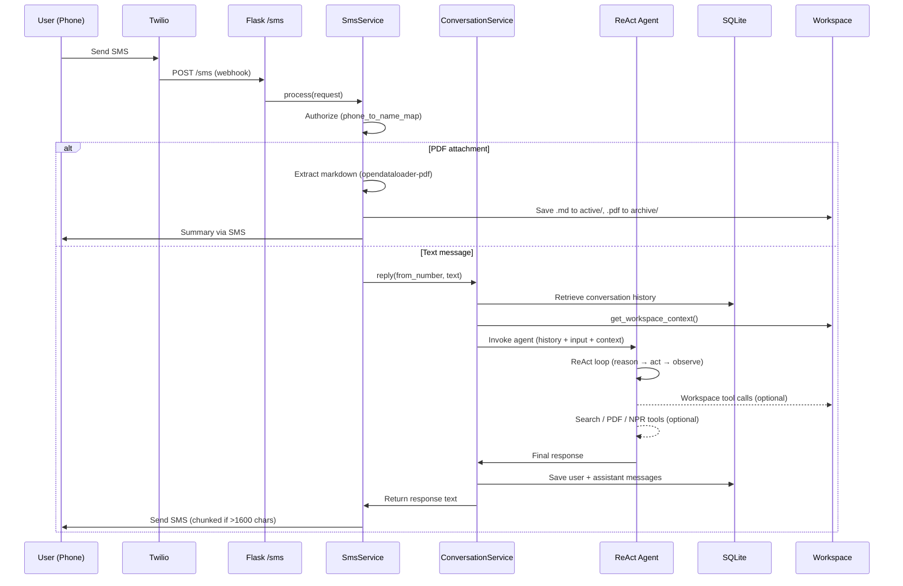

### Request Flow — Discord Message

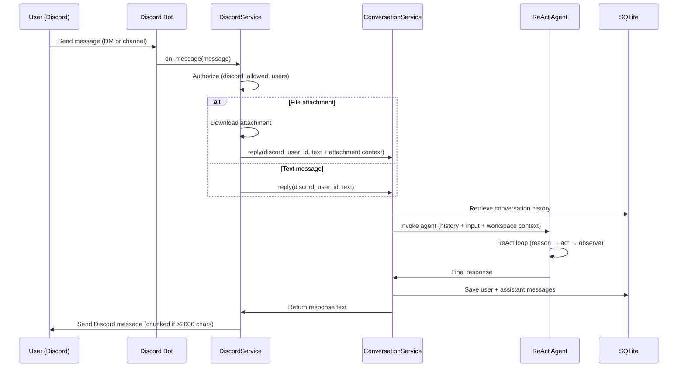

### Sandbox Code Execution Flow

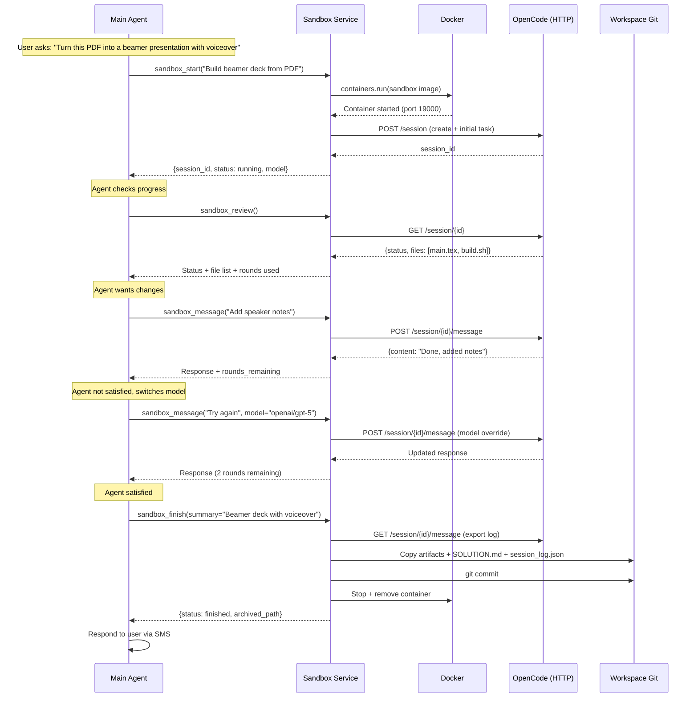

### Solution Reuse Flow

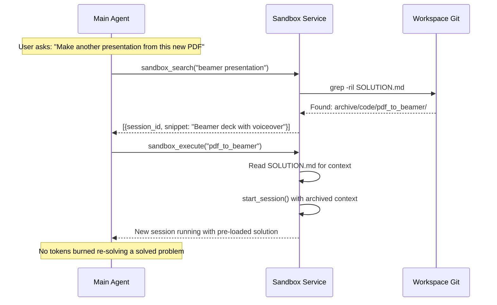

### Scheduled Messages Flow

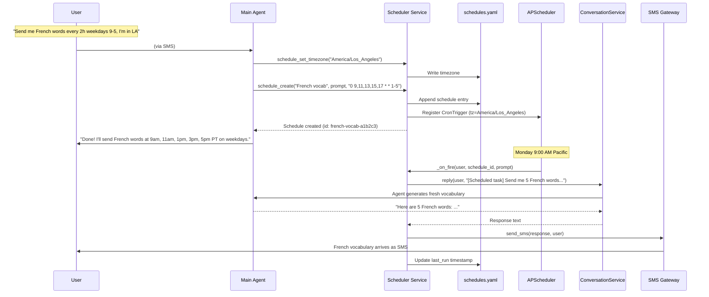

### schedules.yaml Format

Each user has a `schedules.yaml` in their git workspace that both the agent and the user can edit manually:

```yaml
timezone: America/Los_Angeles
schedules:
- id: french-vocab-a1b2c3
  description: French vocabulary practice
  prompt: >
    Send me 5 new French words with their English translations,
    pronunciation guides, and example sentences. Vary the difficulty
    and topic each time. Remember what you sent before.
  cron: '0 9,11,13,15,17 * * 1-5'
  timezone: America/Los_Angeles
  enabled: true
  created_at: '2026-03-20T09:00:00-07:00'
  last_run: '2026-03-20T15:00:00-07:00'

- id: daily-briefing-d4e5f6
  description: Morning news briefing
  prompt: >
    Give me a brief morning briefing: top 3 news headlines,
    weather summary, and one interesting fact.
  cron: '30 7 * * 1-5'
  timezone: America/Los_Angeles
  enabled: true
  created_at: '2026-03-20T09:05:00-07:00'
  last_run: null
```

Cron field reference (5 fields: `minute hour day month weekday`):

| Pattern | Meaning |
|---------|---------|
| `0 9,11,13,15,17 * * 1-5` | 9am, 11am, 1pm, 3pm, 5pm on weekdays |
| `30 7 * * *` | Daily at 7:30am |
| `0 */3 * * 1-5` | Every 3 hours on weekdays |
| `0 8 * * 1` | Every Monday at 8am |
| `0 20 1,15 * *` | 8pm on the 1st and 15th of each month |

**Manual editing:** Edit the YAML directly in the workspace, then tell the agent "I edited the schedules file" and it will call `schedule_reload` to pick up changes. All changes are git-committed automatically.

### Hub-and-Spoke Architecture

Prax uses a hub-and-spoke model: the orchestrator holds ~24 core tools (workspace, scheduling, courses) and delegates domain-specific work to focused spoke agents.  This keeps the orchestrator's context lean — [research shows](#9-tool-overload-and-selection-degradation) that tool selection accuracy degrades significantly past 20–50 tools.

> **Fallback:** If a delegated agent fails or can't handle the task, Prax can read the full tool catalog from a generated markdown file and call any tool directly. The spoke system is the fast path; direct tool access is the safety net.

#### Orchestrator (Hub)

```mermaid
graph TB
    Prax["Prax Orchestrator\n~24 tools"]

    Prax --> Core["Core\nsearch, datetime, URL fetch, image analysis"]
    Prax --> Workspace["Workspace\nfiles, todos, planning"]
    Prax --> Courses["Courses\ncreate, tutor, publish"]

    Prax -->|delegate_browser| Browser["Browser Spoke"]
    Prax -->|delegate_content_editor| Content["Content Editor\nsub-hub"]
    Prax -->|delegate_sysadmin| Sysadmin["Sysadmin\nsub-hub"]
    Prax -->|delegate_sandbox| Sandbox["Sandbox Spoke"]
    Prax -->|delegate_finetune| Finetune["Finetune Spoke"]
    Prax -->|delegate_knowledge| Knowledge["Knowledge Spoke"]
    Prax -->|delegate_research| Research["Research Spoke"]
    Prax -->|delegate_task| Generic["Generic Sub-Agent"]

    style Prax fill:#4A90D9,color:#fff
    style Browser fill:#F5A623,color:#fff
    style Content fill:#E8543E,color:#fff
    style Sysadmin fill:#E8543E,color:#fff
    style Sandbox fill:#F5A623,color:#fff
    style Finetune fill:#F5A623,color:#fff
    style Knowledge fill:#F5A623,color:#fff
    style Research fill:#F5A623,color:#fff
    style Generic fill:#F5A623,color:#fff
```

#### Media Agent

Handles images, PDFs, audio, video transcripts, and web content extraction.

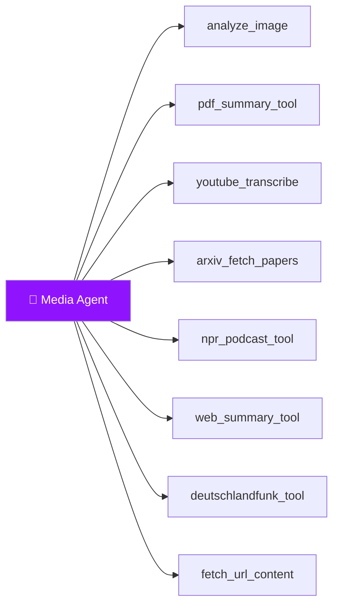

#### Sandbox Agent

Executes code in an isolated Docker container with a full dev environment.

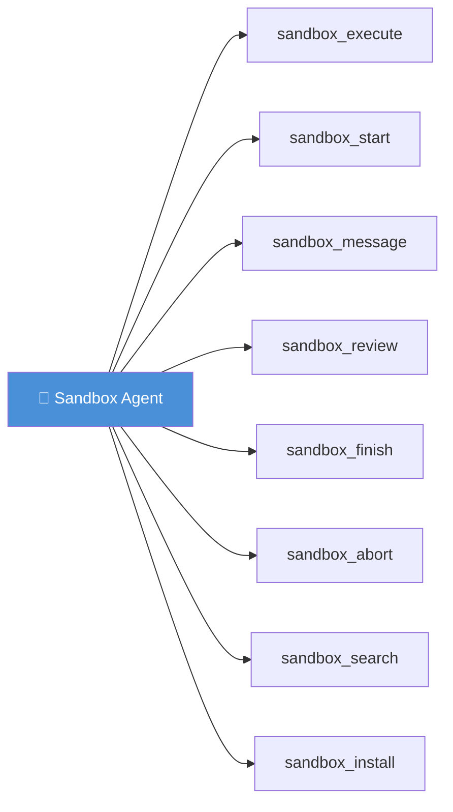

#### Browser Agent

Automates web interactions via Playwright with persistent profiles and credential management.

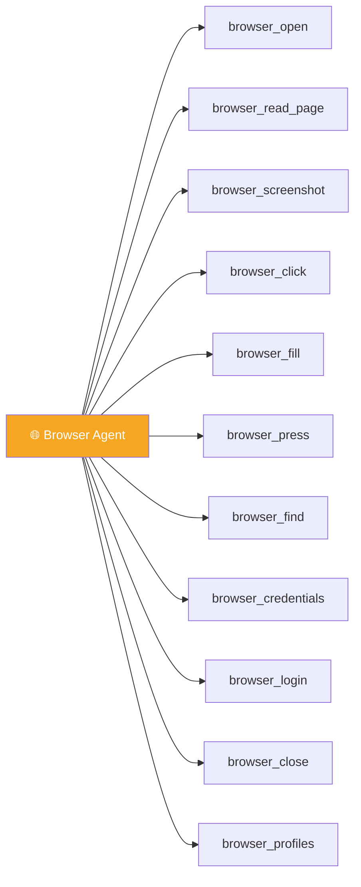

#### Workspace Agent

Manages per-user file storage, git-backed workspaces, and link history.

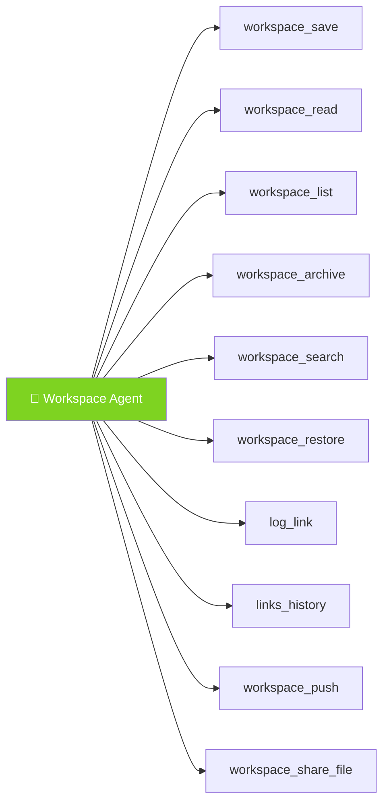

#### Scheduler Agent

Manages recurring cron jobs and one-time reminders.

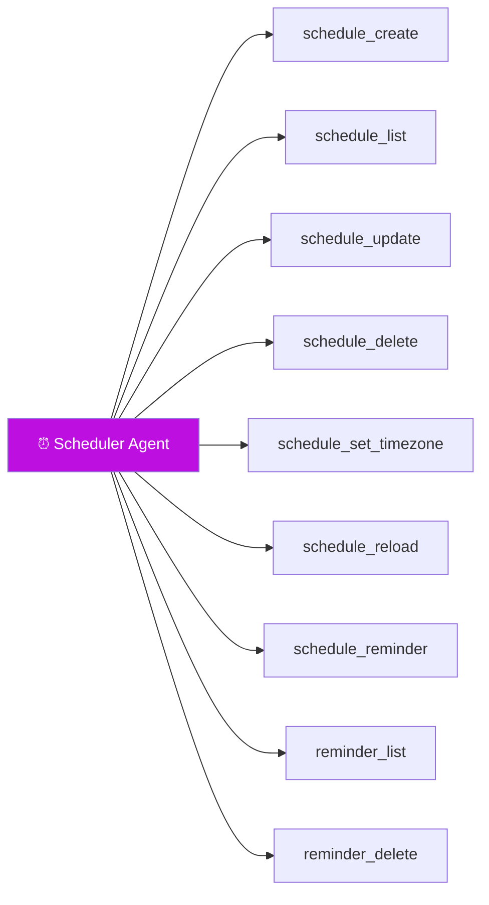

#### Plugin Engineering Agent

Creates, tests, and manages hot-swappable plugins.

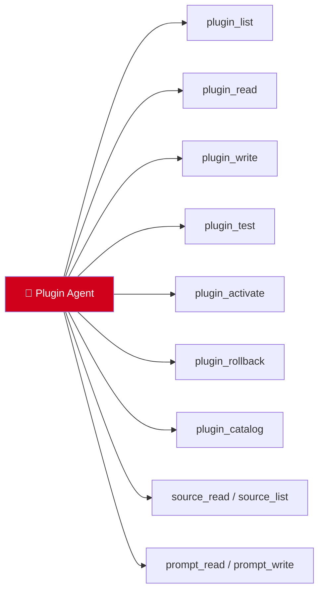

#### Self-Improvement Agent

Diagnoses bugs in Prax's own code, writes patches in the sandbox, and deploys fixes.

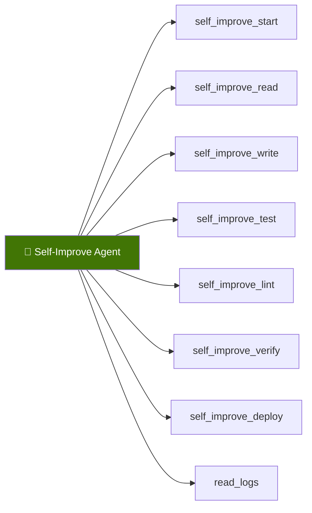

### Key Modules

| Module | Purpose |
|--------|---------|
| `prax/agent/orchestrator.py` | LangGraph ReAct agent with hot-swappable system prompt, plugin-aware graph rebuild, and per-component LLM routing |
| `prax/agent/subagent.py` | General sub-agent delegation: spawns focused LangGraph sub-graphs with per-category LLM config |
| `prax/agent/self_improve_agent.py` | Self-improvement sub-agent: diagnose bugs, patch via sandbox, deploy via codegen |
| `prax/agent/plugin_fix_agent.py` | Plugin engineering sub-agent: create/fix/test/activate plugins autonomously |
| `prax/agent/course_author_agent.py` | Content author sub-agent: produces rich course materials (mermaid, code, LaTeX) via iterative sandbox drafting |
| `prax/agent/tools.py` | Kernel tool wrappers (search, datetime, fetch_url) — reader tools migrated to plugins |
| `prax/agent/plugin_tools.py` | 17 plugin management tools: plugin CRUD, catalog, prompt CRUD, LLM config, source_read/list |
| `prax/agent/workspace_tools.py` | 24 workspace tools: notes, files, links, todos, task planning, instructions, conversation history/search, system status, diff-aware patch |
| `prax/agent/sandbox_tools.py` | 7 sandbox tools for code execution sessions |
| `prax/agent/scheduler_tools.py` | 9 scheduler tools: recurring cron + one-time reminders |
| `prax/agent/finetune_tools.py` | 8 fine-tuning tools (harvest, train, verify, promote, rollback) |
| `prax/agent/codegen_tools.py` | 10 self-improvement tools (worktree, edit, test, lint, verify, deploy, PR) |
| `prax/agent/note_tools.py` | 7 note tools (create, update, list, search, url_to_note, pdf_to_note, note_link) |
| `prax/agent/project_tools.py` | 6 research project tools (create, status, add note/link/source, brief) |
| `prax/agent/browser_tools.py` | 14 browser tools (navigate, click, fill, screenshot, login, VNC) |
| `prax/agent/tool_registry.py` | Tool aggregation: built-in + plugin-provided + manually registered |
| `prax/agent/llm_factory.py` | Multi-provider LLM factory (OpenAI, Anthropic, Google, Ollama, vLLM) |
| `prax/plugins/loader.py` | Recursive plugin discovery (folder-per-plugin + flat), hot-swap, version tracking, auto-rollback, catalog generation |
| `prax/plugins/sandbox.py` | Subprocess-isolated plugin validation before activation |
| `prax/plugins/registry.py` | JSON-based version registry with rollback and failure monitoring |
| `prax/plugins/repo.py` | Plugin repository service: SSH deploy key auth, clone, commit, push to private repo branch |
| `prax/plugins/catalog.py` | Auto-generated CATALOG.md listing all available plugins with metadata |
| `prax/plugins/prompt_manager.py` | Hot-swappable system prompt loading with variable expansion |
| `prax/plugins/llm_config.py` | Per-component LLM routing (YAML-based, hot-reloaded) |
| `prax/plugins/monitored_tool.py` | Runtime monitoring wrapper: failure counting + auto-rollback |
| `prax/plugins/tools/*/plugin.py` | Built-in reader plugins (NPR, web summary, PDF, YouTube, arXiv, RSS, Deutschlandfunk) |
| `prax/services/sms_service.py` | SMS workflow: media handling, PDF pipeline, agent routing |
| `prax/services/voice_service.py` | Voice workflow: speech processing, TTS buffer management |
| `prax/services/conversation_service.py` | Shared conversation layer with workspace context injection |
| `prax/services/sandbox_service.py` | Docker + OpenCode sandbox lifecycle, archiving, budget control |
| `prax/services/scheduler_service.py` | APScheduler-backed cron service reading YAML definitions |
| `prax/services/finetune_service.py` | LoRA fine-tuning pipeline: harvest → train → verify → hot-swap |
| `prax/services/note_service.py` | Note CRUD, search, knowledge graph (related notes), Hugo page generation |
| `prax/services/project_service.py` | Research project CRUD, note/link/source aggregation, brief generation |
| `prax/services/codegen_service.py` | Self-modification via staging clone + verify + hot-swap / PR workflow |
| `prax/services/discord_service.py` | Discord bot: message handling, authorization, response delivery |
| `prax/services/browser_service.py` | Playwright browser automation with per-user sessions |
| `prax/services/pdf_service.py` | PDF download, extraction (opendataloader-pdf), arxiv detection |
| `prax/services/youtube_service.py` | YouTube audio download (yt-dlp) + Whisper transcription |
| `prax/services/workspace_service.py` | Git-backed per-user file operations with per-user locking |
| `scripts/watchdog.py` | Supervisor process: health checks Flask, auto-rollback on crash after self-improve deploy |
| `scripts/finetune_train.py` | Standalone Unsloth QLoRA training script (runs in GPU subprocess) |
| `prax/settings.py` | Pydantic BaseSettings — all config from `.env` |
| `prax/clients.py` | Shared lazy-initialized Twilio client |
| `prax/sms.py` | SMS chunking and sending utilities |
| `prax/call_state.py` | `CallStateManager` — typed call state with `ensure()` |
| `prax/conversation_memory.py` | SQLite storage with auto-summarization at 100k tokens |

### Workspace Layout

```
workspaces/{user_id}/          ← phone number or Discord user ID
├── .git/                  ← full version history
├── schedules.yaml         ← cron schedule definitions (YAML)
├── user_notes.md          ← dynamic notes about the user (timezone, preferences, personality)
├── links.md               ← running log of every URL the user has shared
├── todos.json             ← user's personal to-do list
├── instructions.md        ← system prompt reference (agent can re-read)
├── agent_plan.json        ← current task decomposition (transient)
├── trace.log              ← conversation trace (rotated at 0.5 MB)
├── feeds.yaml             ← RSS/Atom feed subscriptions
├── notes/                 ← markdown notes with YAML frontmatter
│   ├── eigenvalues.md
│   └── bayesian-prob.md
├── projects/              ← research projects (notes + links + sources)
│   └── {project-slug}/
│       ├── project.yaml
│       └── paper.md
├── active/                ← files the agent is currently aware of
│   ├── 2301.12345.md      ← extracted PDF with frontmatter
│   └── sessions/          ← live sandbox coding sessions
│       └── {session_id}/
└── archive/               ← agent moves files here when done
    ├── trace_logs/        ← rotated trace logs (plain text, grep-able)
    │   └── trace.20250301-120000.log
    ├── 2301.12345.pdf     ← original PDF preserved
    └── code/              ← completed coding solutions
        └── pdf_to_beamer/
            ├── SOLUTION.md
            ├── session_log.json
            ├── convert.py
            └── build.sh

adapters/                  ← LoRA adapter storage (FINETUNE_OUTPUT_DIR)
├── adapter_registry.json  ← active/previous adapter tracking
├── training_data/         ← JSONL training batches
│   └── batch_20260320_140000.jsonl
├── adapter_20260319_140000/  ← previous LoRA weights
│   ├── adapter_config.json
│   └── adapter_model.safetensors
└── adapter_20260320_140000/  ← active LoRA weights
    ├── adapter_config.json
    └── adapter_model.safetensors
```

### Dropbox Sync

To back up workspaces to Dropbox, symlink the workspace directory into your Dropbox folder:

```bash
# From the project root:
ln -s "$PWD/workspaces" ~/Dropbox/prax-workspaces
```

> **Caution:** Dropbox may conflict with `.git` repositories and SQLite databases during active writes. Pause Dropbox sync while the agent is running, or configure Dropbox to skip `.git` directories and `*.db` files.

If you move the project, remove the old symlink and re-link:

```bash
rm ~/Dropbox/prax-workspaces
ln -s "$PWD/workspaces" ~/Dropbox/prax-workspaces
```

The Dropbox desktop app will sync all workspace files (notes, todos, links, archives) in real time. No API keys or code changes needed.

## Sandbox Code Execution

### The Problem

Instead of adding infinite specialized tools (one for LaTeX, one for ffmpeg, one for data transforms...), give the agent a sandbox where it can write and execute its own code. The hardest or most common operations stay as dedicated tools; everything else the agent codes up itself.

### The Solution: Docker + OpenCode

[OpenCode](https://opencode.ai/) is an open-source coding agent (MIT, 126k+ stars) with a headless HTTP server mode (`opencode serve`). It has 15 built-in tools (bash, file edit, read, write, grep, glob, etc.), supports every major LLM provider, and has first-class session management (create, resume, fork, export).

**Always-on sandbox:** In Docker Compose deployment, the sandbox runs 24/7 alongside the app. Prax can install system packages on the fly with `sandbox_install("poppler-utils")` — no user intervention needed. For permanent additions, Prax can edit the sandbox Dockerfile and rebuild with `sandbox_rebuild()`. In local development, ephemeral containers are spun up per session instead.

**Interactive feedback loop:** The main agent and coding agent converse. If the result isn't satisfactory, the main agent can send follow-up instructions, switch models mid-session (e.g., from Claude to GPT-5), or abort and try a different approach.

**Solution reuse:** Every `sandbox_finish()` commits code to the workspace git with a `SOLUTION.md`. When a similar task comes up, the agent searches the archive and re-executes the existing solution — zero tokens burned re-solving a solved problem.

**Budget control:** Each session has a configurable round limit (`SANDBOX_MAX_ROUNDS`, default 10). The agent sees `rounds_remaining` in every response so it knows when to wrap up. After hitting the limit, only `sandbox_finish` or `sandbox_abort` are available. Timed-out messages do *not* consume a round — only successful responses count against the budget.

**Stuck-session protection:** If the coding agent inside the sandbox stops responding (e.g. infinite loop, package install hang, OOM), `send_message` tracks consecutive failures. After 3 consecutive timeouts the session is **auto-aborted** and the agent is told to start fresh. The `sandbox_message` tool also returns explicit guidance to abort on individual timeouts, preventing the main agent from looping endlessly on a stuck session.

**File sharing:** When the sandbox produces large files (videos, PDFs), Prax can publish them with `workspace_share_file()` to generate a public ngrok URL. Only explicitly published files are accessible — the rest of the workspace stays private. Links can be revoked with `workspace_unshare_file()`.

> **Security note:** Ngrok URLs are publicly reachable — anyone with the link can download the file. However, shared file URLs are protected by two layers of randomization: a 32-character hex token in the path and a UUID-randomized filename (only the file extension is preserved). This makes URLs unguessable and reveals nothing about the original file name or contents. Still, treat shared links as semi-public: share them only with intended recipients, and revoke them with `workspace_unshare_file()` when no longer needed.

### Sandbox Docker Image

Pre-built with common tools:

```dockerfile
FROM node:22-slim
RUN apt-get update && apt-get install -y \
    python3 python3-pip python3-venv \
    texlive-latex-base texlive-latex-extra texlive-fonts-recommended latexmk \
    ffmpeg poppler-utils pandoc \
    git curl wget jq \
    && npm install -g opencode
WORKDIR /workspace
EXPOSE 4096
CMD ["opencode", "serve", "--hostname", "0.0.0.0", "--port", "4096"]
```

### Alternatives Evaluated

| Option | Verdict |
|--------|---------|
| **NVIDIA OpenShell** | Wraps the agent (security sandbox), doesn't provide code execution as a tool. Wrong direction of control. |
| **E2B** | Cloud-only, pay-per-second, no self-hosting. Good API but sends user data to third party. |
| **Daytona** | Self-hostable, 90ms sandbox creation, built-in Git/LSP/MCP. Strong runner-up — upgrade path if Docker management gets unwieldy. |
| **Docker SDK + custom sub-agent** | Full control but requires building everything OpenCode already has. |
| **Docker SDK + OpenCode** | **Selected.** Best balance of capability, simplicity, and self-hosting. |

## Self-Improving Fine-Tuning

### The Problem

Cloud LLMs are expensive and generic. An 8B parameter model fine-tuned on *your* conversations — where the agent learns from every correction you make — can outperform a general-purpose model at a fraction of the cost.

### The Solution: vLLM + Unsloth + LoRA Hot-Swap

The agent runs on a local [Qwen3-8B](https://huggingface.co/Qwen/Qwen3-8B) model served by [vLLM](https://docs.vllm.ai/) with its OpenAI-compatible API. When the agent detects it's been making mistakes (user corrections like "no, that's wrong" or "try again"), it:

1. **Harvests** correction pairs from SQLite conversation history
2. **Trains** a QLoRA adapter using [Unsloth](https://github.com/unslothai/unsloth) (~6 GB VRAM, fits on RTX A2000 16GB)
3. **Verifies** the new adapter against test prompts
4. **Hot-swaps** the adapter into vLLM via its REST API — zero downtime, no restart
5. **Promotes** or **rolls back** based on verification results

The entire pipeline is gated behind `FINETUNE_ENABLED=true` so the app runs normally on machines without a GPU.

### Self-Improvement Cycle

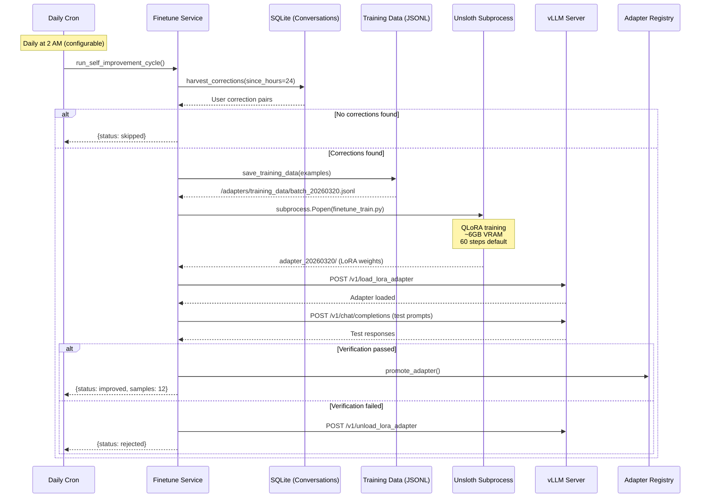

### Training Data Format

Corrections are extracted as ChatML training pairs:

```jsonl
{"messages": [
  {"role": "system", "content": "You are Prax, a warm, capable phone concierge."},
  {"role": "user", "content": "What's the capital of Australia?"},
  {"role": "assistant", "content": "The capital of Australia is Canberra."}
]}
```

The harvester looks for user messages containing correction signals ("no,", "that's wrong", "try again", etc.), then pairs the original question with the corrected response to create training examples.

### Hardware Requirements

| Component | Minimum | Recommended |
|-----------|---------|-------------|
| GPU | NVIDIA with 8GB VRAM | NVIDIA RTX A2000 16GB+ |
| VRAM Usage | ~6GB (4-bit QLoRA) | ~10GB (training + serving) |
| Disk | 20GB for model + adapters | 50GB+ |
| RAM | 16GB | 32GB+ |

### vLLM Setup

```bash
# Install vLLM (requires CUDA)
pip install vllm

# Enable runtime LoRA loading/unloading (required for /v1/load_lora_adapter)
export VLLM_ALLOW_RUNTIME_LORA_UPDATING=True

# Start vLLM with LoRA support
vllm serve Qwen/Qwen3-8B \
  --enable-lora \
  --max-lora-rank 16 \
  --port 8000

# Configure the app
echo 'FINETUNE_ENABLED=true' >> .env
echo 'VLLM_BASE_URL=http://localhost:8000/v1' >> .env
echo 'LLM_PROVIDER=vllm' >> .env
echo 'LOCAL_MODEL=Qwen/Qwen3-8B' >> .env
```

### Adapter Registry

Adapters are tracked in `{FINETUNE_OUTPUT_DIR}/adapter_registry.json`:

```json
{
  "active_adapter": "adapter_20260320_140000",
  "previous_adapter": "adapter_20260319_140000",
  "adapters": [
    {
      "name": "adapter_20260319_140000",
      "path": "./adapters/adapter_20260319_140000",
      "created_at": "2026-03-19T14:00:00+00:00",
      "verified": true
    },
    {
      "name": "adapter_20260320_140000",
      "path": "./adapters/adapter_20260320_140000",
      "created_at": "2026-03-20T14:00:00+00:00",
      "verified": true
    }
  ]
}
```

Rollback is one tool call: `finetune_rollback` unloads the current adapter and re-loads the previous one.

## Self-Modification via PRs

### The Problem

When the agent identifies a pattern it handles poorly, it should be able to fix its own code — but never without human review.

### The Solution: Staging Clone + Verify + Hot-Swap

The agent works in a **staging clone** — a separate `git clone` of the live repo at `/tmp/self-improve-staging`. It never touches the live directory during development. [Git worktrees](https://git-scm.com/docs/git-worktree) branch off the staging clone for each change.

Two deployment paths:

**Path A — Hot-swap (dev mode only, requires Werkzeug reloader):**
1. **Start branch** — creates a worktree off the staging clone
2. **Read/Write files** — operates entirely within the worktree
3. **Verify** — runs tests + lint + app startup check (all must pass)
4. **Deploy** — copies changed files to live repo + commits; Werkzeug's reloader auto-restarts

> Path A relies on Werkzeug's file-watching reloader (`docker compose -f docker-compose.yml -f docker-compose.dev.yml`). In production (gunicorn), use Path B — hot-swap will not trigger a reload.

**Path B — PR (complex changes):**
1. Same steps 1-2
2. **Submit PR** — pushes to GitHub and creates a PR for human review
3. The agent **cannot merge to main**

### Self-Modification Flow (Hot-Swap Deploy)

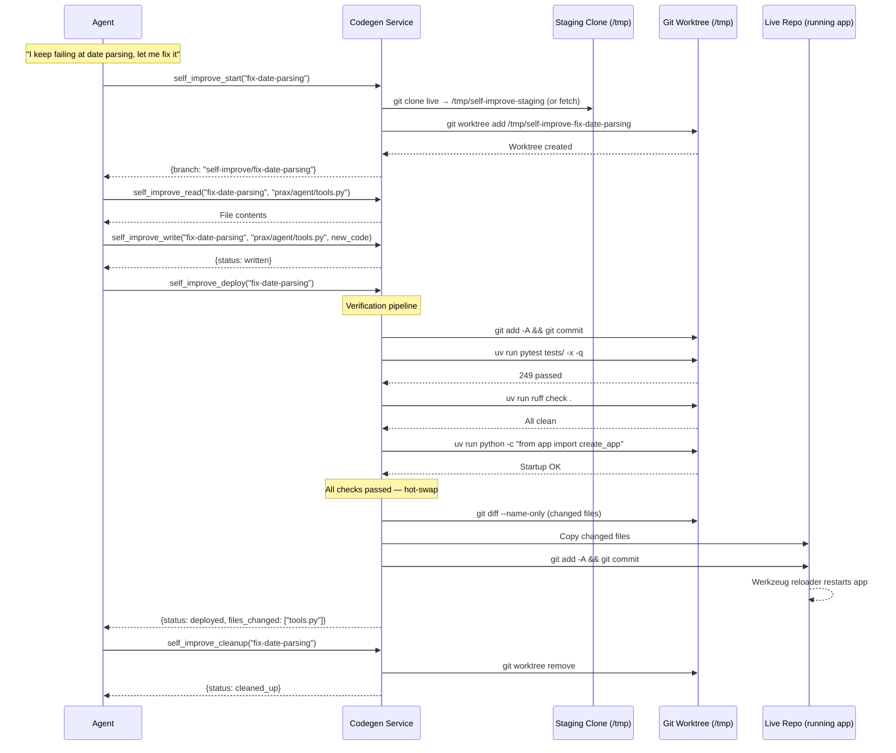

### Self-Modification Flow (PR Path)

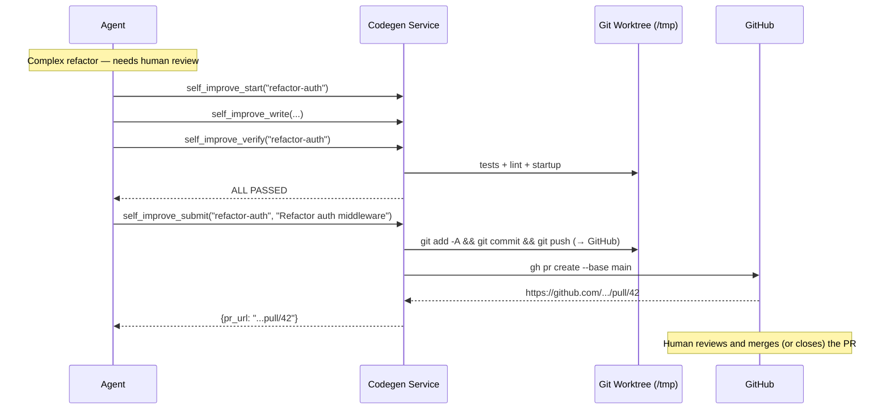

### Safety Guardrails

- **Staging isolation** — all development happens in a clone at `/tmp`, never the live repo
- **Verify-then-deploy** — tests, lint, AND startup check must all pass before any files are copied
- **Atomic hot-swap** — only changed files are copied; Flask's reloader handles the restart
- **Watchdog supervisor** — `scripts/watchdog.py` runs as the main process and monitors Flask via `/health`. If the app crashes (non-zero exit) after a self-improve deploy, the watchdog automatically `git revert`s the offending commit and restarts. Clean exits (code 0, e.g. Werkzeug reloader) are restarted immediately without counting against limits. Prax is informed on the next conversation turn via `self_improve_pending`
- **Max 3 attempts** — the deploy state file (`.self-improve-state.yaml`) tracks attempt counts per branch. After 3 failures, the agent is forced to stop and report to the user
- **Rollback** — `self_improve_rollback` reverts the last deploy commit. The watchdog also does this automatically on crash
- The `SELF_IMPROVE_ENABLED` flag must be `true` (default `false`)

## Agent Delegation

Prax keeps its main conversation loop lean by delegating domain-specific work to focused **spoke agents**.  Each spoke runs its own LangGraph ReAct loop with a specialized system prompt and curated tool set — the orchestrator sees only a single `delegate_*` tool per spoke.

Research shows that LLM tool-selection accuracy degrades past 20--30 tools ([see Research section](#9-tool-overload-and-selection-degradation)).  The hub-and-spoke pattern keeps the orchestrator's tool count low while giving each spoke deep domain capabilities.

Key infrastructure that makes this work:

- **Execution tracing** -- every delegation chain gets a UUID.  Individual agent invocations get span IDs.  The execution graph tracks the full tree: timing, status, tool call counts, and parent/child relationships.  Governing agents see the big picture via the graph summary appended to `delegate_parallel` results.
- **Read guard** -- spokes can verify preconditions before starting work (inspired by [smux](https://github.com/ShawnPana/smux)'s read-before-act pattern).  If the guard fails, the spoke aborts without wasting an LLM call.
- **Identity injection** -- each agent receives execution context in its system prompt: trace ID, depth in the delegation tree, who delegated it, and what parallel peers are doing.
- **Self-diagnostics** -- `prax_doctor` checks LLM configuration, sandbox health, plugin status, spoke availability, workspace integrity, TeamWork connectivity, and scheduler state in one call.

### Hub-and-Spoke Architecture

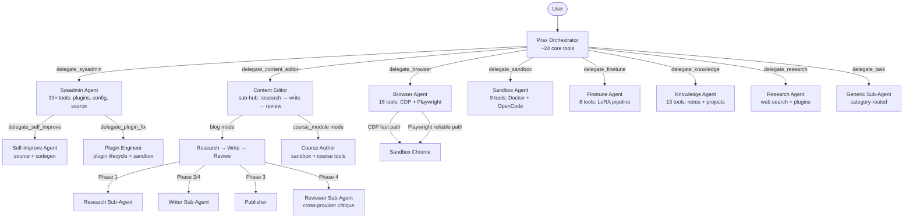

### Spoke Agents

| Spoke | Delegation Tool | Tools | Purpose |
|-------|----------------|-------|---------|
| **Browser** | `delegate_browser` | 16: CDP read/act + Playwright navigate/click/fill/login/VNC | Web navigation, page reading, login flows, screenshots |
| **Content Editor** | `delegate_content_editor` | Sub-hub: blog pipeline (research → write → review) or course author mode | Blog posts, publication-quality content, and course module content |
| **Sysadmin** | `delegate_sysadmin` | 30+: plugin mgmt, prompts, LLM config, source, workspace sync | Plugin install/update, config changes, self-improvement |
| **Sandbox** | `delegate_sandbox` | 9: session lifecycle, archive, package management | Code execution in isolated Docker containers |
| **Finetune** | `delegate_finetune` | 8: harvest, train, verify, promote, rollback | LoRA fine-tuning pipeline (requires FINETUNE_ENABLED) |
| **Knowledge** | `delegate_knowledge` | 13: note CRUD, search, linking, URL/PDF-to-note, project management | Notes, knowledge graph, research projects |
| **Research** | `delegate_research` | Web search, URL fetch, datetime, reader plugins | Multi-source investigation with citations |
| **Generic** | `delegate_task(category=...)` | Category-routed (research, workspace, scheduler, codegen) | Ad-hoc delegation for categories without a dedicated spoke |

### Sub-Hubs: Spokes That Spawn Agents

Some spokes are **sub-hubs** — they don't just run a single ReAct loop, they orchestrate multiple sub-agents in a pipeline.  This gives them richer behavior than a flat tool set while keeping the main orchestrator unaware of the internal complexity.

**Content Editor** is the primary example.  It has two modes controlled by a `mode` parameter:

**Blog mode** (default) — a procedural coordinator that runs a multi-phase pipeline:

```
Research → Write → Publish → Review ──┐
                                      │ APPROVED? → Done
                                      │ REVISE?   → ↓
                              Write (with feedback) → Re-publish → Review (max 3 cycles)
```

Each phase uses a different sub-agent:
- **Researcher** — generic research sub-agent via `_run_subagent(query, "research")`
- **Writer** — ReAct agent with search tools; takes research findings + optional revision feedback
- **Reviewer** — ReAct agent that uses `delegate_browser` to visually inspect the published page; **deliberately uses a different LLM provider** than the writer for adversarial diversity
- **Publisher** — utility functions wrapping the note/Hugo system

**Course module mode** (`mode="course_module"`) — routes to the Course Author sub-agent for rich, sandbox-based content with Mermaid diagrams, LaTeX equations, code examples, and structured pedagogy.

**Sysadmin** is another sub-hub.  It holds ~30 plugin/config tools directly, but can further delegate to:
- `delegate_self_improve` — for bug fixes requiring source + sandbox + codegen
- `delegate_plugin_fix` — for plugin creation/fixes requiring sandbox iteration

This hierarchical pattern means the orchestrator calls one tool (`delegate_sysadmin`), the sysadmin tries to handle it directly, and only escalates to a sub-agent when the task requires code-level changes.

### Browser Spoke Detail

The browser spoke is the reference implementation for the **simple spoke pattern** (single ReAct agent).  It demonstrates CDP-first routing with Playwright fallback:

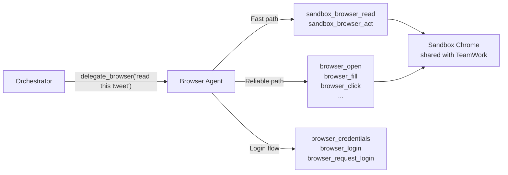

The browser agent decides internally:
- **CDP first** — page reads, screenshots, quick navigation, simple clicks (faster)
- **Playwright when needed** — login flows, form filling, auto-waiting, complex selectors (more reliable)
- Both APIs hit the **same Chrome instance** the user sees in TeamWork

### What Stays on the Orchestrator

The orchestrator keeps tools that are **conversational** (require back-and-forth with the user) or **foundational** (used by many workflows):

- **Conversation** — interactive Q&A, pacing, tone
- **Workspace** — file CRUD, todos, planning (11 tools)
- **Courses** — tutoring is conversational; the orchestrator IS the tutor (6 tools)
- **Scheduling** — cron jobs, reminders (9 tools)
- **URL handling** — lightweight `fetch_url_content` (no browser needed)
- **Routing decisions** — choosing which spoke to delegate to
- **Spoke delegation** — 6 spoke tools + 2 generic sub-agent tools + 1 research delegate + 1 vision tool

### Adding a New Spoke

The spoke system lives in `prax/agent/spokes/` with one folder per spoke:

```
prax/agent/spokes/
├── __init__.py          # Registry — imports all spokes
├── _runner.py           # Shared delegation engine (LLM, invoke, logging, TeamWork)
├── browser/             # Simple spoke: single ReAct agent (reference implementation)
│   ├── __init__.py
│   └── agent.py         # Prompt, tools, delegate function
├── content/             # Sub-hub spoke: blog pipeline + course author mode
│   ├── __init__.py
│   ├── agent.py          # Pipeline coordinator (blog mode) + course author routing
│   ├── writer.py         # Writer sub-agent
│   ├── reviewer.py       # Reviewer sub-agent (cross-provider)
│   ├── publisher.py      # Hugo publishing utilities
│   └── prompts.py        # System prompts for sub-agents
├── finetune/            # Simple spoke: LoRA training pipeline
├── knowledge/           # Simple spoke: notes + research projects
├── sandbox/             # Simple spoke: Docker code execution
└── sysadmin/            # Sub-hub spoke: delegates to self-improve + plugin-fix
```

**Two spoke patterns:**

1. **Simple spoke** — single ReAct agent with curated tools.  Use `run_spoke()` from `_runner.py`.  See `browser/agent.py`.
2. **Sub-hub spoke** — procedural coordinator that spawns sub-agents.  Write your own orchestration logic.  See `content/agent.py`.

To add a new spoke:

1. Create `prax/agent/spokes/<name>/agent.py` with `SYSTEM_PROMPT`, `build_tools()`, `delegate_<name>()`, `build_spoke_tools()`
2. Register in `prax/agent/spokes/__init__.py`
3. Remove the spoke's direct tools from `tools.py:build_default_tools()`

See `prax/agent/spokes/browser/agent.py` for a simple spoke, or `prax/agent/spokes/content/agent.py` for a sub-hub.

### Source Code in the Sandbox

The app source is mounted in the sandbox container at `/source/` so OpenCode can read and modify Prax's own code:

| Mode | Mount | Access |
|------|-------|--------|
| Production | `./prax:/source/prax` | Read-only — OpenCode can inspect but not modify directly |
| Dev mode | `./prax:/source/prax` | Read-write — changes propagate via bind mount, Werkzeug auto-reloads |

### Key Files

| File | Purpose |
|------|---------|
| `prax/agent/spokes/` | Spoke agent directory — one folder per spoke |
| `prax/agent/spokes/_runner.py` | Shared delegation engine — LLM config, invocation, logging, TeamWork hooks |
| `prax/agent/spokes/browser/agent.py` | Browser spoke — CDP-first routing, Playwright fallback, login flows |
| `prax/agent/spokes/content/agent.py` | Content Editor sub-hub — multi-agent pipeline (research → write → review) |
| `prax/agent/spokes/sysadmin/agent.py` | Sysadmin sub-hub — plugin/config mgmt, delegates to self-improve + plugin-fix |
| `prax/agent/spokes/sandbox/agent.py` | Sandbox spoke — Docker code execution sessions |
| `prax/agent/spokes/finetune/agent.py` | Finetune spoke — LoRA training pipeline |
| `prax/agent/spokes/knowledge/agent.py` | Knowledge spoke — notes, knowledge graph, research projects |
| `prax/agent/self_improve_agent.py` | Self-improvement sub-agent (used by sysadmin spoke) |
| `prax/agent/plugin_fix_agent.py` | Plugin engineering sub-agent (used by sysadmin spoke) |
| `prax/agent/course_author_agent.py` | Course author sub-agent (used by content editor in course_module mode) |
| `prax/agent/research_agent.py` | Research delegate — multi-source investigation with citations |
| `prax/agent/subagent.py` | Generic delegation (`delegate_task`, `delegate_parallel`) with category and spoke routing |
| `prax/agent/trace.py` | Execution tracing — chain UUIDs, named spans, execution graphs |
| `prax/agent/doctor.py` | Self-diagnostics (`prax_doctor`) — LLM, sandbox, plugins, spokes, TeamWork |
| `scripts/watchdog.py` | Supervisor process — health checks, crash rollback, restart |

## Observability

Prax ships with a full observability stack that traces every LLM call, tool invocation, and agent delegation. When `OBSERVABILITY_ENABLED=true` (set automatically in dev mode), all telemetry flows through the Grafana LGTM stack.

### Vision

Observability is not just for debugging — it's the **sensory system** that enables Prax to self-reflect and evolve. Every LLM call, token count, latency measurement, and delegation decision is a potential training signal. The observability pipeline feeds the self-improvement loop: traces and metrics inform LoRA fine-tuning, cost optimization, and architectural decisions.

### Architecture

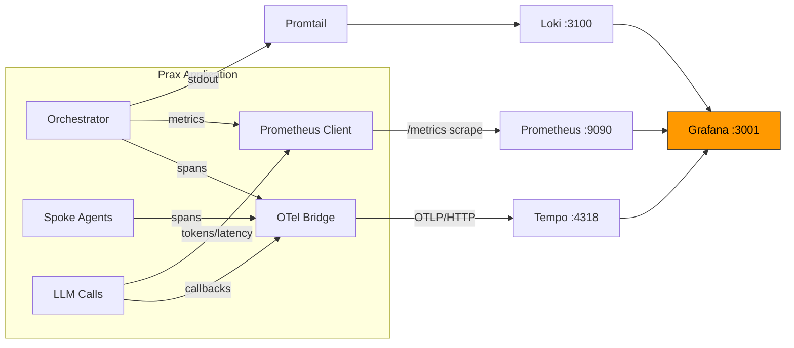

### Stack Components

| Component | Role | Port | Image |
|-----------|------|------|-------|
| **Tempo** | Distributed trace backend (receives OTLP from Prax) | 3200, 4317, 4318 | `grafana/tempo:2.7.2` |
| **Loki** | Log aggregation (receives Docker logs via Promtail) | 3100 | `grafana/loki:3.4.2` |
| **Promtail** | Log collector (Docker service discovery) | 9080 | `grafana/promtail:3.4.2` |
| **Prometheus** | Metrics (scrapes `/metrics` every 10s) | 9090 | `prom/prometheus:v3.2.1` |
| **Grafana** | Unified dashboards with pre-provisioned datasources | 3001 | `grafana/grafana:11.5.2` |

### Metrics

| Metric | Type | Labels | Description |
|--------|------|--------|-------------|
| `prax_llm_calls_total` | Counter | `model`, `status` | Total LLM API calls |
| `prax_llm_tokens_total` | Counter | `model`, `type` (input/output) | Total tokens consumed |
| `prax_llm_duration_seconds` | Histogram | `model` | LLM call latency |
| `prax_spoke_calls_total` | Counter | `spoke`, `status` | Spoke/sub-agent delegations |
| `prax_spoke_duration_seconds` | Histogram | `spoke` | Spoke execution duration |
| `prax_tool_calls_total` | Counter | `tool` | Tool invocations |

### Pre-Provisioned Dashboards

Two dashboards are auto-loaded into Grafana on startup:

- **LLM Performance** (`prax-llm-performance`) — Token usage, call counts by model, p50/p95/p99 latency, error rates, model distribution pie chart, tool invocation rates
- **Agent Overview** (`prax-agent-overview`) — Spoke delegation rates, duration percentiles, success/failure breakdown, delegation tree traces, top tools, error logs

### Trace Flow

Every user message creates a **root span** in the orchestrator. Tool calls, spoke delegations, and sub-agent invocations create child spans. The full execution tree is visible in Grafana Tempo.

```mermaid
graph TD
    R[orchestrator root span] --> S1[delegate_parallel]
    S1 --> B[browser spoke]
    S1 --> K[knowledge spoke]
    S1 --> RES[research sub-agent]
    RES --> WS[web_search tool]
    RES --> URL[fetch_url tool]
    B --> CDP[cdp_navigate tool]
    B --> SS[cdp_screenshot tool]
    K --> NC[note_create tool]
```

### Per-Message Trace Links

When TeamWork is connected and observability is enabled, each agent response message includes a **trace button** (green Activity icon on hover). Clicking it opens the full execution trace in Grafana Tempo, showing:

- Every LLM call with model name, token counts, and latency
- Every tool invocation with input/output previews
- The full delegation tree (orchestrator → spokes → sub-agents)
- Correlated logs from the same trace

### TeamWork Integration

The TeamWork web UI includes an **Observability tab** (Activity icon in the toolbar) that provides:

- Links to pre-provisioned Grafana dashboards
- Direct access to Trace Explorer, Log Explorer, and Metrics Explorer
- Stack component overview with ports
- Status indicator showing whether observability is active

### Configuration

| Variable | Default | Description |
|----------|---------|-------------|
| `OBSERVABILITY_ENABLED` | `false` | Master switch for the observability stack |
| `GRAFANA_URL` | (empty) | Grafana base URL for deep-links (e.g. `http://localhost:3001`) |
| `OTEL_EXPORTER_OTLP_ENDPOINT` | `http://tempo:4318` | OTLP exporter endpoint |

All three are set automatically by `docker-compose.dev.yml`. In production, set `OBSERVABILITY_ENABLED=true` and point to your external Tempo/Prometheus/Loki deployment.

### Enabling in Dev Mode

```bash
docker compose -f docker-compose.yml -f docker-compose.dev.yml up --build
```

This starts the full LGTM stack alongside Prax. Open Grafana at **http://localhost:3001** (default credentials: admin/prax).

### Key Files

| File | Purpose |
|------|---------|
| `prax/observability/__init__.py` | Package entry — exports `init_observability`, `get_tracer` |
| `prax/observability/setup.py` | OTel SDK init with OTLP/HTTP exporter, graceful degradation |
| `prax/observability/callbacks.py` | LangChain callback handler — OTel spans for LLM calls (GenAI conventions) |
| `prax/observability/metrics.py` | Prometheus metric definitions with no-op fallback |
| `prax/agent/trace.py` | Execution tracing — custom spans + OTel bridge |
| `observability/tempo.yaml` | Tempo config (OTLP gRPC + HTTP receivers) |
| `observability/prometheus.yaml` | Prometheus scrape config |
| `observability/promtail.yaml` | Promtail Docker service discovery |
| `observability/grafana/` | Grafana provisioning (datasources + dashboards) |

---

## Browser Automation

### Why a Live Browser?

Many websites (Twitter/X, SPAs, pages behind logins) return empty or broken HTML to a simple `requests.get()`.  Modern pages render content with JavaScript, gate it behind authentication, or use anti-bot protections.  Prax needs a **real browser** — one that executes JS, stores cookies, and renders the DOM — to interact with the web the way a human does.

### Architecture: One Chrome, Two APIs

In Docker, the sandbox container runs a **headless Chromium** with remote debugging enabled (CDP on port 9222, forwarded to 9223 via socat).  **Three consumers share the same Chrome instance:**

```
                         ┌─────────────────────┐
                         │   Sandbox Chrome     │
                         │   (headless, CDP)    │
                         │   :9222 → :9223      │
                         └──────┬───────────────┘
                                │
               ┌────────────────┼────────────────┐
               │                │                │
      ┌────────▼────────┐  ┌───▼────────┐  ┌────▼───────────┐
      │   Playwright    │  │  Raw CDP   │  │   TeamWork     │
      │  (browser_*)    │  │  (sandbox  │  │  Screencast    │
      │  Rich API       │  │  _browser  │  │  (user sees    │
      │  via connect_   │  │  _read/act)│  │  the browser   │
      │  over_cdp()     │  │            │  │  live)         │
      └─────────────────┘  └────────────┘  └────────────────┘
```

- **Playwright** connects via `connect_over_cdp()` — the agent gets ergonomic selectors, auto-waiting, form filling, and file uploads, all operating on the shared Chrome
- **Raw CDP** (`cdp_service.py`) — low-level WebSocket protocol for direct DOM evaluation, input dispatch, and screenshots; used by `sandbox_browser_read`/`sandbox_browser_act` tools
- **TeamWork** — streams the Chrome screencast to the web UI so the user watches in real-time and can "Take Over" control

When the user takes over (e.g. to solve a CAPTCHA), the agent sees the resulting page state immediately because it's the same browser.

### Playwright vs Raw CDP

Both APIs talk to the same Chrome instance.  Playwright wraps CDP with a high-level, reliable API; raw CDP gives direct protocol access when needed.

| Capability | Playwright | Raw CDP |
|------------|-----------|---------|
| **Selectors** | `click("text=Sign In")`, CSS, XPath, role-based | You compute coordinates yourself |
| **Waiting** | Auto-waits for elements, navigation, network idle | Manual — you poll DOM or listen for events |
| **Forms** | `fill()`, `select_option()`, `check()` — handles focus, clear, type | `Input.dispatchKeyEvent` one keystroke at a time |
| **Navigation** | `goto()`, `wait_for_url()`, `go_back()` — handles redirects | `Page.navigate` + manual lifecycle tracking |
| **Screenshots** | One-liner | One-liner (equally good) |
| **File uploads** | `set_input_files()` | `DOM.setFileInputFiles` (painful) |
| **iframes** | `frame_locator()` traverses naturally | Manual frame tree management |
| **Multi-tab** | Built-in page management | Manual `Target.createTarget` |
| **Error messages** | `"Timeout waiting for selector 'button.submit'"` | `"Target closed"` or cryptic protocol errors |
| **Stealth** | Anti-bot patches available (playwright-stealth) | You're on your own |
| **Network interception** | `route()` for interception, but abstracted | Full access — `Network.getResponseBody`, `Fetch.fulfillRequest` |
| **Performance profiling** | No | Full access — `Profiler`, `HeapProfiler`, `Tracing` |
| **Console/JS eval** | `evaluate()` works fine | Direct `Runtime.evaluate` — equivalent |

**In practice:** Prax uses Playwright for most browser tasks (navigation, login flows, form filling, content extraction).  Raw CDP is available for edge cases that need low-level protocol access (performance profiling, network interception, direct input dispatch).

### Configuration

```bash
# docker-compose sets this automatically:
BROWSER_CDP_URL=http://sandbox:9223   # Playwright connects to sandbox Chrome

# Local dev (no sandbox) — leave unset and Playwright launches its own browser:
#BROWSER_CDP_URL=
```

When `BROWSER_CDP_URL` is set, Playwright calls `connect_over_cdp()` to attach to the existing Chrome.  If the connection fails (sandbox not running), it falls back to launching a standalone browser — so local development works without Docker.

### Login Strategies

The agent gets a full Playwright-backed Chromium browser with per-user sessions. Two login strategies:

1. **YAML credentials** (`sites.yaml`) — the agent fills login forms automatically
2. **VNC manual login** — the agent starts a visible browser on a VNC display; the user SSH-tunnels in, logs in manually (handling MFA, CAPTCHAs, etc.), and the login session is saved to a **persistent browser profile** that future headless sessions reuse

When a user texts a Twitter link, the agent opens it, detects the login wall, and either auto-fills credentials or prompts the user to connect via VNC.

### Browser Automation Flow

```mermaid
sequenceDiagram
    participant U as User
    participant A as Agent
    participant BW as Browser Service
    participant PW as Playwright (Chromium)
    participant YAML as sites.yaml

    U->>A: "What does this tweet say? https://x.com/user/status/123"
    A->>BW: browser_open(user_id, "https://x.com/user/status/123")
    BW->>PW: page.goto(url)
    PW-->>BW: Page loaded (login wall)
    BW-->>A: {content: "Log in to X..."}

    A->>BW: browser_credentials("x.com")
    BW->>YAML: Load sites.yaml
    YAML-->>BW: {username: "user", password: "***"}
    BW-->>A: {domain: "x.com", username: "user"}

    A->>BW: browser_login("x.com")
    BW->>YAML: Load full credentials
    BW->>PW: page.fill("input[name=username]", ...)
    BW->>PW: page.fill("input[name=password]", ...)
    BW->>PW: page.click("button[type=submit]")
    PW-->>BW: Logged in

    A->>BW: browser_open(user_id, "https://x.com/user/status/123")
    BW->>PW: page.goto(url)
    PW-->>BW: Full tweet content
    BW-->>A: {title: "X", content: "The tweet says..."}

    A->>U: "That tweet is about..."

    Note over A: Session persists for future requests
    A->>BW: browser_close(user_id)
    BW->>PW: browser.close()
```

### VNC Manual Login Flow

```mermaid
sequenceDiagram
    participant U as User
    participant A as Agent
    participant BW as Browser Service
    participant VNC as Xvfb + x11vnc
    participant PW as Playwright (Chromium)
    participant Disk as Profile Dir

    U->>A: "Read this tweet" (sends x.com link)
    A->>BW: browser_open(url)
    BW-->>A: {login_required: true, login_hint: "..."}

    A->>U: "x.com needs login. I'll open a browser for you."
    A->>BW: browser_request_login("https://x.com")
    BW->>VNC: Start Xvfb :51 + x11vnc on port 5901
    BW->>PW: launch_persistent_context(profile_dir, headless=False, DISPLAY=:51)
    BW->>PW: page.goto("https://x.com")
    BW-->>A: {vnc_port: 5901, instructions: "..."}

    A->>U: "SSH tunnel: ssh -NL 5901:localhost:5901 server<br/>Then connect VNC client to localhost:5901<br/>Log in and tell me when done."

    Note over U: User connects via VNC, logs in manually<br/>(handles MFA, CAPTCHAs, etc.)
    U->>A: "done"

    A->>BW: browser_finish_login()
    BW->>PW: context.close() (saves cookies to profile_dir)
    BW->>VNC: Stop Xvfb + x11vnc
    PW-->>Disk: Cookies, localStorage, sessions saved
    BW-->>A: {status: "login_saved"}

    A->>U: "Login saved! Let me read that tweet now."
    A->>BW: browser_open(url)
    BW->>PW: launch_persistent_context(profile_dir, headless=True)
    Note over PW: Reuses saved cookies — no login wall
    PW-->>BW: Full tweet content
    BW-->>A: {content: "The tweet says..."}
    A->>U: "That tweet is about..."
```

### Persistent Browser Profiles

When `BROWSER_PROFILE_DIR` is set, the browser uses Playwright's persistent context to save cookies, localStorage, and session data to disk. This means:

- Logins survive process restarts
- Each user gets an isolated profile at `{BROWSER_PROFILE_DIR}/{phone_number}/`
- VNC logins and YAML credential logins both persist to the same profile
- The agent can check login status before attempting access (`browser_check_login`)

```bash
# Enable persistent profiles
echo 'BROWSER_PROFILE_DIR=./browser_profiles' >> .env

# Enable VNC for manual login (requires Xvfb + x11vnc on the server)
echo 'BROWSER_VNC_ENABLED=true' >> .env
echo 'BROWSER_VNC_BASE_PORT=5900' >> .env

# Install VNC dependencies (Linux)
sudo apt-get install xvfb x11vnc
```

### sites.yaml Credentials Format

Store site credentials in a YAML file (set `SITES_CREDENTIALS_PATH` in `.env`):

```yaml
sites:
  x.com:
    username: your_twitter_handle
    password: your_password
    aliases:
      - twitter.com

  github.com:
    username: your_github_user
    password: your_github_pat

  reddit.com:
    username: your_reddit_user
    password: your_reddit_pass
```

The `aliases` field lets the agent match `twitter.com` URLs to `x.com` credentials. The `browser_credentials` tool returns the username but hides the password; `browser_login` exposes the password only to the Playwright fill action.

### Browser Tools

**Playwright tools** (high-level, recommended for most tasks):

| Tool | What It Does |
|------|-------------|
| `browser_open` | Navigate to a URL, wait for JS to render, return page text (detects login walls) |
| `browser_read_page` | Get the current page's text content |
| `browser_screenshot` | Take a PNG screenshot of the current page |
| `browser_click` | Click an element by CSS selector |
| `browser_fill` | Fill a form field |
| `browser_press` | Press a keyboard key (Enter, Tab, Escape) |
| `browser_find` | Query all elements matching a selector |
| `browser_credentials` | Look up stored credentials (password hidden) |
| `browser_login` | Fill login form with stored credentials |
| `browser_close` | Close the browser session |
| `browser_request_login` | Start VNC session for manual login (MFA, CAPTCHAs) |
| `browser_finish_login` | End VNC session and save persistent profile |
| `browser_check_login` | Check if currently logged into a domain |
| `browser_profiles` | List all saved browser profiles |

**Raw CDP tools** (low-level, for direct Chrome DevTools Protocol access):

| Tool | What It Does |
|------|-------------|
| `sandbox_browser_read` | Read from sandbox Chrome — text, URL, screenshot, scroll (user sees actions live in TeamWork) |
| `sandbox_browser_act` | Act in sandbox Chrome — navigate, click (by text or CSS), type, press keys (user watches live) |

## Agent Checkpointing

### The Problem

When the agent chains multiple tool calls to accomplish a task, a failure midway through (API timeout, bad tool output, wrong approach) can leave things in a half-finished state. Without checkpointing, the only option is to re-run the entire chain from scratch.

### The Solution: LangGraph Checkpoints with Automatic Retry

Every conversation turn is checkpointed using LangGraph's built-in `InMemorySaver`. After each tool call, the agent's full state (messages, tool results, pending decisions) is saved to an in-memory checkpoint. If a tool call fails:

1. **Automatic rollback** — the orchestrator rolls back to the last clean decision point (skipping the failed tool result and the tool call itself)
2. **Retry from checkpoint** — the agent resumes from the rolled-back state, choosing a different approach
3. **Budget limit** — after `DEFAULT_MAX_RETRIES` (default: 2) failed attempts, the error is raised to the user

Checkpoints are scoped per-user with unique thread IDs, so one user's state can never leak into another's. Memory is freed automatically when a turn completes.

### How It Works

```
User message
  → start_turn() — creates a fresh thread_id
  → graph.invoke(messages, config={thread_id})
      ├─ checkpoint saved after each step
      ├─ tool call succeeds → checkpoint saved → continue
      └─ tool call fails →
          ├─ can_retry? → rollback 2 checkpoints → retry from last good state
          └─ no retries left → raise error
  → end_turn() — purge checkpoints, free memory
```

### Key Design Decisions

- **In-memory only** — no database or filesystem needed. Fast, zero-config. Checkpoints are ephemeral and scoped to a single turn.
- **Per-turn isolation** — each message from a user gets a fresh thread. No cross-turn state leakage.
- **Rollback granularity** — rolls back 2 steps by default (the failed result + the tool call), landing on the last clean agent decision point.

## Prerequisites

- Python 3.13 (managed via [uv](https://github.com/astral-sh/uv)).
- **At least one messaging channel:**
  - **Twilio** (Voice + SMS) — requires a Twilio account, verified phone number, and ngrok for webhooks. Paid per message/minute.
  - **Discord** (text + attachments) — requires a Discord bot token (free). No ngrok needed — connects via WebSocket.
- OpenAI (or alternate LLM) credentials.
- Java 11+ (for `opendataloader-pdf` PDF extraction).
- Docker (for sandbox code execution).
- **Optional:** NVIDIA GPU with 8GB+ VRAM + vLLM + Unsloth (for self-improving fine-tuning).
- **Optional:** Playwright (`pip install playwright && playwright install chromium`) for browser automation.
- **Optional:** `gh` CLI (for self-modification PR creation).

## Installation Details

See [Quick Start](#quick-start) at the top of this README for the fast path.

**Sandbox code execution** requires both Docker Desktop running **and** the sandbox image built (`docker build -t prax-sandbox:latest sandbox/`). Without the image, sandbox tools will fail with a "pull access denied" error — it's a local image, not on Docker Hub. If Docker itself isn't running, the agent falls back to saving source files to the workspace.

**Browser automation** requires Playwright: `uv run playwright install chromium`

On startup you'll see:
```
Starting Prax — provider=openai model=gpt-4o temperature=0.7 encoding=o200k_base
```

## Security

- **Twilio webhook validation** — all webhook routes (`/transcribe`, `/respond`, `/sms`, `/reader`, `/read`, `/say`, `/play`, `/conference`) validate the `X-Twilio-Signature` header using your `TWILIO_AUTH_TOKEN`. If the token is not set (e.g. Discord-only or local dev), validation is skipped with a one-time warning.
- **Path traversal protection** — workspace file operations (`save_file`, `read_file`, `archive_file`, etc.) and self-improvement file operations validate that resolved paths stay within the expected root directory. Attempts to escape via `../` or absolute paths are blocked.
- **Sandbox auth** — each app process generates a random per-process auth key (`secrets.token_urlsafe(32)`) for sandbox container communication. Never committed to source.
- **Docker socket** — the app container needs `/var/run/docker.sock` mounted for sandbox management. This grants host Docker access; only run in trusted environments.
- **VNC** — when enabled, VNC ports are mapped to the host's `127.0.0.1` only (not exposed on `0.0.0.0`). Remote access requires an SSH tunnel to the host: `ssh -NL 5901:localhost:5901 your-server`.
- **Secret key validation** — the app warns on startup if `FLASK_SECRET_KEY` is set to a weak placeholder like `change-me`.

### Plugin security

Plugins imported from external repos pass through multiple security gates before and during execution:

| Layer | What it does |
|-------|-------------|
| **AST-based static analysis** | Parses plugin source with Python's `ast` module to detect `subprocess`, `eval`, `exec`, `compile`, `__import__`, `os.environ`, `os.system`, `socket`, `getattr(__builtins__, ...)`, and 12+ evasion patterns (`__globals__`, `__subclasses__`, `vars(os)`, `codecs.decode`, etc.). |
| **Regex pattern scanning** | Supplements AST analysis with line-level pattern matching for HTTP calls, file deletion, hex-encoded strings, and base64 decoding. |
| **Built-in tool name protection** | Plugins cannot register tools with the same name as built-in tools. A plugin trying to override `browser_read_page` or `get_current_datetime` is rejected at load time. |
| **Subprocess sandbox testing** | Before activation, plugins are imported in a separate subprocess with a stripped environment and 30-second timeout. Failures prevent activation. |
| **Runtime monitoring + auto-rollback** | Active plugin tools are wrapped with failure tracking. After consecutive failures, the plugin is automatically rolled back to its previous version. |
| **Governance layer** | All tools (built-in and plugin) pass through a single governance choke point with risk classification (LOW/MEDIUM/HIGH), confirmation gating for HIGH-risk actions, and audit logging to the workspace trace. |
| **Blocking security scan** | `import_plugin_repo()` and `update_plugin_repo()` flag security warnings and require explicit acknowledgement before activation. |

### Subprocess isolation

IMPORTED plugins execute in **isolated subprocesses** — separate OS processes with no access to API keys, secrets, or the parent's memory. The OS process boundary is the primary security guarantee, not Python-level tricks.

#### Architecture

```
┌─────────────────────────────────┐     JSON-lines     ┌──────────────────────────────┐
│         Parent Process          │    on stdin/stdout   │     Plugin Subprocess        │
│                                 │◄───────────────────►│                              │
│  MonitoredTool                  │                      │  host.py                     │
│    ├─ call budget (10/msg)      │  ── invoke ──►       │    ├─ import plugin module   │
│    ├─ governance (HIGH risk)    │  ◄── result ──       │    ├─ call tool.invoke()     │
│    └─ bridge.invoke()           │                      │    └─ CapsProxy             │
│                                 │  ◄── caps_call ──    │         ├─ http_get(url)     │
│  Bridge                         │  ── caps_result ──►  │         ├─ build_llm()       │
│    ├─ spawn subprocess          │                      │         ├─ save_file()       │
│    ├─ service caps callbacks    │                      │         ├─ read_file()       │
│    ├─ scoped plugin_data dir    │                      │         └─ get_config()      │
│    ├─ timeout → SIGKILL         │                      │                              │
│    └─ PluginCapabilities (real) │                      │  Env: PATH, HOME, LANG only  │
│         ├─ API keys ✓           │                      │  No API keys. No secrets.    │
│         ├─ prax.settings ✓      │                      │  No Docker socket.           │
│         └─ network access ✓     │                      │  No prax.settings.           │
└─────────────────────────────────┘                      └──────────────────────────────┘
```

When a plugin calls `caps.http_get(url)`, the proxy in the subprocess serializes the call as a JSON-RPC message, sends it to the parent over stdout, and blocks. The parent — which holds the real API keys — makes the HTTP request and sends the result back. The plugin experiences a normal synchronous method call but never touches a credential.

#### What's isolated

| Attack vector | Result |
|---------------|--------|
| `os.environ["OPENAI_KEY"]` | `KeyError` — key is not in the subprocess environment |
| `os.environ["ANTHROPIC_KEY"]` | `KeyError` — same reason |
| `gc.get_objects()` to find `prax.settings` | Returns nothing — settings object is in a different process |
| `().__class__.__base__.__subclasses__()` → `BuiltinImporter` | Can import modules, but there are no secrets in memory to steal |
| `open("/proc/self/environ")` | Contains only `PATH`, `HOME`, `LANG`, `PYTHONPATH` |
| Infinite loop / memory bomb | `SIGALRM` → `SIGTERM` → `SIGKILL` (uncatchable) |
| `ctypes` memory writes to bypass audit hooks | Nothing to find — no API keys in process memory |
| Docker socket access | Not mounted in subprocess environment |
| Read other plugins' files | Blocked — `save_file`/`read_file`/`workspace_path` scoped to `plugin_data/{plugin}/`; path traversal blocked by `safe_join` |
| Read user workspace (`active/`) | Blocked — IMPORTED plugins' filesystem ops are confined to their scoped directory |

#### Capabilities proxy

Plugins access Prax services through a `PluginCapabilities` proxy. Every method is forwarded to the parent via JSON-RPC — the plugin never directly holds credentials or network connections:

| Method | What the parent does |
|--------|---------------------|
| `caps.build_llm(tier)` | Constructs a LangChain LLM with the real API key and returns it (serialized) |
| `caps.http_get(url)` / `caps.http_post(url)` | Makes the HTTP request with credentials, rate-limited (50/invocation), returns serialized response |
| `caps.save_file(name, content)` | Writes to the plugin's scoped directory (`plugin_data/{plugin}/`) for IMPORTED; `active/` for BUILTIN/WORKSPACE |
| `caps.read_file(name)` | Reads from the plugin's scoped directory only — IMPORTED plugins cannot read other plugins' files or user workspace |
| `caps.run_command(cmd)` | Executes in the parent with auditing and timeout; IMPORTED plugins have `cwd` forced to their scoped directory |
| `caps.tts_synthesize(text, path)` | Calls OpenAI/ElevenLabs TTS API with the real key |
| `caps.get_config(key)` | Returns non-secret config values; blocks keys matching `key`, `secret`, `token`, `password`, `credential` |
| `caps.workspace_path()` / `caps.get_user_id()` / `caps.shared_tempdir()` | IMPORTED plugins get their scoped path (`plugin_data/{plugin}/`), not the full workspace root |

#### Framework-enforced limits

These limits are enforced in the **parent process** (in `MonitoredTool`), outside the subprocess — the plugin cannot increase its own budget or disable enforcement:

| Limit | Value | Enforcement |
|-------|-------|-------------|
| Tool calls per message | 10 | `_increment_call_count()` in parent, checked before each bridge invocation |
| HTTP requests per invocation | 50 | Counted in `PluginCapabilities._check_http()` in parent |
| Invocation timeout | 30 seconds | `SIGALRM` in parent → `SIGTERM` → 5s grace → `SIGKILL` |
| Risk classification | HIGH | All IMPORTED tools require user confirmation before first execution |

#### Subprocess lifecycle

| Event | What happens |
|-------|-------------|
| **First tool call** | Subprocess spawned lazily, plugin registered via JSON-RPC handshake |
| **Subsequent calls** | Same subprocess reused (~5ms overhead per call) |
| **Agent turn ends** | `shutdown_all_bridges()` terminates all subprocesses |
| **Process exit** | `atexit` handler kills any surviving subprocesses |
| **Plugin reload** | Old subprocess shut down, new one spawned on next call |
| **Subprocess crash** | Error propagated to agent, failure recorded, auto-rollback may trigger |

#### Defence-in-depth (in-process layers)

The following in-process guards remain active as a secondary defense. They are no longer the primary security boundary — the subprocess is — but they catch bugs in the bridge and provide redundancy:

| Control | What it does |
|---------|-------------|
| **Python audit hook** (PEP 578) | `sys.addaudithook` blocks `subprocess.Popen`, `os.system`, `ctypes.dlopen`, etc. during IMPORTED execution |
| **Import blocker** (`sys.meta_path`) | Blocks `subprocess`, `ctypes`, `pickle`, `marshal`, `shutil`, `multiprocessing`, `signal` |
| **`PluginCapabilities` gateway** | `build_llm()`, `http_get/post()`, `save_file()`, `read_file()`, `get_config()` — all without exposing API keys; filesystem scoped to `plugin_data/{plugin}/` |
| **Per-tier policy** | `PluginPolicy` dataclass controls `can_access_env`, `can_make_http`, `can_use_llm`, `max_http_requests_per_invocation`, etc. |

#### Migration for plugin authors

If your plugin's `register()` function accepts a parameter, it receives a `PluginCapabilities` instance (or a proxy that behaves identically in the subprocess). Use `caps.http_get()` instead of `requests.get()`, `caps.build_llm()` instead of importing the LLM factory, and `caps.get_config("workspace_dir")` instead of `settings.workspace_dir`. Zero-arg `register()` still works for backward-compatible built-in plugins.

BUILTIN and WORKSPACE plugins remain fully in-process with no overhead — subprocess isolation applies only to IMPORTED plugins from external repos.

### Tool risk classification

Every tool is classified by risk level at the governance layer:

| Risk | Behavior | Examples |
|------|----------|---------|
| **HIGH** | Blocked on first call; requires user confirmation | `sandbox_execute`, `workspace_send_file`, `browser_click`, `plugin_write`, `schedule_create` |
| **MEDIUM** | Executes immediately; logged to audit trail | `note_create`, `browser_open`, `arxiv_search`, `course_publish` |
| **LOW** | Executes immediately; logged | `note_list`, `todo_add`, `workspace_read`, `get_current_datetime` |

Risk levels are declared at the tool definition site via `@risk_tool(risk=RiskLevel.HIGH)` and enforced centrally in `tool_registry.get_registered_tools()`.

### Plugin trust tiers

Every plugin is tagged with a trust tier based on its origin:

| Tier | Meaning | Source directory |
|------|---------|-----------------|
| **`builtin`** | Ships with Prax | `prax/plugins/tools/` |
| **`workspace`** | User-created in their workspace | `<workspace>/plugins/custom/` |
| **`imported`** | Cloned from an external git repo | `<workspace>/plugins/shared/` |

Trust tiers are stored in `registry.json` and surfaced in `plugin_list` and `plugin_status`. Unknown plugins default to `imported` (least trust). Defined as `PluginTrust` enum in `prax/plugins/registry.py`.

### Plugin lifecycle audit trail

All plugin lifecycle events are recorded as typed trace entries, searchable via `search_trace`:

| Event | Emitted when |
|-------|-------------|
| `plugin_import` | Plugin repo cloned successfully |
| `plugin_activate` | Plugin activated (manual or after write + sandbox test) |
| `plugin_block` | Activation blocked by security scan or failure |
| `plugin_rollback` | Plugin rolled back (manual or auto after repeated failures) |
| `plugin_remove` | Plugin deleted |
| `plugin_security_warn` | Security scan found warnings during import |

Example queries:
```python
search_trace(uid, "pdf2presentation", type_filter="plugin_activate")
search_trace(uid, "security", type_filter="plugin_security_warn")
```

### Supply chain hardening

In March 2026, the [TeamPCP supply chain campaign](https://ramimac.me/teampcp/) compromised Trivy, Checkmarx KICS, and [LiteLLM](https://github.com/BerriAI/litellm/issues/24512) across GitHub Actions, Docker Hub, PyPI, and npm — all by stealing CI/CD credentials and publishing poisoned versions under legitimate project names. The attack exploited mutable version tags (GitHub Action tags force-pushed to malicious commits, Docker Hub tags pointing to backdoored images) and compromised PyPI publishing tokens.

Prax applies the following mitigations against this class of attack:

| Layer | Mitigation | Status |
|-------|-----------|--------|
| **GitHub Actions** | All actions pinned to full commit SHAs, not mutable version tags. A tag like `@v4` can be force-pushed; a SHA cannot. | Done |
| **Docker base images** | `Dockerfile` and `sandbox/Dockerfile` pin base images to `@sha256:` digests. Tag hijacking on Docker Hub or GHCR has no effect. | Done |
| **Python dependencies** | `uv.lock` contains SHA-256 hashes for every wheel and sdist. `uv sync --frozen` in Docker builds rejects any package whose hash doesn't match. A poisoned PyPI upload (the LiteLLM vector) fails verification. | Done |
| **PyPI quarantine window** | `exclude-newer = "7 days"` in `pyproject.toml` prevents uv from resolving any package version published less than 7 days ago. Most PyPI compromises (LiteLLM, TeamPCP) are detected within 24–72 hours; a 7-day rolling buffer ensures poisoned releases are flagged and yanked before they can enter the dependency tree. | Done |
| **CI/CD secrets** | CI jobs have no publishing credentials, API keys, or deploy tokens. There is nothing to steal from a compromised workflow. | Done |
| **No `pull_request_target`** | CI uses `pull_request` (safe — runs on the PR's merge commit with read-only access), not `pull_request_target` (the Trivy entry point — runs in the base repo context with write access and secrets). | Done |

**Updating pinned digests:** Each Dockerfile contains a comment with the `docker inspect` command to refresh the digest. For GitHub Actions, look up the SHA at `https://api.github.com/repos/{owner}/{repo}/git/ref/tags/{tag}`.

**Upgrading dependencies:** Since `exclude-newer = "7 days"` is a rolling window, simply run `uv lock --upgrade` at any time to pull the latest packages that have cleared the 7-day quarantine. Review the `uv.lock` diff for unexpected new packages or version jumps, then commit both files together.

#### Remaining risk: plugin code execution

Imported plugins execute in **isolated subprocesses** with a stripped environment (no API keys, no secrets). The OS process boundary prevents credential theft and memory-space attacks. However:

- **Side-channel attacks** (timing, cache) are theoretically possible but impractical over JSON-RPC pipes.
- **Capability abuse** — a malicious plugin could use `caps.http_get()` to exfiltrate data from its scoped directory to an external server. The HTTP rate limit (50 requests/invocation), filesystem scoping (plugins can only read/write their own `plugin_data/{plugin}/` directory), and HIGH-risk confirmation gate mitigate but do not eliminate this.
- **Subprocess escape** — if a kernel vulnerability allows escaping process isolation, the subprocess has access to the host filesystem (though not to env vars). Docker container isolation (future enhancement) would add a second boundary.

**Current controls:** subprocess isolation + static analysis + capabilities gateway + per-tier policy + call budgets + HIGH risk classification + user confirmation gate + audit hooks + import blockers + runtime auto-rollback + blocking security scan.

## Configuration

All runtime config is centralized in `.env` and validated via Pydantic (`prax/settings.py`). Copy `.env-example` and fill in your values:

```bash
cp .env-example .env
```

Key fields:

| Variable | Purpose | Default |
|----------|---------|---------|
| `TWILIO_ACCOUNT_SID`, `TWILIO_AUTH_TOKEN` | Twilio console credentials (not needed if Discord-only) | `None` |
| `OPENAI_KEY` | OpenAI API key | *(required unless using other provider)* |
| `ANTHROPIC_KEY` | Anthropic API key (for sandbox coding agent) | `None` |
| `LLM_PROVIDER` | LLM provider: `openai`, `anthropic`, `google_vertex`, `ollama`, `vllm` | `openai` |
| `BASE_MODEL` | Model name for the main agent | `gpt-4o` |
| `AGENT_NAME` | Display name for the agent across all channels, greetings, and prompts | `Prax` |
| `PHONE_TO_NAME_MAP` | JSON: `{"+15551234567": "Alice"}` — whitelists callers | `None` |
| `PHONE_TO_EMAIL_MAP` | JSON: `{"+15551234567": "alice@example.com"}` | `None` |
| `NGROK_URL` | HTTPS base URL from ngrok | `None` |
| `WORKSPACE_DIR` | Path to workspace root | `./workspaces` |
| **Sandbox** | | |
| `SANDBOX_IMAGE` | Docker image for sandbox | `prax-sandbox:latest` |
| `SANDBOX_TIMEOUT` | Max sandbox session duration (seconds) | `1800` |
| `SANDBOX_MAX_CONCURRENT` | Max simultaneous sandbox sessions | `5` |
| `SANDBOX_DEFAULT_MODEL` | Default model for sandbox coding | `anthropic/claude-sonnet-4-5` |
| `SANDBOX_MAX_ROUNDS` | Max message rounds per sandbox session | `10` |
| `SANDBOX_MEM_LIMIT` | Container memory limit | `1g` |
| `SANDBOX_CPU_LIMIT` | Container CPU limit (nanocpus) | `2000000000` |
| **Fine-Tuning (optional)** | | |
| `FINETUNE_ENABLED` | Enable self-improving fine-tuning | `false` |
| `VLLM_BASE_URL` | vLLM server URL | `http://localhost:8000/v1` |
| `LOCAL_MODEL` | Local model name for vLLM inference | `Qwen/Qwen3-8B` |
| `FINETUNE_BASE_MODEL` | Unsloth model for QLoRA training | `unsloth/Qwen3-8B-unsloth-bnb-4bit` |
| `FINETUNE_OUTPUT_DIR` | Directory for LoRA adapters | `./adapters` |
| `FINETUNE_MAX_STEPS` | Training steps per run | `60` |
| `FINETUNE_LEARNING_RATE` | QLoRA learning rate | `2e-4` |
| `FINETUNE_LORA_RANK` | LoRA rank (higher = more capacity) | `16` |
| **Browser (optional)** | | |
| `BROWSER_HEADLESS` | Run Chromium in headless mode | `true` |
| `BROWSER_TIMEOUT` | Default page timeout (ms) | `30000` |
| `SITES_CREDENTIALS_PATH` | Path to `sites.yaml` credentials file | `None` |
| `BROWSER_PROFILE_DIR` | Directory for persistent browser profiles (cookies/sessions); recommended for x.com/Twitter support | `None` |
| `BROWSER_VNC_ENABLED` | Enable VNC-based manual login sessions | `false` |
| `BROWSER_VNC_BASE_PORT` | Base port for VNC servers | `5900` |
| **Self-Improvement (optional)** | | |
| `SELF_IMPROVE_ENABLED` | Enable self-modification via staging clone + verify + deploy | `false` |
| `SELF_IMPROVE_REPO_PATH` | Path to the repo (default: cwd) | `None` |
| **Discord (optional)** | | |
| `DISCORD_BOT_TOKEN` | Discord bot token from Developer Portal | `None` |
| `DISCORD_ALLOWED_USERS` | JSON: `{"123456789": "Alice"}` — maps Discord user IDs to names | `None` |
| `DISCORD_ALLOWED_CHANNELS` | Comma-separated channel IDs the bot responds in (empty = DMs + all visible) | `None` |
| `DISCORD_TO_PHONE_MAP` | JSON: `{"discord_id": "+phone"}` — link Discord to Twilio identity | `None` |

## Channel Setup

You need at least one messaging channel. You can run multiple simultaneously.

### Option A: TeamWork Web UI (Included)

[TeamWork](https://github.com/praxagent/teamwork) is included in `docker-compose.yml` and starts automatically. No extra configuration needed.

```bash
docker compose up --build    # TeamWork is at http://localhost:3000
```

TeamWork provides Slack-like chat channels, a Kanban board, an in-browser terminal, browser screencast, and a file browser. Prax connects to it automatically on startup via the `TEAMWORK_URL` environment variable.

To link TeamWork conversations with your SMS/Discord identity (shared workspace and memory), set `TEAMWORK_USER_PHONE` in `.env` to your phone number.

| Variable | Default | Description |
|----------|---------|-------------|
| `TEAMWORK_URL` | `http://teamwork:8000` | TeamWork API URL (set by docker-compose) |
| `TEAMWORK_API_KEY` | *(empty)* | API key for authentication (optional) |
| `TEAMWORK_USER_PHONE` | *(empty)* | Phone number to share workspace with SMS/Discord |

### Option B: Discord (Free)

No ngrok, no per-message costs. The bot connects to Discord via WebSocket.

#### Step 1: Create a Discord Application

1. Go to the [Discord Developer Portal](https://discord.com/developers/applications).
2. Click **New Application** (top right).
3. When asked "What brings you to the Developer Portal?", select **Build a Bot**.
4. Give it a name (e.g., "Prax") and click **Create**.

#### Step 2: Configure the Bot

1. In your application, go to the **Bot** tab (left sidebar).
2. Click **Reset Token** and **copy** the token. You'll only see it once — save it now.
3. Scroll down to **Privileged Gateway Intents** and enable:
   - **Message Content Intent** (required — the bot needs to read message text)
4. Under **Authorization Flow**, keep **Public Bot** checked (it just means anyone with the invite link can add it — you control who can actually talk to it via `DISCORD_ALLOWED_USERS`).

#### Step 3: Create a Discord Server

If you don't already have a server to add the bot to:

1. Open Discord (desktop app or browser).
2. Click the **+** button at the bottom of the server list (left sidebar).
3. Select **Create My Own** → **For me and my friends** (or any option).
4. Name it (e.g., "Prax AI") and click **Create**.

#### Step 4: Invite the Bot to Your Server

1. Back in the [Developer Portal](https://discord.com/developers/applications), open your application.
2. Go to the **Installation** tab (left sidebar).
2. Under **Installation Contexts**, uncheck **User Install** and keep **Guild Install** checked.
3. Under **Guild Install → Default Install Settings**, click the **Scopes** dropdown and add `bot`.
4. A **Permissions** dropdown appears — add:
   - Send Messages
   - Read Message History
   - Attach Files
   - Add Reactions
   - Embed Links
   - View Channels
5. Click **Save Changes**.
6. Now go to the **OAuth2** tab (left sidebar). Copy the **Install Link** (or use the URL Generator with `bot` scope if you prefer).
7. Open the link in your browser, select your server, and click **Authorize**.

#### Step 5: Find Your Discord User ID

You need your Discord user ID (a long number) for the allow list:

1. Open Discord → **User Settings** (gear icon) → **Advanced** → enable **Developer Mode**.
2. Close settings, then **right-click your own name** in any chat → **Copy User ID**.
3. It'll be something like `123456789012345678`.

#### Step 6: Configure `.env`

```bash
# Paste the bot token from Step 2
DISCORD_BOT_TOKEN=MTIz...your_token_here

# Map Discord user IDs to display names (JSON)
DISCORD_ALLOWED_USERS={"123456789012345678": "Alice"}

# Optional: restrict to specific channels (comma-separated channel IDs)
# If empty, the bot responds to DMs and all channels it can see
DISCORD_ALLOWED_CHANNELS=
```

#### Step 7: Identity Linking (automatic for single users)

If you have **one Discord user** and **one phone user** in your config, they are **automatically linked** — Discord messages share the same conversation history and workspace as SMS. You'll see this in the logs:

```
Auto-linking Discord user 123... → +1555... (single user on both channels).
```

**Multiple users?** Set the mapping explicitly:

```bash
# Maps Discord user IDs to PERSONAL phone numbers (from PHONE_TO_NAME_MAP).
# This is YOUR number that you text/call FROM — NOT the Twilio ROOT_PHONE_NUMBER.
DISCORD_TO_PHONE_MAP={"123456789012345678": "+15551234567", "987654321098765432": "+15559876543"}
```

**Don't want linking?** Opt out explicitly:

```bash
DISCORD_TO_PHONE_MAP=false
```

Without linking, Discord gets its own separate conversation history and workspace.

#### Step 8: Start

```bash
uv run python app.py
```

The Discord bot starts automatically if `DISCORD_BOT_TOKEN` is set. You'll see `Discord bot connected as Prax#1234` in the logs. DM the bot or message in a channel to start chatting.

> **Discord-only setup:** If you don't want Twilio at all, you can skip `TWILIO_ACCOUNT_SID` and `TWILIO_AUTH_TOKEN` entirely. The app works with just Discord.

### Option C: Twilio (Voice + SMS)

Requires a Twilio account and ngrok for webhook forwarding.

1. Start the Flask server locally (see Running below).
2. In another terminal, run ngrok against the Flask port (default 5001):
   ```bash
   ngrok http 5001
   ```
3. Copy the HTTPS forwarding URL from ngrok output and set `NGROK_URL` in `.env`.
4. In the Twilio console open **Phone Numbers → Active Numbers → [your number] → Voice & Fax**:
   - Set **A Call Comes In** to `Webhook` with URL `https://<ngrok-domain>/transcribe` using POST.
5. Under **Messaging** set **A Message Comes In** to `Webhook` with URL `https://<ngrok-domain>/sms` using POST.

> **Note:** US phone numbers require A2P 10DLC registration for SMS. Consider a toll-free number or use Discord to avoid this entirely.

## Database

By default the SQLite database lives at `conversations.db`. To start fresh:
```bash
rm -f conversations.db
uv run python -c "from prax.conversation_memory import init_database; init_database('conversations.db')"
```

## Running the App

```bash
uv run python app.py
```
The server listens on `0.0.0.0:5001` (configurable via `.env`). The scheduler starts automatically and loads any existing `schedules.yaml` files from user workspaces.

### Production / Deployment

- **Gunicorn**: `uv run gunicorn 'app:app' --bind 0.0.0.0:5001 --workers 2 --threads 4`
- **Environment**: copy `.env` to the server, point `LOG_PATH`/`DATABASE_NAME` to persistent volumes.
- **Docker**: see `Dockerfile` and `docker-compose.yml` in the repo root. The app container needs `/var/run/docker.sock` mounted for sandbox functionality.
- **TLS / DNS**: terminate TLS via ngrok (dev) or a reverse proxy (Nginx/Cloudflare/etc.).

## Testing

```bash
# Run all tests
uv run pytest tests/ -q

# Run only end-to-end workflow tests
uv run pytest tests/e2e/ -v

# With coverage
uv run coverage run -m pytest
uv run coverage report
```

Before opening a pull request, run `make ci` to validate everything locally:

```bash
make ci   # actionlint + ruff + pytest
```

This mirrors the GitHub Actions CI pipeline and catches issues before they hit remote.

Coverage configuration (see `pyproject.toml`) focuses on business logic; Twilio blueprints and heavy IO helpers are excluded until integration tests are added.

### End-to-End Workflow Tests

The `tests/e2e/` directory contains integration tests that exercise the **full agent orchestration loop** — from user message through tool calls and back to final response — with a `ScriptedLLM` that plays back predetermined responses. No real API calls are made.

**Architecture:**

```
User message ──▶ ConversationAgent.run() ──▶ LangGraph ReAct loop
                         │                         │
                    ScriptedLLM              Real tool execution
                  (plays back script)        (mocked backends)
                         │                         │
                  AIMessage with               Governance wrapper,
                  tool_calls or text           audit logging, etc.
                         │                         │
                         ◀─────── ToolMessage ─────┘
```

- **`ScriptedLLM`** — A `BaseChatModel` that returns pre-scripted `AIMessage` responses in sequence. Some responses include `tool_calls` to trigger the real tool execution path; others are plain text (final response).
- **Service mocks** — External backends (`background_search`, `sandbox_service`, `note_service`, etc.) are mocked at the service boundary. Everything above that runs for real: tool registry, governance wrapper, risk classification, audit logging, checkpoint management, and trace logging.
- **`run_e2e` fixture** — Creates a `ConversationAgent` with the `ScriptedLLM`, patches TeamWork hooks and the plugin loader, and runs the full orchestration loop. Per-test service mocks are passed via the `mocks={}` parameter.

| File | Tests | What it covers |
|------|-------|----------------|
| `test_chat.py` | 3 | Greetings, factual Q&A, multi-sentence — no tool calls |
| `test_search.py` | 4 | Web search, URL fetch, search follow-up, parallel tool calls |
| `test_notes.py` | 3 | Note creation, user notes update, workspace file save |
| `test_sandbox.py` | 6 | Full sandbox lifecycle, review, abort, model switch, timeout guidance, auto-abort on repeated failures |
| `test_delegation.py` | 4 | Research sub-agent, browser spoke, content editor spoke, parallel delegation |
| `test_errors.py` | 6 | Empty search, no sandbox, note service failure, URL timeout, delegation failure, max rounds |

**Adding a new workflow test:**

```python
# tests/e2e/test_example.py
from tests.e2e.conftest import ai, ai_tools, make_async_return, tc

def test_my_workflow(run_e2e):
    response, llm = run_e2e(
        "User message here",
        [
            # Step 1: Agent calls a tool
            ai_tools(tc("background_search_tool", {"query": "something"})),
            # Step 2: Agent gives final response
            ai("Here's what I found..."),
        ],
        mocks={
            "prax.helpers_functions.background_search": make_async_return("search results"),
        },
    )
    assert "found" in response
    assert llm.call_count == 2
```

### Releases and Semantic Versioning

This project uses [release-please](https://github.com/googleapis/release-please) to automate releases. When commits land on `main`, release-please parses their messages and opens (or updates) a release PR with a version bump and changelog entry.

Commit messages must follow [Conventional Commits](https://www.conventionalcommits.org/):

| Prefix | Version bump | Example |
|--------|-------------|---------|
| `fix:` | Patch (0.0.x) | `fix: handle empty transcript` |
| `feat:` | Minor (0.x.0) | `feat: add arXiv reader plugin` |
| `feat!:` or `BREAKING CHANGE:` | Major (x.0.0) | `feat!: redesign plugin API` |
| `chore:`, `docs:`, `refactor:`, `test:` | No bump | `chore: update dependencies` |

Prax's self-improve pipeline uses the `(self-improve)` scope (e.g. `fix(self-improve): correct prompt escaping`) so automated commits are clearly attributed and still trigger the appropriate version bump.

## Docker

### Docker Compose (recommended)

```bash
cp .env-example .env    # configure API keys
docker compose up --build
```

**Day-to-day usage** — once images are built, skip the rebuild to start in seconds:

```bash
docker compose up                         # start with existing images (fast)
docker compose up --build                 # rebuild ALL images then start
docker compose up --build app             # rebuild only the app image, start everything
docker compose up --build sandbox         # rebuild only the sandbox image, start everything
docker compose build app && docker compose up   # same idea, explicit two-step
```

Use `--build` when you've changed a Dockerfile or its dependencies (e.g. added a package). For code-only changes in dev mode, plain `docker compose up` is enough.

**Dev mode** — mount local source code so changes auto-reload without rebuilding:

```bash
docker compose -f docker-compose.yml -f docker-compose.dev.yml up
```

This bind-mounts `prax/`, `app.py`, `config.py`, and `scripts/` into the container and sets `DEBUG=true`, which enables Flask's Werkzeug reloader. Edit code locally, save, and the app restarts automatically. You still need `--build` if you change the Dockerfile, `pyproject.toml`, or system-level dependencies.

This starts three services:

| Service | Description |
|---------|-------------|
| **app** | Flask app (port 5001), `.env` injected, Docker socket for sandbox management |
| **sandbox** | Always-on OpenCode sandbox with Python, LaTeX, ffmpeg, poppler, pandoc. Shares `./workspaces` volume. Restarts automatically. |
| **ngrok** | Tunnel to app:5001. Prax can serve files via public URLs. |

The app waits for the sandbox health check before starting. Environment detection is automatic — `RUNNING_IN_DOCKER=true` and `SANDBOX_HOST=sandbox` are set by compose.

**Runtime capabilities in Docker mode:**
- `sandbox_install("package")` — apt-get install inside the running sandbox
- `sandbox_rebuild()` — Prax edits the Dockerfile, rebuilds the image, and restarts the container
- `workspace_share_file("path/to/file.mp4")` — publish a file with a public ngrok URL

### Standalone (without compose)

```bash
docker build -t prax .

# Ensure the database file exists (Docker will create a directory otherwise)
touch "$HOME/conversations.db"

docker run -d -p 5001:5001 --restart always \
  -v "$HOME/workspaces:/app/workspaces" \
  -v "$HOME/conversations.db:/app/conversations.db" \
  -v /var/run/docker.sock:/var/run/docker.sock \
  prax
```

Build the sandbox image separately:
```bash
docker build -t prax-sandbox:latest sandbox/
```

## Extending the Agent

### Plugin System (recommended — hot-swappable at runtime)

The agent can create and manage its own tool plugins at runtime. Plugins use a **folder-per-plugin** layout and are validated in a subprocess sandbox before activation. No restart needed — the orchestrator rebuilds its tool graph automatically.

**Plugin layout:**

```
prax/plugins/tools/
  npr_podcast/          ← Built-in plugin (ships with repo)
    plugin.py
    README.md
  pdf_reader/
    plugin.py
    README.md
  custom/               ← Agent-created plugins
    weather/
      plugin.py
      README.md
  CATALOG.md            ← Auto-generated plugin listing
```

**Plugin format** — a Python module with a `register()` function:

```python
# prax/plugins/tools/custom/weather/plugin.py
from langchain_core.tools import tool

PLUGIN_VERSION = "1"
PLUGIN_DESCRIPTION = "Weather lookup for any city"

def register(caps):
    @tool
    def weather_lookup(city: str) -> str:
        """Get the current weather for a city."""
        resp = caps.http_get(f"https://wttr.in/{city}?format=3")
        return resp.text

    return [weather_lookup]
```

> **Note:** `register(caps)` receives a [`PluginCapabilities`](#plugin-security) instance.
> Use `caps.http_get()` instead of `requests.get()`, `caps.build_llm()` instead of
> importing the LLM factory, and `caps.get_config()` instead of reading `prax.settings`
> directly. Zero-arg `register()` still works for backward-compatible built-in plugins.

**Lifecycle:**

1. **Write** — `plugin_write("weather", code)` creates the folder, saves `plugin.py` + `README.md`, runs sandbox tests
2. **Activate** — `plugin_activate("weather")` hot-swaps it into the live agent
3. **Monitor** — runtime failures are counted; after 3 consecutive failures, the plugin auto-rolls back
4. **Rollback** — `plugin_rollback("weather")` reverts to the previous version instantly
5. **Catalog** — `plugin_catalog()` shows all available plugins with versions and tools

**Workspace sync (optional):** Prax stores custom plugins and user files in a git-backed workspace. You can push this workspace to a **private** remote for backup and review. Prax verifies the remote is private before pushing — public repos are refused.

**Setting up workspace sync (step by step):**

**Step 1 — Create a private GitHub repo for the workspace:**

Go to [github.com/new](https://github.com/new), create a repo (e.g. `prax-workspace`), and **make sure it is set to Private**. Do NOT initialize it with a README.

**Step 2 — Generate an SSH deploy key:**

```bash
ssh-keygen -t ed25519 -f ~/.ssh/prax_deploy_key -N "" -C "prax-workspace"
```

This creates two files:
- `~/.ssh/prax_deploy_key` — the **private** key (stays on your server, goes into `.env`)
- `~/.ssh/prax_deploy_key.pub` — the **public** key (goes onto GitHub)

**Step 3 — Add the public key to GitHub as a deploy key:**

1. Go to your repo → **Settings** → **Deploy keys** → **Add deploy key**
2. Title: `Prax workspace`
3. Key: paste the output of `cat ~/.ssh/prax_deploy_key.pub`
4. **Check "Allow write access"** — this is required for Prax to push
5. Click **Add key**

**Step 4 — Make the private key available to Prax:**

*Option A — Bind-mount (preferred, avoids env var leakage):*

```bash
# In docker-compose.yml, add under app.volumes:
#   - ~/.ssh/prax_deploy_key:/run/secrets/prax_ssh_key:ro
```

*Option B — Base64 in `.env` (simpler, but env vars can leak in crash dumps, APM traces, `/proc/self/environ`, and child processes):*

```bash
cat ~/.ssh/prax_deploy_key | base64 | tr -d '\n'
```

Copy the output (one long string) and add to your Prax `.env`:

```bash
PRAX_SSH_KEY_B64=<paste the base64 string here>
```

**Step 5 — Tell Prax the remote URL:**

In a conversation with Prax, say: *"Set my workspace remote to git@github.com:yourname/prax-workspace.git"*

Prax will verify the repo is private, then set it up. After that, say *"push my workspace"* any time to sync.

> **Security:** Prax checks the GitHub/GitLab API before every push to confirm the remote repo is private. If someone changes the repo to public, Prax will refuse to push.

**Importing shared plugins:** Users can share plugin repos publicly. Import them with `plugin_import("https://github.com/someone/cool-tools.git")` — they're added as git submodules in the workspace. `plugin_import_list` shows what's installed, `plugin_import_remove` uninstalls.

**Workspace .gitignore:** Every workspace automatically gets a `.gitignore` that blocks media files (mp3, mp4, wav, etc.), LaTeX build artifacts (aux, log, nav, etc.), and Python caches. PDFs, `.tex` files, and text are committed normally.

The agent also has tools for modifying its own system prompt (`prompt_write`, `prompt_rollback`) and LLM routing (`llm_config_update`) — all without restart.

| Tool | Purpose |
|------|---------|
| `plugin_list` | List all active plugins with versions |
| `plugin_read` / `plugin_write` | Read/write plugin source code |
| `plugin_test` / `plugin_activate` | Sandbox test / hot-swap activation |
| `plugin_rollback` / `plugin_remove` | Revert or remove a plugin |
| `plugin_status` | Health: version, failure count, auto-rollback threshold |
| `plugin_catalog` | Auto-generated listing of all available plugins |
| `plugin_import` / `plugin_import_activate` / `plugin_import_remove` / `plugin_import_list` | Import shared plugins from public repos (git submodules), security review |
| `workspace_set_remote` / `workspace_push` | Configure and push workspace to a private remote |
| `workspace_share_file` / `workspace_unshare_file` | Publish/unpublish workspace files via ngrok (opt-in, token-based) |
| `sandbox_install` | Install system packages in the persistent sandbox |
| `sandbox_rebuild` | Edit sandbox Dockerfile and rebuild the container image |
| `prompt_read` / `prompt_write` / `prompt_rollback` | System prompt management |
| `prompt_list` | List all prompt files with version info |
| `llm_config_read` / `llm_config_update` | Per-component LLM provider/model/temperature routing |
| `source_read` / `source_list` | Read any source file or list directories in the codebase |

**Plugin priority:** Workspace custom plugins override built-in ones when they define tools with the same name. Priority: workspace plugins > built-in. This lets Prax fix or improve any built-in tool by writing a better version.

**Example plugins — [prax-plugins](https://github.com/praxagent/prax-plugins):** A collection of open-source plugins. Install one by telling Prax: *"Import the pdf2presentation plugin from https://github.com/praxagent/prax-plugins"* — or install them all: *"Import all plugins from https://github.com/praxagent/prax-plugins"*. See its README for how to create your own plugins.

**Architecture:** See [SELF_MODIFY_PLAN.md](SELF_MODIFY_PLAN.md) for the full design rationale.

### Manual Tool Registration (for deployment-time extensions)

For tools that should be registered at startup (not runtime), use the tool registry before the Flask app is created:

```python
from langchain_core.tools import tool
from prax.agent.tool_registry import register_tool

@tool
def city_guide(city: str) -> str:
    """Return travel resources for a city."""
    return f"Here are resources for {city}"

register_tool(city_guide)
```

Registered tools automatically become available to both SMS and voice flows without editing the blueprints.

### Per-User Workspace Locking

Prax uses a per-user `threading.Lock` to prevent concurrent git operations on the same workspace. Every service or tool that writes to the workspace acquires it via `get_lock(user_id)`:

```python
from prax.services.workspace_service import get_lock, ensure_workspace

with get_lock(user_id):
    root = ensure_workspace(user_id)
    # … read/write files, git commit …
```

**The lock is NOT reentrant.** `threading.Lock` will deadlock if the same thread tries to acquire it twice. This is the most common cause of silent hangs — no error, no log, just a tool that never returns.

**How deadlocks happen:**

```python
# ❌ BAD — deadlock: tool holds the lock, then calls a service that also takes it
@tool
def my_tool():
    with get_lock(uid):           # acquires lock
        data = read_config(root)
        publish_something(uid)    # internally calls get_lock(uid) → deadlock

# ✅ GOOD — release the lock before calling functions that need it
@tool
def my_tool():
    with get_lock(uid):           # acquires lock
        data = read_config(root)  # quick I/O under lock
    # lock released
    publish_something(uid)        # free to acquire its own lock
```

**Rules for safe locking:**

1. **Hold the lock for the shortest possible scope** — read config, write a file, commit — then release.
2. **Never call a service function while holding the lock** unless you have verified the service does NOT acquire the same lock internally. Services like `publish_notes()`, `publish_news()`, `run_hugo()`, and `generate_hugo_content()` all take the lock.
3. **Never nest `get_lock()` calls** for the same user ID, even indirectly.
4. **If a tool hangs silently**, check for lock re-entry: trace the call chain from the tool through every function it calls, looking for `get_lock`.

**Debugging a deadlock in production:**

If you see a `Tool X starting` log with no matching `Tool X finished`, it's almost certainly a deadlock. To confirm:
- Add logging around `get_lock()` calls (the lock itself doesn't log)
- Check whether the tool's execution path calls any service that acquires the lock
- The fix is always the same: release the lock before calling into the service

## Troubleshooting

- **Docker build "not enough free space":** Run `docker system prune -a` to remove unused images, containers, and build cache. Add `--volumes` if you also want to reclaim volume space (this deletes data in unnamed volumes). On macOS, Docker Desktop's disk image can also be resized in Settings → Resources.
- **403 from `/transcribe`:** Ensure the calling number exists in `PHONE_TO_NAME_MAP`.
- **ngrok 502 / Twilio timeout:** Confirm the Flask process is running and ngrok points to the correct port.
- **PDF extraction fails:** Ensure Java 11+ is installed (`java -version`).
- **LangChain provider errors:** `prax/agent/llm_factory.py` validates missing API keys; double-check `.env`.
- **Sandbox won't start:** In Docker Compose mode, check `docker compose logs sandbox` — the app waits for the sandbox health check. In local mode, verify Docker Desktop is running (`docker info`). Build the sandbox image: `docker build -t prax-sandbox:latest sandbox/`.
- **sandbox_install fails:** Only works in Docker Compose mode (`RUNNING_IN_DOCKER=true`). In local mode, install packages on your machine directly.
- **Shared file link returns 404:** The file may have been deleted or the share token revoked. Re-publish with `workspace_share_file`.
- **Schedule fires at wrong time:** Check the `timezone` field in `schedules.yaml`. Use IANA names like `America/Los_Angeles`, not abbreviations like `PST`.
- **vLLM connection refused:** Ensure vLLM is running with `--enable-lora` and `VLLM_BASE_URL` points to it.
- **Training OOM:** Reduce `FINETUNE_LORA_RANK` (8 instead of 16) or `FINETUNE_MAX_STEPS`. QLoRA should fit in 6GB VRAM.
- **Browser login fails:** Check `sites.yaml` credentials. For sites with CAPTCHAs or 2FA, use `browser_request_login` for VNC-based manual login instead.
- **VNC won't connect:** Ensure `Xvfb` and `x11vnc` are installed. Check the SSH tunnel: `ssh -NL 5901:localhost:5901 server`. Verify `BROWSER_VNC_ENABLED=true` and `BROWSER_PROFILE_DIR` is set.
- **Self-improve stuck in a loop:** Prax is limited to 3 deploy attempts per branch. If it keeps failing, it will stop automatically. To manually clear the state: delete `.self-improve-state.yaml` from the project root and restart the app. To rollback a broken deploy: tell Prax "rollback" or manually run `git revert HEAD` (if the last commit starts with `self-improve deploy:`).
- **Self-improve PR fails:** Ensure `gh` CLI is authenticated (`gh auth status`) and the repo has a remote origin.
- **Plugin sandbox fails:** The sandbox runs plugins in a subprocess of the same Python environment. If `langchain_core` or other dependencies aren't installed, plugin tests will fail. Run `uv sync` to ensure all dependencies are available.
- **Plugin auto-rollback triggers unexpectedly:** Check `plugin_status("name")` to see the failure count and threshold. Adjust `max_failures_before_rollback` in the registry if needed.
- **Workspace push fails:** Verify `PRAX_SSH_KEY_B64` in `.env` and that a remote is set via `workspace_set_remote`. The key must be base64-encoded: `cat ~/.ssh/prax_deploy_key | base64 | tr -d '\n'`. Check that the deploy key has write access to the repo. The repo must be **private** — Prax refuses to push to public repos.
- **CATALOG.md not updating:** The catalog regenerates on every `load_all()` call (startup and after any hot-swap). Check `prax/plugins/tools/CATALOG.md` or the plugin repo's `CATALOG.md`.
- **Discord bot not responding:** Verify `DISCORD_BOT_TOKEN` is set and valid. Check that **Message Content Intent** is enabled in the Developer Portal. Ensure the user's Discord ID is in `DISCORD_ALLOWED_USERS`.
- **Discord "Privileged intent" error:** Go to Developer Portal → Bot tab → enable **Message Content Intent** under Privileged Gateway Intents.

## Research — Academic Foundations for Agentic Workflow Design

This section summarizes empirically validated findings from academic research and production systems that inform Prax's architecture. These aren't theoretical — each finding has been demonstrated to improve agent performance on real benchmarks.

### 1. Explicit Planning Before Execution

**Finding:** Agents that create a structured plan before taking action significantly outperform those that dive straight into tool calls.

- **Plan-and-Solve Prompting** (Wang et al., 2023) showed that generating a plan before solving improves accuracy on math and reasoning benchmarks by 5–10% over standard chain-of-thought. The key insight: planning reduces error propagation because the agent commits to a strategy before executing.
- **ADaPT** (Prasad et al., 2024) demonstrated that recursive task decomposition — breaking a task into subtasks, and subtasks into sub-subtasks — matches or beats fixed-depth planning on ALFWorld and WebShop benchmarks, while adapting to task complexity at runtime.

**Prax implementation:** `agent_plan` + complexity classifier + orchestrator-level plan enforcement.

**References:**
- Wang et al., "Plan-and-Solve Prompting," ACL 2023 — [arXiv:2305.04091](https://arxiv.org/abs/2305.04091)
- Prasad et al., "ADaPT: As-Needed Decomposition and Planning with Language Models," NAACL 2024 — [arXiv:2311.05772](https://arxiv.org/abs/2311.05772)

### 2. Self-Verification and Reflexion

**Finding:** Agents that verify their own outputs and retry on failure dramatically outperform single-pass agents.

- **Reflexion** (Shinn et al., 2023) introduced a loop where the agent reflects on failures (stored in an episodic memory buffer) and retries with that context. This improved pass rates on HumanEval from 80% to 91% and on ALFWorld from 75% to 97% — without any weight updates.
- **Self-Refine** (Madaan et al., 2023) showed that iterative self-feedback (generate → critique → refine) improves output quality by 5–20% across tasks including code generation, math reasoning, and dialogue.

**Prax implementation:** Plan step verification via `agent_step_done`, checkpoint-based retry in `_invoke_with_retry`, claim audit layer.

**References:**
- Shinn et al., "Reflexion: Language Agents with Verbal Reinforcement Learning," NeurIPS 2023 — [arXiv:2303.11366](https://arxiv.org/abs/2303.11366)
- Madaan et al., "Self-Refine: Iterative Refinement with Self-Feedback," NeurIPS 2023 — [arXiv:2303.17651](https://arxiv.org/abs/2303.17651)

### 3. Centralized Orchestration with Bounded Sub-Agents

**Finding:** A hub-and-spoke architecture (one orchestrator delegating to specialized sub-agents) scales better than peer-to-peer multi-agent systems — but only up to a point.

- A Google DeepMind scaling study found that **agent performance peaks at roughly 4 sub-agents** in parallel. Beyond that, coordination overhead dominates — the orchestrator spends more time synthesizing than the sub-agents save by parallelizing. The recommendation: cap parallelism and use sequential delegation for dependent tasks.
- **MetaGPT** (Hong et al., 2023) showed that encoding Standard Operating Procedures (structured role-based workflows) into multi-agent systems reduced code hallucinations by 20–30% compared to unstructured agent communication.

**Prax implementation:** `delegate_task` / `delegate_parallel` with centralized orchestrator, `_run_subagent` with category-specific tool sets.

**References:**
- Hong et al., "MetaGPT: Meta Programming for A Multi-Agent Collaborative Framework," ICLR 2024 — [arXiv:2308.00352](https://arxiv.org/abs/2308.00352)

### 4. Workspace and Scratchpad Persistence

**Finding:** Agents that write intermediate results to persistent storage (scratchpad files, workspace logs) maintain coherence over long tasks far better than those relying solely on context windows.

- **SWE-Agent** (Yang et al., 2024) demonstrated that a well-designed agent-computer interface — including a scratchpad for notes, structured file navigation, and linting feedback — raised SWE-bench resolve rates from 1.3% (raw GPT-4) to 12.5%. The scratchpad was critical for tasks requiring more than 5 tool calls.
- **Voyager** (Wang et al., 2023) used a persistent skill library in Minecraft — essentially a workspace of reusable code. Agents with the skill library explored 3.3× more map area and obtained 15.3× more unique items than memoryless baselines.

**Prax implementation:** Git-backed per-user workspaces, instruction persistence (`save_instructions`), workspace context injection every turn, trace logging.

**References:**
- Yang et al., "SWE-agent: Agent-Computer Interfaces Enable Automated Software Engineering," 2024 — [arXiv:2405.15793](https://arxiv.org/abs/2405.15793)
- Wang et al., "Voyager: An Open-Ended Embodied Agent with Large Language Models," NeurIPS 2023 — [arXiv:2305.16291](https://arxiv.org/abs/2305.16291)

### 5. Context Window Management and Drift Prevention

**Finding:** As conversations grow, agent performance degrades due to "context drift" — earlier instructions get diluted by accumulated messages.

- **Lost in the Middle** (Liu et al., 2023) showed that LLMs are worst at retrieving information placed in the middle of long contexts. Performance follows a U-curve: best for information at the beginning or end, worst in the middle. This means system prompts and plans should be re-injected or placed at boundaries, not buried in conversation history.
- Production systems (Devin, OpenHands) address this by **re-injecting the plan and current state as system messages** at each turn, rather than relying on the model to remember earlier instructions from deep in the context.

**Prax implementation:** System prompt + workspace context rebuilt every turn, plan status injected into messages, instruction persistence for mid-conversation re-reads.

**References:**
- Liu et al., "Lost in the Middle: How Language Models Use Long Contexts," TACL 2024 — [arXiv:2307.03172](https://arxiv.org/abs/2307.03172)

### 6. Error Recovery via Checkpointing

**Finding:** Agents that can roll back to a known-good state recover from errors faster than those that must restart from scratch.

- **GCC (Git-Based Contextual Checkpointing)** proposed storing agent state as git commits, enabling rollback to any prior checkpoint. This is especially valuable for long-running tasks where a single bad tool call can corrupt the entire context.
- **OpenHands** and **Devin** both use checkpoint-based recovery in production, with OpenHands reporting that rollback + retry resolves ~40% of failures that would otherwise require human intervention.

**Prax implementation:** `CheckpointManager` with LangGraph checkpointer, `_invoke_with_retry` with rollback to last good checkpoint, fresh-start fallback for corrupted checkpoint state.

### 7. Tool-Grounded Responses (Anti-Hallucination)

**Finding:** Agents hallucinate actions less when the architecture enforces that responses must be grounded in actual tool results.

- **Toolformer** (Schick et al., 2023) established that models can learn when to call tools vs. when to generate — but without architectural enforcement, they still skip tool calls when the "shortcut" (generating a plausible answer) is easier. The solution: make tool use the path of least resistance.
- **ReAct** (Yao et al., 2022) showed that interleaving reasoning and action traces reduces hallucination compared to pure reasoning (chain-of-thought) or pure action (tool-only) approaches. The reasoning trace creates an audit trail that makes skipped steps visible.

**Prax implementation:** "Never hallucinate actions" prompt rules, plan-delegate-verify-synthesize workflow, claim audit post-processing, trace logging for all tool calls.

**References:**
- Schick et al., "Toolformer: Language Models Can Teach Themselves to Use Tools," NeurIPS 2023 — [arXiv:2302.04761](https://arxiv.org/abs/2302.04761)
- Yao et al., "ReAct: Synergizing Reasoning and Acting in Language Models," ICLR 2023 — [arXiv:2210.03629](https://arxiv.org/abs/2210.03629)

### 8. Framework Patterns from Production Systems

Several production agent frameworks have converged on similar architectural patterns:

| Pattern | Used By | Prax Equivalent |
|---------|---------|-----------------|
| Centralized orchestrator + specialized workers | AutoGen, CrewAI, MetaGPT | `ConversationAgent` + `delegate_task` |
| Plan → Execute → Verify loop | Devin, OpenHands, SWE-Agent | `agent_plan` → tools → `agent_step_done` |
| Persistent workspace with git backing | Devin, OpenHands | `workspace_service` + git commits |
| Tool result validation before response | Copilot Workspace | Claim audit + plan enforcement |
| Scratchpad / working memory files | SWE-Agent, Voyager | Workspace notes + instruction persistence |
| Bounded retry with rollback | OpenHands, LangGraph | `CheckpointManager` + `_invoke_with_retry` |
| Complexity-triggered planning | ADaPT | `_classify_complexity` + orchestrator hints |

### 9. Tool Overload and Selection Degradation

**Finding:** Giving an LLM access to too many tools simultaneously degrades tool selection accuracy, increases hallucinated tool calls, and wastes context on definitions the agent rarely uses. Every major LLM provider has documented this effect, and multiple academic benchmarks confirm it.

**Industry guidance:**

- **OpenAI** notes that o3/o4-mini handle up to ~100 tools "in-distribution," but performance still degrades as tool count grows: "longer lists mean the model has more options to parse during its reasoning phase... tool hallucinations can increase with complexity" ([o3/o4-mini Prompting Guide](https://developers.openai.com/cookbook/examples/o-series/o3o4-mini_prompting_guide)). Their [Function Calling Guide](https://developers.openai.com/api/docs/guides/function-calling) recommends keeping tool definitions concise.
- **Anthropic** reports that tool selection accuracy "degrades significantly once you exceed 30–50 available tools" ([Tool Search Tool docs](https://platform.claude.com/docs/en/agents-and-tools/tool-use/tool-search-tool)). In their advanced tool use study, loading 58 tools from 5 MCP servers consumed ~55K tokens before the conversation even started. Implementing on-demand tool search improved Claude Opus 4 accuracy from 49% to 74% ([Advanced Tool Use](https://www.anthropic.com/engineering/advanced-tool-use)).

**Academic evidence:**

- **RAG-MCP** (Gan & Sun, 2025) measured tool selection accuracy at just 13.62% when all tool definitions are present, vs. 43.13% with RAG-based pre-filtering — a 3× improvement from simply not showing irrelevant tools ([arXiv:2505.03275](https://arxiv.org/abs/2505.03275)).
- **ToolLoad-Bench** (Wang et al., AAAI 2026) formalized "cognitive load" for tool-using agents and found "distinct performance cliffs" as load increases. GPT-4o achieved 68% overall with graceful degradation, while open-source models collapsed to 17% ([arXiv:2601.20412](https://arxiv.org/abs/2601.20412)).
- **ToolLLM** (Qin et al., ICLR 2024) showed that using an API retriever to pre-filter relevant tools from a pool of 16,464 APIs actually *outperformed* giving the model the ground-truth API set, because a smaller search space reduces confusion ([arXiv:2307.16789](https://arxiv.org/abs/2307.16789)).
- **Gorilla** (Patil et al., NeurIPS 2024) demonstrated that LLMs hallucinate wrong API calls when exposed to large tool sets, and that retrieval-augmented tool selection outperforms GPT-4 by 20.43% on API call accuracy ([arXiv:2305.15334](https://arxiv.org/abs/2305.15334)).
- **BFCL** (Patil et al., ICML 2025) found that even top models "still stumble when they must remember context, manage long conversations, or decide when not to act" — performance degrades as tool selection difficulty increases ([proceedings](https://proceedings.mlr.press/v267/patil25a.html)).

**Prax implementation:** Hub-and-spoke architecture — the orchestrator holds ~10 core tools and delegates domain-specific work to focused sub-agents (media, browser, sandbox, workspace, scheduler, codegen), each with a curated tool set of 7–15 tools. If delegation fails, Prax can fall back to reading a generated tool catalog and calling any tool directly.

### 10. Multi-Agent Content Pipelines and Iterative Refinement

**Finding:** Multi-agent pipelines with dedicated reviewer agents and iterative revision loops produce significantly higher-quality content than single-pass generation. Diverse agents (different models or providers) outperform homogeneous ones.

**Key results:**

| Study | Finding | Source |
|-------|---------|--------|
| **Self-Refine** (NeurIPS 2023) | ~20% average improvement over single-pass; most gains in first 1-2 iterations | [arXiv:2303.17651](https://arxiv.org/abs/2303.17651) |
| **MAR: Multi-Agent Reflexion** (2024) | Multi-critic debate: HumanEval 76.4% → 82.6% vs single-agent reflexion | [arXiv:2512.20845](https://arxiv.org/abs/2512.20845) |
| **ICLR 2025 Review Study** | 45,000 reviews; 89% of updated reviews improved after AI feedback | [arXiv:2504.09737](https://arxiv.org/abs/2504.09737) |
| **Diverse-Model Debate** (2024) | 91% on GSM-8K (beats GPT-4); same-model debate only 82% | [arXiv:2410.12853](https://arxiv.org/abs/2410.12853) |
| **STORM** (Stanford) | 25% improvement in organization, 10% in coverage vs baselines | [arXiv:2402.14207](https://arxiv.org/abs/2402.14207) |
| **Google Agent Scaling** (2024) | +80.9% on parallelizable tasks; -39% to -70% on sequential reasoning | [arXiv:2512.08296](https://arxiv.org/abs/2512.08296) |
| **Writer-R1** (2026) | Generation-Reflection-Revision loop; 4B model outperforms 100B+ baselines | [arXiv:2603.15061](https://arxiv.org/abs/2603.15061) |
| **CycleResearcher** (ICLR 2025) | Research-Review-Refinement cycle; reviewer achieves 26.89% reduction in MAE | [arXiv:2411.00816](https://arxiv.org/abs/2411.00816) |

**Proven orchestration patterns** (from Google ADK and [multi-agent collaboration survey](https://arxiv.org/html/2501.06322v1)):

| Pattern | How It Works | Best For |
|---------|-------------|----------|
| Sequential Pipeline | A → B → C → D | Simple content, each stage independent |
| Evaluator-Optimizer Loop | Writer → Reviewer → Writer (until threshold) | Iterative refinement |
| Parallel Fan-Out/Gather | Multiple agents in parallel, then merge | Research-heavy tasks |
| Generator-Critic | One creates, another tears it apart | Quality assurance |

**Optimal revision cycles:** 2-3 rounds.  Self-Refine showed most gains in passes 1-2.  Multi-agent debate peaks at round 3, can degrade at rounds 4-5.

**Prax implementation:** The Content Editor spoke (`prax/agent/spokes/content/`) runs a 5-phase pipeline: Research → Write (MEDIUM tier) → Publish → Review (HIGH tier, different provider when available) → Revise (up to 3 cycles).  The Reviewer visually inspects the rendered Hugo page via the Browser Agent and gives structured adversarial feedback.  The Writer and Reviewer use different LLM providers when multiple are configured (e.g. Claude reviews GPT's writing), leveraging the diverse-agent improvement.

**References:**
- Madaan et al., "Self-Refine," NeurIPS 2023 — [arXiv:2303.17651](https://arxiv.org/abs/2303.17651)
- Du et al., "Improving Factuality and Reasoning via Multi-Agent Debate," ICML 2024 — [arXiv:2305.14325](https://arxiv.org/abs/2305.14325)
- Shao et al., "STORM," 2024 — [arXiv:2402.14207](https://arxiv.org/abs/2402.14207)
- Huang et al., "Google Agent Scaling," 2024 — [arXiv:2512.08296](https://arxiv.org/abs/2512.08296)
- Gu et al., "Writer-R1," 2026 — [arXiv:2603.15061](https://arxiv.org/abs/2603.15061)
- Li et al., "CycleResearcher," ICLR 2025 — [arXiv:2411.00816](https://arxiv.org/abs/2411.00816)
- Multi-Agent Collaboration Survey — [arXiv:2501.06322](https://arxiv.org/html/2501.06322v1)
- Google ADK Patterns — [developers.googleblog.com](https://developers.googleblog.com/developers-guide-to-multi-agent-patterns-in-adk/)

### 11. Plugin Sandboxing and the Glass Sandbox Problem

**Finding:** In-process Python sandboxing is fundamentally fragile. Python's object graph allows traversal from any object to `__subclasses__()` → `BuiltinImporter` → arbitrary module import. Every major in-process sandbox has been bypassed: RestrictedPython (CVE-2025-22153, CVE-2023-37271), n8n's AST sandbox (CVE-2026-0863, CVE-2026-1470), and Python audit hooks (bypassable via ctypes memory writes). The industry consensus — reflected in LangChain's evolution to microVM sandboxes, OpenAI's gVisor-based code interpreter, and HashiCorp's go-plugin process isolation — is that security boundaries must exist at the OS/process level, not the language level.

**The Glass Sandbox problem** (Checkmarx, 2024): Python's introspection creates "visible boundaries that give the illusion of security." Starting from any object (even `()`), an attacker can use `.__class__.__base__.__subclasses__()` to walk the entire class hierarchy and import any module. This is not a fixable bug — it is an architectural property of CPython.

**Phase 2 response (implemented):** IMPORTED plugins now execute in **isolated subprocesses** with a stripped environment. The OS process boundary is the primary security guarantee:

| Layer | Mechanism | What It Provides | Bypassable? |
|-------|-----------|-----------------|-------------|
| **1. Process isolation** | Separate subprocess, stripped env | No API keys in memory or environment. `os.environ["OPENAI_KEY"]` → `KeyError`. Object graph traversal finds nothing. | No — keys are not in the process |
| **2. JSON-RPC bridge** | stdin/stdout JSON-lines protocol | No shared memory between parent and child. No `gc.get_objects()`, no `__globals__` traversal across the boundary. | No — OS process boundary |
| **3. Capabilities proxy** | `PluginCapabilities` forwarded via RPC | Plugin can only access services the parent explicitly proxies. All credentialed calls execute in the parent. | No — plugin cannot bypass the proxy |
| **4. SIGKILL timeout** | `SIGALRM` → `SIGTERM` → `SIGKILL` | Unresponsive plugins are force-killed. SIGKILL cannot be caught or blocked. | No |
| **5. Call budget** | Framework-enforced 10 calls/message | Runaway recursion, infinite loops. Enforced in parent, outside subprocess. | No |

**Defence-in-depth (still active):** The Phase 1 in-process layers remain as secondary defenses — they catch bugs in the bridge itself and add depth:

| Layer | Mechanism | What It Catches |
|-------|-----------|----------------|
| AST + regex scanning | Static analysis before activation | Dangerous patterns caught before code even loads |
| `sys.addaudithook` | Runtime event monitoring (PEP 578) | `subprocess.Popen`, `os.system`, `ctypes.dlopen`, etc. |
| `sys.meta_path` import blocker | Blocks dangerous module imports | `subprocess`, `ctypes`, `pickle`, `marshal`, `shutil` |
| Blocking security scan | Requires acknowledgement of warnings | Gates activation on human review |

**Key design principle:** The subprocess boundary makes the in-process layers *redundant* for credential theft — but redundant defenses are good engineering. If a future change accidentally routes a plugin in-process, the Phase 1 layers still catch it.

**Academic foundations:**

| Paper | Contribution | How Prax Applies It |
|-------|-------------|---------------------|
| Christodorescu et al., "Systems Security Foundations for Agentic Computing," IEEE SAGAI 2025 ([arXiv:2512.01295](https://arxiv.org/abs/2512.01295)) | Identifies five classical security principles for agents: least privilege, TCB tamper resistance, complete mediation, secure information flow, human weak link. Documents 11 real attacks including Cursor AgentFlayer (Jira→AWS creds) and Claude Code .env exfiltration via DNS. | Capabilities gateway = least privilege; audit hook = complete mediation; call budget = TCB tamper resistance (framework-enforced, not bypassable). |
| Checkmarx, "The Glass Sandbox" (2024) | Proves Python's object graph makes language-level sandboxing impossible against determined adversaries. | Prax's primary boundary is subprocess isolation (Phase 2), not in-process sandboxing. In-process layers remain as defence-in-depth. |
| SandboxEval ([arXiv:2504.00018](https://arxiv.org/abs/2504.00018)) and CIBER ([arXiv:2602.19547](https://arxiv.org/abs/2602.19547)) | Benchmarks for sandbox security in LLM code execution environments. | Prax's scanner covers all SandboxEval test categories (information exposure, filesystem manipulation, external communication). |
| Nahum et al., "Fault-Tolerant Sandboxing for AI Coding Agents" ([arXiv:2512.12806](https://arxiv.org/abs/2512.12806)) | Proposes transactional agent execution with rollback on policy violation. | Auto-rollback after 3 consecutive failures + checkpoint-based retry in orchestrator. |
| PEP 578, Python Runtime Audit Hooks | Defines `sys.addaudithook` for monitoring 200+ runtime events. Authors explicitly state it is not a sandbox — but it is the best available detection layer in CPython. | Prax uses audit hooks for enforcement (raising exceptions on dangerous events) with awareness that determined attackers can bypass them. The hook is one layer in a seven-layer stack. |
| HashiCorp go-plugin | Gold standard for plugin security: separate process + gRPC + mTLS + checksum verification. | Prax's Phase 2 uses the same model: separate process + JSON-RPC + stripped env + capabilities proxy. |

**Phase 2 implementation:** IMPORTED plugins now run in isolated subprocesses with JSON-RPC communication (see [Plugin security](#plugin-security)). This moves the security boundary from "seven imperfect Python layers" to "OS-level process isolation." Future enhancement: run the subprocess inside the sandbox Docker container for cgroups + seccomp + filesystem isolation on top of process isolation.

### Key Takeaways

1. **Planning is not optional** — it's the single highest-leverage intervention for multi-step tasks.
2. **Verification beats generation** — checking work is cheaper and more reliable than generating it perfectly the first time.
3. **Persistence prevents drift** — re-inject state every turn; don't trust the context window to remember.
4. **Bound your parallelism** — diminishing returns kick in hard after ~4 concurrent sub-agents.
5. **Make the honest path the smooth path** — architectural enforcement (plan requirements, verification gates) works better than prompt-only instructions.
6. **Fewer tools, better choices** — tool selection accuracy collapses past 20–50 tools. Use hub-and-spoke delegation or on-demand tool search to keep each agent's tool set focused.
7. **Diverse reviewers improve quality** — different models/providers in a review loop outperform same-model self-critique by 9+ percentage points.
8. **Put security boundaries at the OS level** — in-process Python sandboxing is fundamentally fragile (the Glass Sandbox). Use subprocess/process isolation as the primary boundary, keep in-process guards as defence-in-depth, and make the framework enforce limits the plugin code cannot override.

## Roadmap

- [x] LangGraph ReAct agent with tool calling
- [x] PDF extraction pipeline (opendataloader-pdf)
- [x] Git-backed per-user workspace with agent tools
- [x] Workspace context injection in system prompt
- [x] Structural refactor (shared Twilio client, Pydantic settings, modular services)
- [x] Sandbox code execution (Docker + OpenCode)
- [x] Solution archiving and reuse
- [x] Interactive sandbox sessions (main agent <-> coding agent feedback loop)
- [x] Multi-model support with mid-session switching
- [x] Round-based budget control for sandbox sessions
- [x] Scheduled recurring messages (APScheduler + YAML + timezone-aware cron)
- [x] Self-improving fine-tuning (vLLM + Unsloth QLoRA + hot-swap)
- [x] Self-modification via staging clone + verify-then-deploy + PR workflow
- [x] Browser automation (Playwright + credential store + persistent profiles + VNC login)
- [x] Discord bot (free alternative to Twilio for text messaging)
- [x] Local model support (vLLM with OpenAI-compatible API)
- [x] Configurable agent name (AGENT_NAME)
- [x] One-time reminders (APScheduler DateTrigger)
- [x] User to-do list (natural language task management)
- [x] Link history (URL logging to workspace)
- [x] Dynamic user notes (per-user preferences and personality)
- [x] Agent task planning (multi-step decomposition)
- [x] Lightweight URL fetching (fetch_url_content with oEmbed support)
- [x] Instruction persistence (reread_instructions tool)
- [x] Plugin system (hot-swappable tools, prompts, and LLM routing with subprocess sandbox + auto-rollback)
- [x] Folder-per-plugin layout with auto-generated CATALOG.md
- [x] Reader-to-plugin migration (NPR, web summary, PDF, YouTube, arXiv, Deutschlandfunk)
- [x] Plugin repository support (separate private git repo with SSH deploy key)
- [x] Subprocess isolation for imported plugins (Phase 2 — JSON-RPC bridge, stripped env, capabilities proxy)
- [ ] Apple Silicon support (MLX backend as alternative to vLLM/CUDA)
- [ ] Sandbox Docker image build + integration test with live OpenCode
- [ ] Voice-triggered sandbox sessions
- [ ] Schedule firing with workspace file attachments (e.g., daily PDF digest)
- [ ] MCP server integration for sandbox tooling
- [ ] Discord voice channel support (join, listen, speak)
- [ ] Multi-step browser workflows (e.g., "check my Twitter DMs every morning")
- [ ] Adapter A/B testing (serve two adapters, compare quality metrics)

## License

[Apache License 2.0](LICENSE)
