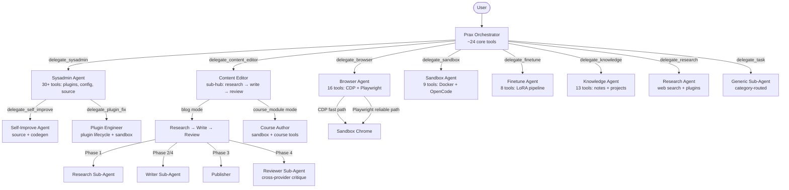
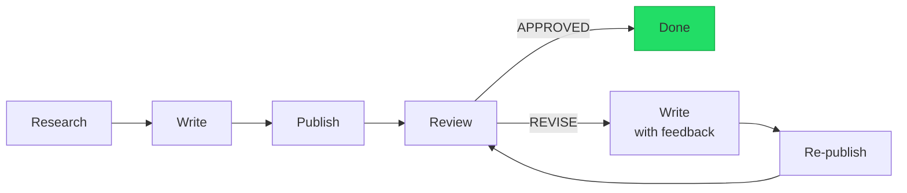
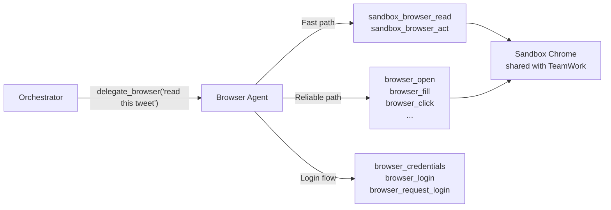

# Agent Delegation

[← Agents](README.md)

Prax keeps its main conversation loop lean by delegating domain-specific work to focused **spoke agents**.  Each spoke runs its own LangGraph ReAct loop with a specialized system prompt and curated tool set — the orchestrator sees only a single `delegate_*` tool per spoke.

Research shows that LLM tool-selection accuracy degrades past 20--30 tools ([see Research section](../research/README.md)).  The hub-and-spoke pattern keeps the orchestrator's tool count low while giving each spoke deep domain capabilities.

Key infrastructure that makes this work:

- **Execution tracing** -- every delegation chain gets a UUID.  Individual agent invocations get span IDs.  The execution graph tracks the full tree: timing, status, tool call counts, and parent/child relationships.  Governing agents see the big picture via the graph summary appended to `delegate_parallel` results.
- **Read guard** -- spokes can verify preconditions before starting work (inspired by [smux](https://github.com/ShawnPana/smux)'s read-before-act pattern).  If the guard fails, the spoke aborts without wasting an LLM call.
- **Identity injection** -- each agent receives execution context in its system prompt: trace ID, depth in the delegation tree, who delegated it, and what parallel peers are doing.
- **Self-diagnostics** -- `prax_doctor` checks LLM configuration, sandbox health, plugin status, spoke availability, workspace integrity, TeamWork connectivity, and scheduler state in one call.

## Hub-and-Spoke Architecture



## Spoke Agents

| Spoke | Delegation Tool | Tools | Purpose |
|-------|----------------|-------|---------|
| **Browser** | `delegate_browser` | 16: CDP read/act + Playwright navigate/click/fill/login/VNC | Web navigation, page reading, login flows, screenshots |
| **Content Editor** | `delegate_content_editor` | Sub-hub: blog pipeline (research → write → review) or course author mode | Blog posts, publication-quality content, and course module content |
| **Sysadmin** | `delegate_sysadmin` | 30+: plugin mgmt, prompts, LLM config, source, workspace sync | Plugin install/update, config changes, self-improvement |
| **Sandbox** | `delegate_sandbox` | 9: session lifecycle, archive, package management | Code execution in isolated Docker containers |
| **Finetune** | `delegate_finetune` | 8: harvest, train, verify, promote, rollback | LoRA fine-tuning pipeline (requires FINETUNE_ENABLED) |
| **Knowledge** | `delegate_knowledge` | 13: note CRUD, search, linking, URL/PDF-to-note, project management | Notes, knowledge graph, research projects |
| **Research** | `delegate_research` | Web search, URL fetch, datetime, reader plugins | Multi-source investigation with citations |
| **Generic** | `delegate_task(category=...)` | Category-routed (research, workspace, scheduler, codegen) | Ad-hoc delegation for categories without a dedicated spoke |

## Sub-Hubs: Spokes That Spawn Agents

Some spokes are **sub-hubs** — they don't just run a single ReAct loop, they orchestrate multiple sub-agents in a pipeline.  This gives them richer behavior than a flat tool set while keeping the main orchestrator unaware of the internal complexity.

**Content Editor** is the primary example.  It has two modes controlled by a `mode` parameter:

**Blog mode** (default) — a procedural coordinator that runs a multi-phase pipeline:


*Max 3 revision cycles.*

Each phase uses a different sub-agent:
- **Researcher** — generic research sub-agent via `_run_subagent(query, "research")`
- **Writer** — ReAct agent with search tools; takes research findings + optional revision feedback
- **Reviewer** — ReAct agent that uses `delegate_browser` to visually inspect the published page; **deliberately uses a different LLM provider** than the writer for adversarial diversity
- **Publisher** — utility functions wrapping the note/Hugo system

**Course module mode** (`mode="course_module"`) — routes to the Course Author sub-agent for rich, sandbox-based content with Mermaid diagrams, LaTeX equations, code examples, and structured pedagogy.

**Sysadmin** is another sub-hub.  It holds ~30 plugin/config tools directly, but can further delegate to:
- `delegate_self_improve` — for bug fixes requiring source + sandbox + codegen
- `delegate_plugin_fix` — for plugin creation/fixes requiring sandbox iteration

This hierarchical pattern means the orchestrator calls one tool (`delegate_sysadmin`), the sysadmin tries to handle it directly, and only escalates to a sub-agent when the task requires code-level changes.

## Browser Spoke Detail

The browser spoke is the reference implementation for the **simple spoke pattern** (single ReAct agent).  It demonstrates CDP-first routing with Playwright fallback:



The browser agent decides internally:
- **CDP first** — page reads, screenshots, quick navigation, simple clicks (faster)
- **Playwright when needed** — login flows, form filling, auto-waiting, complex selectors (more reliable)
- Both APIs hit the **same Chrome instance** the user sees in TeamWork

## What Stays on the Orchestrator

The orchestrator keeps tools that are **conversational** (require back-and-forth with the user) or **foundational** (used by many workflows):

- **Conversation** — interactive Q&A, pacing, tone
- **Workspace** — file CRUD, todos, planning (11 tools)
- **Courses** — tutoring is conversational; the orchestrator IS the tutor (6 tools)
- **Scheduling** — cron jobs, reminders (9 tools)
- **URL handling** — lightweight `fetch_url_content` (no browser needed)
- **Routing decisions** — choosing which spoke to delegate to
- **Spoke delegation** — 6 spoke tools + 2 generic sub-agent tools + 1 research delegate + 1 vision tool

## Adding a New Spoke

The spoke system lives in `prax/agent/spokes/` with one folder per spoke:

```
prax/agent/spokes/
├── __init__.py          # Registry — imports all spokes
├── _runner.py           # Shared delegation engine (LLM, invoke, logging, TeamWork)
├── browser/             # Simple spoke: single ReAct agent (reference implementation)
│   ├── __init__.py
│   └── agent.py         # Prompt, tools, delegate function
├── content/             # Sub-hub spoke: blog pipeline + course author mode
│   ├── __init__.py
│   ├── agent.py          # Pipeline coordinator (blog mode) + course author routing
│   ├── writer.py         # Writer sub-agent
│   ├── reviewer.py       # Reviewer sub-agent (cross-provider)
│   ├── publisher.py      # Hugo publishing utilities
│   └── prompts.py        # System prompts for sub-agents
├── finetune/            # Simple spoke: LoRA training pipeline
├── knowledge/           # Simple spoke: notes + research projects
├── sandbox/             # Simple spoke: Docker code execution
└── sysadmin/            # Sub-hub spoke: delegates to self-improve + plugin-fix
```

**Two spoke patterns:**

1. **Simple spoke** — single ReAct agent with curated tools.  Use `run_spoke()` from `_runner.py`.  See `browser/agent.py`.
2. **Sub-hub spoke** — procedural coordinator that spawns sub-agents.  Write your own orchestration logic.  See `content/agent.py`.

To add a new spoke:

1. Create `prax/agent/spokes/<name>/agent.py` with `SYSTEM_PROMPT`, `build_tools()`, `delegate_<name>()`, `build_spoke_tools()`
2. Register in `prax/agent/spokes/__init__.py`
3. Remove the spoke's direct tools from `tools.py:build_default_tools()`

See `prax/agent/spokes/browser/agent.py` for a simple spoke, or `prax/agent/spokes/content/agent.py` for a sub-hub.

## Source Code in the Sandbox

The app source is mounted in the sandbox container at `/source/` so OpenCode can read and modify Prax's own code:

| Mode | Mount | Access |
|------|-------|--------|
| Production | `./prax:/source/prax` | Read-only — OpenCode can inspect but not modify directly |
| Dev mode | `./prax:/source/prax` | Read-write — changes propagate via bind mount, Werkzeug auto-reloads |

## Key Files

| File | Purpose |
|------|---------|
| `prax/agent/spokes/` | Spoke agent directory — one folder per spoke |
| `prax/agent/spokes/_runner.py` | Shared delegation engine — LLM config, invocation, logging, TeamWork hooks |
| `prax/agent/spokes/browser/agent.py` | Browser spoke — CDP-first routing, Playwright fallback, login flows |
| `prax/agent/spokes/content/agent.py` | Content Editor sub-hub — multi-agent pipeline (research → write → review) |
| `prax/agent/spokes/sysadmin/agent.py` | Sysadmin sub-hub — plugin/config mgmt, delegates to self-improve + plugin-fix |
| `prax/agent/spokes/sandbox/agent.py` | Sandbox spoke — Docker code execution sessions |
| `prax/agent/spokes/finetune/agent.py` | Finetune spoke — LoRA training pipeline |
| `prax/agent/spokes/knowledge/agent.py` | Knowledge spoke — notes, knowledge graph, research projects |
| `prax/agent/self_improve_agent.py` | Self-improvement sub-agent (used by sysadmin spoke) |
| `prax/agent/plugin_fix_agent.py` | Plugin engineering sub-agent (used by sysadmin spoke) |
| `prax/agent/course_author_agent.py` | Course author sub-agent (used by content editor in course_module mode) |
| `prax/agent/research_agent.py` | Research delegate — multi-source investigation with citations |
| `prax/agent/subagent.py` | Generic delegation (`delegate_task`, `delegate_parallel`) with category and spoke routing |
| `prax/agent/trace.py` | Execution tracing — chain UUIDs, named spans, execution graphs |
| `prax/agent/doctor.py` | Self-diagnostics (`prax_doctor`) — LLM, sandbox, plugins, spokes, TeamWork |
| `scripts/watchdog.py` | Supervisor process — health checks, crash rollback, restart |
