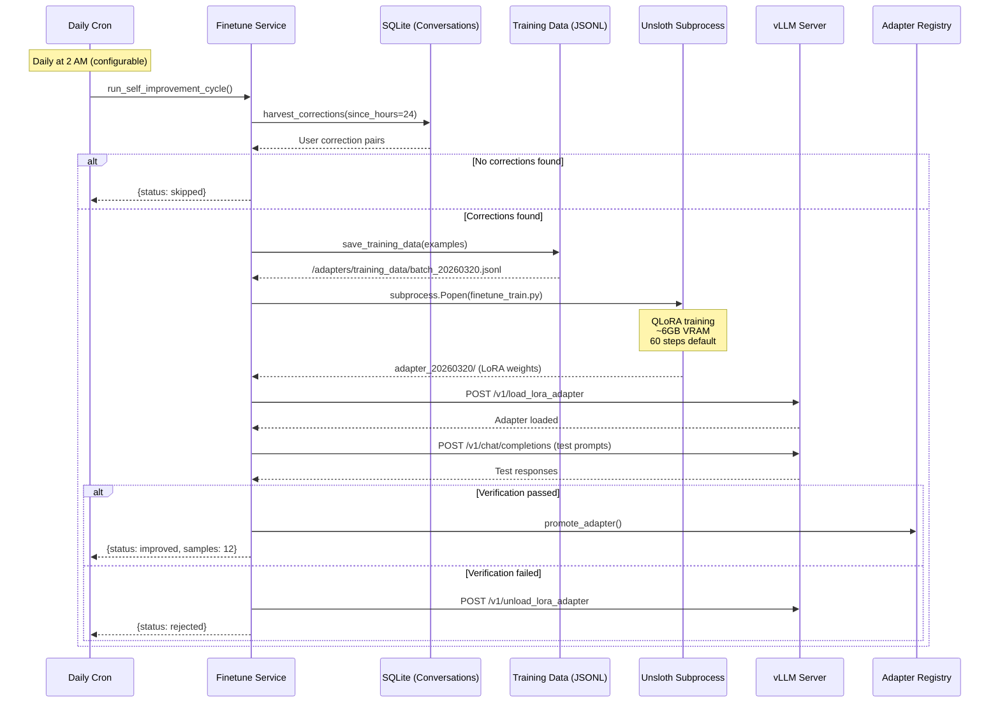

# Self-Improving Fine-Tuning

[← Agents](README.md)

## The Problem

Cloud LLMs are expensive and generic. An 8B parameter model fine-tuned on *your* conversations — where the agent learns from every correction you make — can outperform a general-purpose model at a fraction of the cost.

## The Solution: vLLM + Unsloth + LoRA Hot-Swap

The agent runs on a local [Qwen3-8B](https://huggingface.co/Qwen/Qwen3-8B) model served by [vLLM](https://docs.vllm.ai/) with its OpenAI-compatible API. When the agent detects it's been making mistakes (user corrections like "no, that's wrong" or "try again"), it:

1. **Harvests** correction pairs from SQLite conversation history
2. **Trains** a QLoRA adapter using [Unsloth](https://github.com/unslothai/unsloth) (~6 GB VRAM, fits on RTX A2000 16GB)
3. **Verifies** the new adapter against test prompts
4. **Hot-swaps** the adapter into vLLM via its REST API — zero downtime, no restart
5. **Promotes** or **rolls back** based on verification results

The entire pipeline is gated behind `FINETUNE_ENABLED=true` so the app runs normally on machines without a GPU.

## Self-Improvement Cycle



## Training Data Format

Corrections are extracted as ChatML training pairs:

```jsonl
{"messages": [
  {"role": "system", "content": "You are Prax, a warm, capable phone concierge."},
  {"role": "user", "content": "What's the capital of Australia?"},
  {"role": "assistant", "content": "The capital of Australia is Canberra."}
]}
```

The harvester looks for user messages containing correction signals ("no,", "that's wrong", "try again", etc.), then pairs the original question with the corrected response to create training examples.

## Hardware Requirements

| Component | Minimum | Recommended |
|-----------|---------|-------------|
| GPU | NVIDIA with 8GB VRAM | NVIDIA RTX A2000 16GB+ |
| VRAM Usage | ~6GB (4-bit QLoRA) | ~10GB (training + serving) |
| Disk | 20GB for model + adapters | 50GB+ |
| RAM | 16GB | 32GB+ |

## vLLM Setup

```bash
# Install vLLM (requires CUDA)
pip install vllm

# Enable runtime LoRA loading/unloading (required for /v1/load_lora_adapter)
export VLLM_ALLOW_RUNTIME_LORA_UPDATING=True

# Start vLLM with LoRA support
vllm serve Qwen/Qwen3-8B \
  --enable-lora \
  --max-lora-rank 16 \
  --port 8000

# Configure the app
echo 'FINETUNE_ENABLED=true' >> .env
echo 'VLLM_BASE_URL=http://localhost:8000/v1' >> .env
echo 'LLM_PROVIDER=vllm' >> .env
echo 'LOCAL_MODEL=Qwen/Qwen3-8B' >> .env
```

## Adapter Registry

Adapters are tracked in `{FINETUNE_OUTPUT_DIR}/adapter_registry.json`:

```json
{
  "active_adapter": "adapter_20260320_140000",
  "previous_adapter": "adapter_20260319_140000",
  "adapters": [
    {
      "name": "adapter_20260319_140000",
      "path": "./adapters/adapter_20260319_140000",
      "created_at": "2026-03-19T14:00:00+00:00",
      "verified": true
    },
    {
      "name": "adapter_20260320_140000",
      "path": "./adapters/adapter_20260320_140000",
      "created_at": "2026-03-20T14:00:00+00:00",
      "verified": true
    }
  ]
}
```

Rollback is one tool call: `finetune_rollback` unloads the current adapter and re-loads the previous one.
