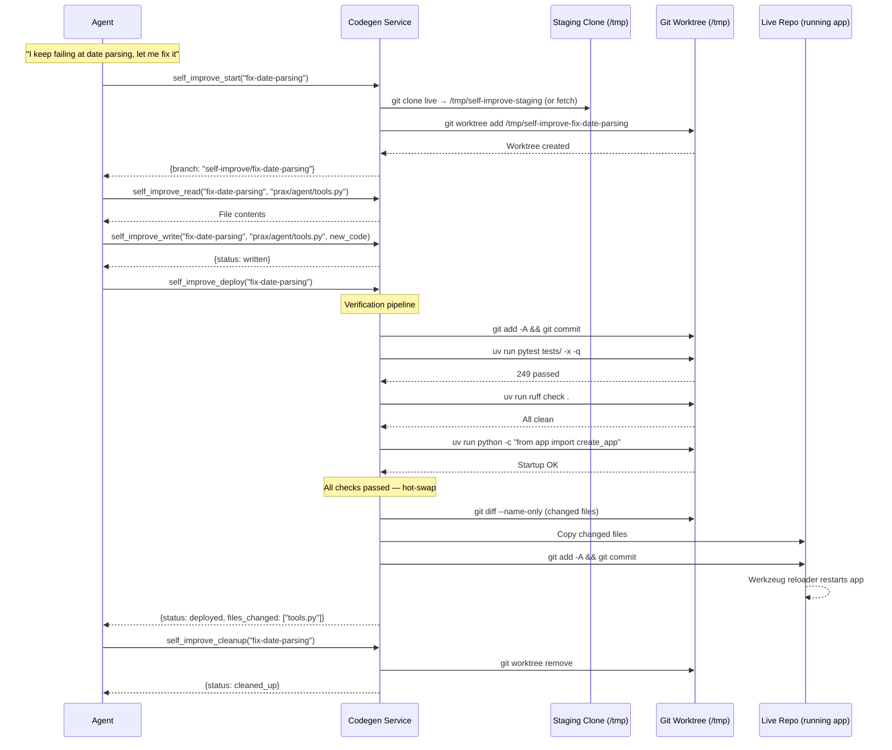
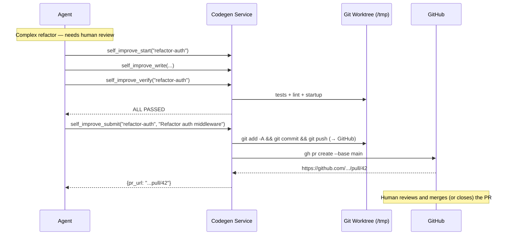

# Self-Modification via PRs

[← Agents](README.md)

## The Problem

When the agent identifies a pattern it handles poorly, it should be able to fix its own code — but never without human review.

## The Solution: Staging Clone + Verify + Hot-Swap

The agent works in a **staging clone** — a separate `git clone` of the live repo at `/tmp/self-improve-staging`. It never touches the live directory during development. [Git worktrees](https://git-scm.com/docs/git-worktree) branch off the staging clone for each change.

Two deployment paths:

**Path A — Hot-swap (dev mode only, requires Werkzeug reloader):**
1. **Start branch** — creates a worktree off the staging clone
2. **Read/Write files** — operates entirely within the worktree
3. **Verify** — runs tests + lint + app startup check (all must pass)
4. **Deploy** — copies changed files to live repo + commits; Werkzeug's reloader auto-restarts

> Path A relies on Werkzeug's file-watching reloader (`docker compose -f docker-compose.yml -f docker-compose.dev.yml`). In production (gunicorn), use Path B — hot-swap will not trigger a reload.

**Path B — PR (complex changes):**
1. Same steps 1-2
2. **Submit PR** — pushes to GitHub and creates a PR for human review
3. The agent **cannot merge to main**

## Self-Modification Flow (Hot-Swap Deploy)

## Self-Modification Flow (PR Path)

## Safety Guardrails

- **Staging isolation** — all development happens in a clone at `/tmp`, never the live repo
- **Verify-then-deploy** — tests, lint, AND startup check must all pass before any files are copied
- **Atomic hot-swap** — only changed files are copied; Flask's reloader handles the restart
- **Watchdog supervisor** — `scripts/watchdog.py` runs as the main process and monitors Flask via `/health`. If the app crashes (non-zero exit) after a self-improve deploy, the watchdog automatically `git revert`s the offending commit and restarts. Clean exits (code 0, e.g. Werkzeug reloader) are restarted immediately without counting against limits. Prax is informed on the next conversation turn via `self_improve_pending`
- **Max 3 attempts** — the deploy state file (`.self-improve-state.yaml`) tracks attempt counts per branch. After 3 failures, the agent is forced to stop and report to the user
- **Rollback** — `self_improve_rollback` reverts the last deploy commit. The watchdog also does this automatically on crash
- The `SELF_IMPROVE_ENABLED` flag must be `true` (default `false`)
