# Architecture

Prax is organized in five layers with a clear direction of dependency: **blueprints → services → agent → plugins**. The hub-and-spoke architecture keeps each agent's tool count low while providing deep domain capabilities.

## Contents

- [Hub-and-Spoke Architecture](hub-and-spoke.md) — Orchestrator, spoke agents, sub-hubs, and delegation patterns
- [Request Flows](request-flows.md) — SMS, Discord, TeamWork, sandbox, and scheduling flows
- [Workspace](workspace.md) — Per-user git-backed file layout, TeamWork integration, Dropbox sync

## High-Level System Overview

```mermaid
graph TB
    User["User (Phone / Discord / Web)"]

    subgraph TeamWork["TeamWork Web UI"]
        TWChat["Chat Channels"]
        TWKanban["Kanban Board"]
        TWTerminal["Terminal"]
        TWBrowser["Browser Screencast"]
    end

    subgraph Twilio["Twilio Cloud (optional)"]
        Voice["Voice Webhook"]
        SMS["SMS Webhook"]
    end

    subgraph Discord["Discord (optional)"]
        DiscordBot["Discord Bot\n(WebSocket)"]
    end

    subgraph Flask["Flask App"]
        MainRoutes["/transcribe, /respond"]
        SmsRoute["/sms"]
        VoiceSvc["VoiceService"]
        SmsSvc["SmsService"]
        DiscordSvc["DiscordService"]
        ConvoSvc["ConversationService"]
    end

    subgraph Agent["LangGraph ReAct Agent (Prax)"]
        Orchestrator["ConversationAgent"]
        LLMFactory["LLM Factory"]

        subgraph Tools["Orchestrator Tools (~24)"]
            BuiltIn["Core (3)\nsearch, datetime, URL fetch"]
            WS["Workspace (11)\nfiles, todos, planning"]
            Sched["Scheduler (9)\ncron, reminders"]
            Courses["Courses (6)\ntutoring"]
            Spokes["Spoke Delegates (8)\nbrowser, content, sysadmin,\nsandbox, finetune, knowledge,\nresearch, vision"]
            SA["Sub-Agent (2)\ndelegate_task, delegate_parallel"]
        end
    end

    subgraph PluginSys["Plugin System (Hot-Swappable)"]
        PluginLoader["Plugin Loader\n(folder-per-plugin discovery)"]
        PluginSandbox["Subprocess Sandbox"]
        PluginRegistry["Version Registry\n(registry.json)"]
        PluginCatalog["CATALOG.md\n(auto-generated)"]
        PromptMgr["Prompt Manager"]
        LLMConfig["LLM Routing\n(llm_routing.yaml)"]
        BuiltInPlugins["Built-In Plugins\n(NPR, PDF, YouTube, arXiv, ...)"]
        CustomPlugins["Custom Plugins\n(plugins/tools/custom/)"]
        SysPrompt["System Prompt\n(plugins/prompts/)"]
    end

    subgraph PluginRepo["Plugin Repository (optional)"]
        RemoteRepo["Private Git Repo\n(SSH deploy key)"]
        RepoBranch["Branch: plugins"]
        RemoteCatalog["CATALOG.md"]
    end

    subgraph Storage["Persistence"]
        SQLite["SQLite\n(conversation memory)"]
        Workspace["Git-Backed Workspace\n(per-user files)"]
        ScheduleYAML["schedules.yaml\n(cron definitions)"]
        AdapterReg["adapter_registry.json\n(LoRA adapters)"]
        Todos["todos.json\n(user to-do list)"]
        Links["links.md\n(link history)"]
        Instructions["instructions.md\n(prompt reference)"]
        AgentPlan["agent_plan.json\n(task decomposition)"]
    end

    subgraph Sandbox["Docker Sandbox"]
        Container["Docker Container"]
        OpenCode["OpenCode\n(headless HTTP API)"]
    end

    subgraph LocalML["Local ML Stack (optional)"]
        vLLM["vLLM Server\n(OpenAI-compat API)"]
        LoRA["LoRA Adapters\n(hot-swappable)"]
        Unsloth["Unsloth QLoRA\n(training subprocess)"]
    end

    subgraph Browser["Browser (Playwright)"]
        Chromium["Headless Chromium"]
        SiteCreds["sites.yaml\n(credentials)"]
        Profiles["Persistent Profiles\n(cookies/sessions)"]
        VNCServer["Xvfb + x11vnc\n(manual login)"]
    end

    Worktree["Git Worktree\n(self-modification)"]

    Scheduler["APScheduler\n(background cron)"]

    User -->|Web| TWChat
    User -->|Call| Voice
    User -->|Text| SMS
    User -->|Message| DiscordBot
    TWChat -->|Webhook| ConvoSvc
    TWTerminal -->|docker exec| Container
    TWBrowser -->|CDP| Chromium
    Voice --> MainRoutes --> VoiceSvc
    SMS --> SmsRoute --> SmsSvc
    DiscordBot --> DiscordSvc
    VoiceSvc --> ConvoSvc
    SmsSvc --> ConvoSvc
    DiscordSvc --> ConvoSvc
    ConvoSvc --> Orchestrator
    Orchestrator --> LLMFactory
    LLMFactory -->|cloud| BuiltIn
    LLMFactory -->|local| vLLM
    Orchestrator --> Tools
    WS --> Workspace
    Spokes -->|sandbox| Container
    Container --> OpenCode
    Sched --> ScheduleYAML
    Spokes -->|finetune| Unsloth
    Spokes -->|finetune| vLLM
    vLLM --> LoRA
    SA -->|codegen| Worktree
    Spokes -->|sysadmin| PluginLoader
    PluginLoader --> BuiltInPlugins
    PluginLoader --> CustomPlugins
    PluginLoader --> PluginSandbox
    PluginLoader --> PluginRegistry
    PluginLoader --> PluginCatalog
    CustomPlugins -.->|push| RemoteRepo
    RemoteRepo --> RepoBranch
    RepoBranch --> RemoteCatalog
    Orchestrator --> PromptMgr
    PromptMgr --> SysPrompt
    LLMFactory --> LLMConfig
    Spokes -->|browser| Chromium
    Chromium --> SiteCreds
    Chromium --> Profiles
    VNCServer --> Chromium
    ConvoSvc --> SQLite
    Scheduler -->|reads| ScheduleYAML
    Scheduler -->|fires| ConvoSvc
    ConvoSvc -->|SMS / Discord reply| User
    Worktree -->|PR| Workspace
```



## Concepts — What Lives Where

Prax is organized in five layers. Each has a clear job and a single direction of dependency: **blueprints → services → agent → plugins**.

| Layer | Directory | What it is | Example |
|-------|-----------|------------|---------|
| **Blueprints** | `prax/blueprints/` | Flask route handlers — the HTTP surface. They receive webhooks from Twilio (voice, SMS) or serve static files. Blueprints know about *channels* but not about the agent. | `POST /sms` validates a Twilio signature, hands the message to `SmsService`, and returns a TwiML response. |
| **Services** | `prax/services/` | Business logic that doesn't belong in the agent. A service encapsulates one capability: workspace git ops, Docker sandbox lifecycle, Playwright browser sessions, APScheduler cron, Hugo publishing, etc. Services are called *both* by blueprints (channel-facing) and by agent tools (capability-facing). They never call the agent directly. | `workspace_service.py` manages the per-user git repo — creating, reading, locking, committing. |
| **Agent** | `prax/agent/` | The LangGraph ReAct loop and everything around it: the orchestrator, LLM factory, tool builders, governance, checkpointing. Tool builder files (`*_tools.py`) define groups of LangChain tools that thin-wrap a service. The agent layer decides *what* to do; services decide *how* to do it. | `sandbox_tools.py` exposes 7 tools (`sandbox_start`, `sandbox_message`, …) that all delegate to `sandbox_service.py`. |
| **Plugins** | `prax/plugins/` | Hot-swappable extensions discovered at startup. Each plugin lives in `plugins/tools/<name>/plugin.py`, exports a `register()` function returning LangChain tools, and can be created/modified/rolled back at runtime — by the agent itself. The plugin system also manages the system prompt and LLM routing config. | `plugins/tools/news/plugin.py` provides the unified `news` tool with actions for briefings, RSS checking, and audio. |
| **Readers** | `prax/readers/` | Legacy content-extraction helpers (ArXiv, NPR audio, web scraping). Being migrated into plugins. New code should use or create a plugin instead. | `readers/news/npr_top_hour.py` fetches the latest NPR podcast URL — now called by the `news` plugin. |

**How they connect:**

```
User ──▸ Twilio/Discord
            │
        Blueprints          (HTTP layer — routes, auth)
            │
        Services             (business logic — workspace, sandbox, browser, scheduler, …)
            │
        Agent                (LangGraph ReAct loop — orchestrator, tools, governance)
            │
        Plugins              (hot-swappable tools — news, PDF, YouTube, custom, …)
```

**Rules of thumb:**

- **Need a new channel?** Add a blueprint + a channel service.
- **Need a new capability** (e.g., email sending)? Add a service, then wrap it with a tool builder in `agent/` or a plugin in `plugins/tools/`.
- **Need a new tool the agent can call?** If it's a core, always-on tool, add it to an `agent/*_tools.py` builder. If it's optional, content-focused, or user-modifiable, make it a plugin.
- **Need to change the system prompt?** Edit `plugins/prompts/system_prompt.md` (or let the agent do it at runtime via `prompt_write`).
