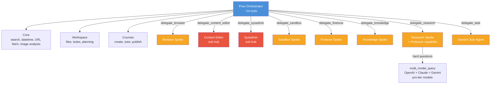
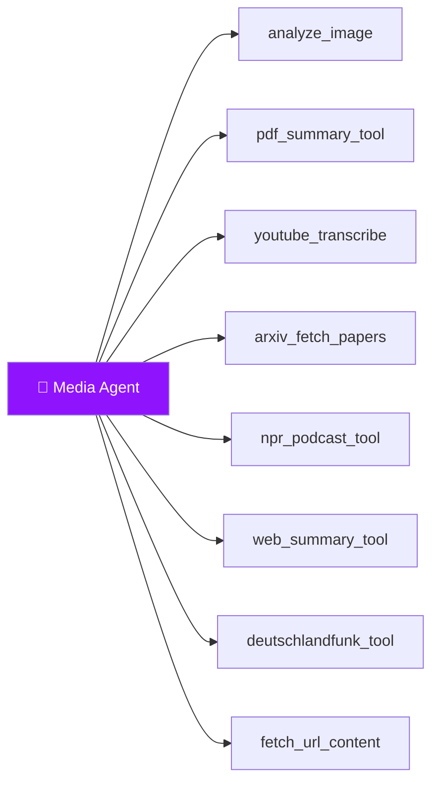
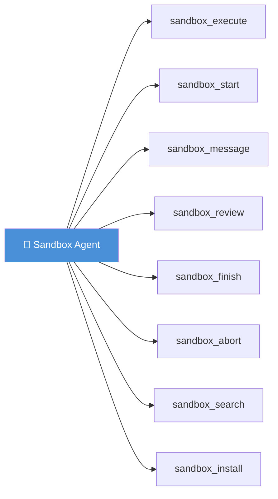
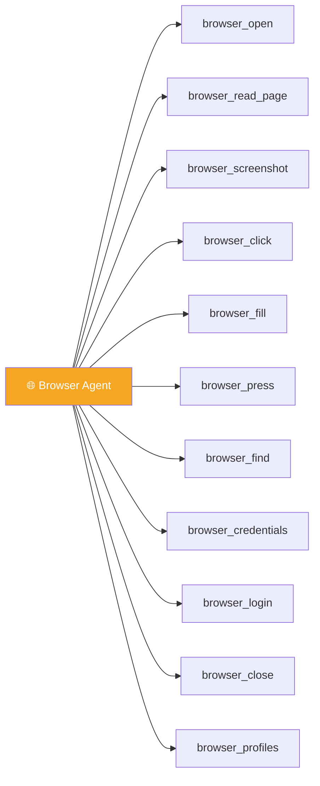
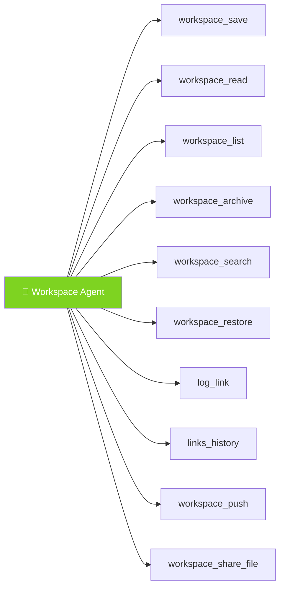
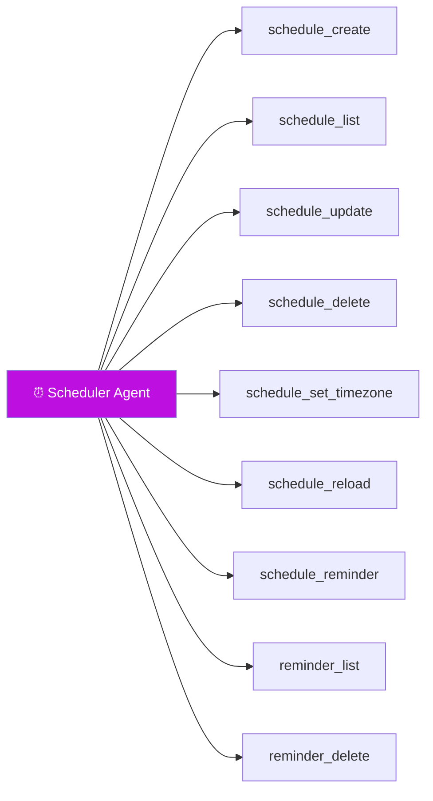
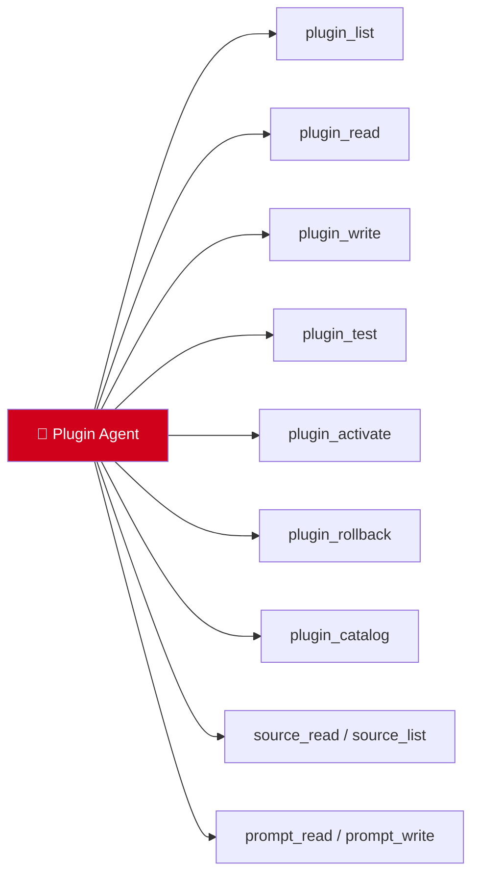
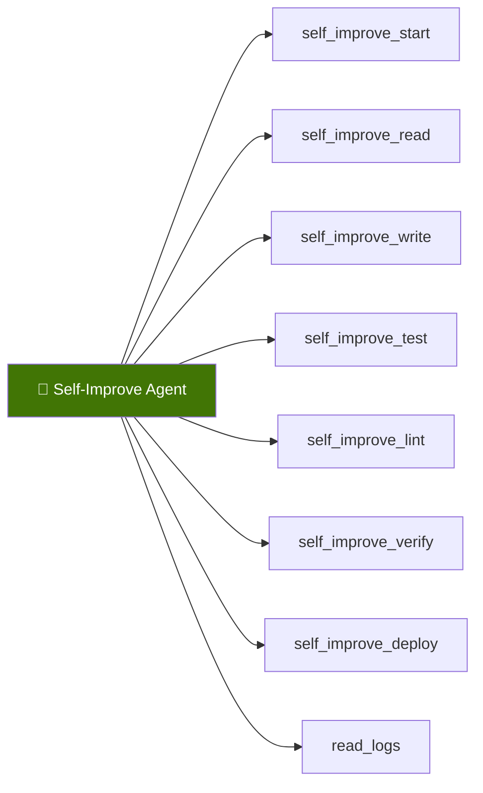

# Hub-and-Spoke Architecture

[← Architecture](README.md)

Prax uses a hub-and-spoke model: the orchestrator holds ~24 core tools (workspace, scheduling, courses) and delegates domain-specific work to focused spoke agents.  This keeps the orchestrator's context lean — [research shows](#9-tool-overload-and-selection-degradation) that tool selection accuracy degrades significantly past 20–50 tools.

> **Fallback:** If a delegated agent fails or can't handle the task, Prax can read the full tool catalog from a generated markdown file and call any tool directly. The spoke system is the fast path; direct tool access is the safety net.

#### Orchestrator (Hub)

#### Media Agent

Handles images, PDFs, audio, video transcripts, and web content extraction.

#### Sandbox Agent

Executes code in an isolated Docker container with a full dev environment.

#### Browser Agent

Automates web interactions via Playwright with persistent profiles and credential management.

#### Workspace Agent

Manages per-user file storage, git-backed workspaces, and link history.

#### Scheduler Agent

Manages recurring cron jobs and one-time reminders.

#### Plugin Engineering Agent

Creates, tests, and manages hot-swappable plugins.

#### Self-Improvement Agent

Diagnoses bugs in Prax's own code, writes patches in the sandbox, and deploys fixes.

### Key Modules

| Module | Purpose |
|--------|---------|
| `prax/agent/orchestrator.py` | LangGraph ReAct agent with hot-swappable system prompt, plugin-aware graph rebuild, and per-component LLM routing |
| `prax/agent/subagent.py` | General sub-agent delegation: spawns focused LangGraph sub-graphs with per-category LLM config |
| `prax/agent/self_improve_agent.py` | Self-improvement sub-agent: diagnose bugs, patch via sandbox, deploy via codegen |
| `prax/agent/plugin_fix_agent.py` | Plugin engineering sub-agent: create/fix/test/activate plugins autonomously |
| `prax/agent/course_author_agent.py` | Content author sub-agent: produces rich course materials (mermaid, code, LaTeX) via iterative sandbox drafting |
| `prax/agent/tools.py` | Kernel tool wrappers (search, datetime, fetch_url) — reader tools migrated to plugins |
| `prax/agent/plugin_tools.py` | 17 plugin management tools: plugin CRUD, catalog, prompt CRUD, LLM config, source_read/list |
| `prax/agent/workspace_tools.py` | 24 workspace tools: notes, files, links, todos, task planning, instructions, conversation history/search, system status, diff-aware patch |
| `prax/agent/sandbox_tools.py` | 7 sandbox tools for code execution sessions |
| `prax/agent/scheduler_tools.py` | 9 scheduler tools: recurring cron + one-time reminders |
| `prax/agent/finetune_tools.py` | 8 fine-tuning tools (harvest, train, verify, promote, rollback) |
| `prax/agent/codegen_tools.py` | 10 self-improvement tools (worktree, edit, test, lint, verify, deploy, PR) |
| `prax/agent/note_tools.py` | 7 note tools (create, update, list, search, note_from_url, pdf_to_note, note_link) |
| `prax/agent/project_tools.py` | 6 research project tools (create, status, add note/link/source, brief) |
| `prax/agent/browser_tools.py` | 14 browser tools (navigate, click, fill, screenshot, login, VNC) |
| `prax/agent/tool_registry.py` | Tool aggregation: built-in + plugin-provided + manually registered |
| `prax/agent/llm_factory.py` | Multi-provider LLM factory (OpenAI, Anthropic, Google, Ollama, vLLM) |
| `prax/plugins/loader.py` | Recursive plugin discovery (folder-per-plugin + flat), hot-swap, version tracking, auto-rollback, catalog generation |
| `prax/plugins/sandbox.py` | Subprocess-isolated plugin validation before activation |
| `prax/plugins/registry.py` | JSON-based version registry with rollback and failure monitoring |
| `prax/plugins/repo.py` | Plugin repository service: SSH deploy key auth, clone, commit, push to private repo branch |
| `prax/plugins/catalog.py` | Auto-generated CATALOG.md listing all available plugins with metadata |
| `prax/plugins/prompt_manager.py` | Hot-swappable system prompt loading with variable expansion |
| `prax/plugins/llm_config.py` | Per-component LLM routing (YAML-based, hot-reloaded) |
| `prax/plugins/monitored_tool.py` | Runtime monitoring wrapper: failure counting + auto-rollback |
| `prax/plugins/tools/*/plugin.py` | Built-in reader plugins (NPR, web summary, PDF, YouTube, arXiv, RSS, Deutschlandfunk) |
| `prax/services/sms_service.py` | SMS workflow: media handling, PDF pipeline, agent routing |
| `prax/services/voice_service.py` | Voice workflow: speech processing, TTS buffer management |
| `prax/services/conversation_service.py` | Shared conversation layer with workspace context injection |
| `prax/services/sandbox_service.py` | Docker + OpenCode sandbox lifecycle, archiving, budget control |
| `prax/services/scheduler_service.py` | APScheduler-backed cron service reading YAML definitions |
| `prax/services/finetune_service.py` | LoRA fine-tuning pipeline: harvest → train → verify → hot-swap |
| `prax/services/note_service.py` | Note CRUD, search, knowledge graph (related notes), Hugo page generation |
| `prax/services/project_service.py` | Research project CRUD, note/link/source aggregation, brief generation |
| `prax/services/codegen_service.py` | Self-modification via staging clone + verify + hot-swap / PR workflow |
| `prax/services/discord_service.py` | Discord bot: message handling, authorization, response delivery |
| `prax/services/browser_service.py` | Playwright browser automation with per-user sessions |
| `prax/services/pdf_service.py` | PDF download, extraction (opendataloader-pdf), arxiv detection |
| `prax/services/youtube_service.py` | YouTube audio download (yt-dlp) + Whisper transcription |
| `prax/services/workspace_service.py` | Git-backed per-user file operations with per-user locking |
| `scripts/watchdog.py` | Supervisor process: health checks Flask, auto-rollback on crash after self-improve deploy |
| `scripts/finetune_train.py` | Standalone Unsloth QLoRA training script (runs in GPU subprocess) |
| `prax/settings.py` | Pydantic BaseSettings — all config from `.env` |
| `prax/clients.py` | Shared lazy-initialized Twilio client |
| `prax/sms.py` | SMS chunking and sending utilities |
| `prax/call_state.py` | `CallStateManager` — typed call state with `ensure()` |
| `prax/conversation_memory.py` | SQLite storage with auto-summarization at 100k tokens |
