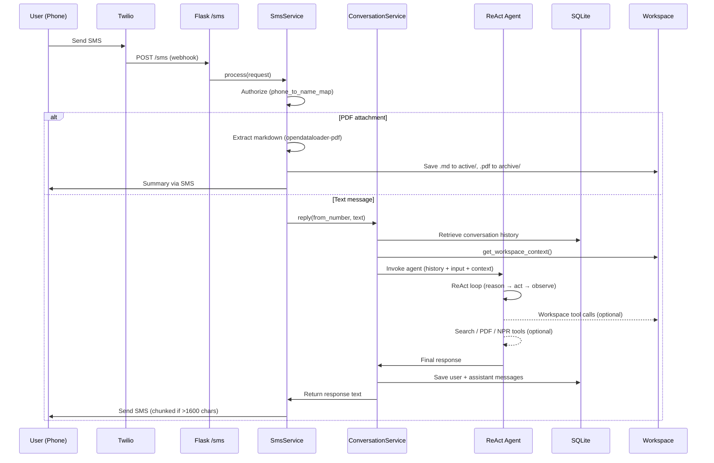
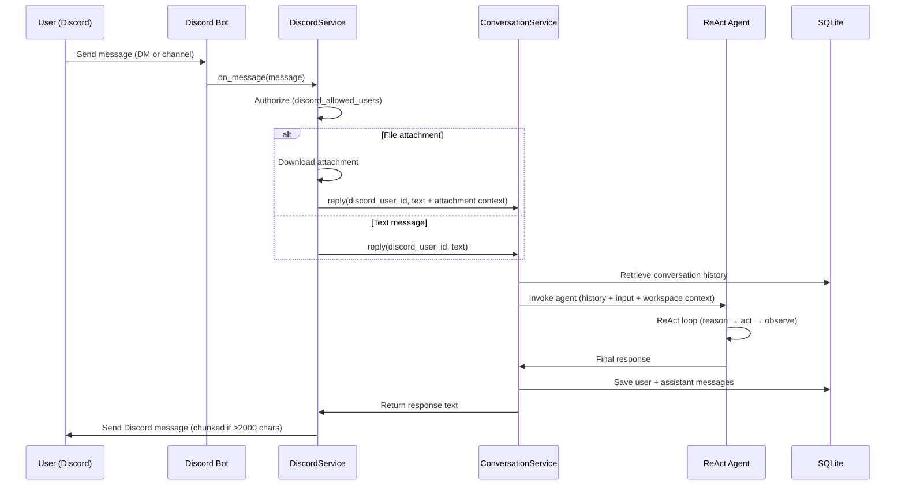
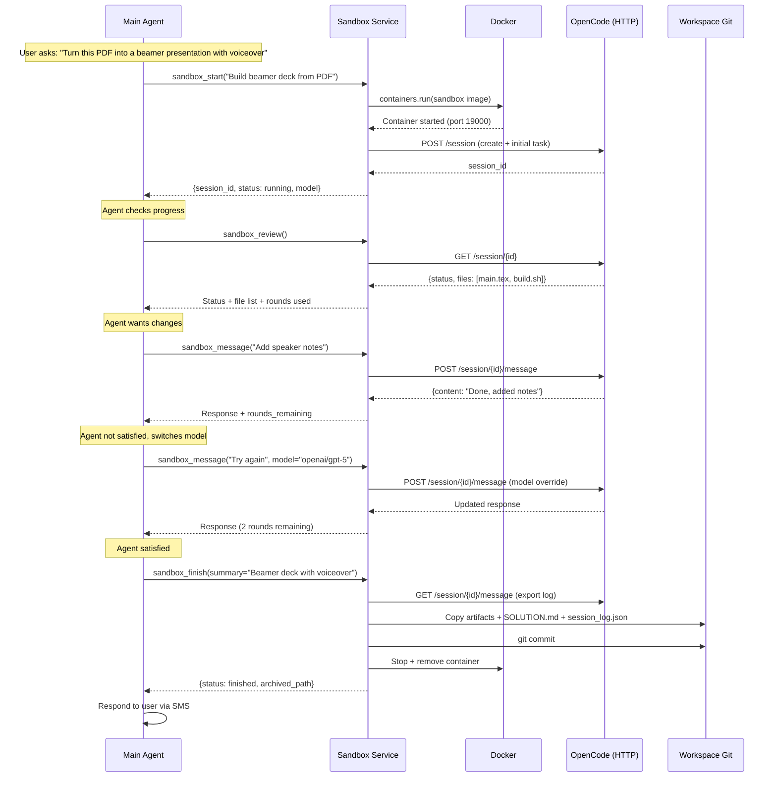
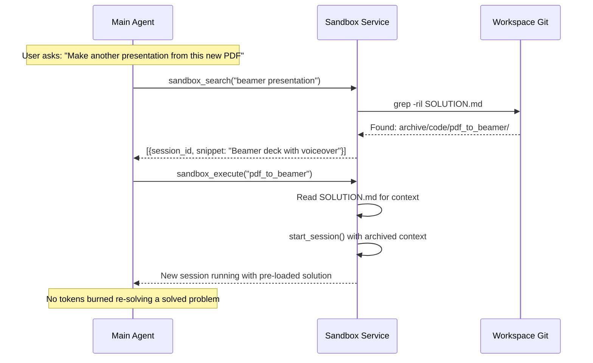
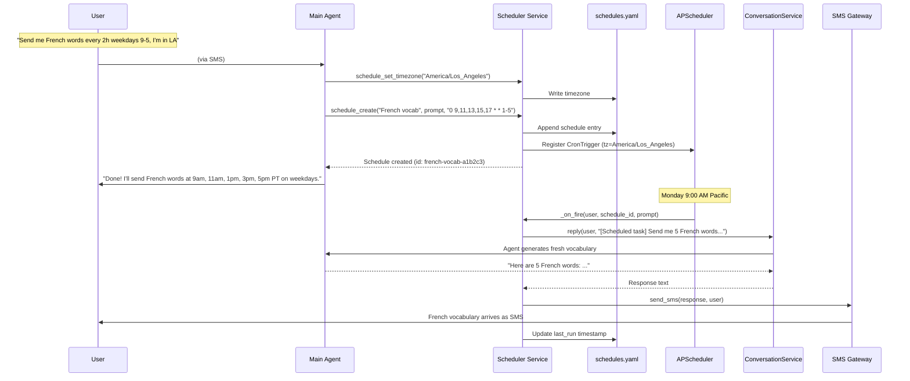

# Request Flows

[← Architecture](README.md)

### Request Flow — SMS Message



### Request Flow — Discord Message



### Sandbox Code Execution Flow



### Solution Reuse Flow



### Scheduled Messages Flow



### schedules.yaml Format

Each user has a `schedules.yaml` in their git workspace that both the agent and the user can edit manually:

```yaml
timezone: America/Los_Angeles
schedules:
- id: french-vocab-a1b2c3
  description: French vocabulary practice
  prompt: >
    Send me 5 new French words with their English translations,
    pronunciation guides, and example sentences. Vary the difficulty
    and topic each time. Remember what you sent before.
  cron: '0 9,11,13,15,17 * * 1-5'
  timezone: America/Los_Angeles
  enabled: true
  created_at: '2026-03-20T09:00:00-07:00'
  last_run: '2026-03-20T15:00:00-07:00'

- id: daily-briefing-d4e5f6
  description: Morning news briefing
  prompt: >
    Give me a brief morning briefing: top 3 news headlines,
    weather summary, and one interesting fact.
  cron: '30 7 * * 1-5'
  timezone: America/Los_Angeles
  enabled: true
  created_at: '2026-03-20T09:05:00-07:00'
  last_run: null
```

Cron field reference (5 fields: `minute hour day month weekday`):

| Pattern | Meaning |
|---------|---------|
| `0 9,11,13,15,17 * * 1-5` | 9am, 11am, 1pm, 3pm, 5pm on weekdays |
| `30 7 * * *` | Daily at 7:30am |
| `0 */3 * * 1-5` | Every 3 hours on weekdays |
| `0 8 * * 1` | Every Monday at 8am |
| `0 20 1,15 * *` | 8pm on the 1st and 15th of each month |

**Manual editing:** Edit the YAML directly in the workspace, then tell the agent "I edited the schedules file" and it will call `schedule_reload` to pick up changes. All changes are git-committed automatically.
