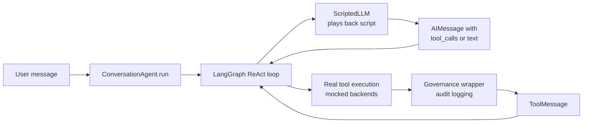
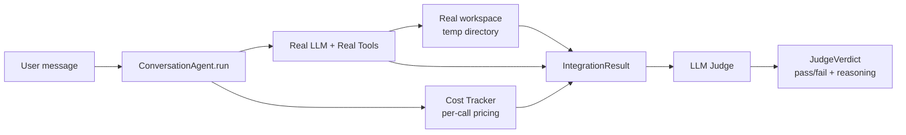
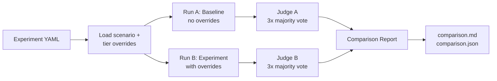

# Testing

[← Guides](README.md)

```bash
# Run all tests
uv run pytest tests/ -q

# Run only end-to-end workflow tests
uv run pytest tests/e2e/ -v

# With coverage
uv run coverage run -m pytest
uv run coverage report

# Run TeamWork UI smoke tests (requires docker-compose stack running)
cd ../teamwork/frontend && npx playwright test
```

Before opening a pull request, run `make ci` to validate everything locally:

```bash
make ci   # actionlint + ruff + pytest
```

This mirrors the GitHub Actions CI pipeline and catches issues before they hit remote.

Coverage configuration (see `pyproject.toml`) focuses on business logic; Twilio blueprints and heavy IO helpers are excluded until integration tests are added.

### End-to-End Workflow Tests

The `tests/e2e/` directory contains integration tests that exercise the **full agent orchestration loop** — from user message through tool calls and back to final response — with a `ScriptedLLM` that plays back predetermined responses. No real API calls are made.

**Architecture:**



- **`ScriptedLLM`** — A `BaseChatModel` that returns pre-scripted `AIMessage` responses in sequence. Some responses include `tool_calls` to trigger the real tool execution path; others are plain text (final response).
- **Service mocks** — External backends (`background_search`, `sandbox_service`, `note_service`, etc.) are mocked at the service boundary. Everything above that runs for real: tool registry, governance wrapper, risk classification, audit logging, checkpoint management, and trace logging.
- **`run_e2e` fixture** — Creates a `ConversationAgent` with the `ScriptedLLM`, patches TeamWork hooks and the plugin loader, and runs the full orchestration loop. Per-test service mocks are passed via the `mocks={}` parameter.

| File | Tests | What it covers |
|------|-------|----------------|
| `test_chat.py` | 3 | Greetings, factual Q&A, multi-sentence — no tool calls |
| `test_search.py` | 4 | Web search, URL fetch, search follow-up, parallel tool calls |
| `test_notes.py` | 3 | Note creation, user notes update, workspace file save |
| `test_sandbox.py` | 6 | Full sandbox lifecycle, review, abort, model switch, timeout guidance, auto-abort on repeated failures |
| `test_delegation.py` | 4 | Research sub-agent, browser spoke, content editor spoke, parallel delegation |
| `test_errors.py` | 6 | Empty search, no sandbox, note service failure, URL timeout, delegation failure, max rounds |
| `test_active_inference.py` | 13 | Prediction error tracking, epistemic gate (block/allow/new-file), logprob entropy drain, semantic entropy buffer, expected_observation stripping, trace completeness, budget coexistence, multi-tool prediction tracking |

**Adding a new workflow test:**

```python
# tests/e2e/test_example.py
from tests.e2e.conftest import ai, ai_tools, make_async_return, tc

def test_my_workflow(run_e2e):
    response, llm = run_e2e(
        "User message here",
        [
            # Step 1: Agent calls a tool
            ai_tools(tc("background_search_tool", {"query": "something"})),
            # Step 2: Agent gives final response
            ai("Here's what I found..."),
        ],
        mocks={
            "prax.helpers_functions.background_search": make_async_return("search results"),
        },
    )
    assert "found" in response
    assert llm.call_count == 2
```

### Integration Tests (Real LLM + LLM Judge)

The `tests/integration/` directory contains tests that send **real messages through the full Prax pipeline** (real LLM, real tools, real workspace) and then have an LLM judge evaluate whether the result met expectations. These require a real API key.

```bash
# Run all integration tests
uv run pytest tests/integration/ -m integration -v -s

# Run a single scenario (useful when developing a new skill)
uv run pytest tests/integration/test_workflows.py -k create_simple_note -v -s

# Run only research-related scenarios
uv run pytest tests/integration/test_workflows.py -k research -v -s
```

**Requirements:**
- A real API key in `.env` (`OPENAI_KEY` or `ANTHROPIC_KEY`)
- Docker is NOT required for current scenarios (no sandbox-dependent tests yet)
- Tests are skipped automatically when no API key is available

**Architecture:**



**Artifacts:** Each test run saves detailed artifacts to `tests/integration/.artifacts/<scenario>/`:

| File | Contents |
|------|----------|
| `SUMMARY.md` | Duration, cost breakdown by model, judge verdict |
| `response.md` | Full agent response text |
| `cost.json` | Per-call token usage and USD cost |
| `spans.json` | Structured execution graph spans (includes per-span tier choices) |
| `tiers.json` | Every tier→model resolution with span context and timestamps |
| `execution_graph.txt` | Human-readable delegation tree with tier annotations |
| `verdict.json` | Judge pass/fail, reasoning, issues |
| `workspace/` | All workspace files created during the run |

**Judging:** Each test uses **3 parallel LLM judges** with majority voting (2/3 must pass). This eliminates flaky verdicts from single-judge hallucination.

**Tier tracking:** Every `build_llm()` call records which tier was requested, which model it resolved to, which provider, and which span (agent/spoke) made the call. This data flows to:
- `tiers.json` artifact — for offline analysis
- Execution graph summary — human-readable tier annotations per span
- Workspace `trace.log` — `[TIER_CHOICE]` entries for production trace analysis
- OTel spans — `prax.tier` attribute for Grafana queries

**Current scenarios:**

| Scenario | What it tests | Expected cost | Timeout |
|----------|--------------|---------------|---------|
| `create_simple_note` | Basic workspace_save | ~$0.004 | 60s |
| `create_structured_note` | Structured markdown generation | ~$0.003 | 60s |
| `research_and_note` | Research delegation + workspace save | ~$0.030 | 180s |
| `factual_question` | Direct response, no tools | ~$0.002 | 45s |
| `multi_step_plan` | Multi-step planning, two workspace saves | ~$0.005 | 90s |
| `arxiv_course_creation` | PDF download + course creation (real plugins) | ~$0.080 | 300s |
| `compare_two_topics` | Multi-source research synthesis | ~$0.040 | 180s |
| `workspace_read_and_extend` | Simple workspace save | ~$0.003 | 45s |
| `simple_save_no_delegation` | Verifies simple tasks don't over-delegate | ~$0.003 | 30s |
| `graceful_missing_capability` | Truthfulness guardrails (real-time data) | ~$0.002 | 45s |
| `linked_workspace_files` | Three cross-referenced workspace files | ~$0.005 | 90s |
| `note_without_ngrok` | Note creation works without ngrok (URL falls back to TeamWork-served `TEAMWORK_BASE_URL`) | ~$0.012 | 90s |

**Active Inference integration tests** (`test_active_inference.py`) — verify that the Active Inference pipeline (§17) produces real trace artifacts with a live LLM:

| Test | What it verifies |
|------|-----------------|
| `test_search_produces_prediction_record` | Web search generates `PREDICTION_ERROR` trace entries; LLM fills `expected_observation` |
| `test_direct_save_triggers_gate_or_succeeds` | Epistemic gate detects write-before-read; agent self-corrects or succeeds on new files |
| `test_read_then_update_passes_gate` | Read-then-write sequence passes the epistemic gate without blocking |
| `test_trace_log_has_audit_entries` | Governance audit entries appear in every trace log |
| `test_multi_tool_trace_has_predictions` | Multi-tool interactions (search + save) produce structured trace entries |
| `test_tool_schema_includes_expected_observation` | All governed tools have the `expected_observation` field in their schema |
| `test_normal_task_completes_within_budget` | Active Inference tracking doesn't inflate call counts or exhaust budgets |

**Adding a new scenario:**

```python
# tests/integration/scenarios.py
Scenario(
    name="my_new_scenario",
    message="Ask Prax to do something specific",
    expected_flow="""\
Describe what tools/spokes should fire and in what order.
The judge uses this to evaluate the execution graph.
""",
    quality_criteria="""\
Describe what the output should look like.
The judge uses this to evaluate workspace files and response.
""",
    expected_artifacts=["*pattern*"],  # glob patterns for workspace files
    max_duration=60,
    min_tool_calls=1,   # 0 = no minimum check
    max_tool_calls=15,  # safety valve — anything above is probably a loop
)
```

**Cost tracking:** Token usage and USD cost are tracked per LLM call during integration tests. Default pricing is built-in for major models; override via the `PRAX_MODEL_PRICING` env var:

```bash
# Override pricing for specific models (JSON dict, merged on top of defaults)
export PRAX_MODEL_PRICING='{"my-custom-model": {"input": 2.0, "output": 8.0}}'
```

### A/B Testing (Tier Experiments)

Prax includes an A/B replay system for measuring how tier/model changes affect cost, latency, and output quality. Experiments define tier overrides to apply on top of an existing scenario, then run baseline vs experiment side by side.

```bash
# Run all experiments
uv run pytest tests/integration/test_ab_replay.py -m ab -v -s

# Run a single experiment
uv run pytest tests/integration/test_ab_replay.py -k upgrade_research -v -s
```

**How it works:**



**Creating an experiment:**

Create a YAML file in `tests/integration/experiments/`:

```yaml
# tests/integration/experiments/upgrade_research_to_medium.yaml
name: upgrade-research-to-medium
description: Does bumping research from low to medium improve output?
base_scenario: research_and_note

overrides:
  subagent_research:
    tier: medium
```

The `overrides` keys match the component names from `llm_routing.yaml` (`orchestrator`, `subagent_research`, `subagent_browser`, `subagent_codegen`, etc.). You can override `tier`, `model`, `provider`, and `temperature`.

**Included experiments:**

| Experiment | Question | Scenario |
|------------|----------|----------|
| `upgrade_research_to_medium` | Does smarter research improve citations? | `research_and_note` |
| `orchestrator_medium_vs_low` | Does smarter routing reduce over-delegation? | `multi_step_plan` |
| `all_medium` | What's the ceiling for quality gains from tier upgrades? | `compare_two_topics` |

**Comparison report** (`tests/integration/.artifacts/experiments/<name>/<timestamp>/comparison.md`):

The report includes:
- Cost delta (baseline vs experiment, percentage change)
- Timing delta
- Per-span tier differences (which spokes changed, what they changed to)
- Judge verdicts for both runs
- Response previews and execution graphs

**Using experiments as a feedback loop:**

1. Run integration tests to identify quality issues (e.g., shallow research, over-delegation)
2. Hypothesize a tier change that might fix it (e.g., "research spoke needs medium tier")
3. Create an experiment YAML
4. Run the A/B test — compare cost vs quality
5. If the experiment wins, update `llm_routing.yaml` to make it permanent
6. If it doesn't, try a different approach (prompt changes, tool improvements)

**Programmatic overrides** (for custom scripts or CI):

```python
from prax.plugins.llm_config import set_experiment_overrides, clear_experiment_overrides

token = set_experiment_overrides({
    "subagent_research": {"tier": "medium"},
    "orchestrator": {"tier": "high"},
})
try:
    result = agent.run(user_input="Research quantum computing")
finally:
    clear_experiment_overrides(token)
```

Overrides use `contextvars.ContextVar` so parallel test runs don't interfere.

### Releases and Semantic Versioning

This project uses [release-please](https://github.com/googleapis/release-please) to automate releases. When commits land on `main`, release-please parses their messages and opens (or updates) a release PR with a version bump and changelog entry.

Commit messages must follow [Conventional Commits](https://www.conventionalcommits.org/):

| Prefix | Version bump | Example |
|--------|-------------|---------|
| `fix:` | Patch (0.0.x) | `fix: handle empty transcript` |
| `feat:` | Minor (0.x.0) | `feat: add arXiv reader plugin` |
| `feat!:` or `BREAKING CHANGE:` | Major (x.0.0) | `feat!: redesign plugin API` |
| `chore:`, `docs:`, `refactor:`, `test:` | No bump | `chore: update dependencies` |

Prax's self-improve pipeline uses the `(self-improve)` scope (e.g. `fix(self-improve): correct prompt escaping`) so automated commits are clearly attributed and still trigger the appropriate version bump.
