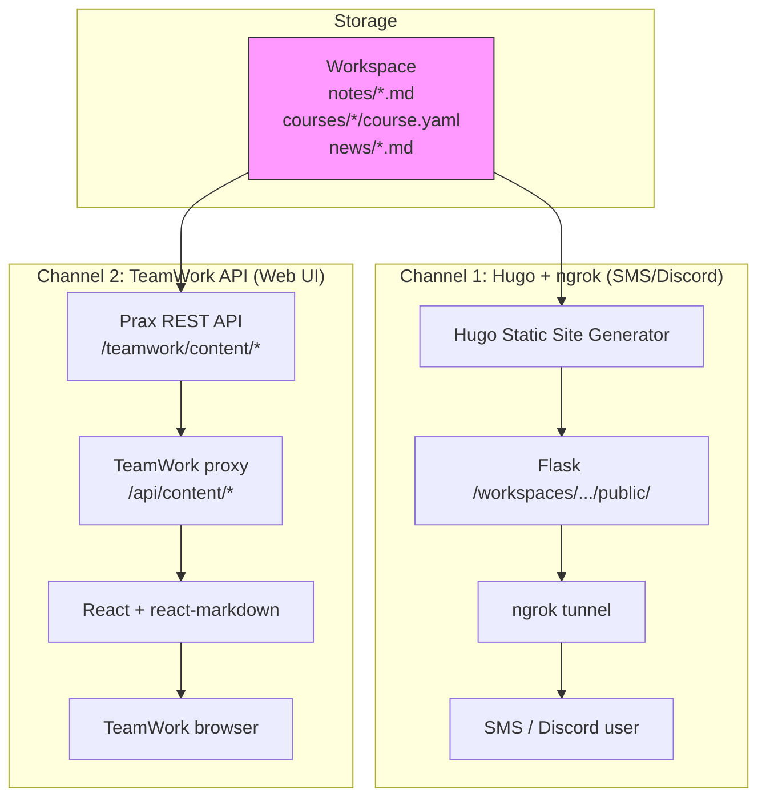

# Content Publishing

[← Infrastructure](README.md)

Prax creates and manages three types of content: **notes**, **courses**, and **news briefings**. Each is stored as markdown with YAML frontmatter in the user's git-backed workspace, and can be published through two independent delivery channels.

### Content Types

| Type | Storage Path | Frontmatter | Description |
|------|-------------|-------------|-------------|
| **Notes** | `notes/<slug>.md` | title, tags, related, created_at, updated_at | Knowledge base — research summaries, extracted papers, manual notes |
| **Courses** | `courses/<id>/course.yaml` + lessons | title, subject, level, status, progress | Structured learning content with lessons and exercises |
| **News** | `news/<slug>.md` | title, created_at, updated_at | Daily briefings, curated digests |

### Two Delivery Channels



**Channel 1 — Hugo + ngrok** (SMS/Discord): When Prax calls `publish_notes()` or `publish_news()`, it generates Hugo content files, builds the static site, and serves the HTML through Flask. ngrok provides a public URL. Users on SMS/Discord receive links like `https://abc123.ngrok.io/notes/eigenvalues/`.

**Channel 2 — TeamWork API** (Web UI): TeamWork's "Prax's Space" panel fetches raw markdown + metadata via the REST API and renders it client-side with `react-markdown`. Hugo is not involved — no build step, no static HTML. This is instant and allows interactive features (editing, versioning, deletion) that static HTML can't support.

### Prax's Space — TeamWork Content Panel

The content panel is accessed via the BookOpen icon in TeamWork's left rail. It provides:

**Browsing:**
- Tabbed interface: Notes / Courses / News with item counts
- Cross-content search (title, tags, body)
- List view with titles, tags, dates, snippets
- Detail view with full markdown rendering (syntax highlighting, LaTeX, tables, GFM)

**Editing (notes only):**
- Raw markdown editor — toggle between rendered view and editable textarea
- Save commits changes to git and notifies Prax via the side chat
- Delete with confirmation — removes the file and commits

**Version History (notes only):**
- Shows last 5 git commits that touched the note file
- Each version displays commit hash, date, and message
- Restore button reverts to a previous version (creates a new commit, preserving history)
- Restoring also notifies Prax via the side chat

**Side Chat & Content Context Tracking:**
- BrowserChatSidebar appears alongside the content panel (same as browser/terminal views)
- DM with Prax's PM agent — discuss the content, ask for edits, request new content
- `active_view: 'content'` context tells Prax the user is browsing content
- **Content context tracking**: When the user selects a note/course/news item, the `ContentPanel` reports which item is being viewed (`{ category, slug, title }`) via callback to `ProjectWorkspace`, which passes it to `BrowserChatSidebar`. Every message sent from the sidebar while viewing an item includes this context as `extra_data.content_context` — so when the user says "tell me about this page", Prax knows exactly which item they mean
- Edit/restore notifications are auto-sent as messages so Prax stays in sync

**How content context flows end-to-end:**

```
ContentPanel (React)
  → onContentSelect({ category: "notes", slug: "eigenvalues", title: "Eigenvalues" })
  → ProjectWorkspace (state)
  → BrowserChatSidebar (contentContext prop)
  → useSendMessage({ extra_data: { content_context: { category, slug, title } } })
  → TeamWork POST /api/messages
  → _forward_to_external_webhook() (includes extra_data in payload)
  → Prax /teamwork/webhook
  → _handle_message() extracts content_context:
      1. Adds to tool_guidance: "Viewing: notes/eigenvalues — 'Eigenvalues'"
      2. Fetches note content via note_service.get_note()
      3. Injects full markdown into message context (like terminal output)
```

This follows the same pattern as terminal and browser views: Prax "sees" what the user sees without needing to call any tools. For very long notes (>6000 chars), content is truncated with a hint to use `note_read` for the full version.

Without content context (user is browsing the list, not viewing a specific item), Prax receives only the generic content view guidance.

### Content API

**Prax endpoints** (Flask, `teamwork_routes.py`):

| Method | Endpoint | Description |
|--------|----------|-------------|
| GET | `/teamwork/content` | List all notes, courses, news (metadata only) |
| GET | `/teamwork/content/<category>/<slug>` | Get single item with full content |
| GET | `/teamwork/content/search?q=...` | Search across all content types |
| DELETE | `/teamwork/content/notes/<slug>` | Delete a note |
| PUT | `/teamwork/content/notes/<slug>` | Update note content/title/tags |
| GET | `/teamwork/content/notes/<slug>/versions` | List git version history (last 5) |
| GET | `/teamwork/content/notes/<slug>/versions/<commit>` | Get note at a specific version |
| POST | `/teamwork/content/notes/<slug>/versions/<commit>/restore` | Restore to a specific version |

**TeamWork proxy** (FastAPI, `routers/content.py`): Mirrors all Prax endpoints at `/api/content/*`.

### Version Control

Every content operation (create, update, delete, restore) produces a git commit in the user's workspace:

```
git log --oneline -- notes/eigenvalues.md
a1b2c3d  Update note: Eigenvalues          ← user edited in TeamWork
e4f5g6h  Restore note from e4f5g6h         ← user restored old version
i7j8k9l  Update note: Eigenvalues          ← Prax updated via tool
m0n1o2p  Create note: Eigenvalues          ← Prax created via tool
```

The `note_versions()` function runs `git log --follow` on the specific file, so renames are tracked. Version retrieval uses `git show <commit>:<path>` to read the file at any point in history.

### Math Rendering

Content is rendered with `react-markdown` + `remark-math` + `rehype-katex`. Display math (`$$...$$`) and inline math (`$...$`) are supported natively. Since LLMs often generate LaTeX with `\(...\)` and `\[...\]` delimiters, the `MarkdownContent` component preprocesses content to convert these to `$`/`$$` delimiters before rendering. Code blocks are skipped during this conversion.

### Key Files

| File | Purpose |
|------|---------|
| `prax/services/note_service.py` | Note CRUD, search, Hugo generation, versioning, news briefings |
| `prax/services/course_service.py` | Course CRUD, Hugo generation, lesson management |
| `prax/blueprints/teamwork_routes.py` | Content API endpoints, webhook handler (view context + content context injection) |
| `teamwork/routers/content.py` | TeamWork proxy router for content endpoints |
| `teamwork/routers/messages.py` | Message handling — forwards `active_view` + `extra_data` to Prax webhook |
| `frontend/src/components/workspace/ContentPanel.tsx` | React content browser/editor/version viewer, reports selected item via `onContentSelect` |
| `frontend/src/components/workspace/BrowserChatSidebar.tsx` | Side chat — attaches `content_context` to messages when viewing content |
| `frontend/src/components/common/MarkdownContent.tsx` | Markdown renderer — LaTeX delimiter conversion, syntax highlighting, @mentions |
| `frontend/src/hooks/useApi.ts` | React Query hooks for content API |
