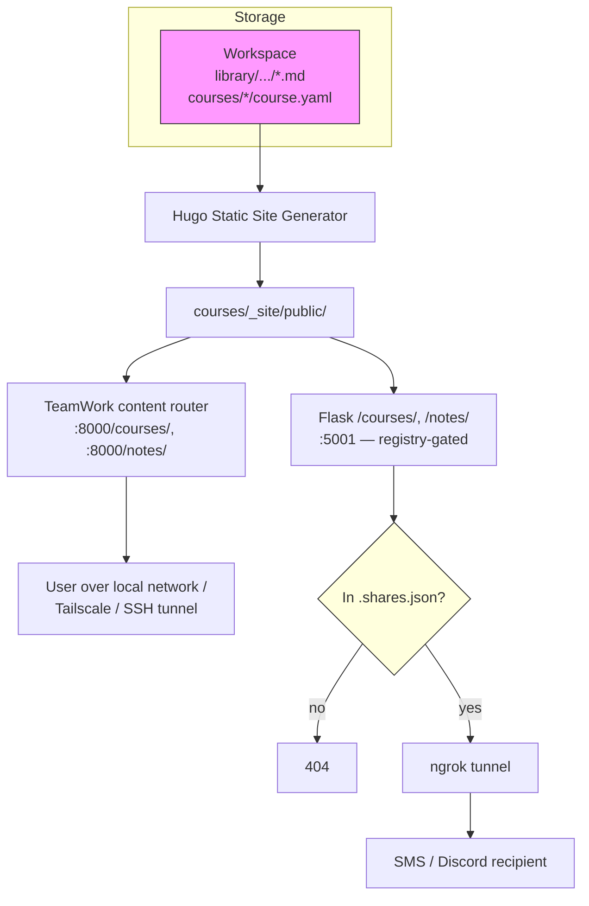

# Content Publishing

[← Infrastructure](README.md)

> **The flat notes / courses / news "Content Panel" was removed in
> Phase 3 (2026-04-08).**  The **Library** is now the single surface
> for notes, sequenced course-like notebooks, Kanban task boards,
> raw captures, and generated outputs — see [`docs/library.md`](../library.md)
> for the full design.  News briefings no longer exist as a separate
> concept; generated briefings land in `library/outputs/`.
>
> **Publishing model change (2026-04-25).**  Hugo-rendered courses and
> notes are no longer auto-exposed via the public ngrok tunnel.  They
> are served by **TeamWork** (port 8000) for local / Tailscale / SSH
> access, and only the specific pages the user explicitly opts to share
> are routed through ngrok via the gated share registry.  See "Two
> serving paths" below for the full architecture.

Prax creates and manages two types of persistent content: **notes** (stored
in the Library) and **courses** (legacy, still uses `workspace/courses/`
with its own Hugo publish flow — a future PR will refactor this to write
into the Library as sequenced notebooks).

### Content Types

| Type | Storage Path | Description |
|------|-------------|-------------|
| **Library notes** | `library/projects/{p}/notebooks/{n}/*.md` | Knowledge base pages — research, notes, references, lessons |
| **Courses (legacy)** | `courses/<id>/course.yaml` + lessons | Structured learning content with lessons and exercises |

### Two serving paths — local (default) and public (opt-in)



**Local path (always on).**  The Hugo build runs whenever Prax calls
`publish_notes()` or `course_publish()`.  The output is served by the
TeamWork content router (`teamwork/routers/content.py`) at
`http://localhost:8000/notes/<slug>/` and `/courses/<id>/`.  TeamWork is
bound to the host network only — it is **not** exposed via the ngrok
tunnel — so this path has no authentication and reach is controlled by
network position.  The user-facing URL is whatever
`TEAMWORK_BASE_URL` points to: `http://localhost:8000` by default,
`https://<host>.<tailnet>.ts.net` for Tailscale users.

**Public path (opt-in).**  When the user explicitly says "share this
publicly", `course_publish(public=True)` or `save_and_publish(public=True)`
adds an entry to `workspaces/{user}/.shares.json` (the share registry —
see [`prax/services/share_registry.py`](../../prax/services/share_registry.py)).
The Flask `/courses/<id>/` and `/notes/<slug>/` routes are
**registry-gated**: they return 404 unless the slug has an entry.  When
the registry hits, ngrok serves the page at
`https://<your-domain>.ngrok-free.app/notes/<slug>/`.  The same
registry powers per-file shares (`workspace_share_file`); use
`workspace_list_shares` to enumerate active shares and
`workspace_unshare_file` to revoke by token.

For direct browsing of notes, raw captures, outputs, tasks, and
everything else, the TeamWork **Library panel** reads the markdown via
the `/teamwork/library/*` REST API and renders it client-side — no
Hugo involved.

### Version Control

Every content operation (create, update, delete, restore) produces a git commit in the user's workspace:

```
git log --oneline -- notes/eigenvalues.md
a1b2c3d  Update note: Eigenvalues          ← user edited in TeamWork
e4f5g6h  Restore note from e4f5g6h         ← user restored old version
i7j8k9l  Update note: Eigenvalues          ← Prax updated via tool
m0n1o2p  Create note: Eigenvalues          ← Prax created via tool
```

The `note_versions()` function runs `git log --follow` on the specific file, so renames are tracked. Version retrieval uses `git show <commit>:<path>` to read the file at any point in history.

### Math Rendering

Content is rendered with `react-markdown` + `remark-math` + `rehype-katex`. Display math (`$$...$$`) and inline math (`$...$`) are supported natively. Since LLMs often generate LaTeX with `\(...\)` and `\[...\]` delimiters, the `MarkdownContent` component preprocesses content to convert these to `$`/`$$` delimiters before rendering. Code blocks are skipped during this conversion.

### Key Files

| File | Purpose |
|------|---------|
| `prax/services/note_service.py` | Note CRUD, search, Hugo generation, versioning, news briefings |
| `prax/services/course_service.py` | Course CRUD, Hugo generation, lesson management |
| `prax/blueprints/teamwork_routes.py` | Content API endpoints, webhook handler (view context + content context injection) |
| `teamwork/routers/content.py` | TeamWork proxy router for content endpoints |
| `teamwork/routers/messages.py` | Message handling — forwards `active_view` + `extra_data` to Prax webhook |
| `frontend/src/components/workspace/ContentPanel.tsx` | React content browser/editor/version viewer, reports selected item via `onContentSelect` |
| `frontend/src/components/workspace/BrowserChatSidebar.tsx` | Side chat — attaches `content_context` to messages when viewing content |
| `frontend/src/components/common/MarkdownContent.tsx` | Markdown renderer — LaTeX delimiter conversion, syntax highlighting, @mentions |
| `frontend/src/hooks/useApi.ts` | React Query hooks for content API |
