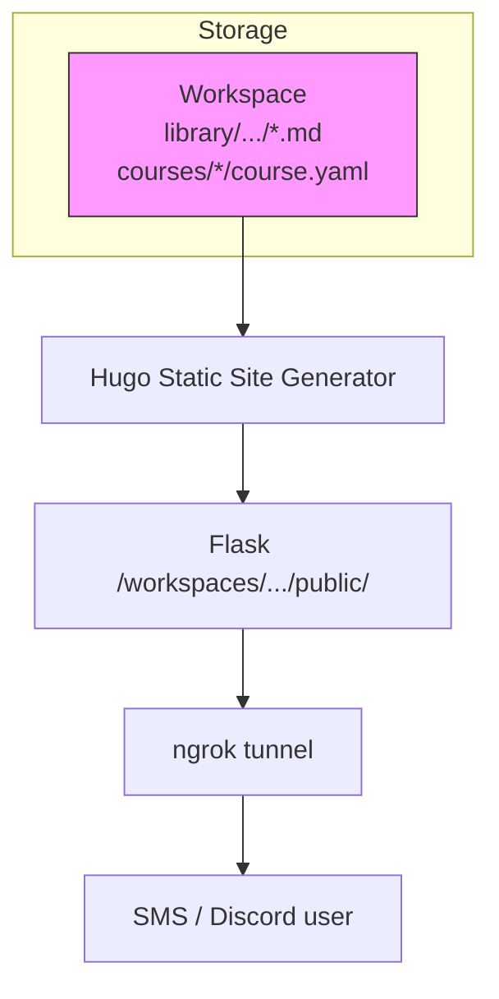

# Content Publishing

[← Infrastructure](README.md)

> **The flat notes / courses / news "Content Panel" was removed in
> Phase 3 (2026-04-08).**  The **Library** is now the single surface
> for notes, sequenced course-like notebooks, Kanban task boards,
> raw captures, and generated outputs — see [`docs/library.md`](../library.md)
> for the full design.  News briefings no longer exist as a separate
> concept; generated briefings land in `library/outputs/`.
>
> This doc remains as a reference for the **Hugo + ngrok publishing
> channel** that's still used for note pages delivered over SMS /
> Discord (the `publish_notes()` path).

Prax creates and manages two types of persistent content: **notes** (stored
in the Library) and **courses** (legacy, still uses `workspace/courses/`
with its own Hugo publish flow — a future PR will refactor this to write
into the Library as sequenced notebooks).

### Content Types

| Type | Storage Path | Description |
|------|-------------|-------------|
| **Library notes** | `library/projects/{p}/notebooks/{n}/*.md` | Knowledge base pages — research, notes, references, lessons |
| **Courses (legacy)** | `courses/<id>/course.yaml` + lessons | Structured learning content with lessons and exercises |

### Hugo + ngrok publishing channel (SMS/Discord)



When Prax calls `publish_notes()`, it generates Hugo content files, builds
the static site, and serves the HTML through Flask.  ngrok provides a public
URL.  Users on SMS/Discord receive links like `https://abc123.ngrok.io/notes/eigenvalues/`.

For direct browsing of notes, raw captures, outputs, tasks, and
everything else, the TeamWork **Library panel** reads the markdown via
the `/teamwork/library/*` REST API and renders it client-side — no
Hugo involved.

### Version Control

Every content operation (create, update, delete, restore) produces a git commit in the user's workspace:

```
git log --oneline -- notes/eigenvalues.md
a1b2c3d  Update note: Eigenvalues          ← user edited in TeamWork
e4f5g6h  Restore note from e4f5g6h         ← user restored old version
i7j8k9l  Update note: Eigenvalues          ← Prax updated via tool
m0n1o2p  Create note: Eigenvalues          ← Prax created via tool
```

The `note_versions()` function runs `git log --follow` on the specific file, so renames are tracked. Version retrieval uses `git show <commit>:<path>` to read the file at any point in history.

### Math Rendering

Content is rendered with `react-markdown` + `remark-math` + `rehype-katex`. Display math (`$$...$$`) and inline math (`$...$`) are supported natively. Since LLMs often generate LaTeX with `\(...\)` and `\[...\]` delimiters, the `MarkdownContent` component preprocesses content to convert these to `$`/`$$` delimiters before rendering. Code blocks are skipped during this conversion.

### Key Files

| File | Purpose |
|------|---------|
| `prax/services/note_service.py` | Note CRUD, search, Hugo generation, versioning, news briefings |
| `prax/services/course_service.py` | Course CRUD, Hugo generation, lesson management |
| `prax/blueprints/teamwork_routes.py` | Content API endpoints, webhook handler (view context + content context injection) |
| `teamwork/routers/content.py` | TeamWork proxy router for content endpoints |
| `teamwork/routers/messages.py` | Message handling — forwards `active_view` + `extra_data` to Prax webhook |
| `frontend/src/components/workspace/ContentPanel.tsx` | React content browser/editor/version viewer, reports selected item via `onContentSelect` |
| `frontend/src/components/workspace/BrowserChatSidebar.tsx` | Side chat — attaches `content_context` to messages when viewing content |
| `frontend/src/components/common/MarkdownContent.tsx` | Markdown renderer — LaTeX delimiter conversion, syntax highlighting, @mentions |
| `frontend/src/hooks/useApi.ts` | React Query hooks for content API |
