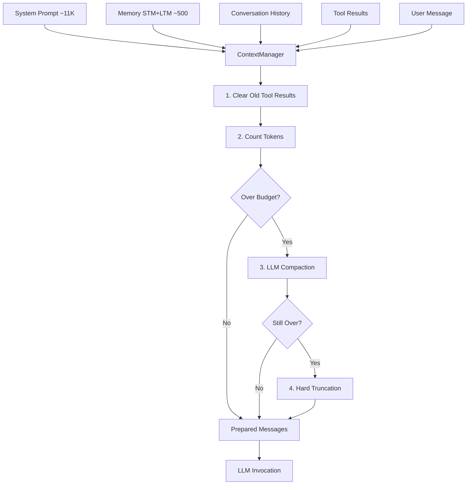

# Context Management

[← Infrastructure](README.md)

Based on strategies from [Effective Context Engineering for AI Agents](https://www.anthropic.com/engineering/effective-context-engineering-for-ai-agents) by Anthropic's Applied AI team.

Prax manages its LLM context window to prevent overflow, reduce token costs, and maintain response quality. The `ContextManager` sits between the orchestrator and the LLM, automatically budgeting, clearing, and compacting the context before every invocation.

## Why this matters

LLM context windows are finite resources. As conversations grow:
- **Context rot** — accuracy degrades as token volume increases
- **Attention dilution** — important information gets lost in noise
- **Cost escalation** — more tokens = more API spend per turn
- **Hard failures** — exceeding the window causes errors

## Architecture

```
┌──────────────────────────────────────────────────────────┐
│                     Orchestrator                         │
│                                                          │
│  System Prompt (~11K tokens)                             │
│       + Memory Context (STM + LTM, ~500 token budget)    │
│       + Workspace Context                                │
│       + Difficulty / Metacognitive Hints                  │
│       + Conversation History (unbounded without mgmt)    │
│       + Current User Message                             │
│                         │                                │
│                         ▼                                │
│           ContextManager.prepare_context()                │
│                         │                                │
│            ┌────────────┼────────────┐                   │
│            ▼            ▼            ▼                   │
│     1. Clear old   2. Count     3. Compact               │
│        tool results   tokens       or truncate           │
│        → stubs                     if over budget        │
│            │            │            │                   │
│            └────────────┼────────────┘                   │
│                         ▼                                │
│              Prepared messages (within budget)           │
│                         │                                │
│                         ▼                                │
│                   graph.invoke()                         │
└──────────────────────────────────────────────────────────┘
```



## Strategies

### 1. Token budgeting — per-model limits

Context limits are resolved from the specific model name first, not a per-tier lowest common denominator. A Claude model with 160K context gets a much larger budget than a nano model with 12K, even if both happen to be assigned to the same tier.

The orchestrator logs token usage every turn:

```
Context budget: 8432/100000 tokens (system=6200, history=2232)
```

### 2. Tool result clearing — old results to stubs

The safest, lightest-touch form of compaction. Old tool results (beyond the last 6) are replaced with stubs:

```
Before: ToolMessage(content="<3000 chars of search results>")
After:  ToolMessage(content="[Result from background_search — cleared for context efficiency]")
```

The agent's interpretation of the results (in its AIMessage response) is preserved — only the raw output is cleared. This is applied first, before any token counting or budget checks.

### 3. LLM compaction — summarize oldest half

When the conversation exceeds the budget after tool result clearing, the oldest half of turns are summarized by a cheap LLM. The summary preserves:
- Key decisions and their reasoning
- Unresolved issues or bugs
- User preferences and corrections
- File paths, URLs, and identifiers

The most recent turns are kept verbatim. This creates a natural "working memory" effect — recent context is detailed, older context is summarized.

If the LLM summarization call fails, compaction falls back to hard truncation.

### 4. Hard truncation — oldest-first, always preserve system message

If compaction still leaves the context over budget, the oldest messages are dropped one at a time. The system message is always preserved. After dropping, the message list is adjusted to ensure it starts with a valid HumanMessage (not an orphaned AIMessage or ToolMessage).

### 5. Spoke architecture — 67 to 35 tools

Context quality also depends on tool count — every tool in the system prompt costs tokens for its description, even when the agent never calls it. The spoke architecture reduces the orchestrator's tool count:

| Before | After |
|--------|-------|
| 67 tools | 35 tools |
| Every tool directly on orchestrator | 13 delegation tools + 22 essentials |
| Plugin tools on orchestrator | Plugin tools behind delegate_research |

Each spoke agent gets its own clean context window with only the tools it needs.

## Per-model context window lookup

The context manager maintains a lookup table of known models and their context budgets (with ~20% headroom reserved for the response):

| Model | Budget (tokens) |
|-------|----------------|
| **OpenAI** | |
| `gpt-5.4-nano` | 12,000 |
| `gpt-5.4-mini` | 100,000 |
| `gpt-5.4` | 100,000 |
| `gpt-5.4-pro` | 180,000 |
| `gpt-4o` | 100,000 |
| `gpt-4o-mini` | 100,000 |
| `gpt-4-turbo` | 100,000 |
| `gpt-4` | 6,000 |
| `o3-mini` | 100,000 |
| `o3` | 150,000 |
| **Anthropic** | |
| `claude-opus-4-6` | 160,000 |
| `claude-sonnet-4-6` | 160,000 |
| `claude-haiku-4-5-20251001` | 160,000 |
| `claude-3-5-sonnet-20241022` | 160,000 |
| `claude-3-haiku-20240307` | 160,000 |
| **Google** | |
| `gemini-2.0-flash` | 800,000 |
| `gemini-2.5-pro` | 800,000 |
| **DeepSeek** | |
| `deepseek-chat` | 50,000 |
| `deepseek-reasoner` | 50,000 |
| **Local / Ollama** | |
| `qwen3-8b` | 25,000 |

When a model is not in the table, `get_context_limit` tries substring matching (e.g., `claude-sonnet-4-6-20260101` matches `claude-sonnet-4-6`), then falls back to tier-based defaults:

| Tier | Fallback Budget |
|------|----------------|
| Low | 12,000 |
| Medium | 50,000 |
| High | 100,000 |
| Pro | 160,000 |

## Model override system

Users can override the orchestrator's model at runtime. The override takes precedence over the config default.

### Runtime API

```
PUT /teamwork/model
{ "model": "claude-opus-4-6" }
```

- Setting `"model": "auto"` clears the override and reverts to the config default.
- Setting `"model": null` also clears the override.

### Conversational

Users can say "switch to Claude Opus" or "use GPT-5.4-pro" in chat, and the orchestrator picks it up via the model picker tool.

### TeamWork UI

The Memory panel's Model section shows the current model and provides a dropdown to switch. The change takes effect on the next message.

### Implementation

In `orchestrator.py`:

```python
_model_override: str | None = None

def set_model_override(model: str | None) -> None:
    """Pass None or 'auto' to clear."""
    global _model_override
    if model and model.lower() == "auto":
        model = None
    _model_override = model

def get_model_override() -> str | None:
    return _model_override
```

The `ConversationAgent.__init__` resolves the effective model as:

```python
effective_model = _model_override or model or cfg.get("model")
```

## Context inspector

The TeamWork Memory panel's Context tab shows real-time context usage:

- **History messages** — number of messages in the conversation
- **History tokens** — token count of the conversation history
- **System prompt tokens** — token count of the system prompt (including memory, hints)
- **Total tokens** — combined total
- **Per-tier limits** — the budget ceilings for each tier
- **Overflow flag** — whether the context exceeded its budget

This is served by the `GET /teamwork/context/stats` endpoint.

## Token budget breakdown example

A typical turn for a `gpt-5.4-mini` (100K budget):

| Section | Tokens | Notes |
|---------|--------|-------|
| System prompt | ~11,000 | Includes tool descriptions, guidelines |
| Memory (STM + LTM) | ~500 | Retrieved memories relevant to query |
| Conversation history | ~8,000 | Previous turns (after clearing/compaction) |
| Current user message | ~200 | The new user input |
| **Total input** | **~19,700** | Well within 100K budget |
| Reserved for response | ~4,000 | Model's output tokens |

For a `gpt-5.4-nano` (12K budget), the same conversation would trigger compaction around turn 10-15, and hard truncation if the compacted summary plus recent turns still exceeds 12K.

## API

### GET /teamwork/context/stats

Returns current context usage for the user:

```json
{
  "history_messages": 42,
  "history_tokens": 8500,
  "system_prompt_tokens": 11200,
  "total_tokens": 19700,
  "limits": {
    "low": 12000,
    "medium": 50000,
    "high": 100000,
    "pro": 160000
  }
}
```

## Configuration

Context limits are defined per model in `context_manager.py` with tier-based fallbacks. The orchestrator's tier is determined by the `orchestrator` component config in `llm_routing.yaml`. The model override (if set) takes precedence over both.

## References

- [Effective Context Engineering for AI Agents](https://www.anthropic.com/engineering/effective-context-engineering-for-ai-agents) — Anthropic's Applied AI team guide (the basis for this implementation)
- [Building Effective Agents](https://www.anthropic.com/research/building-effective-agents) — Anthropic's research on agent architectures
- [context_manager.py](../../prax/agent/context_manager.py) — Implementation: token counting, tool clearing, compaction, truncation
- [orchestrator.py](../../prax/agent/orchestrator.py) — Model override system, context preparation call site
- [model_tiers.py](../../prax/agent/model_tiers.py) — Tier resolution and model selection
