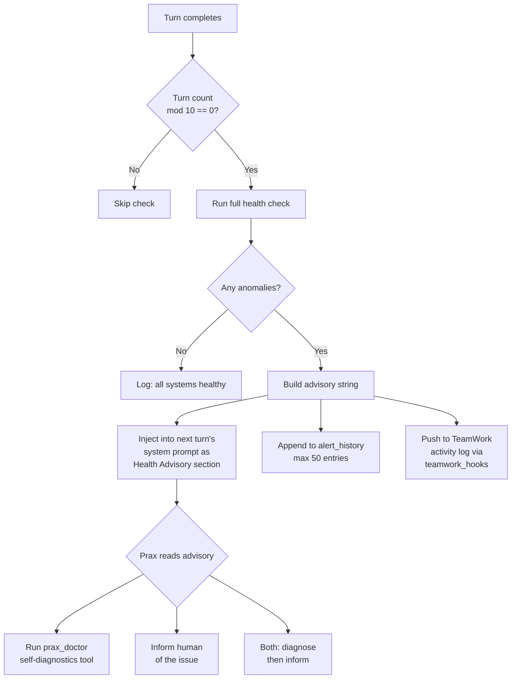
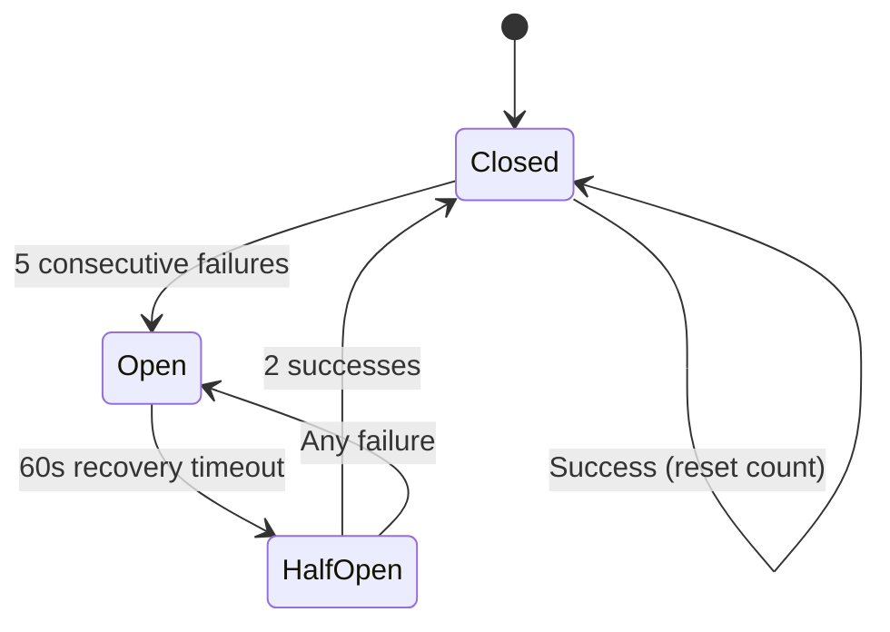

# Health Monitoring

[← Infrastructure](README.md)

Prax continuously monitors its own operational health -- tool error rates, spoke failures, context overflows, LLM provider issues, response latency, and budget consumption. When anomalies are detected, the health monitor injects advisories into the orchestrator's system context so Prax can self-repair or alert the human operator.

## Why this matters

A multi-agent system with 97+ tools has many failure modes that are invisible to the end user:

- **Silent degradation** -- a tool starts failing 20% of the time, producing partial results instead of crashing
- **Spoke cascade** -- one sub-agent's failures cause the orchestrator to retry or fall back, burning through budget
- **Context pressure** -- long conversations trigger repeated compactions, degrading answer quality
- **Provider instability** -- an LLM provider starts timing out, slowing every turn
- **Budget exhaustion** -- complex tasks exhaust tool call budgets before completing

Without health monitoring, these issues accumulate silently until the user notices degraded quality. The health monitor detects them early and gives Prax a chance to respond.

## Architecture

```
┌───────────────────────────────────────────────────────────────────────────┐
│                          Event Sources                                    │
│                                                                           │
│  governed_tool.py      orchestrator.py      spokes/_runner.py             │
│  ├─ TOOL_ERROR         ├─ TURN_COMPLETED    ├─ SPOKE_SUCCESS              │
│  ├─ BUDGET_EXHAUSTED   ├─ TURN_TIMEOUT      ├─ SPOKE_FAILURE             │
│  │                     ├─ CONTEXT_OVERFLOW   └─ CONTEXT_OVERFLOW          │
│  │                     └─ RETRY                                           │
│  │                                                                        │
│  │  context_manager.py                                                    │
│  │  └─ CONTEXT_COMPACTION                                                 │
│  │                                                                        │
│  └──────────────────────┬─────────────────────────────────────────────────┘
│                         │ record_event()
│                         ▼
│  ┌─────────────────────────────────────────┐
│  │       health_telemetry.py (Store)       │
│  │  Append-only JSONL + in-memory ring buf │
│  │  • 2000 events in memory               │
│  │  • 24h retention on disk                │
│  │  • Thread-safe, fire-and-forget writes  │
│  └─────────────┬───────────────────────────┘
│                │ get_rolling_stats()
│                ▼
│  ┌─────────────────────────────────────────┐
│  │       health_monitor.py (Watchdog)      │
│  │  • Runs every 10 turns (cheap counter)  │
│  │  • 7 subsystem checks with thresholds   │
│  │  • Produces HealthCheck result           │
│  └─────────┬──────────────┬────────────────┘
│            │              │
│            ▼              ▼
│   System prompt      TeamWork API
│   advisory inject    /teamwork/health
│   (next turn)        /teamwork/health/events
└───────────────────────────────────────────────────────────────────────────┘
```



```mermaid
flowchart TD
    GT[governed_tool.py] -->|TOOL_ERROR, BUDGET_EXHAUSTED| HT
    ORC[orchestrator.py] -->|TURN_COMPLETED, TURN_TIMEOUT, CONTEXT_OVERFLOW, RETRY| HT
    SR[spokes/_runner.py] -->|SPOKE_SUCCESS, SPOKE_FAILURE, CONTEXT_OVERFLOW| HT
    CM[context_manager.py] -->|CONTEXT_COMPACTION| HT

    HT[health_telemetry.py<br/>Append-only JSONL store]

    HT -->|get_rolling_stats| HM[health_monitor.py<br/>Anomaly detection]

    HM -->|on_turn_end| ADV{Anomalies?}
    ADV -- Yes --> SYS[Advisory injected<br/>into system prompt]
    ADV -- Yes --> TW[TeamWork activity log<br/>via teamwork_hooks]
    ADV -- No --> NOOP[No action]

    SYS --> PRAX[Prax decides:<br/>self-repair or alert human]

    API1[GET /teamwork/health] -->|get_health_status| HM
    API2[GET /teamwork/health/events] -->|get_recent_events| HT
```

## Telemetry events

Every event is a `HealthEvent` with: `category`, `severity`, `component`, `details`, `timestamp`, `latency_ms`, `tokens`, and `extra`.

| EventCategory | Value | Triggered by | Severity | Component |
|---|---|---|---|---|
| `CONTEXT_OVERFLOW` | `context_overflow` | Context exceeds model budget; orchestrator or spoke retries with compaction | WARNING | `orchestrator` or `spoke:<label>` |
| `CONTEXT_COMPACTION` | `context_compaction` | ContextManager summarizes oldest half of conversation | INFO | `context_manager` |
| `TOOL_ERROR` | `tool_error` | Any governed tool raises an exception | WARNING | Tool name (e.g., `web_search`) |
| `TOOL_SUCCESS` | `tool_success` | Governed tool completes successfully | INFO | Tool name |
| `SPOKE_FAILURE` | `spoke_failure` | A spoke sub-agent fails (exception during delegation) | WARNING | Spoke label (e.g., `browser`, `content`) |
| `SPOKE_SUCCESS` | `spoke_success` | A spoke sub-agent completes successfully | INFO | Spoke label |
| `LLM_ERROR` | `llm_error` | LLM provider returns an error (rate limit, timeout, etc.) | ERROR | Provider name |
| `TURN_COMPLETED` | `turn_completed` | Orchestrator finishes processing a user message | INFO | `orchestrator` |
| `TURN_TIMEOUT` | `turn_timeout` | Orchestrator's graph execution exceeds `agent_run_timeout` | WARNING | `orchestrator` |
| `RETRY` | `retry` | Orchestrator retries after a graph failure | WARNING | `orchestrator` |
| `BUDGET_EXHAUSTED` | `budget_exhausted` | Tool call counter exceeds `agent_max_tool_calls` budget | WARNING | `governed_tool` |

## Anomaly detection

The health monitor evaluates 7 subsystem checks against configurable thresholds. Each check produces a `SubsystemStatus` with a traffic-light status: `healthy`, `warning`, or `error`.

| Subsystem | Metric | Threshold | Triggers at | Status |
|---|---|---|---|---|
| Tool Execution | Tool error rate | `TOOL_ERROR_RATE_WARN` | >= 15% of tool calls fail | warning |
| Spoke Delegation | Spoke failure rate | `SPOKE_FAILURE_RATE_WARN` | >= 20% of delegations fail | warning |
| Context Management | Context overflows | `CONTEXT_OVERFLOW_WARN` | >= 3 overflows in window | warning |
| Context Management | Compactions | `COMPACTION_WARN` | >= 5 compactions in window | warning |
| LLM Provider | LLM errors | `LLM_ERROR_WARN` | >= 3 errors in window | **error** |
| Response Latency | Avg turn latency | `LATENCY_WARN_MS` | > 60s average (min 3 turns) | warning |
| Reliability | Timeouts | `TIMEOUT_WARN` | >= 2 timeouts in window | **error** |
| Reliability | Retries | (hardcoded) | > 5 retries in window | warning |
| Tool Budget | Budget exhaustions | (hardcoded) | >= 3 exhaustions in window | warning |

The overall status is derived from the worst subsystem:

| Worst subsystem status | Overall status |
|---|---|
| All `healthy` | **healthy** |
| Any `warning` | **degraded** |
| Any `error` | **unhealthy** |

## Subsystems monitored

### Tool Execution

Tracks the ratio of `TOOL_ERROR` to total tool calls (`TOOL_SUCCESS` + `TOOL_ERROR`) within the rolling window. A sustained error rate above 15% indicates a systemic tool issue -- a broken API key, a service outage, or a misconfigured tool.

### Spoke Delegation

Tracks the ratio of `SPOKE_FAILURE` to total spoke calls. Spoke failures are more severe than individual tool errors because each spoke invocation represents an entire sub-agent workflow. A 20% failure rate means 1 in 5 delegations is wasted.

### Context Management

Monitors two signals:
- **Context overflows** -- the conversation exceeded the model's token budget and required emergency compaction or retry. Frequent overflows suggest the conversation is too long for the current model tier.
- **Compactions** -- the context manager summarized old messages to stay within budget. Occasional compaction is normal; frequent compaction (5+/hour) means the conversation is growing faster than the model can absorb.

### LLM Provider

Counts `LLM_ERROR` events. Unlike tool errors (which are rate-based), LLM errors use an absolute count threshold because even a few LLM failures can stall the entire agent. Three or more LLM errors in an hour elevates the subsystem to `error` status.

### Response Latency

Computes average and P95 latency from `TURN_COMPLETED` events (which carry `latency_ms`). Requires at least 3 completed turns to avoid false positives from a single slow turn. Average latency above 60 seconds indicates the model or tool chain is consistently slow.

### Reliability

Combines two signals:
- **Timeouts** -- the orchestrator's graph execution exceeded the configured `agent_run_timeout`. Two or more timeouts triggers `error` status.
- **Retries** -- the orchestrator retried after a graph failure. More than 5 retries indicates persistent instability.

### Tool Budget

Counts `BUDGET_EXHAUSTED` events, which fire when the governed tool wrapper's call counter exceeds `agent_max_tool_calls`. Three or more exhaustions in an hour suggests the budget is too low for the tasks being requested, or the agent is looping.

## Escalation flow



1. **Detection**: Every 10 turns, `on_turn_end()` calls `run_health_check()` which queries rolling stats from the telemetry store.
2. **Advisory generation**: If any subsystem is degraded or unhealthy, the monitor builds a structured advisory string with severity (`WARNING` or `CRITICAL`) and a list of alerts.
3. **System prompt injection**: On the _next_ turn, the orchestrator's `_build_system_prompt` reads the last health check result. If it has alerts, they are appended as a `## Health Advisory` section in the system prompt.
4. **Agent response**: Prax sees the advisory and can choose to:
   - Run the `prax_doctor` tool for deeper self-diagnostics
   - Inform the user about the issue
   - Take corrective action (e.g., switch models, retry a failed operation)
5. **TeamWork notification**: The advisory is also pushed to TeamWork's activity log via `teamwork_hooks.log_activity()`, making it visible in the UI's activity feed.
6. **Alert history**: All alerts are stored in `_alert_history` (capped at 50 entries) and exposed via the health API.

## TeamWork UI

The Health tab in the TeamWork Observability panel provides a real-time view of Prax's operational health. It queries the health API endpoints and renders:

- **Overall status banner** -- color-coded badge showing `healthy` (green), `degraded` (yellow), or `unhealthy` (red)
- **Subsystem cards** -- one card per subsystem showing name, status, current metric value, threshold, and descriptive message
- **Rolling metrics** -- key statistics from the current window: total turns, tool calls, error rates, average latency, P95 latency
- **Recent events** -- filterable list of recent health events (by category, severity, time range)
- **Alert history** -- chronological list of past alerts with timestamps and overall status at time of alert

## API

### GET /teamwork/health

Returns the full health status: latest check result, rolling statistics, alert history, and configuration.

**Response:**

```json
{
  "check": {
    "timestamp": 1743638400.0,
    "overall": "degraded",
    "subsystems": {
      "tools": {
        "name": "Tool Execution",
        "status": "warning",
        "message": "8/40 tool calls failed (20% error rate)",
        "metric_value": 0.2,
        "threshold": 0.15
      },
      "spokes": { "..." : "..." },
      "context": { "..." : "..." },
      "llm": { "..." : "..." },
      "latency": { "..." : "..." },
      "reliability": { "..." : "..." },
      "budget": { "..." : "..." }
    },
    "alerts": [
      "8/40 tool calls failed (20% error rate)"
    ]
  },
  "stats": {
    "window_minutes": 60,
    "total_events": 142,
    "turns": 25,
    "tool_calls": 40,
    "tool_errors": 8,
    "tool_error_rate": 0.2,
    "spoke_calls": 10,
    "spoke_failures": 1,
    "spoke_failure_rate": 0.1,
    "context_overflows": 0,
    "compactions": 1,
    "retries": 2,
    "llm_errors": 0,
    "timeouts": 0,
    "budget_exhaustions": 0,
    "avg_latency_ms": 4200.5,
    "p95_latency_ms": 8100.3
  },
  "alert_history": [
    {
      "timestamp": 1743638400.0,
      "message": "8/40 tool calls failed (20% error rate)",
      "overall": "degraded"
    }
  ],
  "check_interval_turns": 10,
  "window_minutes": 60
}
```

If no check has been performed yet (or the last one is older than 5 minutes), the endpoint runs a fresh check before responding.

### GET /teamwork/health/events

Returns recent health events from the telemetry store. Supports filtering.

**Query parameters:**

| Parameter | Type | Default | Description |
|---|---|---|---|
| `minutes` | int | `60` | Look-back window in minutes |
| `category` | string | (all) | Filter by `EventCategory` value (e.g., `tool_error`) |
| `severity` | string | (all) | Filter by severity: `info`, `warning`, `error` |
| `limit` | int | `100` | Maximum number of events to return |

**Response:**

```json
{
  "events": [
    {
      "category": "tool_error",
      "severity": "warning",
      "component": "web_search",
      "details": "ConnectionError: Failed to reach search API",
      "timestamp": 1743638300.0,
      "latency_ms": 0,
      "tokens": 0,
      "extra": {}
    }
  ]
}
```

## Rollback awareness

When health degrades, the monitor checks whether Prax's code was recently modified (e.g., by a coding agent via self-improvement). If a new commit appeared in the last 30 minutes AND any subsystem is unhealthy, the monitor adds a **Recent Changes** subsystem alert:

```
Code changed 12.5min ago (fix: update search tool parsing). Health degradation may be related -- consider rollback.
```

This helps Prax correlate health issues with code changes and decide whether to `git revert` the offending commit or take other corrective action.

The rollback detection tracks the last known commit hash and compares it on each health check. The first check establishes a baseline -- it doesn't alarm on the initial commit, only on changes observed after the monitor starts.

## Enabling and disabling

The health monitor is controlled by the `HEALTH_MONITOR_ENABLED` environment variable (default: `true`).

```env
# Enable (default) -- periodic health checks, telemetry recording, anomaly detection
HEALTH_MONITOR_ENABLED=true

# Disable -- for minimal RAM / lightweight deployments
HEALTH_MONITOR_ENABLED=false
```

When disabled:
- `record_event()` is a no-op -- no telemetry is written to disk or held in memory
- `on_turn_end()` returns `None` immediately -- no health checks run
- `get_health_status()` returns `{"enabled": false}` -- the TeamWork UI shows a disabled state
- The `prax_doctor` tool reports `[OK] Health Monitor: disabled`
- Zero CPU, memory, and I/O overhead from the health system

This makes Prax suitable for lightweight deployments (e.g., single-user, local-only) where the full observability stack isn't needed.

## Configuration

| Setting | Value | Type | Description |
|---|---|---|---|
| `HEALTH_MONITOR_ENABLED` | `true` | env var | Master toggle -- disables all telemetry and checks when `false` |
| `CHECK_EVERY_N_TURNS` | `10` | code | Run a full health check every N orchestrator turns |
| `WINDOW_MINUTES` | `60` | code | Rolling look-back window for anomaly detection |
| `TOOL_ERROR_RATE_WARN` | `0.15` | code | Tool error rate threshold (15%) |
| `SPOKE_FAILURE_RATE_WARN` | `0.20` | code | Spoke failure rate threshold (20%) |
| `CONTEXT_OVERFLOW_WARN` | `3` | code | Context overflow count threshold |
| `COMPACTION_WARN` | `5` | code | Context compaction count threshold |
| `LLM_ERROR_WARN` | `3` | code | LLM error count threshold |
| `LATENCY_WARN_MS` | `60000` | code | Average response latency threshold (60s) |
| `TIMEOUT_WARN` | `2` | code | Turn timeout count threshold |

Telemetry store constants (in `health_telemetry.py`):

| Constant | Value | Description |
|---|---|---|
| `MAX_AGE_HOURS` | `24` | Events older than this are pruned on read and during `prune_old_events()` |
| `_MAX_EVENTS_IN_MEMORY` | `2000` | Maximum events kept in the in-memory ring buffer |

Alert history is capped at `_MAX_ALERT_HISTORY = 50` entries in `health_monitor.py`.

## Storage

Telemetry events are persisted to `{workspace_dir}/.health_telemetry.jsonl` -- one JSON object per line. The file is:
- **Append-only** during normal operation (fire-and-forget writes, failures are silently ignored)
- **Rewritten** only during `prune_old_events()` to remove entries older than 24 hours
- **Loaded lazily** on first access, with old events filtered out during load

The in-memory store is bounded at 2000 events. If the limit is exceeded, the oldest events are dropped (FIFO).

## Loop detection

Detects when the agent is stuck calling the same tool with the same arguments repeatedly. Implemented in `loop_detector.py`, wired into the governed tool layer.

**Escalation ladder:**

| Repeat count | Response |
|---|---|
| 1-2 | Normal execution |
| 3 (REFLECT_THRESHOLD) | Soft nudge: "you've called this N times, is the result going to be different?" |
| 5 (WARN_THRESHOLD) | Stronger: "try a DIFFERENT tool or DIFFERENT arguments" |
| 7 (BLOCK_THRESHOLD) | Hard block: "STOP calling this tool. Explain what's happening." |

**Exempt tools:** `request_extended_budget`, `plan_create`, `plan_mark_step_done`, `stm_write`, `stm_read` — these are expected to be called repeatedly.

The detector is per-turn — cleared when `drain_audit_log()` resets governance state at the end of each turn. Call signatures are SHA-256 hashes of `tool_name + sorted(args)`.

## Circuit breaker

Prevents cascade failures when an external dependency starts returning errors. Each dependency gets its own breaker with a standard state machine:



When OPEN, calls fail immediately with a descriptive error instead of hitting the dead service. Currently wired into `llm_factory.py` — if an LLM provider trips, `build_llm()` raises `ConnectionError` immediately instead of making a doomed API call.

Success/failure recording is done in the OTel LLM callbacks (`callbacks.py`), so every LLM call that completes or fails updates the breaker for that provider.

Circuit breaker states are exposed in the health API response (`circuit_breakers` field) and checked by the readiness probe.

## Liveness and readiness probes

Two separate health endpoints for Docker/Kubernetes:

| Endpoint | Purpose | Checks | Use for |
|---|---|---|---|
| `GET /healthz/live` | Is the process alive? | None (fast 200) | Docker HEALTHCHECK, K8s livenessProbe |
| `GET /healthz/ready` | Is the agent ready for work? | Circuit breakers, health monitor | K8s readinessProbe, load balancer |

The readiness probe returns 503 with a list of issues when:
- Any circuit breaker is OPEN (external dependency down)
- The health monitor reports "unhealthy" status

## Future enhancements

Based on research into production agent monitoring patterns ([VIGIL](https://arxiv.org/abs/2512.07094), [OpenTelemetry GenAI Agent Spans](https://opentelemetry.io/docs/specs/semconv/gen-ai/gen-ai-agent-spans/), [Agent Drift](https://arxiv.org/html/2601.04170v1)):

### OTel GenAI agent semantic conventions (medium priority, medium effort)

The emerging standard adds agent-specific attributes: `gen_ai.agent.name`, `gen_ai.task.kind` (planning, retrieval, execution, delegation), `gen_ai.action` spans for tool calls. Prax already has basic OTel tracing; adopting agent conventions future-proofs compatibility with Datadog, Grafana, LangSmith.

Reference: [OTel GenAI Agent Spans spec](https://opentelemetry.io/docs/specs/semconv/gen-ai/gen-ai-agent-spans/)

### Per-session cost tracking (high impact, medium effort)

Attribute token costs to sessions, users, and task types. Compute per-call cost using a model-to-price lookup. Track cumulative session cost with alerts. Agents make 3-10x more LLM calls than chatbots; without attribution, runaway sessions burn budget undetected.

### Online quality scoring (high impact, medium effort)

Lightweight LLM-as-judge scorer (nano tier) runs asynchronously after responses. Evaluates relevance, factual consistency, completeness. Alerts when rolling average drops below threshold. Closes the biggest gap: operational health != output quality.

### Dead letter queue (medium priority, low effort)

When `_invoke_with_retry` exhausts all retries, enqueue the request for later analysis instead of silently dropping it. Link to failure journal for the self-improve agent to analyze.

### Agent drift detection (high impact, high effort)

Baseline trajectories for common tasks. Compare current session fingerprints (tool sequence, token usage, success rate) against baselines. Alert on >2 sigma deviation. Daily scheduled eval against golden dataset catches silent model updates. Reference: [Agent Drift paper](https://arxiv.org/html/2601.04170v1)

### Canary/shadow deployment for prompts (medium priority, high effort)

Treat prompt changes like code deploys: shadow test (run both old and new, compare), canary rollout (5% -> 100%), automatic rollback on quality regression. Critical safety net for self-improve prompt modifications.

### VIGIL-style reflective supervisor (high impact, high effort)

Separate runtime that watches behavioral logs, classifies events (strengths, opportunities, failures), generates targeted prompt and code adaptations. The existing `metacognitive.py` is a start. Reference: [VIGIL paper](https://arxiv.org/abs/2512.07094)

## References

- [health_telemetry.py](../../prax/services/health_telemetry.py) -- Append-only event store, rolling stats, query helpers
- [health_monitor.py](../../prax/agent/health_monitor.py) -- Anomaly detection, thresholds, advisory generation, rollback awareness, API status
- [loop_detector.py](../../prax/agent/loop_detector.py) -- Tool call loop detection with escalation ladder
- [circuit_breaker.py](../../prax/agent/circuit_breaker.py) -- Per-dependency circuit breaker (Closed/Open/Half-Open)
- [governed_tool.py](../../prax/agent/governed_tool.py) -- Emits `TOOL_ERROR` and `BUDGET_EXHAUSTED`; loop detection gate
- [orchestrator.py](../../prax/agent/orchestrator.py) -- Emits `TURN_COMPLETED`, `TURN_TIMEOUT`, `CONTEXT_OVERFLOW`, `RETRY`; calls `on_turn_end()`; injects health advisory
- [llm_factory.py](../../prax/agent/llm_factory.py) -- Circuit breaker gate on LLM provider construction
- [callbacks.py](../../prax/observability/callbacks.py) -- Records circuit breaker success/failure on LLM calls
- [spokes/_runner.py](../../prax/agent/spokes/_runner.py) -- Emits `SPOKE_SUCCESS`, `SPOKE_FAILURE`, `CONTEXT_OVERFLOW`
- [context_manager.py](../../prax/agent/context_manager.py) -- Emits `CONTEXT_COMPACTION`
- [doctor.py](../../prax/agent/doctor.py) -- `prax_doctor` self-diagnostics tool; health monitor check
- [app.py](../../app.py) -- Liveness (`/healthz/live`) and readiness (`/healthz/ready`) probes
- [teamwork_routes.py](../../prax/blueprints/teamwork_routes.py) -- `/teamwork/health` and `/teamwork/health/events` endpoints
- [Context Management](context-management.md) -- Related: context budgeting, compaction, and overflow handling
- [Observability](observability.md) -- Related: OTel traces, Prometheus metrics, Grafana dashboards
