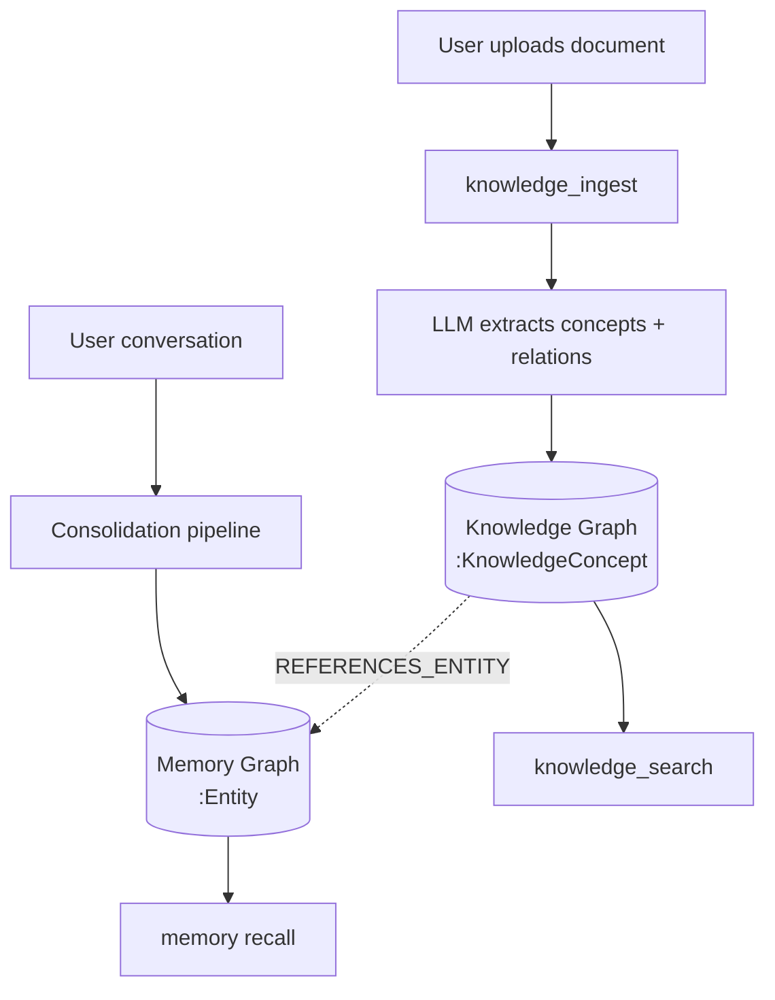

# Memory System

Prax has a two-layer, research-grounded memory system inspired by human cognition: a fast **short-term memory** (STM) for immediate context, and a scalable **long-term memory** (LTM) for durable recall across conversations.

## Table of Contents

- [Architecture Overview](#architecture-overview)
- [Concepts: Dense vs Sparse Retrieval](#concepts-dense-vs-sparse-retrieval)
- [Short-Term Memory (STM)](#short-term-memory-stm)
- [Long-Term Memory (LTM)](#long-term-memory-ltm)
  - [Vector Store (Qdrant)](#vector-store-qdrant)
  - [Knowledge Graph (Neo4j)](#knowledge-graph-neo4j)
  - [Hybrid Retrieval (RRF Fusion)](#hybrid-retrieval-rrf-fusion)
- [Knowledge Graph Namespaces](#knowledge-graph-namespaces)
- [Consolidation Pipeline](#consolidation-pipeline)
- [Memory Decay (Ebbinghaus Forgetting Curve)](#memory-decay-ebbinghaus-forgetting-curve)
- [Embedding Providers](#embedding-providers)
- [Agent Tools](#agent-tools)
- [AST Code Analysis](#ast-code-analysis)
- [Configuration Reference](#configuration-reference)
- [Deployment](#deployment)
- [Graceful Degradation](#graceful-degradation)
- [Research Foundations](#research-foundations)

---

## Architecture Overview

```
User message
    │
    ▼
Orchestrator ──→ Memory context injection (STM scratchpad + LTM recall)
    │                    │
    │              ┌─────┴──────┐
    │              │  Retrieval │
    │              │  Pipeline  │
    │              └─────┬──────┘
    │                    │
    │         ┌──────────┼──────────┐
    │         ▼          ▼          ▼
    │    Dense Search  Sparse    Graph
    │    (Qdrant)      Search   Neighbourhood
    │                  (Qdrant)  (Neo4j)
    │         │          │          │
    │         └──────────┼──────────┘
    │                    │
    │              ┌─────┴──────┐
    │              │ RRF Fusion │
    │              │ + Decay    │
    │              │ + Boost    │
    │              └─────┬──────┘
    │                    │
    │              Top-k results injected into system prompt
    │
    ▼
Memory Spoke Agent
    ├── memory_stm_write / read / delete  (STM)
    ├── memory_remember / recall / forget  (LTM Vector)
    ├── memory_entity_lookup / graph_query  (LTM Graph)
    └── memory_consolidate / stats          (Maintenance)
           │
           ▼
    Consolidation Pipeline (scheduled + manual)
    ├── LLM extraction: entities, relations, key facts
    ├── Importance scoring (0-1, "poignancy" rating)
    ├── Graph upsert (MERGE semantics, weight accumulation)
    ├── Vector upsert (dense + sparse embeddings)
    ├── Ebbinghaus decay (exponential, configurable half-life)
    └── Hierarchical summaries (daily → global)
```

The system has three independent data stores, each serving a different recall pattern:

| Store | Technology | What it's good at |
|-------|-----------|-------------------|
| STM scratchpad | Workspace JSON file | Fast key-value notes, always available, no infra |
| Vector store | Qdrant | "Find memories similar to X" — semantic similarity |
| Knowledge graph | Neo4j | "How are X and Y related?" — structured traversal |

At retrieval time, all three are queried and their results are fused.

---

## Concepts: Dense vs Sparse Retrieval

Understanding the two types of vector search is key to understanding why the memory system uses both.

### Dense Retrieval (Semantic Embeddings)

A **dense embedding** is a fixed-length numerical vector (e.g., 1536 floating-point numbers for OpenAI's `text-embedding-3-small`) that captures the *meaning* of a text. Every dimension carries information — hence "dense" (no zeros).

**How it works:**
1. The text "I prefer dark mode" is passed to an embedding model
2. The model outputs a vector like `[0.023, -0.041, 0.087, ...]` (1536 dimensions)
3. Semantically similar texts produce vectors that are close together in this high-dimensional space
4. At search time, the query is embedded and the nearest vectors are returned (cosine similarity)

**Strengths:**
- Understands paraphrase: "dark theme" matches "dark mode"
- Understands semantic relationships: "Python" matches "programming language"
- Robust to word order and phrasing variations

**Weaknesses:**
- Opaque — you can't inspect why two vectors are similar
- Struggles with exact matches: searching for "error code E-4012" may match any error code
- Rare words, names, and identifiers can be lost in the embedding

**In Prax:** Dense embeddings are generated by OpenAI's `text-embedding-3-small` (1536-dim) by default, or locally via `fastembed` / Ollama when configured for offline use.

### Sparse Retrieval (TF-IDF / BM25)

A **sparse vector** represents text as a bag of weighted terms. Most dimensions are zero (hence "sparse") — only the terms present in the text have non-zero values.

**TF-IDF** stands for **Term Frequency–Inverse Document Frequency**:

- **Term Frequency (TF):** How often a word appears in this document. More occurrences → higher weight. Typically normalised: `TF = 0.5 + 0.5 × (count / max_count)` (augmented TF, prevents bias toward long documents).

- **Inverse Document Frequency (IDF):** How rare a word is across all documents. The word "the" appears everywhere (low IDF); the word "eigenvalue" appears rarely (high IDF). `IDF = log(N / df)` where `N` is total documents and `df` is the number containing the term.

- **TF-IDF = TF × IDF.** Common words get low scores, rare-but-present words get high scores.

**BM25** is a refined version of TF-IDF used in production search engines (Elasticsearch, Lucene). It adds document length normalisation and saturation (diminishing returns for repeated terms).

**How sparse vectors work in Prax:**
1. Text is tokenised into words, stop words removed
2. Each word is hashed to a stable index (integer)
3. TF weight is computed (augmented TF, log-scaled)
4. The result is a sparse vector: `{word_hash: weight, ...}`
5. At search time, the query is encoded the same way and matched against stored sparse vectors

**Strengths:**
- Exact keyword matching: "E-4012" matches exactly
- Transparent — you can see which terms matched
- No ML model required — pure computation

**Weaknesses:**
- No semantic understanding: "dark theme" does NOT match "dark mode"
- Sensitive to word choice and phrasing
- No concept of meaning beyond word overlap

### Why Both? (Hybrid Search)

Neither dense nor sparse retrieval is strictly better — they're complementary:

| Query type | Dense wins | Sparse wins |
|-----------|-----------|------------|
| "What did we discuss about machine learning?" | Matches "ML", "AI models", "neural networks" | Matches only if "machine learning" appears literally |
| "Error code E-4012" | May match random error codes | Exact match on "E-4012" |
| "The user's timezone preference" | Matches "they're in EST" | Matches only if "timezone" appears |

Prax runs both searches in parallel and fuses the ranked results using **Reciprocal Rank Fusion (RRF)** — see below.

### References

- Karpukhin et al., "Dense Passage Retrieval for Open-Domain Question Answering" (EMNLP 2020). [arXiv:2004.04906](https://arxiv.org/abs/2004.04906). Demonstrated that dense retrieval substantially outperforms BM25 for passage retrieval (9-19% absolute improvement in top-20 accuracy).
- Robertson & Zaragoza, "The Probabilistic Relevance Framework: BM25 and Beyond" (Foundations and Trends in IR, 2009). Formal treatment of BM25 as a probabilistic ranking model.
- Salton & Buckley, "Term-weighting approaches in automatic text retrieval" (Information Processing & Management, 1988). Original TF-IDF framework.

---

## Short-Term Memory (STM)

Per-user scratchpad stored as workspace JSON files at `{workspace}/memory/stm.json`. **No external infrastructure required** — STM works even without the memory Docker profile.

### How it works

- **Key-value entries** with importance scores (0-1) and tags
- **Upsert semantics:** writing to an existing key updates content and increments access count (reinforcement)
- **LLM compaction:** when entry count exceeds `MEMORY_STM_MAX_ENTRIES` (default 50), the oldest half is summarised by an LLM into a single compacted entry
- **Automatic injection:** STM entries are injected into the orchestrator's system prompt as "Working Memory (Scratchpad)"

### Data format

```json
[
  {
    "key": "user_timezone",
    "content": "America/New_York (EST/EDT)",
    "tags": ["preference"],
    "created_at": "2026-03-15T14:30:00Z",
    "access_count": 3,
    "importance": 0.8
  }
]
```

### When to use STM vs LTM

| Use STM for | Use LTM for |
|-------------|-------------|
| Current session context | Durable facts across conversations |
| Temporary working notes | User preferences and personality |
| Quick key-value lookups | Semantic search ("what do I know about X?") |
| Always-on (no infra) | Requires Qdrant + Neo4j |

---

## Long-Term Memory (LTM)

Requires `MEMORY_ENABLED=true` and the memory Docker profile (`docker compose --profile memory up`).

### Vector Store (Qdrant)

Qdrant stores memory chunks with both dense and sparse embeddings, enabling hybrid search.

**Collection schema:**

| Field | Type | Description |
|-------|------|-------------|
| `dense` | Vector (1536-dim) | Semantic embedding (text-embedding-3-small or local) |
| `sparse` | Sparse vector | TF-IDF sparse encoding for keyword matching |
| `user_id` | Keyword (indexed) | Mandatory filter — all queries scoped to user |
| `content` | Text | Original memory text |
| `source` | Keyword | "conversation", "note", "consolidation" |
| `importance` | Float | 0-1, decays over time, boosted on access |
| `created_at` | Datetime | When the memory was stored |
| `last_accessed` | Datetime | Last retrieval (for decay calculation) |
| `access_count` | Integer | Retrieval count (reinforcement metric) |
| `tags` | Keyword[] | User-defined tags |
| `entity_ids` | Keyword[] | Cross-references to graph entities |
| `summary_level` | Keyword | "raw", "daily", "weekly", "global" |

**Operations:**
- `upsert_memory` — store a chunk with dense + sparse vectors
- `search_dense` — cosine similarity search on dense vectors
- `search_sparse` — keyword search on sparse vectors
- `reinforce_memory` — bump access count and timestamp on retrieval
- `decay_memories` — apply Ebbinghaus decay, prune below threshold

### Knowledge Graph (Neo4j)

Neo4j stores entities and typed relations for structured memory.

**Multi-graph model** (three orthogonal layers, inspired by MAGMA, Jiang et al. 2026):

```
── Entity Graph (who/what) ──

(:Entity {
  id: UUID,
  user_id: string,        ← mandatory, all queries scoped
  name: string,           ← canonical (lowercased)
  display_name: string,   ← original casing
  type: string,           ← person | topic | project | tool | url | concept | organization
  importance: float,      ← 0-1, decays over time
  mention_count: integer,
  first_seen: datetime,
  last_seen: datetime,
  properties: map
})

-[:RELATES_TO {
  type: string,           ← works_on | interested_in | prefers | related_to | part_of | caused_by | mentioned_with
  weight: float,          ← accumulates on each mention
  first_seen: datetime,
  last_seen: datetime,
  evidence: string,       ← brief reason, semicolon-separated
  valid_from: datetime,   ← bi-temporal: when the fact became true
  valid_until: datetime   ← bi-temporal: when superseded (null = currently valid)
}]->

── Temporal Graph (when) ──

(:TemporalEvent {
  id: UUID,
  user_id: string,
  description: string,
  occurred_at: datetime,
  importance: float,
  created_at: datetime
})

(:Entity)-[:PARTICIPATED_IN]->(:TemporalEvent)

── Causal Graph (why) ──

(:CausalLink {
  id: UUID,
  user_id: string,
  cause: string,
  effect: string,
  importance: float,
  created_at: datetime
})

(:Entity)-[:CAUSED_BY {direction: 'cause'}]->(:CausalLink)
(:CausalLink)-[:CAUSED_BY {direction: 'effect'}]->(:Entity)
```

**Bi-temporal edges** (inspired by Rasmussen et al., "Zep" 2025): Every RELATES_TO edge carries `valid_from` (when the fact became true) and `valid_until` (when it was superseded). `valid_until = null` means "currently valid". When consolidation detects a contradiction (e.g., "user now prefers light mode"), the old "prefers dark mode" edge gets `valid_until` set rather than deleted — preserving history while keeping retrieval current.

**Operations:**
- `merge_entity` — upsert with MERGE semantics (increment mention_count on match)
- `add_relation` — create or strengthen a typed edge (weight accumulates, bi-temporal)
- `supersede_relation` — mark an edge as no longer current (sets `valid_until`)
- `merge_temporal_event` — create a TemporalEvent and link participating entities
- `add_causal_link` — create a CausalLink connecting cause and effect entities
- `get_entity` — look up entity + all its current relations (filter superseded by default)
- `get_neighbours` — k-hop traversal for associative recall
- `search_entities` — substring search on entity names
- `decay_graph` — apply exponential decay to importance/weight, prune weak nodes/edges

### Hybrid Retrieval (RRF Fusion)

At query time, three retrieval arms run and their results are fused:

**Step 1: Classify query intent**

A lightweight heuristic (no LLM call) classifies the query to determine retrieval arm weights:

| Signal | Example | Dense | Sparse | Graph |
|--------|---------|-------|--------|-------|
| Quoted phrases / identifiers | `"error E-4012"` | 0.8× | 1.5× | 1.3× |
| Named entities (capitalised) | `How are Alice and Bob related?` | 1.0× | 1.2× | 1.4× |
| Open-ended / semantic | `How do you feel about the approach?` | 1.4× | 0.9× | 1.0× |
| Neutral | `memory test` | 1.0× | 1.0× | 1.0× |

Inspired by type-specific weighted RRF (arXiv:2511.18194) — different query types benefit from different retrieval strategies.

**Step 2: Generate query representations**
- Dense: embed query with same model used for storage
- Sparse: TF-IDF encode query

**Step 3: Parallel retrieval**
- Dense vector search (Qdrant, top 2k)
- Sparse keyword search (Qdrant, top 2k)
- Graph neighbourhood search:
  1. Extract key noun phrases from query
  2. Find matching entities in graph
  3. Traverse 1-2 hops to find related entities
  4. Fetch associated memories from vector store via `entity_ids`

**Step 4: Weighted Reciprocal Rank Fusion (RRF)**

For each candidate appearing in any list:

```
rrf_score = Σ weight_i / (k + rank_i)  for each list where candidate appears
```

where `k = 60` (standard constant from Cormack et al., 2009) and `weight_i` comes from query classification (Step 1). Equal weights reduce to standard RRF.

**Step 5: Post-processing**
- **Time decay:** `score *= exp(-λ × days_old)` where `λ = ln(2) / halflife`
- **Importance boost:** `score *= (0.5 + importance)` — higher importance gets up to 1.5× boost
- **Re-sort** and take top-k

**Step 6: Reinforcement**
- Returned memories get their `access_count` and `interaction_epoch` updated
- This implements the "strengthen on recall" pattern (MemoryBank, Zhong et al., 2023)

---

## Knowledge Graph Namespaces

The Neo4j instance contains two logically separate graph spaces:

```
Same Neo4j Instance
├── Memory Graph (existing)              ← about the USER
│   ├── (:Entity)                        ← people, topics, projects from conversations
│   ├── (:TemporalEvent)                 ← time-stamped events
│   ├── (:CausalLink)                    ← cause/effect relationships
│   └── [:RELATES_TO, :PARTICIPATED_IN]  ← memory relationships
│
└── Knowledge Graph (new)                ← about the WORLD
    ├── (:KnowledgeConcept)              ← concepts from documents/papers/code
    ├── (:KnowledgeDocument)             ← source documents
    ├── [:KNOWLEDGE_RELATES]             ← concept-to-concept relations
    ├── [:EXTRACTED_FROM]                 ← document-to-concept provenance
    └── [:REFERENCES_ENTITY]             ← cross-namespace links to memory
```

### Why separate namespaces?

If document concepts were stored as regular `(:Entity)` nodes, a user who uploads 50 papers would have their conversational memory flooded with thousands of extracted entities. "What do I know about Alice?" would return paper concepts alongside actual user facts. Separate labels ensure:

- **Memory queries** (`(:Entity)`) return only conversational facts — fast and focused
- **Knowledge queries** (`(:KnowledgeConcept)`) return only document-extracted concepts
- **Cross-links** (`[:REFERENCES_ENTITY]`) connect the two when genuinely relevant

### Namespaces within the knowledge graph

Each `KnowledgeConcept` has a `namespace` field that organizes knowledge by source:

| Namespace | Contents | Created by |
|-----------|----------|-----------|
| `papers` | Academic papers, research articles | `knowledge_ingest` on PDFs |
| `docs` | Documentation, guides, READMEs | `knowledge_ingest` on markdown |
| `codebase` | Code structure, modules, APIs | AST tools or `knowledge_ingest` on code |
| `uploads` | User-uploaded files | `knowledge_ingest` on workspace files |
| Custom | User-defined | `knowledge_ingest(namespace="...")` |

### Tools

| Tool | What it does |
|------|-------------|
| `knowledge_ingest` | Extract concepts and relations from a document using LLM, store in namespace |
| `knowledge_search` | Search concepts across namespaces (or within a specific one) |
| `knowledge_namespaces` | List all namespaces with concept counts — helps Prax know what's available |
| `knowledge_connect` | Link a knowledge concept to a memory entity (cross-namespace) |

### Query patterns

```
"What does that paper say about attention?" → knowledge graph (namespace: papers)
"What do I know about Alice?"               → memory graph (Entity nodes)
"Connect my notes with what the research says" → cross-namespace join via REFERENCES_ENTITY
```

### Data flow



### Implementation

- Same Neo4j driver as the memory graph (shared connection pool)
- Separate indexes on `(:KnowledgeConcept {user_id, namespace, name})`
- All queries filter by `user_id` (multi-tenant isolation maintained)
- `ingest_document()` uses a low-tier LLM to extract concepts — keeps costs down
- `delete_namespace()` cleans up all concepts/relations in a namespace

See [knowledge_graph.py](../../prax/services/memory/knowledge_graph.py) and [knowledge_tools.py](../../prax/agent/knowledge_tools.py).

---

## Consolidation Pipeline

Converts episodic conversation traces into durable memories.

### Triggers

| Trigger | When |
|---------|------|
| **Auto (per-turn)** | Orchestrator calls `maybe_consolidate(user_id)` after every turn; runs the full pipeline once every 5 turns per user |
| **Scheduled** | Every `MEMORY_CONSOLIDATION_INTERVAL` seconds (default: 3600 = 1 hour) — _historical, prefer the per-turn auto trigger_ |
| **Manual** | Agent calls `memory_consolidate` tool |

> **History note:** Before April 2026, consolidation was documented as "scheduled" but never actually wired up — the function existed but had no callers, so memory stayed empty even though the infrastructure was in place. This was fixed by adding a per-turn auto-consolidation hook in `prax/services/memory_service.py:maybe_consolidate()` invoked from the orchestrator's turn-end block. Frequency is bounded by `_CONSOLIDATE_EVERY_N_TURNS = 5` to amortize the LLM extraction cost.

### Pipeline steps

```
 1. Read unconsolidated trace entries from {workspace}/trace.log
    └── Track position in {workspace}/memory/consolidation_state.json

 2. LLM extraction (tier: low, temp: 0.2)
    ├── Entities: {name, type, display_name, importance, confidence}
    ├── Relations: {source, type, target, weight, evidence, confidence, valid_from, supersedes}
    ├── Facts: {content, importance, confidence}
    ├── Temporal events: {description, occurred_at, importance, participants}
    └── Causal links: {cause, effect, cause_entities, effect_entities, importance}

 3. Validation gate (confidence ≥ 0.6)
    ├── High-confidence → proceed to LTM upsert
    └── Low-confidence → STM "pending_review" queue (human validation)

 4. Entity graph upsert
    ├── MERGE entities (increment mention_count on match)
    └── MERGE relations (accumulate weight, bi-temporal edges)
        └── If supersedes: set valid_until on old edge

 5. Temporal + causal graph upsert
    ├── Create TemporalEvent nodes, link participants
    └── Create CausalLink nodes, link cause/effect entities

 6. Vector upsert (high-confidence facts only)
    ├── Chunk facts into memory units
    ├── Generate dense + sparse embeddings
    └── Store with entity cross-references + interaction_epoch

 7. Dual decay pass
    ├── Time decay: importance *= exp(-λ_t × days_since_access)
    ├── Interaction decay: importance *= exp(-λ_i × interactions_since_access)
    ├── Effective decay = min(time_factor, interaction_factor)
    ├── Graph: importance/weight *= exp(-λ × days_since_access)
    └── Prune memories below threshold (0.02)

 8. Daily summary (if new day boundary)
    ├── Summarise today's memories (3-5 sentences)
    └── Store summary as a "daily" level memory

 9. Low-confidence items → STM pending review

10. Update consolidation state
```

### Importance scoring

The LLM rates each extracted fact on a 0-1 scale:

| Score | Meaning | Examples |
|-------|---------|----------|
| 0.8-1.0 | Critical — core preferences, key decisions | "I'm allergic to shellfish", "We decided to use Rust" |
| 0.4-0.7 | Useful — recurring topics, context | "Working on project Alpha", "Interested in quantum computing" |
| 0.1-0.3 | Minor — tangential mentions | "Mentioned having coffee", "Asked about the weather" |

---

## Memory Decay (Dual: Time + Interaction)

Memory importance decays via **two independent signals**, taking the stronger one. This is inspired by the Ebbinghaus forgetting curve (MemoryBank, Zhong et al. 2023) extended with interaction-based decay (FOREVER, arXiv:2601.03938).

### Time-based decay (Ebbinghaus)

```
time_factor = exp(-λ_t × days_since_last_access)
where λ_t = ln(2) / MEMORY_DECAY_HALFLIFE_DAYS
```

With the default half-life of 7 days:
- After 7 days without access: importance halves (0.8 → 0.4)
- After 14 days: quarters (0.8 → 0.2)
- After 21 days: eighths (0.8 → 0.1)

### Interaction-based decay

```
interaction_factor = exp(-λ_i × interactions_since_last_access)
where λ_i = ln(2) / HALFLIFE_INTERACTIONS  (default: 100 interactions)
```

A user who chats daily and one who chats weekly should have different effective decay rates. Interaction-based decay measures "how much has happened since this memory was last relevant?" rather than just clock time.

### Effective decay

```
effective_importance = importance × min(time_factor, interaction_factor)
```

The stronger decay signal wins. This handles both:
- **"Gone for a week"** — time-based decay kicks in even with zero interactions
- **"100 conversations but never mentioned X"** — interaction-based decay catches memories that are technically recent but irrelevant

Below 0.02: memory is pruned.

**Reinforcement:** Accessing a memory resets both its `last_accessed` timestamp and `interaction_epoch`, restarting both decay clocks. Frequently recalled memories persist; unused ones fade — just like human memory.

**Graph decay** uses a 2× longer half-life (14 days default) since entity relationships are more stable than episodic memories.

---

## Embedding Providers

The memory system supports multiple embedding backends for dense vectors. Your choice depends on your priorities: quality, privacy, cost, and infrastructure.

### Comparison

| | **OpenAI** | **Ollama** | **fastembed (local)** |
|---|---|---|---|
| **Model** | `text-embedding-3-small` | `nomic-embed-text` (or others) | `BAAI/bge-small-en-v1.5` |
| **Dimensions** | 1536 | 768 | 384 |
| **Quality (MTEB avg)** | ~62% | ~56-60% | ~51% |
| **Latency** | ~50ms/batch (network) | ~20ms/batch (local GPU/CPU) | ~100ms/batch (CPU) |
| **Cost** | $0.02/1M tokens | Free (your hardware) | Free (in-process) |
| **Privacy** | Data sent to OpenAI | Fully local | Fully local |
| **Infrastructure** | None (API call) | Ollama server | None (Python library) |
| **GPU needed?** | No | Recommended but not required | No |

**Which should you choose?**

- **OpenAI** — Best quality, lowest friction. Use this if you're already using OpenAI for LLM calls and don't have strict data privacy requirements. The embedding data sent is just the text being stored/queried — not conversation history.

- **Ollama** — Best balance of quality and privacy. Use this if you want no data leaving your machine, have a reasonably capable CPU (or GPU), and don't mind running one more service. `nomic-embed-text` is the recommended model — it's small, fast, and punches above its weight on retrieval benchmarks. With Docker Compose (`--profile ollama`), setup is one command.

- **fastembed (local)** — Zero-dependency fallback. Use this if you want the absolute simplest setup or as an automatic fallback when other providers fail. Quality is lower (384-dim vs 1536-dim means less semantic resolution), but for a personal assistant's memory the difference is often acceptable.

**Important:** Once you choose a provider, stick with it for a given Qdrant collection. Changing providers changes the vector dimensions, which requires re-embedding all stored memories. If you need to switch, delete the `prax_memories` collection in Qdrant first (memories from the current session's consolidation will repopulate it).

### OpenAI (default)

Uses `text-embedding-3-small` (1536 dimensions). Requires `OPENAI_KEY` set.

```env
EMBEDDING_PROVIDER=openai
EMBEDDING_MODEL=text-embedding-3-small
```

### Ollama (local, offline)

For users running local models who don't want to send data to OpenAI. Uses Ollama's `/api/embed` endpoint. Requires Ollama running with an embedding model pulled.

```bash
# Docker Compose (recommended)
docker compose --profile memory --profile ollama up --build
docker compose exec ollama ollama pull nomic-embed-text

# Or standalone Ollama (if already installed)
ollama pull nomic-embed-text
```

```env
EMBEDDING_PROVIDER=ollama
EMBEDDING_MODEL=nomic-embed-text
OLLAMA_BASE_URL=http://localhost:11434   # or http://ollama:11434 in Docker
```

Other good Ollama embedding models: `mxbai-embed-large` (1024-dim, higher quality), `all-minilm` (384-dim, very fast).

### Sentence Transformers / fastembed (local, fallback)

Lightweight local embeddings via the `fastembed` library. Uses `BAAI/bge-small-en-v1.5` (384 dimensions). No external service needed — runs in-process. Also serves as the automatic fallback if the primary provider fails.

```env
EMBEDDING_PROVIDER=local
```

The vector store automatically adapts its collection dimensions to match the embedding model.

### Sparse vectors

Sparse vectors are always generated locally (no API call) using TF-IDF encoding. This is a pure computation step independent of the dense embedding provider — no matter which dense provider you choose, sparse vectors are always free and instant.

---

## Agent Tools

The memory spoke provides 10 tools via `delegate_memory`:

| Tool | Type | Description |
|------|------|-------------|
| `memory_stm_write` | STM | Write key-value entry to scratchpad |
| `memory_stm_read` | STM | Read scratchpad entries (all or by key) |
| `memory_stm_delete` | STM | Remove a scratchpad entry |
| `memory_remember` | LTM | Store a fact with dense + sparse embeddings |
| `memory_recall` | LTM | Semantic search across all memories (hybrid) |
| `memory_forget` | LTM | Delete a specific memory by ID |
| `memory_entity_lookup` | Graph | Look up entity + all relationships |
| `memory_graph_query` | Graph | Natural language query over the knowledge graph |
| `memory_consolidate` | Maint | Trigger consolidation pipeline |
| `memory_stats` | Maint | Show memory system statistics |

### Example interactions

**Storing a preference:**
> "Remember that I prefer dark mode in all my tools"
> → `memory_remember("User prefers dark mode in all tools", importance=0.8, tags="preference,ui")`

**Semantic recall:**
> "What do you know about my coding preferences?"
> → `memory_recall("coding preferences")` → returns stored preferences about dark mode, Python, etc.

**Entity lookup:**
> "What do you know about Project Alpha?"
> → `memory_entity_lookup("Project Alpha")` → returns entity + all relations (team members, technologies, dependencies)

**Graph query:**
> "How are quantum computing and my research project connected?"
> → `memory_graph_query("quantum computing research project connection")`

---

## Configuration Reference

| Variable | Default | Description |
|----------|---------|-------------|
| `MEMORY_ENABLED` | `false` | Enable LTM (requires Qdrant + Neo4j) |
| `QDRANT_URL` | `http://localhost:6333` | Qdrant vector store endpoint |
| `NEO4J_URI` | `bolt://localhost:7687` | Neo4j graph database endpoint |
| `NEO4J_USER` | `neo4j` | Neo4j username |
| `NEO4J_PASSWORD` | `prax-memory` | Neo4j password |
| `EMBEDDING_MODEL` | `text-embedding-3-small` | Embedding model name |
| `EMBEDDING_PROVIDER` | `openai` | Embedding provider: `openai`, `ollama`, or `local` |
| `OLLAMA_BASE_URL` | `http://localhost:11434` | Ollama endpoint (when provider=ollama) |
| `MEMORY_CONSOLIDATION_INTERVAL` | `3600` | Seconds between auto-consolidation runs |
| `MEMORY_STM_MAX_ENTRIES` | `50` | Max STM entries before LLM compaction |
| `MEMORY_DECAY_HALFLIFE_DAYS` | `7.0` | Ebbinghaus decay half-life in days |

LLM routing for memory components is configured in `prax/plugins/configs/llm_routing.yaml`:

```yaml
components:
  subagent_memory:       # Memory spoke agent
    tier: low
    temperature: 0.3
  memory_consolidation:  # Entity/relation extraction + summaries
    tier: low
    temperature: 0.2
  memory_compact:        # STM compaction summarisation
    tier: low
    temperature: 0.2
```

---

## Deployment

### Docker Compose (recommended)

```bash
# Core services + memory infrastructure
docker compose --profile memory up --build

# With observability too
docker compose --profile memory --profile observability up --build
```

This starts Qdrant (port 6333) and Neo4j (port 7474/7687) alongside the core services. Set `MEMORY_ENABLED=true` in `.env`.

### Neo4j Browser

Open [http://localhost:7474](http://localhost:7474) to explore the knowledge graph visually. Login with `neo4j` / `prax-memory` (or your configured password).

Useful Cypher queries:

```cypher
-- All entities for a user
MATCH (e:Entity {user_id: 'usr_abc123'})
RETURN e ORDER BY e.mention_count DESC

-- Entity relationship map
MATCH (e:Entity {user_id: 'usr_abc123'})-[r:RELATES_TO]-(other)
RETURN e, r, other

-- Most connected entities
MATCH (e:Entity {user_id: 'usr_abc123'})-[r:RELATES_TO]-()
RETURN e.display_name, e.type, count(r) AS connections
ORDER BY connections DESC
```

### Qdrant Dashboard

Open [http://localhost:6333/dashboard](http://localhost:6333/dashboard) to explore stored memories, view collection stats, and run test queries.

---

## Test Evidence

End-to-end integration tests exercise the full memory stack with real Qdrant, Neo4j, and Ollama — no mocks.  Run with `uv run pytest tests/e2e/test_memory.py -v -s`.

### Test Suite

| Test Class | Tests | Coverage |
|---|---|---|
| `TestSTM` | 2 | Write/read/delete/update + tags |
| `TestLTM` | 3 | Store + semantic recall, ranking correctness, hybrid vs dense-only |
| `TestGraphStore` | 4 | Entity lifecycle, bi-temporal edges, temporal events, causal links |
| `TestMemoryServiceIntegration` | 1 | Full remember→recall through MemoryService facade |
| `TestMemoryContextInjection` | 3 | Empty context without memory, enriched context with memory, side-by-side comparison |
| `TestInteractionDecay` | 2 | Epoch counter increment via Qdrant |
| `TestFullPipeline` | 1 | Realistic multi-turn session: STM + LTM + graph + memory context |

### Sample Output: With vs Without Memory

The `test_with_vs_without_memory_comparison` test stores user preferences, then shows the context the agent receives:

**WITHOUT memory** — agent has no personal context:

```
(empty)
```

**WITH memory** — 4 facts recalled and injected into the system prompt:

```
## Relevant Memories
- [conversation, 2026-04-02] User prefers Rust for systems projects and Python for scripts.
- [conversation, 2026-04-02] User uses NixOS with flake-based project templates.
- [conversation, 2026-04-02] User insists on MIT license for all personal projects.
- [conversation, 2026-04-02] User's preferred editor is Helix with catppuccin theme.
```

With memory, an agent asked "Can you help me set up a new project?" now knows the user wants Rust + NixOS flakes + MIT license + Helix — and can scaffold accordingly.

### Sample Output: Full Pipeline

The `test_realistic_user_session` test simulates a multi-turn conversation building up STM, LTM, and graph layers, then retrieves context for a follow-up question:

```
## Working Memory (Scratchpad)
- **user_role**: data scientist at FinCorp
- **current_project**: fraud detection model using XGBoost

## Relevant Memories
- [conversation, 2026-04-02] User is a data scientist at FinCorp working on fraud detection with XGBoost.
- [conversation, 2026-04-02] User prefers polars over pandas for large datasets because of performance.
```

The agent now knows the user is a data scientist at FinCorp using XGBoost for fraud detection and prefers polars — personalized answers to "optimize my data pipeline" become possible.

---

## Graceful Degradation

The memory system follows Prax's pattern of graceful degradation:

| Condition | Behaviour |
|-----------|-----------|
| `MEMORY_ENABLED=false` | STM works normally. LTM tools return "Memory system not available." |
| Qdrant unreachable | Vector operations log warnings and return empty results |
| Neo4j unreachable | Graph operations log warnings and return empty results |
| Embedding API fails | Falls back to local fastembed, then to zero vectors |
| LLM consolidation fails | Logs warning, skips consolidation run |
| Memory profile not started | Prax starts normally, memory context injection returns empty |

No crashes, no retries, no memory accumulation from failed connections.

---

## Pipeline Coverage Telemetry

Phase 0 of the [pipeline evolution roadmap](../PIPELINE_EVOLUTION_TODO.md) instruments every orchestrator turn so we can measure where the existing spoke library actually fails. The data feeds a Pareto chart that tells us whether to build the L1 dynamic escape hatch or just add more spokes.

### Storage and restart robustness

| Aspect | Detail |
|---|---|
| **On-disk file** | `{workspace_dir}/.pipeline_coverage.jsonl` — append-only JSONL, ~250 bytes per event |
| **In-memory ring buffer** | Bounded at 5000 events for fast clustering during the session |
| **Embeddings on disk** | **Not persisted** — stripped on write to keep the file ~60× smaller |
| **Embeddings on read** | Re-computed lazily at report time via the existing memory embedder |
| **Restart** | On first access after restart, `_init()` loads events from disk; lazy re-embed runs once on the first report call and caches results |
| **Partial writes** | Corrupt JSON lines from a process killed mid-write are skipped via try/except |
| **Auto-prune** | Every 100 turns, `prune_old_events()` rewrites the file to drop entries older than 30 days; called from the orchestrator's turn-end block (no separate scheduler) |
| **Test mode** | `set_test_mode(True)` routes events to `.pipeline_coverage_harness.jsonl` so harness data never pollutes real telemetry |

### What's recorded per turn

```json
{
  "timestamp": 1743638400.0,
  "user_id": "alice",
  "request": "Make me a note about gradient descent",
  "matched_spoke": "knowledge",
  "delegations": ["knowledge"],
  "outcome_status": "completed",
  "tool_call_count": 3,
  "duration_ms": 2156
}
```

The `embedding` field is present in memory but **stripped on disk** to keep the file ~60× smaller. This means a 5000-event store is ~1.3MB instead of ~75MB.

### API endpoints

- `GET /teamwork/pipeline-coverage` — full Pareto report with `total_turns`, `fallback_rate`, `clusters`, `top_failures`, `coverage_by_spoke`, `decision_hint`
- `GET /teamwork/pipeline-coverage/events` — raw events (without embeddings)
- `POST /teamwork/pipeline-coverage/test-mode` — toggle test mode for the coverage harness

### Why this isn't part of the memory system proper

Pipeline coverage is **observability about Prax**, not memory **for Prax**. It lives in the workspace dir alongside the other telemetry files (`.health_telemetry.jsonl`, `.access_log.json`) and is gated by the same `HEALTH_MONITOR_ENABLED` toggle. It doesn't write to STM, LTM, or the knowledge graph — those are for user-facing memory.

See [pipeline-composition.md](../research/pipeline-composition.md) for the research that motivated this and [PIPELINE_EVOLUTION_TODO.md](../PIPELINE_EVOLUTION_TODO.md) for the phased roadmap.

## AST Code Analysis

The sysadmin and self-improve spokes have access to tree-sitter based AST parsing tools that provide structural code understanding:

| Tool | What it does |
|------|-------------|
| `code_structure` | Parse a file and return classes, functions, imports, decorators — without reading the entire file content |
| `code_dependencies` | Map import dependencies across a directory, detect circular imports, find hub files |
| `code_search_ast` | Search for functions/classes/methods by name using AST (not text grep — won't match comments or variable names) |

These tools complement the knowledge graph: `code_structure` provides real-time AST analysis for specific files, while `knowledge_ingest` on a codebase creates a persistent, queryable graph of the overall architecture.

Supports: Python, JavaScript, TypeScript. Requires `tree-sitter` (installed as a dependency).

See [ast_tools.py](../../prax/agent/ast_tools.py).

---

## Research Foundations

The memory system design draws from established academic work across cognitive science, information retrieval, and LLM agents.

### Foundational Work

- **Park et al., "Generative Agents: Interactive Simulacra of Human Behavior" (UIST 2023).** [arXiv:2304.03442](https://arxiv.org/abs/2304.03442). Introduced the relevance + recency + importance scoring triad with exponential recency decay. Ablation studies showed each component is critical. Prax uses this as the basis for memory ranking.

- **Zhong et al., "MemoryBank: Enhancing Large Language Models with Long-Term Memory" (AAAI 2024).** [arXiv:2305.10250](https://arxiv.org/abs/2305.10250). Operationalised the Ebbinghaus forgetting curve for LLM memory. Implemented daily-to-global hierarchical summaries, personality aggregation, and strengthen-on-recall reinforcement. Prax's decay and summary pipeline directly follows this design.

- **Packer et al., "MemGPT: Towards LLMs as Operating Systems" (ICLR 2024).** [arXiv:2310.08560](https://arxiv.org/abs/2310.08560). Virtual memory paging for LLMs — bounded "RAM" context with unbounded "disk" storage, tool-call-driven paging on memory pressure. Prax's STM + LTM split and the retrieval injection pattern are inspired by this framing.

- **Lewis et al., "Retrieval-Augmented Generation for Knowledge-Intensive NLP Tasks" (NeurIPS 2020).** [arXiv:2005.11401](https://arxiv.org/abs/2005.11401). The foundational RAG paper combining parametric (LM weights) with non-parametric (dense index) memory. Prax's vector store retrieval follows this paradigm.

### Graph-Based Memory

- **He et al., "HippoRAG: Neurobiologically Inspired Long-Term Memory for Large Language Models" (NeurIPS 2024).** [arXiv:2405.14831](https://arxiv.org/abs/2405.14831). Knowledge graph + Personalized PageRank for retrieval, inspired by hippocampal indexing theory. Reported strong gains over iterative retrieval baselines. Prax's graph neighbourhood traversal follows this approach.

- **Edge et al., "From Local to Global: A Graph RAG Approach to Query-Focused Summarization" (2024).** [arXiv:2404.16130](https://arxiv.org/abs/2404.16130). Entity graph + community summaries for corpus-level sensemaking. Prax's entity extraction and relation consolidation draw from this methodology.

- **Modarressi et al., "RET-LLM: Towards a General Read-Write Memory for Large Language Models" (2023).** [arXiv:2305.14322](https://arxiv.org/abs/2305.14322). Extracted triplets as structured, interpretable memory units with temporal reasoning. Validates the graph-based approach to LLM memory.

### Information Retrieval

- **Karpukhin et al., "Dense Passage Retrieval for Open-Domain Question Answering" (EMNLP 2020).** [arXiv:2004.04906](https://arxiv.org/abs/2004.04906). Dense retrieval outperforms BM25 by 9-19% absolute in top-20 passage retrieval accuracy. Establishes embeddings as effective retrieval primitives.

- **Cormack et al., "Reciprocal Rank Fusion outperforms Condorcet and individual Rank Learning Methods" (SIGIR 2009).** Reports consistent improvements over individual rankers. Prax uses RRF with k=60 as the fusion strategy.

- **Robertson & Zaragoza, "The Probabilistic Relevance Framework: BM25 and Beyond" (Foundations and Trends in IR, 2009).** Formal treatment of BM25, the probabilistic ranking model underlying sparse retrieval.

- **Khattab & Zaharia, "ColBERT: Efficient and Effective Passage Search via Contextualized Late Interaction over BERT" (SIGIR 2020).** [arXiv:2004.12832](https://arxiv.org/abs/2004.12832). Late interaction retrieval — competitive with cross-encoders at much lower cost. Relevant for future reranking improvements.

### Recent Work (2025-2026)

- **Xu et al., "A-MEM: Agentic Memory for LLM Agents" (2025).** [arXiv:2502.12110](https://arxiv.org/abs/2502.12110). Zettelkasten-inspired dynamic memory framework where agents actively organise memories via structured operations (ADD, UPDATE, DELETE, NOOP) with interconnected knowledge notes. Demonstrates that agent-driven memory organisation outperforms passive storage across six foundation models. Validates Prax's approach of giving agents explicit memory tools rather than relying on implicit context window management.

- **Gutiérrez et al., "From RAG to Memory: Non-Parametric Continual Learning for Large Language Models" (HippoRAG 2, 2025).** [arXiv:2502.14802](https://arxiv.org/abs/2502.14802). Extends HippoRAG with deeper passage integration and improved Personalized PageRank, achieving 7% improvement on associative memory tasks over state-of-the-art embedding models (including NV-Embed-v2). Confirms that graph-based retrieval excels at multi-hop associative recall — the pattern Prax's knowledge graph neighbourhood traversal implements.

- **Guo et al., "LightRAG: Simple and Fast Retrieval-Augmented Generation" (EMNLP 2025 Findings).** [arXiv:2410.05779](https://arxiv.org/abs/2410.05779). Dual-level retrieval combining knowledge graph structures with vector representations, avoiding GraphRAG's heavy community-hierarchy overhead while maintaining retrieval quality. Relevant to Prax's hybrid approach of combining graph traversal with vector search for lightweight yet effective retrieval.

- **Han et al., "Retrieval-Augmented Generation with Graphs (GraphRAG)" (2025).** [arXiv:2501.00309](https://arxiv.org/abs/2501.00309). Comprehensive survey formalising graph-enhanced RAG across five stages: query processing, retrieval, organisation, generation, and data sources. Provides the theoretical framework for graph + vector hybrid architectures like Prax's.

- **Peng et al., "Graph Retrieval-Augmented Generation: A Survey" (ACM TOIS 2025).** [arXiv:2408.08921](https://arxiv.org/abs/2408.08921). Systematic survey of GraphRAG workflows across graph-based indexing, graph-guided retrieval, and graph-enhanced generation. Establishes taxonomies for the design space that Prax's entity extraction and neighbourhood traversal operate within.

- **Hu et al., "Memory in the Age of AI Agents" (2025).** [arXiv:2512.13564](https://arxiv.org/abs/2512.13564). 47-author survey proposing an evolutionary framework for agent memory with three stages: Storage (trajectory preservation), Reflection (trajectory refinement), and Experience (trajectory abstraction). Organises memory by scope (individual/collaborative), storage paradigm (cumulative, reflective, textual, parametric, structured), and composition. Prax implements elements from all three stages: STM as storage, consolidation as reflection, and hierarchical summaries as experience.

- **Hu et al., "Evaluating Memory in LLM Agents via Incremental Multi-Turn Interactions" (ICLR 2026).** [arXiv:2507.05257](https://arxiv.org/abs/2507.05257). First benchmark systematically evaluating memory agent competencies: accurate retrieval, test-time learning, long-range understanding, and selective forgetting. Reveals critical limitations — e.g., 60% accuracy on single-hop retrieval but <7% on multi-hop conflict resolution. Highlights the importance of Prax's multi-source hybrid retrieval and graph-based associative recall for addressing multi-hop weaknesses.

- **Rasmussen et al., "Zep: A Temporal Knowledge Graph Architecture for Agent Memory" (2025).** [arXiv:2501.13956](https://arxiv.org/abs/2501.13956). Temporally-aware KG engine (Graphiti) built on Neo4j with a bi-temporal model tracking both event occurrence and ingestion time. Outperforms MemGPT on Deep Memory Retrieval by up to 18.5% with 90% latency reduction. Directly validates Prax's Neo4j choice and suggests extending edges with temporal validity intervals.

- **Jiang et al., "MAGMA: A Multi-Graph based Agentic Memory Architecture" (2026).** [arXiv:2601.03236](https://arxiv.org/abs/2601.03236). Orthogonal semantic, temporal, causal, and entity graphs with policy-guided traversal. Achieves 45.5% higher reasoning accuracy on long-context benchmarks while reducing token consumption by 95%. Dual-stream write (fast ingestion + async consolidation) closely mirrors Prax's STM → consolidation pipeline. Validates the multi-store hybrid approach.

- **Yu et al., "Agentic Memory: Learning Unified Long-Term and Short-Term Memory Management" (2026).** [arXiv:2601.01885](https://arxiv.org/abs/2601.01885). Unified framework integrating LTM and STM management directly into the agent's policy, with memory operations (store, retrieve, update, summarise, discard) exposed as tool-based actions. Validates Prax's tool-based memory interface and suggests future work on policy-learned consolidation.

- **Chhikara et al., "Mem0: Building Production-Ready AI Agents with Scalable Long-Term Memory" (2025).** [arXiv:2504.19413](https://arxiv.org/abs/2504.19413). Production-focused memory layer with dynamic extraction, consolidation, and retrieval. Graph-enhanced variant achieves 26% improvement over baselines on the LOCOMO benchmark with 91% lower p95 latency. Validates Prax's production-oriented design and the value of KG augmentation.

- **Du et al., "Rethinking Memory in LLM-based Agents: Representations, Operations, and Emerging Topics" (2025).** [arXiv:2505.00675](https://arxiv.org/abs/2505.00675). Defines six core memory operations: Consolidation, Updating, Indexing, Forgetting, Retrieval, and Condensation. Directly validates Prax's consolidation pipeline and Ebbinghaus decay as implementations of the Consolidation and Forgetting operations, and RRF fusion as a multi-index Retrieval strategy.

### Industry Practice

- **Anthropic, "Effective context engineering for AI agents" (2025).** [anthropic.com/engineering](https://www.anthropic.com/engineering/effective-context-engineering-for-ai-agents). Context as finite attention budget, compaction, structured note-taking as agentic memory. Prax's STM scratchpad and compaction directly follow these patterns.

### Cognitive Science

- **Baddeley & Hitch, "Working Memory" (1974).** The working memory model: a limited-capacity system with a central executive and an episodic buffer for integrating multi-source information. Motivates the STM/LTM split and bounded context management.

- **Ebbinghaus, "Über das Gedächtnis" (1885).** The forgetting curve: retention decays exponentially with time, steep early and slowing later. Rehearsal/recall resets or strengthens memory. Prax's decay function directly implements this.
