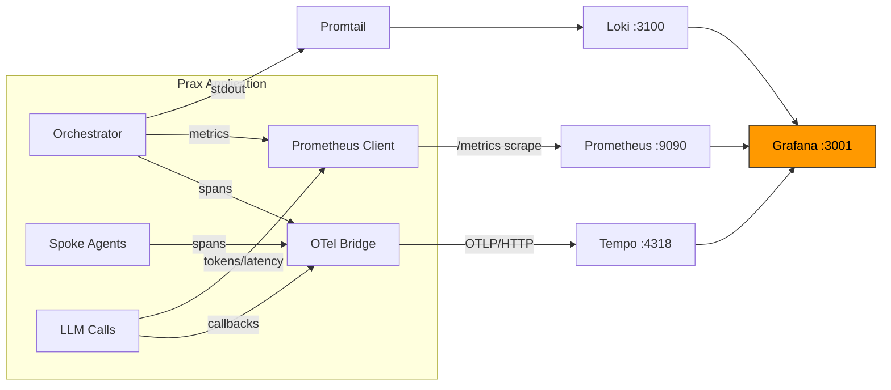
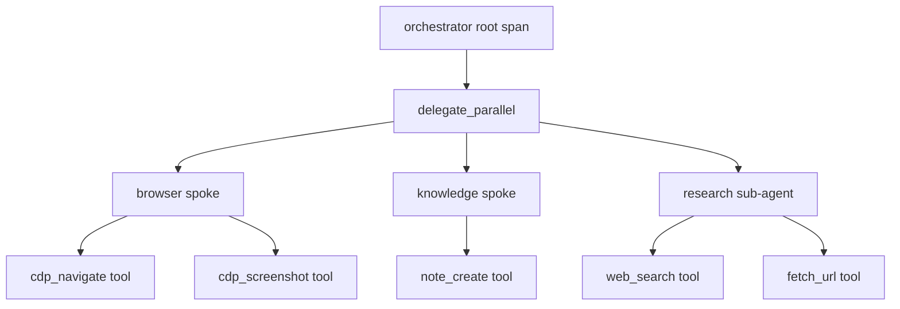

# Observability

[← Infrastructure](README.md)

Prax ships with a full observability stack that traces every LLM call, tool invocation, and agent delegation. When `OBSERVABILITY_ENABLED=true` (set automatically in dev mode), all telemetry flows through the Grafana LGTM stack.

### Vision

Observability is not just for debugging — it's the **sensory system** that enables Prax to self-reflect and evolve. Every LLM call, token count, latency measurement, and delegation decision is a potential training signal. The observability pipeline feeds the self-improvement loop: traces and metrics inform LoRA fine-tuning, cost optimization, and architectural decisions.

### Architecture



### Stack Components

| Component | Role | Port | Image |
|-----------|------|------|-------|
| **Tempo** | Distributed trace backend (receives OTLP from Prax) | 3200, 4317, 4318 | `grafana/tempo:2.7.2` |
| **Loki** | Log aggregation (receives Docker logs via Promtail) | 3100 | `grafana/loki:3.4.2` |
| **Promtail** | Log collector (Docker service discovery) | 9080 | `grafana/promtail:3.4.2` |
| **Prometheus** | Metrics (scrapes `/metrics` every 10s) | 9090 | `prom/prometheus:v3.2.1` |
| **Grafana** | Unified dashboards with pre-provisioned datasources | 3001 | `grafana/grafana:11.5.2` |

### Metrics

| Metric | Type | Labels | Description |
|--------|------|--------|-------------|
| `prax_llm_calls_total` | Counter | `model`, `status` | Total LLM API calls |
| `prax_llm_tokens_total` | Counter | `model`, `type` (input/output) | Total tokens consumed |
| `prax_llm_duration_seconds` | Histogram | `model` | LLM call latency |
| `prax_spoke_calls_total` | Counter | `spoke`, `status` | Spoke/sub-agent delegations |
| `prax_spoke_duration_seconds` | Histogram | `spoke` | Spoke execution duration |
| `prax_tool_calls_total` | Counter | `tool` | Tool invocations |
| `prax_hallucination_guard_total` | Counter | `type` | Grounding-guard firings (`numeric_claim`, `narrative`, `artifact_location`, `plan_completion`, `scheduled_evidence_floor`, `semantic_entropy`) — turns the inline per-turn guards into a trended, alertable signal |
| `prax_eval_quality` | Gauge | `axis` (`overall`/`grounding`/`relevancy`/`correctness`) | Reference-free live-traffic eval quality, updated by the nightly job |

### Evaluation

Two complementary eval paths score quality (see `prax/eval/`):

- **Regression gate (`make eval`)** — replays recorded failure cases through the live agent
  and scores each with an LLM judge decomposed into three axes (grounding / relevancy /
  correctness), so a regression localises to one dimension instead of hiding in a single
  number. `PRAX_EVAL_MIN_PASS_RATE=0.8 make eval` fails below a threshold. Needs provider
  keys (real calls), so it is **not** part of `make ci`. Run it before shipping a
  system-prompt or model-config change.
- **Nightly live-traffic eval** (`EVAL_NIGHTLY_ENABLED`) — a scheduler job samples recent
  execution traces from `.prax/graphs`, scores them with a **reference-free** judge, and
  publishes `prax_eval_quality` to Prometheus. This is continuous drift detection on real
  traffic (`prax/eval/live_eval.py`, cron via `EVAL_NIGHTLY_CRON`).

### Pre-Provisioned Dashboards

Two dashboards are auto-loaded into Grafana on startup:

- **LLM Performance** (`prax-llm-performance`) — Token usage, call counts by model, p50/p95/p99 latency, error rates, model distribution pie chart, tool invocation rates
- **Agent Overview** (`prax-agent-overview`) — Spoke delegation rates, duration percentiles, success/failure breakdown, delegation tree traces, top tools, error logs

### Trace Flow

Every user message creates a **root span** in the orchestrator. Tool calls, spoke delegations, and sub-agent invocations create child spans. The full execution tree is visible in Grafana Tempo.



### Per-Message Trace Links

When TeamWork is connected, each agent response message includes a **trace button** (green Activity icon on hover). Clicking it navigates to the **Execution Graphs** panel in TeamWork with the specific trace auto-selected — showing the delegation tree, tool calls, timing, and status. If Grafana is running, traces can also be viewed in Tempo for deeper analysis (LLM calls, token counts, latency, correlated logs).

Each execution graph also displays the **trigger** — the raw user message (or cron/event) that started the trace — so you can see what prompted each agent run.

### TeamWork Integration

The TeamWork web UI includes an **Observability tab** (Activity icon in the toolbar) with two sub-tabs:

- **Live Agents** — real-time terminal output from each agent. Select any agent in the sidebar to watch its execution stream. Working agents are highlighted and sorted to the top. The panel goes full-width (channel sidebar hidden) for maximum space
- **Dashboards** — links to pre-provisioned Grafana dashboards (LLM Performance, Agent Overview, Trace Explorer, Log Explorer, Metrics Explorer) and stack component overview

A separate **Execution Graphs** panel (Workflow icon) provides a tree visualization of the current LangGraph delegation chains. Each node shows status (running/completed/failed), spoke category, duration, and tool call count. Click a node to see its live output and summary

### Configuration

| Variable | Default | Description |
|----------|---------|-------------|
| `OBSERVABILITY_ENABLED` | `true` | Master switch — probes Tempo at startup, silently disables if unreachable |
| `GRAFANA_URL` | (empty) | Grafana base URL for deep-links (e.g. `http://localhost:3001`) |
| `OTEL_EXPORTER_OTLP_ENDPOINT` | `http://tempo:4318` | OTLP exporter endpoint |

### Enabling the Observability Stack

The observability services (Tempo, Loki, Promtail, Prometheus, Grafana) are defined in the main `docker-compose.yml` behind a **Compose profile**. Start them with:

```bash
# Full stack with observability:
docker compose --profile observability up --build

# Dev mode with observability:
docker compose -f docker-compose.yml -f docker-compose.dev.yml --profile observability up --build
```

Open Grafana at **http://localhost:3001** (default credentials: admin/prax).

### Retention & disk usage (long-running stacks)

Telemetry is bounded at every sink so a long-running deployment can't fill the
disk. None of these grow without limit:

| Sink | Bound | Where |
|------|-------|-------|
| **Prometheus** metrics | 30 days | `--storage.tsdb.retention.time=30d` (docker-compose.yml) |
| **Tempo** traces | 7 days | `compactor.compaction.block_retention: 168h` (`observability/tempo.yaml`) |
| **Loki** logs | 7 days | `compactor` + `limits_config.retention_period: 168h` (`observability/loki.yaml`) — the image default keeps logs *forever*, so we ship our own config |
| **Container stdout** (all LGTM services + Qdrant/Neo4j) | 10 MB × 3 files | json-file `max-size`/`max-file` (compose `logging` anchor; `--log-opt` on the Makefile `docker run`s) |
| Prax in-process OTel queue | 2048 spans (memory, not disk) | `BatchSpanProcessor(max_queue_size=2048)` + a startup probe that disables the exporter if Tempo is unreachable |

**Native host logs (`.local-run/*.log`)** are the one exception: the
`make run-local-all` path runs Prax/TeamWork as host processes whose stdout is
redirected to flat files. These are **truncated on every restart** (the launcher
uses `>`, not `>>`), which bounds the normal dev cycle — but a native process
left running for weeks without a restart will keep appending. For a genuinely
long-running / production deployment, run the **containerized** stack (Docker or
the `k8s/` chart) instead of the native make flow: there, stdout goes through the
capped json-file driver above (or the cluster's log rotation), and Promtail still
ships it to Loki under the 7-day retention.

To change a retention window, edit the value in the file noted above and restart
that service (`make shutdown && make run-local-all`, or
`docker compose --profile observability up -d --force-recreate <service>`).

### Safe Degradation

`OBSERVABILITY_ENABLED=true` is the default in `.env`. If you run without `--profile observability` (i.e., Tempo isn't running), the OTEL exporter **probes Tempo at startup** and silently disables itself if unreachable — no retries, no memory accumulation, no OOM risk. The `BatchSpanProcessor` queue is also capped at 2048 spans as a safety net.

This means you can always leave `OBSERVABILITY_ENABLED=true` in `.env` and simply control whether the stack runs via the Compose profile.

### Key Files

| File | Purpose |
|------|---------|
| `prax/observability/__init__.py` | Package entry — exports `init_observability`, `get_tracer` |
| `prax/observability/setup.py` | OTel SDK init with OTLP/HTTP exporter, graceful degradation |
| `prax/observability/callbacks.py` | LangChain callback handler — OTel spans for LLM calls (GenAI conventions) |
| `prax/observability/metrics.py` | Prometheus metric definitions with no-op fallback |
| `prax/agent/trace.py` | Execution tracing — custom spans + OTel bridge |
| `observability/tempo.yaml` | Tempo config (OTLP gRPC + HTTP receivers) |
| `observability/prometheus.yaml` | Prometheus scrape config |
| `observability/promtail.yaml` | Promtail Docker service discovery |
| `observability/grafana/` | Grafana provisioning (datasources + dashboards) |
