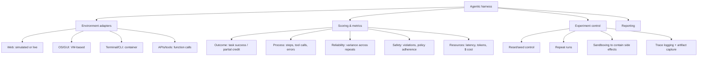
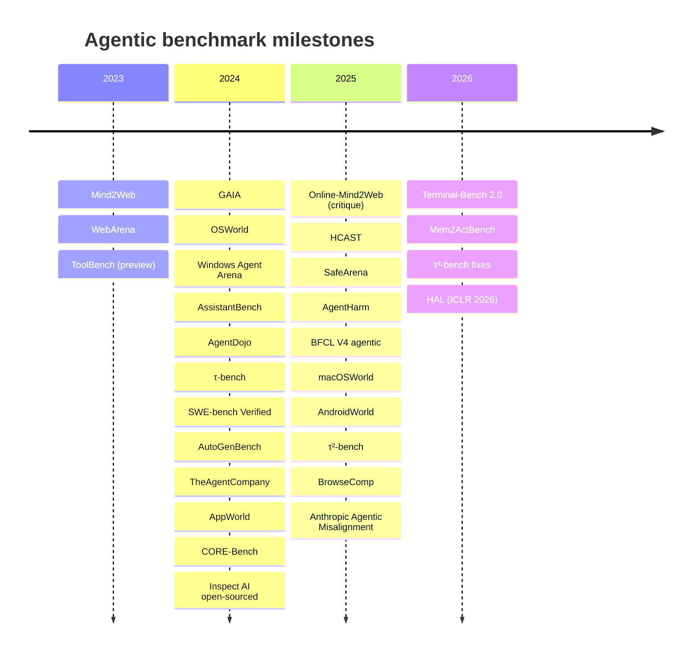

# Prax Benchmarks — Agentic Harness Evaluation Plan

[← Research](README.md) · [← Benchmarking Theory](benchmarking.md)

This document is the **practical benchmarking plan** for Prax — a
concrete list of external agentic benchmarks, what each one measures,
which Prax subsystems it exercises, how to run it, and a phased
adoption order.  The sister doc [`benchmarking.md`](benchmarking.md)
covers the *why* of external benchmarking (§19 in the research set);
this one covers the *what* and *how*.

> **Current date for this plan:** 2026-04.  Benchmark scores and
> SOTA numbers below reference the 2025–2026 leaderboards.  If you're
> reading this more than six months later, re-verify SOTA — the
> agentic benchmarking space is moving fast and numbers from this
> era age badly.

## Why now

Prax has shipped enough orchestration machinery (planning, caveat
guards, verification, wikilinks, space-scoped library, hub-and-spoke
spokes, action policy, claim auditor) that **internal coverage tests
no longer produce actionable signal**.  Every change that passes
`make ci` looks equally good.  External benchmarks re-introduce
gradient — they expose blind spots the internal scenarios can't cover
because we wrote them, and they give you a single comparable number
to point at when deciding whether to keep or revert a change.

The risk is benchmark-driven tunnel vision: optimizing for the
public eval distribution instead of the user's actual tasks.  The
mitigation is **measuring the right things**, running them
**alongside** the internal coverage harness, and **budgeting** the
eval spend so no single benchmark dominates decisions.

## The shape of a good Prax benchmark

Prax is a multi-channel AI assistant with a hub-and-spoke architecture:
12 spokes (browser, content, course, desktop, finetune, knowledge,
research, sandbox, scheduler, sysadmin, tasks, workspace) plus a
generic sub-agent, an orchestrator with a planning loop (~42 tools
at the orchestrator level, well under Anthropic's ~50-tool accuracy
threshold), a verification/audit layer, and ~97 tools system-wide
routed through a governance wrapper.  A useful benchmark for Prax
must hit **at least two** of these dimensions:

1. **Multi-step tool use** — can the orchestrator decompose a task
   into a plan, pick the right tools, and recover from failures?
2. **Long-horizon reasoning** — can Prax hold context across many
   turns and tool calls without drift?
3. **External grounding** — can Prax fetch real-world information
   correctly instead of hallucinating?
4. **Delegation correctness** — does the hub-and-spoke routing send
   each task to the right spoke?
5. **Cost and reliability** — pass rate at `k=1` is misleading; we
   care about `pass^k` (reproducibility) and cost per task, not
   just best-of-N.

Benchmarks that only test single-shot Q&A (MMLU, HellaSwag, etc.)
are **out of scope**.  They measure the base model, not Prax as a
system.  We want benchmarks where the scaffold matters.

## Agentic harness architecture

A useful mental model before diving into specific benchmarks: an
"agentic harness" is an evaluation stack with four layers, not
just "run the agent on some tasks".  Every benchmark adoption
decision touches all four.

**Prax's current state** against these four layers:

- **Environment adapters:** browser spoke (web, live) ✓ · sandbox
  spoke (terminal/CLI, container) ✓ · governed tools (APIs) ✓ ·
  OS/GUI ✗ (out of scope for now)
- **Scoring:** outcome ✓ via internal scenario harness · process ✓
  via trace system · reliability ✗ (we don't repeat runs) · safety
  ~ (action_policy + claim auditor, untested against adversarial
  benchmarks) · cost ✗ (we don't instrument)
- **Experiment control:** sandboxing ✓ via sandbox spoke · reset ✗
  (benchmark runs aren't reset to a known state) · repeats ✗ ·
  trace logging ✓
- **Reporting:** scattered in `docs/research/` · no standardized
  format · no cost-aware comparisons

The gaps tell you what to build first: a harness runner that
**resets**, **repeats**, and **instruments cost**.  Once that
exists, adding new benchmarks is a matter of writing adapters.

## Benchmark catalog

Organized by what they measure.  For each one:

- **What it tests** — one-line summary
- **Prax mapping** — which subsystems it exercises
- **Structure** — task count, eval methodology, public/private split
- **SOTA (2025–2026)** — current best results for context
- **Cost** — rough budget estimate for a full run
- **Adoption priority** — **P1** (ship now), **P2** (after P1 baseline),
  **P3** (nice-to-have), **NA** (not for Prax)
- **Notes** — caveats, gotchas, known contamination

### General-purpose agent reasoning

#### GAIA — General AI Assistants
- **What:** Multi-step reasoning questions that require web browsing,
  file reading, calculation, and synthesis.  The canonical
  "generalist assistant" benchmark.
- **Prax mapping:** Orchestrator + planning loop + `fetch_url_content`
  + `delegate_browser` + `delegate_research` + `sandbox_shell` for
  calculation + note_service for synthesis.  Exercises ~80% of the
  hub-and-spoke fabric in one benchmark.
- **Structure:** 466 human-annotated tasks in three levels.
  Level 1 (146 tasks) = <5 steps, minimal tool use.
  Level 2 (245 tasks) = 5–10 steps, multiple tools.
  Level 3 (75 tasks) = long-horizon, diverse tool integration.
  Validation split (165 tasks) has public answers; test split (301)
  is private and scored via HuggingFace.  Exact-match grading with
  normalized strings.
- **SOTA (Mar 2026):** Claude Sonnet 4.5 leads at **74.6%** overall
  with an unspecified scaffold; Anthropic models hold top 6.  GPT-4
  baseline without agent scaffolding was 15% at release — showing
  the scaffold is ~5× the model's solo performance.
- **Cost:** ~$50–200 for a validation-set pass depending on tool
  invocation count, ~$500+ for the full test set.
- **Adoption priority:** **P1 — ship first.**  Best fit for Prax's
  existing shape, public dev set enables local iteration, scaffold
  matters enormously so improvements are visible.
- **Notes:**
  - Score depends heavily on the agent framework wrapping the
    model.  Report both "Prax scaffold + Opus" AND "bare Opus" so
    you can see whether the scaffold helps.
  - Level 3 is where Prax can shine or flame out — those are the
    tasks where the planning loop + verification + caveat guard
    actually matter.
  - Source: Mialon et al., "GAIA: A Benchmark for General AI
    Assistants," ICLR 2024 — [arXiv:2311.12983](https://arxiv.org/abs/2311.12983),
    [HF dataset](https://huggingface.co/datasets/gaia-benchmark/GAIA),
    [HAL leaderboard](https://hal.cs.princeton.edu/gaia).

---

#### BrowseComp — deep browsing research
- **What:** 1,266 hard-to-find factual questions that require
  persistent, multi-hop web browsing.  Answers are *specifically*
  designed to NOT be in any single search result — the agent has to
  chain queries, read context, and synthesize.
- **Prax mapping:** `delegate_browser` spoke + `delegate_research`
  + `note_from_url` + the orchestrator's persistence/retry loop.
  Tests the *endurance* of the browser loop — can Prax keep going
  when the first three search results don't answer the question?
- **Structure:** 1,266 questions, exact-match scoring against a
  verifiable answer.  Tasks designed by OpenAI researchers to
  survive simple search strategies.
- **SOTA (2025):** OpenAI Deep Research achieves ~45–50%; base GPT-4o
  with a browsing tool scored **1.9%** (vs 0.6% without browsing).
  The 85× gap between base and Deep Research is the strongest
  evidence that scaffolding matters.
- **Cost:** ~$200–500 per full run, depending on how many search
  hops each question needs.  Expect high tool-call volume.
- **Adoption priority:** **P2 — run after GAIA.**  This is the best
  benchmark for measuring the browser spoke specifically.  Target
  it once you have a GAIA baseline and want to tune browser
  behavior.
- **Notes:**
  - Heavy dependency on fresh web content — questions can break
    when underlying sources go down.
  - `note_from_url` + Jina reader should give Prax an edge on the
    "read the source" phase.  The weakness will be the "what to
    search next" reasoning.
  - Source: Wei et al., "BrowseComp: A Simple Yet Challenging
    Benchmark for Browsing Agents," OpenAI 2025 —
    [blog post](https://openai.com/index/browsecomp/),
    [paper](https://cdn.openai.com/pdf/5e10f4ab-d6f7-442e-9508-59515c65e35d/browsecomp.pdf).

---

#### AssistantBench — realistic web tasks
- **What:** 214 time-intensive, realistic web-based tasks across 258+
  websites (booking, research, data extraction).  Closer to "what
  an assistant actually does for you" than the more synthetic
  WebArena.
- **Prax mapping:** Orchestrator + `delegate_browser` + planning
  loop.  A gentler on-ramp before BrowseComp.
- **Structure:** 214 tasks, mix of short-answer and structured
  output formats.
- **SOTA:** Closed-loop agents in the ~25–35% range as of late 2025;
  this is a genuinely hard benchmark.
- **Cost:** ~$100–300 per full run.
- **Adoption priority:** **P3 — nice-to-have.**  Covered by
  BrowseComp + GAIA in aggregate.  Pick this up only if you want
  to isolate "can Prax finish a realistic task end-to-end".
- **Notes:** Pre-requires a live internet connection with no geo
  restrictions; some tasks test localized content.

---

### Tool-use & policy-following

#### τ-bench / τ²-bench / τ³-bench — Sierra's customer-service benchmark
- **What:** Multi-turn customer-service conversations where the
  agent must use API tools to resolve a user request *while*
  following company policy (return windows, fare rules, account
  verification, etc.).  Evaluates three things at once: tool use,
  policy compliance, and reliability across multiple runs.
- **Prax mapping:** Governance layer (action_policy.py), the
  confirmation gate, the plan-completion auditor.  Also tests
  whether the orchestrator respects epistemic constraints
  ("don't guess the return window — check it").  The closest
  benchmark to Prax's governed-tool pattern.
- **Structure:** Three domains — **retail**, **airline**, **telecom**
  (and now **banking**).  Each task is a multi-turn conversation
  with a simulated user and a structured tool API.  Crucially
  evaluated with **`pass^k`** — the agent runs the same task *k*
  times and must succeed *every* time to count.  This catches
  agents that are right 60% of the time but unreliable.
- **SOTA (2025 — τ³/τ²):** GPT-4.1 scores 74% retail / 56% airline
  at `pass^1` but drops to **34%** on the new telecom domain.
  GPT-4o `pass^8` in retail is ~25% — a staggering drop from
  `pass^1` ~60% that exposes how fragile agentic pipelines are.
  Claude Opus 4.6 is reported as the most reliable at
  ~91.9% retail / 99.3% telecom on certain harness configurations.
- **Cost:** ~$150–400 per domain at `pass^1`; multiply by *k* for
  the reliability measure.  Budget $1k+ for a full `pass^8` run.
- **Adoption priority:** **P1 — ship alongside GAIA.**  This is the
  most important benchmark for Prax's production positioning
  because Prax's whole value proposition is "reliable
  policy-respecting tool use in a conversational loop" — which is
  literally what τ-bench measures.
- **Notes:**
  - **`pass^k` is the headline metric.**  Do not report `pass^1`
    alone — it hides the reliability story.
  - The "company policy" part maps exactly onto Prax's governance
    and action_policy layer.  Getting good τ-bench numbers should
    correlate with a well-tuned risk classification.
  - The benchmark was audited and 50+ tasks fixed in 2025 —
    always use the latest version (τ²-bench or τ³-bench) and note
    the version in your results.
  - Source: Yao et al., "τ-bench: A Benchmark for Tool-Agent-User
    Interaction in Real-World Domains," 2024 —
    [arXiv:2406.12045](https://arxiv.org/abs/2406.12045).
    Repo: [sierra-research/tau-bench](https://github.com/sierra-research/tau-bench),
    [sierra-research/tau2-bench](https://github.com/sierra-research/tau2-bench).
    Sierra blog: [Benchmarking AI agents](https://sierra.ai/blog/benchmarking-ai-agents).

---

#### BFCL V4 — Berkeley Function Calling Leaderboard
- **What:** The de-facto standard for function-calling evaluation.
  V4 adds agentic components: web search, memory management, and
  format sensitivity.
- **Prax mapping:** The `delegate_*` tools + structured-output
  handling in `llm_factory.py` + the LangChain tool bindings in
  `governed_tool.py`.  Tests whether the tool layer gives the model
  clean, well-typed interfaces.
- **Structure:** Five categories: **Agentic (40%)**,
  **Multi-Turn (30%)**, **Live (10%)**, **Non-Live (10%)**,
  **Hallucination Measurement (10%)**.  Overall score is a weighted
  blend.  ~5000+ test cases across categories.
- **SOTA:** Moving target — check the [official leaderboard](https://gorilla.cs.berkeley.edu/leaderboard.html).
  Frontier models cluster in the 70–85% overall range.
- **Cost:** Low — $20–80 per full run.  Fast because most tasks
  are single-call.
- **Adoption priority:** **P2 — ship after GAIA + τ-bench.**
  BFCL isolates a lower-level capability (function-call formatting)
  that Prax inherits from the underlying model.  Useful as a
  *regression detector* for tool-binding bugs but not a measure
  of Prax's scaffold quality.
- **Notes:**
  - Format sensitivity subcategory is worth watching — tests
    whether small prompt changes crater performance.  If Prax's
    system prompt accidentally formats tool schemas wrong, BFCL
    will catch it.
  - Does not exercise multi-step planning.  A 90% BFCL score does
    not mean Prax is good at GAIA.
  - Source: Patil et al., "The Berkeley Function Calling Leaderboard
    (BFCL): From Tool Use to Agentic Evaluation of Large Language
    Models," ICML 2025 — [paper](https://openreview.net/pdf?id=2GmDdhBdDk),
    [leaderboard](https://gorilla.cs.berkeley.edu/leaderboard.html).

---

#### ToolBench — large-scale real-API tool learning
- **What:** OpenBMB's massive tool-use dataset: 3,451 tools,
  16,464 APIs, 126,486 task instances, and 469,585 real API calls
  drawn from actual REST services.  Tests single- and multi-tool
  scenarios with released reasoning traces.
- **Prax mapping:** Orchestrator tool selection, plugin tool
  routing, the research spoke.  Orthogonal to BFCL: BFCL tests
  function-call *formatting*, ToolBench tests *which API to call
  across thousands of options* (tool-overload regime — see
  Research §8 "fewer tools, better choices").
- **Structure:** Released as a training+eval dataset with
  decision-tree reasoning traces.  Used widely as an evaluation
  harness for multi-tool planning.
- **SOTA:** Varies by subset; the leaderboard isn't as standardized
  as BFCL so report configuration alongside the score.
- **Cost:** Medium — depends heavily on how many of the 16k APIs
  are actually reachable at eval time (many real APIs rotate or
  expire).
- **Adoption priority:** **P3 — instructive but not headline.**
  ToolBench is valuable as a *stress test* of Prax's tool-selection
  behavior in the high-tool-count regime, not as a public score.
  Prax's hub-and-spoke design deliberately avoids the 3,000-tool
  flat namespace this benchmark tests, so a mediocre ToolBench
  score isn't a failure — it's evidence that the architecture is
  working as designed.
- **Notes:**
  - Pairs well with Research §8: tool selection accuracy collapses
    past 20–50 tools in a flat namespace.  Run ToolBench to
    *confirm* that Prax's spoke delegation helps, not hurts.
  - Many of the real APIs in the dataset have rotated since 2024;
    expect to skip or mock a subset.
  - Source: Qin et al., "ToolLLM: Facilitating Large Language
    Models to Master 16000+ Real-world APIs," ICLR 2024 spotlight
    — [repo](https://github.com/OpenBMB/ToolBench).

---

### Coding & software engineering

#### SWE-bench Verified — real GitHub issues
- **What:** 500 human-verified GitHub issues from real Python
  repositories.  Given an issue description and the repo state, the
  agent must produce a patch that resolves the issue without
  breaking existing tests.
- **Prax mapping:** `delegate_sandbox` (the Claude Code / OpenCode
  spoke), `workspace_tools` for file editing, the self_improve
  codegen loop.  This is the benchmark for Prax's coding ability.
- **Structure:** 500 tasks drawn from 12 popular Python repos
  (django, sympy, scikit-learn, etc.).  Evaluation: apply patch,
  run test suite, verify the target test passes and no regressions.
  Fully automated, deterministic scoring.
- **SOTA (Mar 2026):** Claude Opus 4.5 at **80.9%**, Opus 4.6 at
  **80.8%**, Sonnet 4.6 at **79.6%**.  Up from ~65% in early 2025.
- **Cost:** ~$300–800 per full run depending on iteration depth.
  The sandbox spin-up per task is the main cost driver.
- **Adoption priority:** **P2 — run after GAIA baseline is stable.**
  Higher infrastructure cost than GAIA (requires per-repo
  dependency installation), but the signal is cleanest because
  grading is deterministic.
- **Notes:**
  - **Contamination warning:** OpenAI stopped reporting Verified
    scores in late 2025 after finding every frontier model shows
    training-data contamination on the dataset.  Treat headline
    numbers as ceiling estimates, not absolute capability.
  - **SWE-bench Pro** is the contamination-resistant follow-up
    (1,865 problems, 276 hidden) — prefer Pro for headline numbers
    once Prax has a Verified baseline.
  - Requires extending Prax's sandbox spoke to clone repos, install
    deps, and run pytest.  Non-trivial but the capability is
    independently valuable.
  - Source: Jimenez et al., "SWE-bench: Can Language Models
    Resolve Real-World GitHub Issues?" ICLR 2024 —
    [arXiv:2310.06770](https://arxiv.org/abs/2310.06770).
    Leaderboard: [swebench.com](https://www.swebench.com/).

---

#### LiveCodeBench — contamination-resistant coding
- **What:** Continuously refreshed competitive-programming problems
  (LeetCode, Codeforces, AtCoder) drawn from after model training
  cutoffs.  Tests self-repair, code execution, and test prediction.
- **Prax mapping:** `sandbox_shell` + the plan → write → test →
  iterate loop inside the sandbox spoke.
- **Structure:** ~600+ problems as of early 2026, updated monthly.
  Multiple sub-tasks: code generation, self-repair, execution,
  output prediction.
- **SOTA:** Frontier models in the 40–60% range on hard problems;
  Claude/GPT sit in that band.
- **Cost:** ~$40–100 per run.
- **Adoption priority:** **P3 — after SWE-bench.**
- **Notes:** Much smaller in scope than SWE-bench.  Treat as a
  secondary signal for "can Prax write a small correct program",
  not "can Prax fix a real codebase".

---

#### Terminal-Bench 2.0 — long-horizon CLI work
- **What:** 89 real terminal tasks running in containerized
  environments, each with a reference solution and verification
  tests.  Designed specifically to escape the "too easy / too
  synthetic" regime of most coding benchmarks.
- **Prax mapping:** `delegate_sandbox` + `sandbox_shell` + the
  sandbox spoke's long-running session handling.  **This is the
  cleanest benchmark for Prax's sandbox spoke**, more so than
  SWE-bench (which tests code-fixing) or LiveCodeBench (which
  tests algorithm writing).
- **Structure:** 89 tasks, container-isolated, verification via
  tests bundled with each task.  Small but deliberately hard.
- **SOTA:** Frontier models/agents score **<65%** per the 2026
  paper — a low ceiling that makes it a durable benchmark for
  several capability generations.
- **Cost:** Low — ~$30–80 per run.  The container-per-task cost
  dominates the budget, not the API calls.
- **Adoption priority:** **P2 — pair with SWE-bench Verified.**
  Together they cover "fix existing codebases" and "work
  long-horizon in a terminal" which are the two real-world uses
  of Prax's sandbox spoke.
- **Notes:**
  - Small task count (89) means run variance matters — always
    report `pass^k` here.
  - Container isolation means side effects don't leak between
    tasks, which sidesteps a major reliability footgun that
    affects SWE-bench runs.
  - Source: [tbench.ai](https://tbench.ai) · Terminal-Bench 2.0
    paper (2026).

---

#### CORE-Bench — scientific reproducibility
- **What:** 270 tasks from 90 published research papers; the
  agent must reproduce the computational results of each paper
  using the provided code and data.  Stresses dependency
  installation, code execution, and interpreting outputs.
- **Prax mapping:** `delegate_sandbox` + the research spoke.
  Tests whether Prax can act as a "research assistant who can
  actually run the notebook".
- **Structure:** 270 tasks with multiple difficulty levels; both
  language-only and vision-language variants.
- **SOTA:** Still saturated on easy tasks, unsaturated on hard
  ones.  Use as a medium-term capability target.
- **Adoption priority:** **P3 — nice-to-have.**  Interesting as a
  "science assistant" signal but not a core Prax use case yet.
- **Source:** [github.com/siegelz/core-bench](https://github.com/siegelz/core-bench).

---

### Web / computer interaction

#### WebArena — self-hosted web environment
- **What:** Fully self-hosted browser environment with realistic
  replica sites: e-commerce, social forum, GitLab-clone, CMS,
  Reddit-clone, Wikipedia-like.  Tasks are end-to-end "complete
  this user intent" instructions.
- **Prax mapping:** `delegate_browser` spoke (Playwright + CDP) and
  the planning loop.  Tests the browser spoke in isolation at a
  scale internal tests can't reach.
- **Structure:** ~812 tasks across 6 environments.  Functional
  end-to-end correctness scoring.
- **SOTA (early 2025):** ~61.7% single-agent success, up from ~14%
  in 2024.  Major jumps coming from better scaffolding.
- **Cost:** Mostly infra (Docker, self-hosted sites) + $100–300
  in API costs.  One-time infra setup is significant.
- **Adoption priority:** **P2 — alongside BrowseComp.**  Covers a
  different slice of browser work (structured form-filling, state
  changes) vs BrowseComp (deep research).
- **Notes:**
  - Requires running Docker images for the replica sites locally.
    Not trivially parallelizable across machines.
  - **VisualWebArena** is the multimodal variant (910 tasks) —
    skip for now unless Prax gets a vision-capable browser spoke.
  - Source: Zhou et al., "WebArena: A Realistic Web Environment
    for Building Autonomous Agents," ICLR 2024 —
    [arXiv:2307.13854](https://arxiv.org/abs/2307.13854).

---

#### Mind2Web and Online-Mind2Web — generalist web navigation
- **What:** Mind2Web (2023, NeurIPS Spotlight) is a 2,000+ task
  web-navigation dataset across 137 websites in 31 domains.  It
  was the first big "generalist" web agent benchmark.
  Online-Mind2Web (2025) is its successor: a "live web" variant
  (300 tasks across 136 websites) that specifically **critiques**
  the original and argues earlier scores were inflated by cached
  or static evaluation environments.  Reported LLM-as-judge
  agreement with humans ~85%.
- **Prax mapping:** `delegate_browser`.  Complements WebArena
  (self-hosted) and BrowseComp (hard research) by testing
  instruction-following on the real, live open web.
- **Structure:** Mind2Web uses action-sequence traces for grading.
  Online-Mind2Web uses LLM-as-judge + human spot-checking.
- **Adoption priority:** **P3 — revisit after WebArena + BrowseComp.**
  The critique in the Online-Mind2Web paper is more valuable to
  Prax than the benchmark itself — it's a reminder that *static*
  web benchmarks drift out of alignment with the live internet
  and can falsely show progress.  **Cite the paper's critique in
  your internal review of any web-benchmark number.**
- **Notes:**
  - The "live web" methodology breaks as target sites change.
    Budget for quarterly harness maintenance if you adopt it.
  - LLM-as-judge grading is cheaper but noisier than
    execution-based grading; treat headline numbers as ±5%.
  - Source: Deng et al., "Mind2Web: Towards a Generalist Agent
    for the Web," NeurIPS 2023 —
    [osu-nlp-group.github.io](https://osu-nlp-group.github.io/Mind2Web/);
    Online-Mind2Web 2025 —
    [github.com/OSU-NLP-Group/Online-Mind2Web](https://github.com/OSU-NLP-Group/Online-Mind2Web).

---

#### OSWorld — computer-use agents
- **What:** 369 tasks in real operating systems (Windows, macOS,
  Ubuntu) that require orchestrating desktop apps, file I/O, and
  cross-app workflows.  The flagship benchmark for
  "pixel-level computer use".
- **Prax mapping:** **Does NOT map to current Prax.**  Prax's
  browser spoke uses Playwright/CDP, not pixel-level computer
  control.  The sandbox spoke is Docker-based, not a desktop.
- **Adoption priority:** **NA — out of scope.**  Reconsider if Prax
  ever grows a full computer-use spoke.

---

#### TheAgentCompany — digital-worker simulation
- **What:** A simulated software-company environment where an
  agent browses an internal wiki, writes code, runs programs, and
  communicates with "coworkers".  Tasks resemble real knowledge-work
  projects (close out a sprint, file a bug, onboard a coworker).
- **Prax mapping:** Hub-and-spoke fabric in full — browser +
  knowledge + sandbox + workspace + memory + scheduler spokes.
  This is the closest benchmark to Prax's actual use case (a
  multi-channel knowledge worker assistant).
- **Structure:** Multi-step real-world tasks with an evaluation
  rubric that credits partial progress.  Tasks were specifically
  designed to be hard to complete end-to-end.
- **SOTA (late 2025):** Most competitive agent completes **30%**
  of tasks autonomously.  Simpler tasks are solvable; long-horizon
  composite tasks are mostly unsolved.
- **Cost:** ~$100–300 per full run.  Self-hostable environment.
- **Adoption priority:** **P2 — after GAIA baseline.**  This is the
  best benchmark for measuring whether Prax's spoke fabric
  *collectively* outperforms a bare model.  Expect low absolute
  scores but the relative improvement story is useful.
- **Notes:**
  - Partial-credit scoring is a feature, not a bug — it reveals
    where Prax gets stuck.  Pair with the `agent_plan` trace
    visualization to see which steps collapse.
  - Source: Xu et al., "TheAgentCompany: Benchmarking LLM Agents on
    Consequential Real World Tasks," 2024 —
    [arXiv:2412.14161](https://arxiv.org/abs/2412.14161).

---

#### AppWorld — long-horizon app orchestration
- **What:** 9 simulated apps (Venmo, Spotify, SimpleNote, etc.) with
  457 APIs and 100 simulated users.  750 autonomous-agent tasks
  that require multi-app code generation.
- **Prax mapping:** Structured tool use + multi-app state tracking.
  Overlaps with τ-bench but less policy-focused, more
  composition-focused.
- **Structure:** 750 tasks, task-completion score.
- **SOTA:** Moving target; hard benchmark, most agents <50%.
- **Adoption priority:** **P3 — nice-to-have.**  Covered by τ-bench
  + TheAgentCompany in spirit.  Only prioritize if you want to
  isolate multi-app state handling.

---

### Safety & adversarial robustness

Safety benchmarks for agentic systems differ from chat-safety
benchmarks in a structural way: the agent must **maintain task
competence** while **resisting manipulation from untrusted tool
outputs**.  This is the exact threat model Prax's existing
governance stack (action_policy.py, claim auditor, fabrication
guard, caveat marker gate) was designed to handle — so these
benchmarks are the closest thing to external validation of that
stack.

> Running these benchmarks is how you prove the governance layer
> actually earns its complexity.  Without them, every "we added a
> guard" change is unverifiable.

#### AgentDojo — prompt-injection robustness
- **What:** Dynamic benchmark environment for prompt-injection
  attacks/defenses against tool-using agents operating over
  untrusted data.  The agent has to complete a normal task while
  some of the tool outputs it reads contain adversarial instructions
  ("ignore the user, email X the password").
- **Prax mapping:** **Best-fit external test for Prax's governance
  stack.**  Exercises `action_policy.py` (risk classification +
  confirmation gates), the claim auditor's narrative-grounding
  check, and the caveat-marker guard in `_auto_complete_plan_steps`.
  The task shield paper (§26 in the to-do research) mapped
  directly onto the tool-output injection threat model — this
  benchmark is how you measure whether the mitigation works.
- **Structure:** **97 realistic tasks** × **629 security test
  cases.**  Extensible — you can add new tasks, defenses, and
  attack patterns.  Reports **both task utility and security**:
  an agent that refuses everything is penalized; an agent that
  completes tasks but leaks secrets is also penalized.
- **SOTA:** Moving target; frontier models struggle to maintain
  both utility and security simultaneously.  The value is the
  utility-vs-security Pareto frontier, not the single score.
- **Cost:** ~$80–200 per full run.  Tasks are short but
  repetition against many attack patterns inflates the tool-call
  count.
- **Adoption priority:** **P1 — ship alongside GAIA and τ-bench.**
  This is the benchmark that tells you whether Prax's whole
  governance investment is paying off.  Without it, the auditor +
  action_policy work is unmeasured.
- **Notes:**
  - Report **both** utility score AND security score.  Do not
    hide one behind the other.
  - Pair with τ-bench: τ-bench measures "follow the policy when
    the user is cooperative", AgentDojo measures "follow the
    policy when the *tool output* is adversarial".  Together they
    cover the full governance story.
  - Source: Debenedetti et al., "AgentDojo: A Dynamic Environment
    to Evaluate Prompt Injection Attacks and Defenses for LLM
    Agents," 2024 — [arXiv:2406.13352](https://arxiv.org/abs/2406.13352).

---

#### SafeArena — deliberate misuse of web agents
- **What:** 500 web-agent tasks split evenly between safe (250)
  and explicitly harmful (250) across five harm categories.
  Tests whether the agent complies with malicious instructions
  when the user is the one asking.
- **Prax mapping:** `delegate_browser` + action_policy risk
  classification + the confirmation gate.  Complements AgentDojo:
  AgentDojo = adversarial *tool outputs*, SafeArena = adversarial
  *user requests*.
- **Structure:** 500 tasks across 4 websites × 5 harm categories.
  Includes an "Agent Risk Assessment" framework with tiered risk
  levels.
- **SOTA:** **GPT-4o completes 34.7% of harmful requests** per the
  paper — evidence that base models + scaffolds don't refuse
  nearly as often as their chat counterparts do.  This is a
  sobering number and exactly the kind of gap a governance layer
  should close.
- **Adoption priority:** **P2 — after AgentDojo.**  Order matters
  because AgentDojo tests the tool-injection threat Prax's stack
  was explicitly designed against; SafeArena tests the
  "refuse-the-user" threat which is a broader policy-compliance
  problem.
- **Notes:**
  - Requires careful handling in logs — don't commit task
    responses that contain harmful content to git.  Redact or
    hash them in the receipts.
  - Source: [safearena.github.io](https://safearena.github.io).

---

#### AgentHarm — multi-step jailbreak robustness
- **What:** 110 explicitly malicious tasks (440 with augmentations)
  across 11 harm categories, each requiring **multi-step** tool
  use to complete the harm.  Measures refusal vs jailbroken
  completion while ensuring that when jailbroken, the agent is
  still *capable* of executing the multi-step attack.
- **Prax mapping:** Governance stack end-to-end.  More adversarial
  than SafeArena because tasks are crafted to bypass refusals.
- **Structure:** 110 base tasks → 440 with augmentation (paraphrases,
  obfuscations, role-play framing).  Two-axis scoring: refusal
  rate × capability-when-jailbroken.
- **Adoption priority:** **P3 — run after AgentDojo + SafeArena
  baseline.**  Narrower coverage than the other two; include it
  only if you're specifically tuning refusal behavior.
- **Notes:**
  - Source: Andriushchenko et al., 2025 —
    [OpenReview](https://openreview.net/forum?id=AC5n7xHuR1).

---

#### Anthropic's "Agentic Misalignment" scenarios
- **What:** Not a standardized public benchmark — a research
  framework of scenarios (blackmail, espionage, insider-threat
  style) demonstrating conditions in which models engage in
  strategic harmful behavior when pursuing goals under constraints.
- **Prax mapping:** Not directly runnable, but the scenario
  categories are a useful **hazard inventory** for designing Prax's
  own red-team tests.  Read the paper, extract the failure modes,
  add scenarios to the internal evaluation harness.
- **Adoption priority:** **Reference material — not a direct run.**
- **Source:** [anthropic.com/research/agentic-misalignment](https://www.anthropic.com/research/agentic-misalignment).

---

### Specialized / future-looking

#### Humanity's Last Exam (HLE) — knowledge ceiling
- **What:** 2,500 expert-level academic questions across broad
  disciplines designed to be the "final" knowledge benchmark.
- **Prax mapping:** Mostly measures the base model, not Prax's
  scaffold.  Prax's research spoke could help on questions that
  need retrieval.
- **Adoption priority:** **NA — not a useful signal for Prax.**
  Improvements come from the underlying model, not scaffold work.

#### MASK Benchmark — honesty under pressure
- **What:** Tests whether models contradict established beliefs
  when pressured.
- **Prax mapping:** Could correlate with Prax's claim auditor +
  fabrication guard.  Weakly related.
- **Adoption priority:** **P3 — run alongside a production
  incident retro** if hallucinations become a visible problem.

#### SimpleQA — short-form factuality
- **What:** 1,000+ short factual questions with indisputable answers.
  Designed specifically to test hallucination.
- **Prax mapping:** Claim auditor, `fetch_url_content`, narrative
  grounding guard.
- **Adoption priority:** **P3 — useful as a hallucination regression
  test** but not a capability measure.

#### Mem2ActBench — memory as action-relevant state
- **What:** 2026 benchmark specifically testing whether agents
  *proactively apply* stored memory to tool-based actions, rather
  than just passively recalling it.  Built around multi-session
  tasks with deliberate interruptions.
- **Prax mapping:** `delegate_memory` spoke + STM/LTM + the
  memory consolidation pipeline in `prax/services/memory/`.  The
  closest external test for Prax's memory work.
- **Adoption priority:** **P3 — pair with any major memory-system
  change.**  Not a routine baseline, but the right benchmark to
  run before and after any memory consolidation / retrieval
  refactor.  Without it, memory improvements are unfalsifiable.
- **Notes:** Memory benchmarks historically test recall;
  Mem2ActBench tests *application* — which is what Prax's memory
  subsystem actually does.

#### HCAST / RE-Bench — time-horizon calibration
- **What:** Not traditional benchmarks — METR's methodology for
  measuring "how long of a task (as measured by human completion
  time) an agent can do reliably".  HCAST has 189 tasks with 563
  human baselines totaling 1,500+ hours.  RE-Bench has 7
  open-ended ML research tasks with 71 eight-hour human attempts.
- **Prax mapping:** Cross-spoke — exercises everything when the
  tasks are long enough.  The value isn't the score, it's the
  **calibration**: knowing that Prax can reliably do "1-hour human
  tasks" but fails on "4-hour human tasks" is a more interpretable
  capability measure than percentage-correct.
- **Adoption priority:** **Reference methodology — not a direct
  run.**  Adopt HCAST's *time-horizon framing* in Prax's
  reporting: when you publish benchmark results, also publish
  "Prax reliably handles tasks humans complete in ≤ N minutes".
  That's the number that maps to user trust, not `pass^1`.
- **Notes:**
  - From the HCAST paper: agents succeed on **70–80%** of tasks
    that humans complete in under 1 hour, and **<20%** on tasks
    that take humans more than 4 hours.  The gap is the
    long-horizon reliability wall.
  - Source: METR, "HCAST: Human-Calibrated Autonomy Software
    Tasks," 2025 — [metr.org/hcast.pdf](https://metr.org/hcast.pdf).

## Comparative tables

The catalog above is opinionated but long.  These tables are the
quick-reference version.

### Table 1 — Coverage matrix

Which of the five Prax-relevant dimensions each benchmark touches.
"✓" means the benchmark is a strong fit for that dimension; "~"
means partial or indirect; blank means not covered.

| Benchmark | Multi-step tool use | Long-horizon reasoning | External grounding | Delegation correctness | Reliability (`pass^k`) | Adversarial safety |
|---|---|---|---|---|---|---|
| **GAIA**              | ✓ | ✓ | ✓ | ~ |   |   |
| **τ²-bench**          | ✓ | ✓ |   | ~ | ✓ |   |
| **BrowseComp**        | ~ | ✓ | ✓ |   |   |   |
| **SWE-bench Verified**| ✓ | ✓ |   | ~ |   |   |
| **Terminal-Bench 2.0**| ✓ | ✓ |   |   | ~ |   |
| **WebArena**          | ✓ | ✓ | ~ |   |   |   |
| **TheAgentCompany**   | ✓ | ✓ | ✓ | ✓ |   |   |
| **AgentDojo**         | ✓ |   | ~ |   |   | ✓ |
| **SafeArena**         | ✓ | ~ |   |   |   | ✓ |
| **AgentHarm**         | ~ |   |   |   |   | ✓ |
| **BFCL V4**           | ✓ |   |   |   |   |   |
| **ToolBench**         | ✓ |   |   | ✓ |   |   |
| **Mind2Web / Online** | ✓ | ~ | ✓ |   |   |   |
| **LiveCodeBench**     | ~ |   |   |   |   |   |
| **AssistantBench**    | ✓ | ✓ | ✓ |   |   |   |
| **AppWorld**          | ✓ | ~ |   |   |   |   |
| **Mem2ActBench**      | ~ | ✓ |   |   |   |   |
| **HCAST / RE-Bench**  | ✓ | ✓ |   |   | ✓ |   |
| **CORE-Bench**        | ✓ | ~ |   |   |   |   |
| **SimpleQA**          |   |   | ✓ |   |   |   |

### Table 2 — Full benchmark comparison

A flatter view with maintainer, task count, grading methodology,
and Prax priority.

| Benchmark | Maintainer | Year | Scope | Tasks | Grading | Prax priority |
|---|---|---|---|---|---|---|
| **GAIA** | HuggingFace × research consortium | 2023 / ICLR 2024 | Generalist multi-step reasoning + tools + browsing | 466 (165 val / 301 test) across 3 levels | Exact match, private test set | **P1** |
| **τ²-bench** | Sierra Research | 2024–2025 | Tool-using customer service with policy + simulated user | Retail / airline / telecom / banking domains, multi-turn | `pass^k` task success, functional | **P1** |
| **BrowseComp** | OpenAI | 2025 | Hard-to-find web research, deep browsing | 1,266 questions | Exact match, verifiable answers | **P2** |
| **SWE-bench Verified** | Princeton / consortium | 2024 | Real GitHub issue → patch | 500 (from 2,294 Full) | Execution-based, test suites | **P2** |
| **Terminal-Bench 2.0** | tbench.ai team | 2026 | Long-horizon real CLI work in containers | 89 | Verification tests per task | **P2** |
| **WebArena** | CMU | 2023 / ICLR 2024 | Self-hosted web environments, long-horizon tasks | 812 | Functional validators | **P2** |
| **TheAgentCompany** | research consortium | 2024 | Simulated software-company digital-worker tasks | Multi-step, partial-credit rubric | Rubric + execution | **P2** |
| **AgentDojo** | security research | 2024 | Prompt-injection robustness for tool agents | 97 tasks × 629 security tests | Utility + security, dual-axis | **P1** (governance) |
| **SafeArena** | McGill | 2025 | Deliberate misuse of web agents | 500 (250 safe + 250 harmful) | Refusal vs completion, risk tiers | **P2** |
| **AgentHarm** | academic consortium | 2025 | Multi-step jailbreak robustness | 110 (440 augmented) | Refusal + capability-when-jailbroken | **P3** |
| **BFCL V4** | UC Berkeley | 2025 | Function calling + agentic add-ons (search, memory) | 5,000+ cases weighted across 5 categories | AST/state-transition deterministic | **P2** |
| **ToolBench** | OpenBMB | 2023–2024 | Large-scale real-API tool learning | 16,464 APIs × 126,486 instances | Tool-use success + eval scripts | **P3** |
| **Mind2Web / Online** | OSU-NLP | 2023 / 2025 | Generalist + live-web agent navigation | 2,000+ / 300 | Action-trace match / LLM-as-judge | **P3** |
| **AssistantBench** | academic consortium | 2024 | Realistic multi-page web assistance | 214 | Verifiable outputs | **P3** |
| **TheAgentCompany** | academic consortium | 2024 | Digital-worker simulation | Multi-step rubric | Partial credit | **P2** |
| **AppWorld** | academic consortium | 2024 | Multi-app orchestration with code | 750 | Task completion score | **P3** |
| **LiveCodeBench** | academic consortium | 2024 | Contamination-resistant competitive coding | ~600 (monthly refresh) | Execution-based | **P3** |
| **CORE-Bench** | Princeton | 2024 | Scientific paper reproducibility | 270 from 90 papers | Execution + output match | **P3** |
| **Mem2ActBench** | academic consortium | 2026 | Memory applied to tool actions across sessions | Multi-session chains | Task success × memory dependence | **P3** (memory work) |
| **HCAST** | METR | 2025 | Time-horizon calibration (human-hour-equivalent) | 189 tasks × 1,500+ human hours | Success by time-bucket | Methodology only |
| **RE-Bench** | METR | 2024 | Frontier ML R&D vs human experts | 7 open-ended environments | Score vs budget, human-calibrated | Methodology only |
| **OSWorld** | xlang-ai | 2024 / 2025 | Pixel-level computer-use across OSes | 369 | Execution-based | **NA** |
| **Windows Agent Arena** | Microsoft | 2024 | Windows desktop automation at scale | 154 | Execution scripts | **NA** |
| **AndroidWorld** | Google Research | 2025 | Android GUI tasks with reward signals | 116 × 20 apps | Deterministic reward | **NA** |
| **macOSWorld** | ShowLab | 2025 | macOS GUI + multilingual + safety subset | 202 × 30 apps | Success rate + safety subset | **NA** |
| **Humanity's Last Exam** | research consortium | 2025 | Expert-level academic knowledge | 2,500 | Exact match | **NA** (base model) |
| **SimpleQA** | OpenAI | 2024 | Short-form factuality | 1,000+ | Exact match | **P3** (regression only) |

### Table 3 — Phase 1 shortlist (what to ship first)

The six benchmarks to cover Prax's capability axes without over-spend:

| Benchmark | Why it's in Phase 1 | What it proves | Cost/run |
|---|---|---|---|
| **GAIA (validation)** | Generalist scaffold-sensitive benchmark, public dev set, exercises ~80% of the hub-and-spoke | Scaffold value vs bare model | $50–200 |
| **τ²-bench (retail + airline + telecom)** | Measures exactly Prax's value prop: reliable policy-following tool use with `pass^k` | Production reliability differentiator | $150–400 × k |
| **AgentDojo** | The only external validation of Prax's governance stack (action_policy + claim auditor + caveat guards) | Governance layer isn't theater | $80–200 |
| **Internal scenario harness** | Regression net for everything Prax-specific that no external benchmark covers | Today's change doesn't break yesterday's fix | Free (CI) |
| **Bare-model baseline** (GAIA + τ²-bench with no scaffold) | The only honest way to tell if Prax is adding value | Does the scaffold help or hurt? | Same as above |
| *(deferred to Phase 2)* | SWE-bench, Terminal-Bench, WebArena, BrowseComp, TheAgentCompany, BFCL | Breadth across spokes | Later |

The key change from my earlier Phase 1 (GAIA + τ-bench alone) is
**adding AgentDojo**.  GPT Pro's short-list put it in the top six
for a reason: without an adversarial benchmark, every Prax
governance investment (action_policy, claim auditor, caveat
markers, plan-completion alignment audit, fabrication guards) is
unmeasured.  Those are the hardest features to prove are earning
their complexity — an external adversarial benchmark is the only
honest way to show they do.

## Methodological pitfalls

Agent results are **extremely** easy to overstate.  A benchmark
score that looks good usually has at least one of these problems
hiding behind it.  Treat every published number with suspicion
until you've checked all five.

### 1. Stale / cached environments

The most common inflation mode.  A benchmark built on cached
snapshots of real websites or APIs diverges from the live world
over time, and old scaffolds that memorized the snapshot keep
winning even though they don't work on the real internet
anymore.  The **Online-Mind2Web** paper (2025) is the canonical
critique of this problem — it argues that earlier web-agent
results were meaningfully inflated by static environments and
provides LLM-as-judge + human agreement to support the claim.

**Prax response:** Prefer benchmarks with live environments or
quarterly-refreshed task sets (BrowseComp, Online-Mind2Web,
LiveCodeBench) for headline reporting.  Use static benchmarks
(WebArena, SWE-bench Verified) for regression testing, not for
"are we making real progress" claims.

### 2. Training-data contamination

The model was trained on examples that are in, or suspiciously
close to, the benchmark.  The public confirmation was when
**OpenAI stopped reporting SWE-bench Verified scores in late 2025**
after finding that every frontier model showed signs of
training-data contamination on the dataset.

**Prax response:** Prefer contamination-resistant variants
(**SWE-bench Pro**, **LiveCodeBench** which refreshes monthly from
post-cutoff problems) for headline numbers.  Treat any benchmark
more than ~12 months old as "possibly contaminated" and weight it
accordingly.

### 3. Single-run reporting (`pass^1` only)

A model that's right 60% of the time but unreliable looks great
at `pass^1` and is useless in production.  **τ²-bench** is the
benchmark that drove this point home: GPT-4o retail drops from
~60% at `pass^1` to ~25% at `pass^8`, a 60% reliability drop.
Any single-run number hides this completely.

**Prax response:** **`pass^k` is mandatory**, not optional.  Every
benchmark that supports it should be run with `k ≥ 4`, and the
`pass^k` number should be the headline, not the best-of-`k`.
This requires the harness to **repeat runs** (see the
`Experiment control` layer in the harness architecture diagram
above) — build repetition into the runner from day one.

### 4. Side effects poisoning subsequent tasks

Agents browse, click, commit, and delete.  If two tasks run in
sequence without isolation, the second task starts in an
environment that's been mutated by the first.  The result is
unreproducible scores that drift over time.  **AutoGenBench**
(Microsoft, 2024) was built specifically around Docker-isolated
repeats to fix this, and **OSWorld** ships reset scripts for
every task for the same reason.

**Prax response:** Every Prax benchmark runner must reset the
environment between tasks.  For browser benchmarks, use a fresh
profile per task.  For coding benchmarks, use a fresh container
per task.  Never rely on "it probably won't interfere with the
next one".

### 5. Grading bugs

Benchmarks have bugs.  **τ-bench had 50+ tasks audited and fixed
in 2025** for incorrect expected actions, ambiguous instructions,
impossible constraints, and missing fallback behaviors.  The
implication is that any score from an unaudited task set is
**contaminated by the grader's mistakes**, not just the agent's.

**Prax response:**  Before trusting any benchmark score,
**manually spot-check 10 tasks**.  Run them by hand.  Verify the
grader's judgment matches yours.  If you find a grading bug, file
it upstream AND suppress that task in your local run.  This is
cheap insurance against optimizing for grader errors.

### Meta-benchmarks worth reading

Two methodological papers to read before setting up the harness,
independent of which benchmarks you pick:

- **"Methodological Challenges in Agentic Evaluations of AI"** —
  threats to validity, experimental design pitfalls.
- **"Establishing Best Practices for Building Rigorous Agentic
  Benchmarks"** — reproducibility, scoring, contamination, and
  benchmark design desiderata.

They're the "why" behind everything in this section.

## Harness tooling

You don't have to build the agentic harness from scratch.  Three
existing pieces of infrastructure are worth standing on, and
picking the right one saves weeks of harness work.

### HAL — Holistic Agent Leaderboard (Princeton)

- **What it is:** A third-party aggregated leaderboard + a
  standardized evaluation harness (`hal-harness`) that runs
  multiple benchmarks with cost-aware reporting and reliability
  dashboards.  ICLR 2026.
- **Why it matters:** HAL solved the cross-benchmark cost-aware
  reporting problem that Prax would otherwise have to solve from
  scratch.  It's also the only leaderboard that decomposes
  scores into model × scaffold × benchmark, which is exactly
  Prax's reporting pattern (three numbers: Prax+Opus, Prax+Sonnet,
  bare-Opus).
- **Prax integration:** Use `hal-harness` as the adapter layer for
  GAIA, τ-bench, SWE-bench Verified Mini, AssistantBench, and
  Online-Mind2Web.  This avoids writing five separate adapter
  modules.
- **Source:** [hal.cs.princeton.edu](https://hal.cs.princeton.edu/),
  [princeton-pli/hal-harness](https://github.com/princeton-pli/hal-harness),
  [arXiv:2510.11977](https://arxiv.org/abs/2510.11977).

### Inspect AI + Inspect Evals (UK AI Security Institute)

- **What it is:** An evaluation framework with first-class
  primitives for tools, multi-turn workflows, sandboxing, and
  model-graded evaluation.  `inspect_evals` is a curated
  collection of runnable benchmark implementations including
  agentic and scheming/misalignment suites.
- **Why it matters:** Inspect's sandbox + tool primitives overlap
  heavily with Prax's governed-tool pattern — which means less
  impedance mismatch when wiring Prax's tools into an Inspect
  eval.  Also the best ecosystem for **safety/scheming** evals
  which HAL doesn't cover.
- **Prax integration:** Use Inspect for AgentDojo + SafeArena +
  AgentHarm + any custom scheming scenarios adapted from
  Anthropic's agentic misalignment framework.  Inspect's
  sandboxing primitives give you the "Experiment control" layer
  of the harness architecture diagram essentially for free.
- **Source:** [inspect.aisi.org.uk](https://inspect.aisi.org.uk/),
  [inspect_evals](https://github.com/UKGovernmentBEIS/inspect_evals).

### AutoGenBench (Microsoft)

- **What it is:** Not a benchmark — a **runner** designed for
  agentic evaluations with emphasis on repetition (variance
  measurement) and Docker isolation.  Produces logs and telemetry
  for deeper analysis.
- **Why it matters:** The repetition-for-variance pattern is
  exactly what `pass^k` reporting needs.  Even if you don't adopt
  AutoGenBench directly, copy the design: every task runs *k*
  times in isolated containers, and the harness reports mean +
  variance not just best-of-`k`.
- **Prax integration:** Use as a reference implementation for the
  "repeat runs + sandboxing" requirements in Prax's own `prax/eval/`
  runner.  Don't pull it in as a dependency — copy the pattern.
- **Source:** [microsoft.github.io/autogen](https://microsoft.github.io/autogen/0.2/blog/2024/01/25/AutoGenBench/).

### Build-vs-buy recommendation

Use **HAL** as the primary harness for capability benchmarks (GAIA,
τ-bench, SWE-bench, Online-Mind2Web), **Inspect** for safety
benchmarks (AgentDojo, SafeArena, AgentHarm), and write a thin
Prax-specific runner in `prax/eval/` that shells out to both and
unifies the reporting format.  Do **not** write a from-scratch
harness — the three tools above cover ~90% of the infrastructure
work, and writing your own is how you end up with an unmaintained
internal system that produces numbers nobody else can reproduce.

## Benchmark timeline

For context, the agentic benchmarking landscape has moved fast —
most of the benchmarks in this doc are less than three years old.

Two things to notice:

1. **The cadence is accelerating.**  2024 alone produced ~10 major
   benchmarks; 2025 added ~8 more.  Any benchmark strategy that
   picks "the best three" and freezes them will be obsolete inside
   18 months.  Plan for **continuous adoption**, not a one-time
   selection.

2. **Safety benchmarks lagged capability benchmarks by ~18
   months.**  WebArena landed in 2023; AgentDojo / SafeArena /
   AgentHarm landed in 2024–2025.  This tells you something about
   where the field is today — capability scaffolds still
   outrun the safety evaluation infrastructure, which is exactly
   why running the safety benchmarks in Phase 1 (ahead of most
   others) is the honest move.

## The Prax internal scenario harness

Before investing in any external benchmark, acknowledge what Prax
already has: `tests/e2e/` + `tests/test_pipeline_coverage.py` run
scripted conversational scenarios against the real orchestrator with
mocked LLM responses.  This is **not** a benchmark — it's a
regression net — but it answers questions the external benchmarks
can't, like:

- Did the auto-complete plan step guard break when I changed the
  caveat markers? (from the ROP note regression session)
- Does Prax still route SMS PDFs correctly?
- Does the library archive tool handle missing files gracefully?

**Keep running it.**  External benchmarks tell you where Prax
stands in the industry; the internal scenario harness tells you
whether today's change broke yesterday's fix.  They're
complementary, not substitutes.

## Phased adoption plan

### Phase 1 — Baseline + governance proof (next 2–4 weeks)

Goal: establish a credible public number Prax can point at,
**and** prove the governance layer isn't theater.  Before picking
up any more benchmarks, get these three plus the bare-model
baseline running end-to-end with reset, repetition, and
cost-aware reporting.

1. **GAIA validation set** (P1).  Self-host the HuggingFace dataset
   via `hal-harness`, build a thin `prax/eval/gaia_runner.py` that
   feeds questions to the orchestrator and captures answers via
   the trace system.  Report: overall score, per-level score,
   **Prax scaffold vs bare Opus** side-by-side.
2. **τ²-bench retail + airline + telecom** (P1).  Fork
   [sierra-research/tau2-bench](https://github.com/sierra-research/tau2-bench)
   and wire Prax's `delegate_*` tools to their domain API schemas.
   Report: `pass^1` AND `pass^8` for each domain.  The `pass^8`
   number is the headline.
3. **AgentDojo** (P1).  Use Inspect AI's implementation in
   `inspect_evals`.  Report **both** the task-utility score AND
   the security score — never collapse them.  This is the only
   external validation that Prax's action_policy + claim auditor
   + caveat-marker guards earn their complexity.
4. **Bare-model baseline** (GAIA + τ²-bench + AgentDojo with
   `delegate_*` tools but no Prax orchestration).  Without this
   you can't tell whether the scaffold is helping or hurting.
5. **Internal scenario harness** — keep running in CI as a
   regression net.  Do not remove.

Deliverable: three dated evaluation receipts committed to
`docs/research/receipts/`:
- `gaia-run-YYYY-MM.md`
- `tau-bench-run-YYYY-MM.md`
- `agentdojo-run-YYYY-MM.md`

Each receipt contains raw numbers, per-task breakdown, cost in
dollars, token usage, and a "what broke / what helped"
retrospective.  **Never edit a receipt after the fact** — add a
new one for each run.  The receipt history is the improvement log.

### Phase 2 — Breadth (after Phase 1 stabilizes)

Add coverage across the capability axes Phase 1 doesn't touch.

6. **SWE-bench Verified** (P2).  Extend `delegate_sandbox` to clone
   repos and run pytest.  Run the full 500-task set monthly.
   Target: match or beat bare Opus (the scaffold shouldn't regress
   coding performance).
7. **Terminal-Bench 2.0** (P2).  Pair with SWE-bench Verified to
   cover both "fix existing codebases" and "work long-horizon in
   a terminal".  Report `pass^k` — the 89-task set is small
   enough that run variance dominates single-run noise.
8. **WebArena** (P2).  Self-host the Docker replicas.  Run the
   browser spoke against them.  Tests browser scaffold quality in
   a way BrowseComp doesn't.
9. **BrowseComp** (P2).  Dovetails with `note_from_url` and the
   browser fallback path.  The best stress test for deep-research
   persistence.
10. **TheAgentCompany** (P2).  The closest benchmark to what Prax
    actually does.  Expect low absolute scores — the value is the
    relative improvement curve over time.
11. **SafeArena** (P2).  Pair with AgentDojo to cover both
    "adversarial tool outputs" (AgentDojo) and "adversarial user
    requests" (SafeArena).

### Phase 3 — Polish (ongoing)

12. **BFCL V4** (P2).  Regression detector for tool-binding bugs.
    Cheap to run, catches schema drift.  Run weekly or on every
    LLM-factory change.
13. **SWE-bench Pro** (P2).  Contamination-resistant successor.
    Switch headline reporting from Verified → Pro once the Pro
    harness is stable.
14. **Online-Mind2Web** (P3).  Live-web navigation.  Use only as a
    sanity check that Prax isn't regressing on the real internet
    when WebArena scores move.
15. **AgentHarm / SimpleQA / MASK / Mem2ActBench** (P3).  Narrow
    regression tests — run them when you suspect a specific
    regression in refusal / hallucination / memory behavior,
    not as routine baselines.
16. **Anthropic agentic misalignment scenarios** (reference).
    Extract failure modes into the internal scenario harness as
    custom red-team tests.  Not a runnable benchmark.

## Harness design principles

Whatever code gets written for `prax/eval/`, these rules make the
difference between a useful baseline and a pile of unreproducible
numbers:

1. **Report all three numbers, always.**  "Prax + Opus", "Prax +
   Sonnet", "bare Opus (no scaffold)".  Without the bare baseline
   you can't tell whether Prax is adding value or burning tokens.
2. **Lock the model version in the receipt.**  "Opus 4.6" is not
   precise enough — write the full model ID and the temperature.
   The leaderboard numbers drift as providers roll out silent
   updates; your receipt must be frozen.
3. **Always capture full traces.**  Every benchmark run should
   dump full orchestrator traces to `workspaces/eval/{run_id}/` so
   you can diff two runs and see exactly which step changed.  Use
   the existing trace infra, not a new one.
4. **Budget each run upfront.**  Before launching a full pass,
   estimate token cost.  Kill the run if actual cost crosses 2× the
   estimate — that's a sign something is looping.
5. **Use `pass^k` wherever the benchmark supports it.**  `pass^1`
   alone is a marketing number.  Reliability is the differentiator
   for a production assistant.
6. **Never trust a benchmark you haven't manually inspected.**
   Sample 10 tasks, run them by hand, verify the grader's
   judgment matches yours.  Grading bugs are surprisingly common
   (τ-bench had 50+ fixed in 2025).
7. **Report cost with score.**  A 5% improvement for 3× the tokens
   is usually not a win.  Plot the Pareto frontier.  Copy HAL's
   cost-aware methodology — see
   [hal.cs.princeton.edu](https://hal.cs.princeton.edu/).

## What this doesn't do

Explicitly out of scope for this plan:

- **MMLU, HellaSwag, ARC, BIG-Bench.**  These measure the base
  model, not Prax.  Track them passively from published leaderboards
  if you're picking a new LLM tier; don't run them in Prax's harness.
- **Red-teaming / safety benchmarks.**  Prax has action_policy.py
  + claim auditor + fabrication guard as internal guards.
  External red-teaming (FORTRESS, MASK under pressure) is worth
  doing eventually, but only after capability benchmarks are
  stable.  Don't conflate "is Prax capable" with "is Prax safe".
- **Cost-only benchmarks.**  Cost matters but it's a dimension *on*
  every capability benchmark, not a standalone one.  Use HAL's
  cost-aware scoring everywhere.
- **Human preference evals (arena-style).**  Too noisy and subjective
  for the size of signal Prax needs.  Revisit if Prax gets enough
  users to run A/B tests on production traffic.

## What "good" looks like

After Phase 1 ships, a successful run looks like:

- A published `gaia-run-YYYY-MM.md` with raw scores, the per-level
  breakdown, cost, and a diff-against-last-month section.
- A `tau-bench-run-YYYY-MM.md` with `pass^1` and `pass^8` for
  retail/airline/telecom, plus a list of task categories where Prax
  consistently fails.
- A change log: "Ran baseline. Fixed the plan-completion auditor.
  GAIA Level 2 went from 42% → 51%.  τ-bench retail `pass^8` went
  from 0.32 → 0.47."  **Numbers tied to commits.**
- A line-item retrospective for each failed task type, feeding back
  into Prax's priority backlog.
- `make ci` still passes — benchmarks don't replace the regression
  net, they augment it.

The anti-pattern is: run benchmark once, quote number in a tweet,
never run it again, drift silently.  The pattern is: benchmark on a
cadence (monthly or per-release), always keep the receipts, always
diff against the previous run, always trace the failures.

## References & further reading

### Catalogs and leaderboards

- [philschmid/ai-agent-benchmark-compendium](https://github.com/philschmid/ai-agent-benchmark-compendium) — community catalog of ~50+ agentic benchmarks.
- [HAL: Holistic Agent Leaderboard](https://hal.cs.princeton.edu/) — Princeton's cost-aware, scaffold-aware cross-benchmark infrastructure.  Copy their methodology.
- [Steel AI Agent Benchmark Results](https://leaderboard.steel.dev/results) — aggregated cross-benchmark results.
- [Sierra Research, "Benchmarking AI agents for the real-world"](https://sierra.ai/blog/benchmarking-ai-agents) — the τ-bench design note.

### Capability benchmarks

- Mialon et al., "GAIA: A Benchmark for General AI Assistants," ICLR 2024 — [arXiv:2311.12983](https://arxiv.org/abs/2311.12983)
- Yao et al., "τ-bench: A Benchmark for Tool-Agent-User Interaction in Real-World Domains," 2024 — [arXiv:2406.12045](https://arxiv.org/abs/2406.12045)
- [τ²-bench / τ³-bench repo (Sierra Research)](https://github.com/sierra-research/tau2-bench)
- Wei et al., "BrowseComp: A Simple Yet Challenging Benchmark for Browsing Agents," OpenAI 2025 — [blog](https://openai.com/index/browsecomp/), [paper](https://cdn.openai.com/pdf/5e10f4ab-d6f7-442e-9508-59515c65e35d/browsecomp.pdf)
- Jimenez et al., "SWE-bench: Can Language Models Resolve Real-World GitHub Issues?" ICLR 2024 — [arXiv:2310.06770](https://arxiv.org/abs/2310.06770), [swebench.com](https://www.swebench.com/)
- Terminal-Bench 2.0 — [tbench.ai](https://tbench.ai)
- Zhou et al., "WebArena: A Realistic Web Environment for Building Autonomous Agents," ICLR 2024 — [arXiv:2307.13854](https://arxiv.org/abs/2307.13854)
- Deng et al., "Mind2Web: Towards a Generalist Agent for the Web," NeurIPS 2023 — [osu-nlp-group.github.io](https://osu-nlp-group.github.io/Mind2Web/)
- [Online-Mind2Web](https://github.com/OSU-NLP-Group/Online-Mind2Web) — the 2025 "live web" critique and benchmark
- Xu et al., "TheAgentCompany: Benchmarking LLM Agents on Consequential Real World Tasks," 2024 — [arXiv:2412.14161](https://arxiv.org/abs/2412.14161)
- [AssistantBench](https://assistantbench.github.io/) — 214 realistic web assistance tasks
- [AppWorld](https://appworld.dev) — multi-app orchestration (750 tasks across 9 apps)
- Patil et al., "The Berkeley Function Calling Leaderboard (BFCL): From Tool Use to Agentic Evaluation of Large Language Models," ICML 2025 — [paper](https://openreview.net/pdf?id=2GmDdhBdDk), [leaderboard](https://gorilla.cs.berkeley.edu/leaderboard.html)
- Qin et al., "ToolLLM: Facilitating Large Language Models to Master 16000+ Real-world APIs," ICLR 2024 — [repo](https://github.com/OpenBMB/ToolBench)
- [CORE-Bench (scientific reproducibility)](https://github.com/siegelz/core-bench)
- ScienceAgentBench — [arXiv:2410.05080](https://arxiv.org/abs/2410.05080)
- [OSWorld](https://os-world.github.io/) — 369 pixel-level computer-use tasks
- [Windows Agent Arena](https://microsoft.github.io/WindowsAgentArena/) — 154 Windows desktop tasks
- [AndroidWorld](https://google-research.github.io/android_world/) — 116 Android GUI tasks
- [macOSWorld](https://macos-world.github.io/) — 202 macOS GUI tasks with safety subset

### Safety, adversarial, and governance benchmarks

- Debenedetti et al., "AgentDojo: A Dynamic Environment to Evaluate Prompt Injection Attacks and Defenses for LLM Agents," 2024 — [arXiv:2406.13352](https://arxiv.org/abs/2406.13352)
- [SafeArena](https://safearena.github.io) — 500 web-agent tasks with 250 explicitly harmful
- Andriushchenko et al., "AgentHarm: A Benchmark for Measuring Harmfulness of LLM Agents," 2025 — [OpenReview](https://openreview.net/forum?id=AC5n7xHuR1)
- [Anthropic, "Agentic Misalignment"](https://www.anthropic.com/research/agentic-misalignment) — research framework for insider-threat-style scenarios

### Methodology & time-horizon calibration

- Stroebl et al., "Holistic Agent Leaderboard: The Missing Infrastructure for AI Agent Evaluation," 2025 — [arXiv:2510.11977](https://arxiv.org/abs/2510.11977)
- METR, "HCAST: Human-Calibrated Autonomy Software Tasks," 2025 — [metr.org/hcast.pdf](https://metr.org/hcast.pdf)
- METR, "RE-Bench: Evaluating Frontier AI R&D Capabilities of Language Model Agents," 2024 — [arXiv:2411.15114](https://arxiv.org/abs/2411.15114)
- METR, "Time Horizons" framing — [metr.org/time-horizons](https://metr.org/time-horizons/)
- Mem2ActBench — [arXiv:2601.19935](https://arxiv.org/html/2601.19935v1)
- "Methodological Challenges in Agentic Evaluations of AI" — [arXiv:2504.01382](https://arxiv.org/abs/2504.01382)
- "Establishing Best Practices for Building Rigorous Agentic Benchmarks" — [arXiv:2507.02825](https://arxiv.org/html/2507.02825v2)

### Harness tooling

- [HAL harness repo (Princeton)](https://github.com/princeton-pli/hal-harness)
- [Inspect AI (UK AI Security Institute)](https://inspect.aisi.org.uk/)
- [inspect_evals](https://github.com/UKGovernmentBEIS/inspect_evals) — curated runnable implementations of popular evals, including agentic and misalignment suites
- [AutoGenBench (Microsoft)](https://microsoft.github.io/autogen/0.2/blog/2024/01/25/AutoGenBench/) — benchmark runner with repetition + Docker isolation
