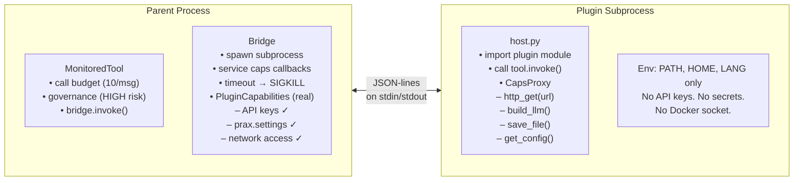

# Plugin Trust & Isolation

[← Security](README.md)

- **Twilio webhook validation** — all webhook routes (`/transcribe`, `/respond`, `/sms`, `/reader`, `/read`, `/say`, `/play`, `/conference`) validate the `X-Twilio-Signature` header using your `TWILIO_AUTH_TOKEN`. If the token is not set (e.g. Discord-only or local dev), validation is skipped with a one-time warning.
- **Path traversal protection** — workspace file operations (`save_file`, `read_file`, `archive_file`, etc.) and self-improvement file operations validate that resolved paths stay within the expected root directory. Attempts to escape via `../` or absolute paths are blocked.
- **Sandbox auth** — each app process generates a random per-process auth key (`secrets.token_urlsafe(32)`) for sandbox container communication. Never committed to source.
- **Docker socket** — the app container needs `/var/run/docker.sock` mounted for sandbox management. This grants host Docker access; only run in trusted environments.
- **VNC** — when enabled, VNC ports are mapped to the host's `127.0.0.1` only (not exposed on `0.0.0.0`). Remote access requires an SSH tunnel to the host: `ssh -NL 5901:localhost:5901 your-server`.
- **Secret key validation** — the app warns on startup if `FLASK_SECRET_KEY` is set to a weak placeholder like `change-me`.

## Plugin security

Plugins imported from external repos pass through multiple security gates before and during execution:

| Layer | What it does |
|-------|-------------|
| **AST-based static analysis** | Parses plugin source with Python's `ast` module to detect `subprocess`, `eval`, `exec`, `compile`, `__import__`, `os.environ`, `os.system`, `socket`, `getattr(__builtins__, ...)`, and 12+ evasion patterns (`__globals__`, `__subclasses__`, `vars(os)`, `codecs.decode`, etc.). |
| **Regex pattern scanning** | Supplements AST analysis with line-level pattern matching for HTTP calls, file deletion, hex-encoded strings, and base64 decoding. |
| **Built-in tool name protection** | Plugins cannot register tools with the same name as built-in tools. A plugin trying to override `browser_read_page` or `get_current_datetime` is rejected at load time. |
| **Subprocess sandbox testing** | Before activation, plugins are imported in a separate subprocess with a stripped environment and 30-second timeout. Failures prevent activation. |
| **Runtime monitoring + auto-rollback** | Active plugin tools are wrapped with failure tracking. After consecutive failures, the plugin is automatically rolled back to its previous version. |
| **Governance layer** | All tools (built-in and plugin) pass through a single governance choke point with risk classification (LOW/MEDIUM/HIGH), confirmation gating for HIGH-risk actions, and audit logging to the workspace trace. |
| **Blocking security scan** | `import_plugin_repo()` and `update_plugin_repo()` flag security warnings and require explicit acknowledgement before activation. |

## Subprocess isolation

IMPORTED plugins execute in **isolated subprocesses** — separate OS processes with no access to API keys, secrets, or the parent's memory. The OS process boundary is the primary security guarantee, not Python-level tricks.

### Architecture



When a plugin calls `caps.http_get(url)`, the proxy in the subprocess serializes the call as a JSON-RPC message, sends it to the parent over stdout, and blocks. The parent — which holds the real API keys — makes the HTTP request and sends the result back. The plugin experiences a normal synchronous method call but never touches a credential.

### What's isolated

| Attack vector | Result |
|---------------|--------|
| `os.environ["OPENAI_KEY"]` | `KeyError` — key is not in the subprocess environment |
| `os.environ["ANTHROPIC_KEY"]` | `KeyError` — same reason |
| `gc.get_objects()` to find `prax.settings` | Returns nothing — settings object is in a different process |
| `().__class__.__base__.__subclasses__()` → `BuiltinImporter` | Can import modules, but there are no secrets in memory to steal |
| `open("/proc/self/environ")` | Contains only `PATH`, `HOME`, `LANG`, `PYTHONPATH` |
| Infinite loop / memory bomb | `SIGALRM` → `SIGTERM` → `SIGKILL` (uncatchable) |
| `ctypes` memory writes to bypass audit hooks | Nothing to find — no API keys in process memory |
| Docker socket access | Not mounted in subprocess environment |
| Read other plugins' files | Blocked — `save_file`/`read_file`/`workspace_path` scoped to `plugin_data/{plugin}/`; path traversal blocked by `safe_join` |
| Read user workspace (`active/`) | Blocked — IMPORTED plugins' filesystem ops are confined to their scoped directory |

### Capabilities proxy

Plugins access Prax services through a `PluginCapabilities` proxy. Every method is forwarded to the parent via JSON-RPC — the plugin never directly holds credentials or network connections:

| Method | What the parent does |
|--------|---------------------|
| `caps.build_llm(tier)` | Constructs a LangChain LLM with the real API key and returns it (serialized) |
| `caps.http_get(url)` / `caps.http_post(url)` | Makes the HTTP request with credentials, rate-limited (50/invocation), returns serialized response |
| `caps.save_file(name, content)` | Writes to the plugin's scoped directory (`plugin_data/{plugin}/`) for IMPORTED; `active/` for BUILTIN/WORKSPACE |
| `caps.read_file(name)` | Reads from the plugin's scoped directory only — IMPORTED plugins cannot read other plugins' files or user workspace |
| `caps.run_command(cmd)` | Executes in the parent with auditing and timeout; IMPORTED plugins have `cwd` forced to their scoped directory |
| `caps.tts_synthesize(text, path)` | Calls OpenAI/ElevenLabs TTS API with the real key |
| `caps.get_config(key)` | Returns non-secret config values; blocks keys matching `key`, `secret`, `token`, `password`, `credential` |
| `caps.workspace_path()` / `caps.get_user_id()` / `caps.shared_tempdir()` | IMPORTED plugins get their scoped path (`plugin_data/{plugin}/`), not the full workspace root |

### Framework-enforced limits

These limits are enforced in the **parent process** (in `MonitoredTool`), outside the subprocess — the plugin cannot increase its own budget or disable enforcement:

| Limit | Value | Enforcement |
|-------|-------|-------------|
| Tool calls per message | 10 | `_increment_call_count()` in parent, checked before each bridge invocation |
| HTTP requests per invocation | 50 | Counted in `PluginCapabilities._check_http()` in parent |
| Invocation timeout | 30 seconds | `SIGALRM` in parent → `SIGTERM` → 5s grace → `SIGKILL` |
| Risk classification | HIGH | All IMPORTED tools require user confirmation before first execution |

### Subprocess lifecycle

| Event | What happens |
|-------|-------------|
| **First tool call** | Subprocess spawned lazily, plugin registered via JSON-RPC handshake |
| **Subsequent calls** | Same subprocess reused (~5ms overhead per call) |
| **Agent turn ends** | `shutdown_all_bridges()` terminates all subprocesses |
| **Process exit** | `atexit` handler kills any surviving subprocesses |
| **Plugin reload** | Old subprocess shut down, new one spawned on next call |
| **Subprocess crash** | Error propagated to agent, failure recorded, auto-rollback may trigger |

### Defence-in-depth (in-process layers)

The following in-process guards remain active as a secondary defense. They are no longer the primary security boundary — the subprocess is — but they catch bugs in the bridge and provide redundancy:

| Control | What it does |
|---------|-------------|
| **Python audit hook** (PEP 578) | `sys.addaudithook` blocks `subprocess.Popen`, `os.system`, `ctypes.dlopen`, etc. during IMPORTED execution |
| **Import blocker** (`sys.meta_path`) | Blocks `subprocess`, `ctypes`, `pickle`, `marshal`, `shutil`, `multiprocessing`, `signal` |
| **`PluginCapabilities` gateway** | `build_llm()`, `http_get/post()`, `save_file()`, `read_file()`, `get_config()` — all without exposing API keys; filesystem scoped to `plugin_data/{plugin}/` |
| **Per-tier policy** | `PluginPolicy` dataclass controls `can_access_env`, `can_make_http`, `can_use_llm`, `max_http_requests_per_invocation`, etc. |

### Migration for plugin authors

If your plugin's `register()` function accepts a parameter, it receives a `PluginCapabilities` instance (or a proxy that behaves identically in the subprocess). Use `caps.http_get()` instead of `requests.get()`, `caps.build_llm()` instead of importing the LLM factory, and `caps.get_config("workspace_dir")` instead of `settings.workspace_dir`. Zero-arg `register()` still works for backward-compatible built-in plugins.

BUILTIN and WORKSPACE plugins remain fully in-process with no overhead — subprocess isolation applies only to IMPORTED plugins from external repos.

## Plugin trust tiers

Every plugin is tagged with a trust tier based on its origin:

| Tier | Meaning | Source directory |
|------|---------|-----------------|
| **`builtin`** | Ships with Prax | `prax/plugins/tools/` |
| **`workspace`** | User-created in their workspace | `<workspace>/plugins/custom/` |
| **`imported`** | Cloned from an external git repo | `<workspace>/plugins/shared/` |

Trust tiers are stored in `registry.json` and surfaced in `plugin_list` and `plugin_status`. Unknown plugins default to `imported` (least trust). Defined as `PluginTrust` enum in `prax/plugins/registry.py`.

## Plugin lifecycle audit trail

All plugin lifecycle events are recorded as typed trace entries, searchable via `search_trace`:

| Event | Emitted when |
|-------|-------------|
| `plugin_import` | Plugin repo cloned successfully |
| `plugin_activate` | Plugin activated (manual or after write + sandbox test) |
| `plugin_block` | Activation blocked by security scan or failure |
| `plugin_rollback` | Plugin rolled back (manual or auto after repeated failures) |
| `plugin_remove` | Plugin deleted |
| `plugin_security_warn` | Security scan found warnings during import |

Example queries:
```python
search_trace(uid, "pdf2presentation", type_filter="plugin_activate")
search_trace(uid, "security", type_filter="plugin_security_warn")
```
