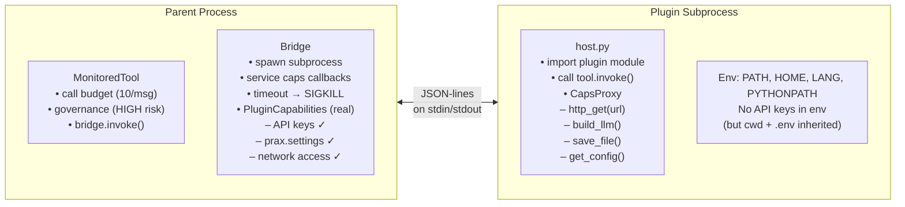

# Plugin Trust & Isolation

[← Security](README.md)

- **Twilio webhook validation** — all Twilio routes (`/transcribe`, `/respond`, `/sms`, `/reader`, `/read`, `/say`, `/play`, `/conference`) validate the `X-Twilio-Signature` header using your `TWILIO_AUTH_TOKEN` (`prax/blueprints/twilio_auth.py`). If the token is not set (e.g. Discord-only or local dev), validation is skipped with a one-time warning — fail-open. **Known gap (2026-09):** it signs `request.url`, and behind the documented HTTPS ngrok tunnel Flask sees `http://…` (no forwarded-scheme handling), so with the token set every genuine Twilio request is rejected; see [configuration.md → Twilio](configuration.md#option-c-twilio-voice--sms). No other inbound route (TeamWork webhook, `/teamwork/*`, `/plugins/*`, `/api/users/*`) carries any validation.
- **Path traversal protection** — workspace file operations (`save_file`, `read_file`, `archive_file`, etc.) and self-improvement file operations validate that resolved paths stay within the expected root directory (`safe_join`). **Known gap (2026-09):** the Library layer does not — `_space_path` / `_notebook_path` / `_note_path` in `prax/services/library_service.py` join the model- or request-supplied `space`/`notebook`/`slug` raw (no `fullmatch`/`relative_to`), and `workspace_root()`'s legacy fallback in `prax/services/workspace_service.py` joins an unresolved `user_id` with plain `os.path.join`.
- **Sandbox access** — there is no per-process sandbox auth key. Local mode drives the container through the Docker socket (`docker exec`); remote mode uses the operator-set `SANDBOX_DAEMON_TOKEN` bearer (optional mTLS via `SANDBOX_CLIENT_CERT`/`_KEY`). The sandbox's own ports (CDP `:9223`, noVNC `:6080`, clipboard `:6090`) are unauthenticated and published on `127.0.0.1` only by prax-sandbox's compose.
- **Docker socket** — the app container needs `/var/run/docker.sock` mounted for sandbox management. This grants host Docker access; only run in trusted environments.
- **VNC** — the manual-login browser flow (`prax/services/browser_service.py`) starts `x11vnc` on the Prax host with `-listen 127.0.0.1 -nopw`, so it is loopback-only and reachable remotely through an SSH tunnel (`ssh -NL 5901:localhost:5901 your-server`). No compose file publishes a VNC port; the sandbox desktop is noVNC on `127.0.0.1:6080` (prax-sandbox's compose).
- **Secret key validation** — the app warns on startup if `FLASK_SECRET_KEY` is set to a weak placeholder like `change-me`.

## Plugin security

Plugins imported from external repos pass through multiple security gates before and during execution:

| Layer | What it does |
|-------|-------------|
| **AST-based static analysis** | Parses plugin source with Python's `ast` module to detect `subprocess`, `eval`, `exec`, `compile`, `__import__`, `os.environ`, `os.system`, `socket`, `getattr(__builtins__, ...)`, and 12+ evasion patterns (`__globals__`, `__subclasses__`, `vars(os)`, `codecs.decode`, etc.). |
| **Regex pattern scanning** | Supplements AST analysis with line-level pattern matching for HTTP calls, file deletion, hex-encoded strings, and base64 decoding. |
| **Built-in tool name protection** | Plugins cannot register tools with the same name as built-in tools. A plugin trying to override `browser_read_page` or `get_current_datetime` is rejected at load time. |
| **Subprocess sandbox testing** | Before activation, plugins are imported in a separate subprocess with a stripped environment and 30-second timeout. Failures prevent activation. |
| **Runtime monitoring + auto-rollback** | Active plugin tools are wrapped with failure tracking. After consecutive failures, the plugin is automatically rolled back to its previous version. |
| **Governance layer** | Tools handed to the **hub** (`tool_registry.get_registered_tools()`) and to the MCP server pass through `wrap_with_governance` (risk classification LOW/MEDIUM/HIGH, confirmation gating for HIGH, audit logging to the workspace trace). **Known gap (2026-09):** spoke-internal tools — including plugin tools routed through the `plugins`/`sysadmin` spokes — are not wrapped (`prax/agent/spokes/_runner.py`), so the HIGH gate reaches only plugin tools promoted into the hub. See [tool-risk.md](tool-risk.md). |
| **Blocking security scan** | `import_plugin_repo()` and `update_plugin_repo()` flag security warnings and require explicit acknowledgement before activation. The flag is recorded in the registry (`requires_acknowledgement`) and **enforced at load time**: `loader.load_all()` refuses to activate a flagged IMPORTED plugin until `acknowledge_warnings()` clears it — not a prompt the model can skip. `plugin_import` / `plugin_import_activate` are classified HIGH-risk (the confirmation gate does not currently reach them — spoke-internal; see above). |

## Subprocess isolation

IMPORTED plugins execute in **separate host subprocesses** whose *environment* is stripped of API keys and whose memory is separate from the parent's. The OS process boundary is the primary security guarantee, not Python-level tricks.

**Known gap (2026-09): the environment is the only thing stripped.** `prax/plugins/bridge.py` spawns `python -m prax.plugins.host` with `env=_SAFE_ENV` (`PATH`, `HOME`, `LANG`, `PYTHONPATH`) but no `cwd=`, no user change and no filesystem or network restriction. The child therefore inherits Prax's working directory and `PYTHONPATH`, and because Pydantic settings load `.env` from the working directory, `from prax.settings import settings` inside the child returns every credential the parent holds. Read the table below with that in mind: it describes what the *environment* no longer contains, not what the child can obtain.

### Architecture


```mermaid
flowchart LR
    subgraph Parent["Parent Process"]
        MT["MonitoredTool\n• call budget (10/msg)\n• governance (HIGH risk)\n• bridge.invoke()"]
        BR["Bridge\n• spawn subprocess\n• service caps callbacks\n• timeout → SIGKILL\n• PluginCapabilities (real)\n  – API keys ✓\n  – prax.settings ✓\n  – network access ✓"]
    end
    subgraph Sub["Plugin Subprocess"]
        HP["host.py\n• import plugin module\n• call tool.invoke()\n• CapsProxy\n  – http_get(url)\n  – build_llm()\n  – save_file()\n  – get_config()"]
        ENV["Env: PATH, HOME, LANG, PYTHONPATH\nNo API keys in env\n(but cwd + .env inherited)"]
    end
    Parent <-->|"JSON-lines\non stdin/stdout"| Sub
```

When a plugin calls `caps.http_get(url)`, the proxy in the subprocess serializes the call as a JSON-RPC message, sends it to the parent over stdout, and blocks. The parent — which holds the real API keys — makes the HTTP request and sends the result back. The plugin experiences a normal synchronous method call but never touches a credential.

### What's isolated

| Attack vector | Result |
|---------------|--------|
| `os.environ["OPENAI_KEY"]` | `KeyError` — key is not in the subprocess environment |
| `os.environ["ANTHROPIC_KEY"]` | `KeyError` — same reason |
| `gc.get_objects()` to find `prax.settings` | Returns nothing — the parent's settings object is in a different process. **Not isolated:** `from prax.settings import settings` builds a fresh one from the inherited cwd's `.env` (Known gap above) |
| `().__class__.__base__.__subclasses__()` → `BuiltinImporter` | Can import modules — including `prax.settings`, which loads the keys from `.env` (Known gap above) |
| `open("/proc/self/environ")` | Contains only `PATH`, `HOME`, `LANG`, `PYTHONPATH` |
| Infinite loop / memory bomb | `SIGALRM` → `SIGTERM` → `SIGKILL` (uncatchable) |
| `ctypes` memory writes to bypass audit hooks | No audit hook is installed to bypass (see Defence-in-depth below); keys are obtainable via `prax.settings` regardless |
| Docker socket access | **Not isolated** — the child is an ordinary host process running as the same OS user; if the host has `/var/run/docker.sock`, the child can open it |
| Read other plugins' files | Blocked **through `caps.*`** — `save_file`/`read_file`/`workspace_path` scoped to `plugin_data/{plugin}/`; path traversal blocked by `safe_join`. Plain `open()` in the child is unrestricted |
| Read user workspace (`active/`) | Blocked **through `caps.*`** only — same caveat |

### Capabilities proxy

Plugins access Prax services through a `PluginCapabilities` proxy. Every method is forwarded to the parent via JSON-RPC — the plugin never directly holds credentials or network connections:

| Method | What the parent does |
|--------|---------------------|
| `caps.build_llm(tier)` | Constructs a LangChain LLM with the real API key and returns it (serialized) |
| `caps.http_get(url)` / `caps.http_post(url)` | Makes the HTTP request with credentials, rate-limited (50/invocation), returns serialized response |
| `caps.save_file(name, content)` | Writes to the plugin's scoped directory (`plugin_data/{plugin}/`) for IMPORTED; `active/` for BUILTIN/WORKSPACE |
| `caps.read_file(name)` | Reads from the plugin's scoped directory only — IMPORTED plugins cannot read other plugins' files or user workspace |
| `caps.run_command(cmd)` | Executes in the parent with auditing and timeout; IMPORTED plugins have `cwd` forced to their scoped directory |
| `caps.tts_synthesize(text, path)` | Calls OpenAI/ElevenLabs TTS API with the real key |
| `caps.get_config(key)` | Returns non-secret config values; blocks keys matching `key`, `secret`, `token`, `password`, `credential` |
| `caps.workspace_path()` / `caps.get_user_id()` / `caps.shared_tempdir()` | IMPORTED plugins get their scoped path (`plugin_data/{plugin}/`), not the full workspace root |

### Framework-enforced limits

These limits are enforced in the **parent process** (in `MonitoredTool`), outside the subprocess — the plugin cannot increase its own budget or disable enforcement:

| Limit | Value | Enforcement |
|-------|-------|-------------|
| Tool calls per message | 10 | `_increment_call_count()` in parent, checked before each bridge invocation |
| HTTP requests | 50 **per `PluginCapabilities` instance, for its lifetime** | Counted in `PluginCapabilities._check_http()` in parent. **Known gap (2026-09):** the policy field is named `max_http_requests_per_invocation`, but `_http_request_count` is set to 0 only in `__init__` and never reset, and caps instances live as long as the loader — so a plugin that has made 50 requests in total gets `PermissionError` until the next `load_all()`/restart |
| Invocation timeout | 30 seconds | `SIGALRM` in parent → `SIGTERM` → 5s grace → `SIGKILL` |
| Risk classification | HIGH | IMPORTED tools are classified HIGH (`get_risk_level`), so they require user confirmation before first execution **where the governance wrapper is in front** — i.e. tools promoted into the hub registry or exposed via MCP (which refuses HIGH). Spoke-routed plugin tools are not wrapped; see [tool-risk.md](tool-risk.md) |

### Subprocess lifecycle

| Event | What happens |
|-------|-------------|
| **First tool call** | Subprocess spawned lazily, plugin registered via JSON-RPC handshake |
| **Subsequent calls** | Same subprocess reused (~5ms overhead per call) |
| **Agent turn ends** | `shutdown_all_bridges()` terminates all subprocesses |
| **Process exit** | `atexit` handler kills any surviving subprocesses |
| **Plugin reload** | Old subprocess shut down, new one spawned on next call |
| **Subprocess crash** | Error propagated to agent, failure recorded, auto-rollback may trigger |

### Defence-in-depth (in-process layers)

Two of the layers below exist in code but are **not installed** anywhere; two are live.

| Control | What it does |
|---------|-------------|
| **Python audit hook** (PEP 578) | Defined in `prax/plugins/sandbox_guard.py` (`install_audit_hook`: `sys.addaudithook` blocking `subprocess.Popen`, `os.system`, `ctypes.dlopen`, …). **Known gap (2026-09): never installed** — `install_all_guards()` / `install_audit_hook()` / `install_import_blocker()` have no callers outside that module (neither `prax/plugins/host.py` nor the bridge calls them), so this layer is inactive in both processes. |
| **Import blocker** (`sys.meta_path`) | Defined in the same module (`install_import_blocker`: blocks `subprocess`, `ctypes`, `pickle`, `marshal`, `shutil`, `multiprocessing`, `signal`). **Same Known gap — never installed.** |
| **`PluginCapabilities` gateway** | `build_llm()`, `http_get/post()`, `save_file()`, `read_file()`, `get_config()` — all without exposing API keys; filesystem scoped to `plugin_data/{plugin}/` |
| **Per-tier policy** | `PluginPolicy` dataclass controls `can_access_env`, `can_make_http`, `can_use_llm`, `max_http_requests_per_invocation`, etc. |

### Migration for plugin authors

If your plugin's `register()` function accepts a parameter, it receives a `PluginCapabilities` instance (or a proxy that behaves identically in the subprocess) when the loader imports it (`prax/plugins/loader.py` inspects the signature). Use `caps.http_get()` instead of `requests.get()`, `caps.build_llm()` instead of importing the LLM factory, and `caps.get_config("workspace_dir")` instead of `settings.workspace_dir`. Zero-arg `register()` still works for backward-compatible built-in plugins.

**Known gap (2026-09):** the pre-activation sandbox test (`prax/plugins/sandbox.py`, `sandbox_test_plugin`) calls `mod.register()` with **no** argument, so a contract-conformant `register(caps)` plugin fails it with `TypeError` — `plugin_write` then removes the file and `plugin_activate`/`hot_swap` refuse to activate. Plugins written to the published `register(caps)` contract can be loaded by `load_all()` but not created or activated through those tools.

BUILTIN and WORKSPACE plugins remain fully in-process with no overhead — subprocess isolation applies only to IMPORTED plugins from external repos. **Known gap (2026-09):** WORKSPACE plugins (`<workspace>/plugins/custom/`) are imported in-process by `load_all()` with no security scan, no sandbox test and no acknowledgement (those run only in `plugin_write` / `hot_swap` / `import_plugin_repo`), and `get_approved_secret` auto-approves every secret for the tier (`prax/plugins/capabilities.py`). Anything that can write into the workspace — the sandbox container has `/workspace` read-write — can therefore get in-process code execution in Prax at the next load (a user's first turn per process, or the unauthenticated `POST /plugins/<name>/acknowledge` route, which calls `load_all()`). See [sandbox-execution-boundary.md](sandbox-execution-boundary.md).

## Plugin trust tiers

Every plugin is tagged with a trust tier based on its origin:

| Tier | Meaning | Source directory |
|------|---------|-----------------|
| **`builtin`** | Ships with Prax | `prax/plugins/tools/` |
| **`workspace`** | User-created in their workspace | `<workspace>/plugins/custom/` |
| **`imported`** | Cloned from an external git repo | `<workspace>/plugins/shared/` |

Trust tiers are stored in `registry.json` and surfaced in `plugin_list` and `plugin_status`. Unknown plugins default to `imported` (least trust). Defined as `PluginTrust` enum in `prax/plugins/registry.py`.

## Plugin lifecycle audit trail

All plugin lifecycle events are recorded as typed trace entries, searchable via `search_trace`:

| Event | Emitted when |
|-------|-------------|
| `plugin_import` | Plugin repo cloned successfully |
| `plugin_activate` | Plugin activated (manual or after write + sandbox test) |
| `plugin_block` | Activation blocked by security scan or failure |
| `plugin_rollback` | Plugin rolled back (manual or auto after repeated failures) |
| `plugin_remove` | Plugin deleted |
| `plugin_security_warn` | Security scan found warnings during import |

Example queries:
```python
search_trace(uid, "txt2presentation", type_filter="plugin_activate")
search_trace(uid, "security", type_filter="plugin_security_warn")
```
