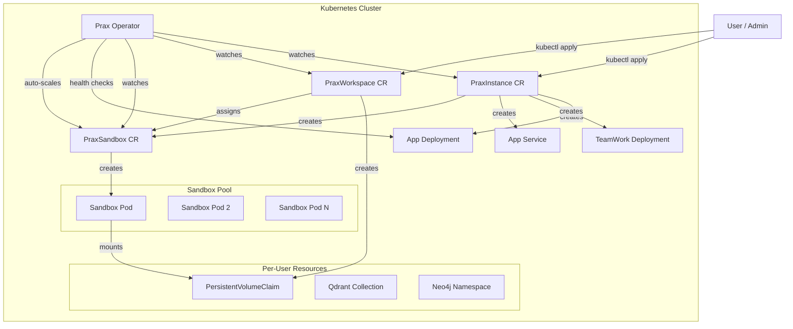

# Prax Kubernetes Operator

A kopf-based Kubernetes operator that manages multi-user Prax deployments,
sandbox lifecycle, and workspace provisioning.

## Architecture



## Why Custom Resource Definitions (CRDs)?

Prax isn't a typical stateless web app that fits neatly into a Deployment + Service. It has **domain-specific lifecycle semantics** that Kubernetes doesn't understand natively:

- **User onboarding** — when a user joins, they need a workspace PVC, a Qdrant vector collection, a Neo4j namespace, and a sandbox pod assignment. These are 4 coordinated operations across different systems. A Deployment can't express this.
- **Sandbox pool management** — sandboxes aren't interchangeable replicas. Each one is either free, assigned to a user, or draining. Scaling up means creating a new pod *and* registering it in the pool. Scaling down means draining active sessions first. An HPA can't express "scale down but only idle pods."
- **Health-driven decisions** — when the health monitor reports degradation after a code change, the right response might be to roll back the app image but *not* the sandbox image. A single Deployment rollback can't be that surgical.

CRDs let us teach Kubernetes these concepts. Instead of managing 15 raw resources per user, you write one YAML:

```yaml
apiVersion: prax.ai/v1alpha1
kind: PraxWorkspace
metadata:
  name: user-alice
spec:
  userId: alice
  instanceRef: production
  storageSize: 10Gi
```

The operator handles the rest — PVC creation, memory provisioning, sandbox assignment, cleanup on delete. Without CRDs, this would be a brittle shell script calling `kubectl` in sequence, with no status tracking, no reconciliation on failure, and no visibility via `kubectl get`.

**You don't need CRDs for single-user.** The Helm chart works standalone. CRDs + operator are for when you scale to multiple users and want automated lifecycle management.

## CRD Overview

| CRD | Short Name | Purpose |
|-----|-----------|---------|
| `PraxInstance` | `pi` | Full Prax deployment (app, TeamWork, sandbox pool) |
| `PraxWorkspace` | `pw` | Per-user workspace with storage and sandbox assignment |
| `PraxSandbox` | `ps` | Individual sandbox pod in the pool |

### PraxInstance

Represents a complete Prax tenant deployment. When created, the operator
provisions:

- A Deployment for the Prax Flask app
- A Deployment for the TeamWork web UI
- A Service for the app
- An initial pool of PraxSandbox CRs (configurable via `sandbox.poolSize`)

### PraxWorkspace

Represents a single user's workspace. When created, the operator:

- Creates a PVC for persistent workspace storage
- Creates a Qdrant vector collection for the user's memory
- Assigns a free sandbox pod (or scales up if none available)

### PraxSandbox

Represents one sandbox pod in the pool. The operator:

- Creates and manages the backing Pod
- Tracks assignment state (free / busy / draining)
- Reports health status back to the parent PraxInstance

## Quick Start

### Prerequisites

- Kubernetes cluster (1.27+)
- `kubectl` configured to talk to the cluster
- Container registry access for operator and app images

### 1. Create the namespace

```bash
kubectl create namespace prax-system
```

### 2. Install CRDs

```bash
kubectl apply -f k8s/operator/crds/
```

### 3. Deploy the operator

Build and push the operator image, then deploy:

```bash
# Build
docker build -t your-registry/prax-operator:latest k8s/operator/

# Push
docker push your-registry/prax-operator:latest

# Update the image in deploy.yaml, then apply
kubectl apply -f k8s/operator/deploy.yaml
```

### 4. Create a PraxInstance

```yaml
apiVersion: prax.ai/v1alpha1
kind: PraxInstance
metadata:
  name: my-prax
  namespace: prax-system
spec:
  appImage: your-registry/prax:latest
  sandboxImage: your-registry/prax-sandbox:latest
  teamworkImage: your-registry/teamwork:latest
  replicas: 2
  sandbox:
    poolSize: 2
    maxPoolSize: 10
    scaleOnDemand: true
  model:
    provider: openai
    baseModel: gpt-4o
    tiers:
      low: gpt-4o-mini
      medium: gpt-4o
      high: gpt-4o
      pro: o1
  observability:
    enabled: false
  resources:
    app:
      requests:
        cpu: "500m"
        memory: "1Gi"
      limits:
        cpu: "2"
        memory: "4Gi"
    sandbox:
      requests:
        cpu: "250m"
        memory: "512Mi"
      limits:
        cpu: "1"
        memory: "2Gi"
```

```bash
kubectl apply -f my-instance.yaml
```

### 5. Verify

```bash
kubectl get praxinstances -n prax-system
kubectl get praxsandboxes -n prax-system
```

## Multi-User Setup

For each user, create a PraxWorkspace:

```yaml
apiVersion: prax.ai/v1alpha1
kind: PraxWorkspace
metadata:
  name: user-alice
  namespace: prax-system
spec:
  userId: alice
  instanceRef: my-prax
  storageSize: 10Gi
```

```bash
kubectl apply -f user-alice.yaml
```

The operator will:

1. Create a PVC named `ws-user-alice` with 10Gi storage
2. Create a Qdrant collection `prax-alice` for vector memory
3. Reserve a Neo4j namespace `prax_alice` for graph memory
4. Assign a free sandbox pod (or scale up if the pool is exhausted)

Check workspace status:

```bash
kubectl get praxworkspaces -n prax-system
# NAME         USER    INSTANCE   PHASE   SANDBOX                    STORAGE   AGE
# user-alice   alice   my-prax    Ready   my-prax-sandbox-0-pod      10Gi      5m
```

To remove a user's workspace:

```bash
kubectl delete praxworkspace user-alice -n prax-system
```

This releases the sandbox back to the pool and cleans up the Qdrant collection.

## Sandbox Pool Scaling

The operator manages the sandbox pool automatically:

| Condition | Action |
|-----------|--------|
| All sandboxes are Busy and total < `maxPoolSize` | Scale up (create new PraxSandbox) |
| >50% sandboxes idle for >5 minutes and total > `poolSize` | Scale down (delete idle PraxSandbox) |
| Sandbox pod becomes unhealthy | Marked unhealthy; replaced on next cycle |

Scaling behavior is controlled by these PraxInstance fields:

- `sandbox.poolSize` -- minimum number of sandbox pods (floor)
- `sandbox.maxPoolSize` -- maximum number of sandbox pods (ceiling)
- `sandbox.scaleOnDemand` -- set to `false` to disable auto-scaling

The health daemon runs every 60 seconds and evaluates scaling decisions.

## Comparison with docker-compose

| Aspect | docker-compose | Kubernetes Operator |
|--------|---------------|-------------------|
| Multi-user | Single user, manual sandbox management | Automated per-user workspace provisioning |
| Scaling | Manual `docker-compose up --scale` | Automatic pool scaling based on demand |
| Storage | Docker volumes, manual cleanup | PVCs with lifecycle tied to PraxWorkspace |
| Health | Manual monitoring | Automated health checks, self-healing |
| Memory backends | Shared Qdrant/Neo4j | Per-user collections and namespaces |
| Upgrades | Rebuild and restart all containers | Rolling updates via Deployment strategy |
| Observability | Docker logs | Kubernetes events, conditions, structured status |
| Multi-tenant | Not supported | Each PraxInstance is an isolated tenant |

## Operator Internals

The operator uses [kopf](https://kopf.readthedocs.io/) and watches three CRDs:

- **Create handlers** provision child resources (Deployments, Pods, PVCs, Qdrant collections)
- **Update handlers** reconcile changes (image updates, pool size changes)
- **Delete handlers** clean up resources (release sandboxes, delete collections)
- **Daemon handler** runs periodic health checks and auto-scaling on each PraxInstance
- **Field watcher** on `PraxSandbox.status.phase` keeps parent instance counts accurate

All child resources use `ownerReferences` so Kubernetes garbage collection handles
cascade deletes automatically.

## File Structure

```
k8s/
  helm/
    prax/
      Chart.yaml             # Helm chart metadata
      values.yaml            # All configurable values
      templates/
        _helpers.tpl          # Template helpers
        app-statefulset.yaml  # Prax app
        sandbox-statefulset.yaml  # Sandbox pool
        teamwork-deployment.yaml  # TeamWork UI
        qdrant-statefulset.yaml   # Vector memory
        neo4j-statefulset.yaml    # Graph memory
        ollama-statefulset.yaml   # Local embeddings
        ollama-init-job.yaml      # Model puller
        secrets.yaml          # API keys
        configmap.yaml        # Non-secret config
        ingress.yaml          # Optional ingress
        workspace-pvc.yaml    # Shared workspace
        serviceaccount.yaml   # RBAC
        observability-*.yaml  # Optional Tempo/Loki/Prometheus/Grafana
  operator/
    crds/
      praxinstance.yaml    # PraxInstance CRD
      praxworkspace.yaml   # PraxWorkspace CRD
      praxsandbox.yaml     # PraxSandbox CRD
    operator.py            # kopf operator (all handlers)
    Dockerfile             # Operator container image
    requirements.txt       # Python dependencies
    deploy.yaml            # Operator deployment manifests (SA, RBAC, Deployment)
  README.md                # This file
```

---

## Deployment Guide

### Which deployment method?

| Scenario | Recommended | Why |
|----------|-------------|-----|
| Solo developer, local machine | **docker-compose** | Simplest, zero K8s knowledge needed |
| Solo developer, wants K8s experience | **Helm on k3s** | Production-grade, single binary, low resources |
| Multi-user / team | **Helm + Operator on k3s/EKS/GKE** | Automated workspace provisioning, sandbox scaling |
| Production cloud | **Helm + Operator on managed K8s** | Rolling updates, autoscaling, proper secrets management |

### Which local K8s?

| Tool | Recommendation | GUI needed? |
|------|---------------|-------------|
| **k3s** | Best choice. Production-grade, single binary, ~512MB RAM. Includes Traefik ingress + local-path storage. | No |
| minikube | Heavier, VM-based. Fine but overkill. | No |
| kind | Good for CI/testing. No ingress or storage by default. | No |
| Docker Desktop K8s | Convenient if already using Docker Desktop. Heavier. | Yes (menu) |

**k3s is the clear winner for headless workstations.** It's the same thing that runs in production (SUSE/Rancher), installs in 30 seconds, and works over SSH.

### Recommended tools

| Tool | What | Install |
|------|------|---------|
| **k3s** | Lightweight K8s distribution | `curl -sfL https://get.k3s.io \| sh -` |
| **k9s** | Terminal UI for Kubernetes (like `htop` for clusters) | `brew install k9s` or `curl -sS https://webinstall.dev/k9s \| bash` |
| **helm** | Package manager for K8s | `brew install helm` or `curl https://raw.githubusercontent.com/helm/helm/main/scripts/get-helm-3 \| bash` |
| **kubectl** | K8s CLI (included with k3s) | Comes with k3s |

k9s gives you a full TUI for watching pods, logs, exec-ing into containers, viewing events — everything you'd want on a headless box. Works great over SSH.

```
 ┌──────────────────── k9s: prax namespace ────────────────────┐
 │ PODS                                                         │
 │ NAME                        STATUS   CPU   MEM    AGE        │
 │ prax-app-0                  Running  120m  890Mi  2h         │
 │ prax-sandbox-0              Running  80m   450Mi  2h         │
 │ prax-sandbox-1              Running  60m   320Mi  1h         │
 │ prax-teamwork-7f8d9-x2k4j  Running  30m   180Mi  2h         │
 │ prax-qdrant-0               Running  40m   256Mi  2h         │
 │ prax-neo4j-0                Running  90m   512Mi  2h         │
 │ prax-ollama-0               Running  50m   1.2Gi  2h         │
 └──────────────────────────────────────────────────────────────┘
```

---

## Workstation Deployment (k3s) — Step by Step

### Prerequisites

- Linux (bare metal, VM, or WSL2) or macOS with multipass
- Docker installed (for building images)
- 8GB+ RAM available
- API keys for at least one LLM provider (OpenAI or Anthropic)

### Step 1: Install k3s

**Linux (recommended — single command):**
```bash
curl -sfL https://get.k3s.io | sh -
export KUBECONFIG=/etc/rancher/k3s/k3s.yaml

# Make kubeconfig accessible without sudo
sudo cp /etc/rancher/k3s/k3s.yaml ~/.kube/config
sudo chown $(id -u):$(id -g) ~/.kube/config
export KUBECONFIG=~/.kube/config
```

**macOS (k3s needs a Linux kernel — use multipass):**
```bash
brew install multipass
multipass launch --name k3s --memory 8G --cpus 4 --disk 40G
multipass exec k3s -- bash -c "curl -sfL https://get.k3s.io | sh -"

# Get kubeconfig
mkdir -p ~/.kube
multipass exec k3s -- sudo cat /etc/rancher/k3s/k3s.yaml > ~/.kube/config
sed -i '' "s/127.0.0.1/$(multipass info k3s | grep IPv4 | awk '{print $2}')/g" ~/.kube/config
export KUBECONFIG=~/.kube/config
```

**Verify:**
```bash
kubectl get nodes
# NAME   STATUS   ROLES                  AGE   VERSION
# k3s    Ready    control-plane,master   1m    v1.31.x+k3s1
```

### Step 1b: Install k9s (optional but highly recommended)

```bash
# Linux
curl -sS https://webinstall.dev/k9s | bash

# macOS
brew install k9s

# Run it
k9s -n prax
```

k9s gives you real-time pod status, logs, shell access, and resource usage — all from the terminal. Press `?` for keybindings, `:` to switch resource types (pods, services, pvc, events).

### Step 2: Build and load images

```bash
# From the prax repo root
docker build -t prax-app:latest .
docker build -t prax-sandbox:latest ./sandbox/
docker build -t teamwork:latest ../teamwork/

# Load into k3s (k3s uses containerd, not Docker)
# On Linux (k3s on same machine):
docker save prax-app:latest | sudo k3s ctr images import -
docker save prax-sandbox:latest | sudo k3s ctr images import -
docker save teamwork:latest | sudo k3s ctr images import -

# On macOS (k3s in multipass VM):
docker save prax-app:latest | multipass transfer - k3s:/tmp/prax-app.tar
multipass exec k3s -- sudo k3s ctr images import /tmp/prax-app.tar
docker save prax-sandbox:latest | multipass transfer - k3s:/tmp/prax-sandbox.tar
multipass exec k3s -- sudo k3s ctr images import /tmp/prax-sandbox.tar
docker save teamwork:latest | multipass transfer - k3s:/tmp/teamwork.tar
multipass exec k3s -- sudo k3s ctr images import /tmp/teamwork.tar
```

### Step 3: Create your values file

```bash
cp k8s/helm/prax/values.yaml k8s/my-values.yaml
```

Edit `k8s/my-values.yaml` — fill in your API keys:

```yaml
secrets:
  openaiKey: "sk-..."
  anthropicKey: "sk-ant-..."
  flaskSecretKey: "$(openssl rand -hex 32)"

# For local k3s, use local storage class
global:
  storageClass: "local-path"

# Use locally built images
images:
  app:
    repository: prax-app
    tag: latest
    pullPolicy: Never   # already loaded locally
  sandbox:
    repository: prax-sandbox
    tag: latest
    pullPolicy: Never
  teamwork:
    repository: teamwork
    tag: latest
    pullPolicy: Never
```

### Step 4: Install with Helm

```bash
# Install Helm if you don't have it
brew install helm  # or: curl https://raw.githubusercontent.com/helm/helm/main/scripts/get-helm-3 | bash

# Install Prax
helm install prax k8s/helm/prax -f k8s/my-values.yaml -n prax --create-namespace

# Watch pods come up
kubectl get pods -n prax -w
```

### Step 5: Access TeamWork UI

```bash
# Port-forward TeamWork
kubectl port-forward -n prax svc/prax-teamwork 3000:8000

# Open http://localhost:3000
```

Or if you want proper ingress:

```yaml
# In my-values.yaml:
ingress:
  enabled: true
  className: traefik
  hosts:
    - host: prax.local
      paths:
        - path: /
          service: teamwork
```

Then add `prax.local` to `/etc/hosts` pointing to your k3s IP.

### Step 6: Verify health

```bash
# Check all pods are running
kubectl get pods -n prax

# Check app health
kubectl exec -n prax deploy/prax-app -- curl -s http://localhost:5001/healthz/ready | python3 -m json.tool

# Check health monitor
kubectl exec -n prax deploy/prax-app -- curl -s http://localhost:5001/teamwork/health | python3 -m json.tool
```

---

## Cloud Deployment

### AWS (EKS)

```bash
# Create cluster
eksctl create cluster --name prax --region us-east-1 --node-type t3.xlarge --nodes 3

# Install EBS CSI driver for persistent volumes
eksctl create addon --name aws-ebs-csi-driver --cluster prax

# For shared workspace (ReadWriteMany), use EFS:
# 1. Create an EFS filesystem in the same VPC
# 2. Install the EFS CSI driver
# 3. Create a StorageClass pointing to EFS
# 4. Set global.storageClass: "efs-sc" in values

# Create ECR repos and push images
aws ecr create-repository --repository-name prax-app
aws ecr create-repository --repository-name prax-sandbox
aws ecr create-repository --repository-name teamwork
# Tag and push images...

# Store secrets in AWS Secrets Manager (recommended) or use Helm secrets
helm install prax k8s/helm/prax -f cloud-values.yaml -n prax --create-namespace
```

### GCP (GKE)

```bash
# Create cluster
gcloud container clusters create prax --zone us-central1-a --machine-type e2-standard-4 --num-nodes 3

# GKE includes a default storage class (pd-standard). For ReadWriteMany, use Filestore:
# gcloud filestore instances create prax-workspace --zone=us-central1-a --tier=STANDARD --file-share=name=workspace,capacity=100GB

# Push images to Artifact Registry
gcloud auth configure-docker us-central1-docker.pkg.dev
docker tag prax-app us-central1-docker.pkg.dev/PROJECT/prax/app:latest
docker push us-central1-docker.pkg.dev/PROJECT/prax/app:latest

helm install prax k8s/helm/prax -f gcp-values.yaml -n prax --create-namespace
```

### Azure (AKS)

```bash
# Create cluster
az aks create --resource-group prax-rg --name prax --node-count 3 --node-vm-size Standard_D4s_v3

# AKS includes Azure Disk (ReadWriteOnce). For ReadWriteMany, use Azure Files:
# Create a StorageClass with provisioner: file.csi.azure.com

# Push to ACR
az acr create --name praxregistry --sku Basic
az acr build --registry praxregistry --image prax-app:latest .

helm install prax k8s/helm/prax -f azure-values.yaml -n prax --create-namespace
```

### Cloud considerations

| Concern | Recommendation |
|---------|---------------|
| **Secrets** | Use cloud secrets managers (AWS Secrets Manager, GCP Secret Manager, Azure Key Vault) with External Secrets Operator instead of Helm secrets |
| **Storage** | Use managed storage for databases: Amazon MemoryDB for Qdrant, managed Neo4j Aura, etc. |
| **Ingress** | Use cloud load balancers (ALB/NLB on AWS, Cloud Load Balancing on GCP) with cert-manager for TLS |
| **GPU** | For local Ollama with GPU: use a GPU node pool and set `ollama.resources.limits.nvidia.com/gpu: 1` |
| **Monitoring** | Enable the observability stack or use cloud-native monitoring (CloudWatch, Cloud Monitoring, Azure Monitor) |
| **Backups** | Set up VolumeSnapshots for PVCs. Use Velero for cluster-level backup/restore. |

---

## Adding the Operator (Multi-User)

After the Helm chart is running, add the operator for automated multi-user management:

```bash
# Install CRDs
kubectl apply -f k8s/operator/crds/

# Build and deploy operator
docker build -t prax-operator:latest k8s/operator/
# (load or push image to registry)
kubectl apply -f k8s/operator/deploy.yaml

# Create instance (operator takes over management)
kubectl apply -f - <<EOF
apiVersion: prax.ai/v1alpha1
kind: PraxInstance
metadata:
  name: production
  namespace: prax
spec:
  appImage: prax-app:latest
  sandboxImage: prax-sandbox:latest
  teamworkImage: teamwork:latest
  sandbox:
    poolSize: 2
    maxPoolSize: 10
    scaleOnDemand: true
EOF

# Add users
kubectl apply -f - <<EOF
apiVersion: prax.ai/v1alpha1
kind: PraxWorkspace
metadata:
  name: user-alice
  namespace: prax
spec:
  userId: alice
  instanceRef: production
  storageSize: 10Gi
EOF
```

---

## Upgrading

```bash
# Update images
docker build -t prax-app:v0.6.0 .

# Helm upgrade (rolling update, zero downtime)
helm upgrade prax k8s/helm/prax -f k8s/my-values.yaml -n prax --set images.app.tag=v0.6.0
```

## Uninstalling

```bash
# Remove Prax (keeps PVCs by default)
helm uninstall prax -n prax

# Remove PVCs too (destructive!)
kubectl delete pvc --all -n prax

# Remove operator
kubectl delete -f k8s/operator/deploy.yaml
kubectl delete -f k8s/operator/crds/

# Remove namespace
kubectl delete namespace prax
```
